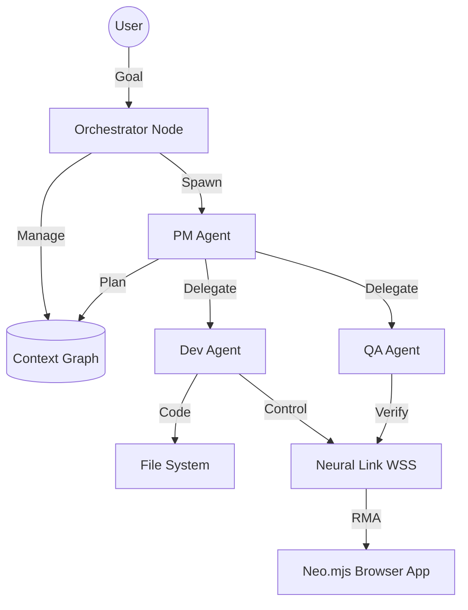

# Neo Agent OS: The Autonomous Application Engine

## 1. Vision
Transform Neo.mjs from a passive framework into an **Autonomous Application Engine**.
The goal is to move beyond "Interactive Assistance" (CLI) to **"Asynchronous Agency"** (Swarm).
We are building a digital workforce ("Night Watchman," "Bug Hunter") that operates autonomously to maintain, optimize, and extend applications.

## 2. Core Architecture

### 2.1. The Runtime: Node.js Agent Server
*   **Role:** The persistent "Body" of the Agent OS.
*   **Why Node.js?**
    *   **Stability:** Does not crash when the browser reloads.
    *   **Persistence:** Hosts the long-running loops and state.
    *   **Connectivity:** Acts as the hub for MCP Clients (GitHub, FS) and LLM APIs.
*   **Vs. In-App Workers:** While in-app workers (via `MessageChannel`) offer low latency, they are ephemeral. The Node.js runtime provides the necessary lifecycle stability for DevOps tasks.

### 2.2. The Orchestrator (The "Loop")
*   **Role:** The "Brain" that replaces the human-in-the-loop.
*   **Mechanism:** A persistent event loop that manages agent lifecycles.
*   **Responsibilities:**
    *   **Task Ingestion:** Monitors GitHub Issues, Webhooks, and Timers.
    *   **Agent Spawning:** Instantiates specific agents (PM, Dev, QA) based on task type.
    *   **State Management:** Maintains the Context Graph.
    *   **Termination:** Enforces budgets (tokens/time) and quality gates.

### 2.3. The Context Graph (The "Shared World Model")
*   **Role:** The structured memory that prevents "Context Window Overflow" in multi-agent swarms.
*   **Data Structure:** A directed graph modeling project reality.
    *   **Nodes:** Tickets, Files, Concepts, Agents, Errors.
    *   **Edges:** `is_blocking`, `modifies`, `relates_to`, `assigned_to`.
*   **Usage:** Agents receive a *subgraph* relevant to their task, not the entire chat history.

### 2.4. Decision Trees (The "SOPs")
*   **Role:** The algorithmic "Game Rules" that guide agent behavior.
*   **Mechanism:** Hard-coded or learned logic defining legal transitions.
    *   *Example:* `If (Build Fails) -> Retry(MAX=3) -> Else Escalate`.
*   **Benefit:** Prevents infinite loops and embeds "Senior Engineer Intuition" into the process.

### 2.5. The Neural Link (The "Hands & Eyes")
*   **Role:** The bridge between the Node.js Agent OS and the running Neo.mjs Browser App.
*   **Technology:** WebSocket-based Remote Method Access (RMA).
*   **Capabilities:**
    *   **Introspection:** `get_component_tree`, `get_dom_event_listeners`.
    *   **Manipulation:** `set_component_property`, `simulate_event`.
    *   **Orchestration:** Spawning new windows, navigating routes.

## 3. Swarm Topology

## 4. Implementation Strategy

### Phase 1: The "Night Watchman" (Prototype)
*   **Goal:** A simple script (`supervisor.mjs`) that runs nightly.
*   **Logic:**
    1.  Read `TODO.md`.
    2.  Pick top item.
    3.  Run `gemini` (or equivalent API) to implement.
    4.  Run tests.
    5.  Commit or Rollback.

### Phase 2: The Neural Link Integration
*   **Goal:** Enable agents to "see" and "debug" the app.
*   **Key Tools:**
    *   `get_dom_event_listeners` (Introspection).
    *   `simulate_event` (Interaction).
    *   `get_computed_styles` (Visual verification).

### Phase 3: The Context Graph
*   **Goal:** Structured inter-agent memory.
*   **Stack:** Graph Database (or JSON-based in-memory graph) + Vector Search (ChromaDB).

## 5. Related Epics
*   **#8169:** Neural Link Core Capabilities.
*   **#8288:** Neo Agent OS: Orchestration & Swarm Architecture.
