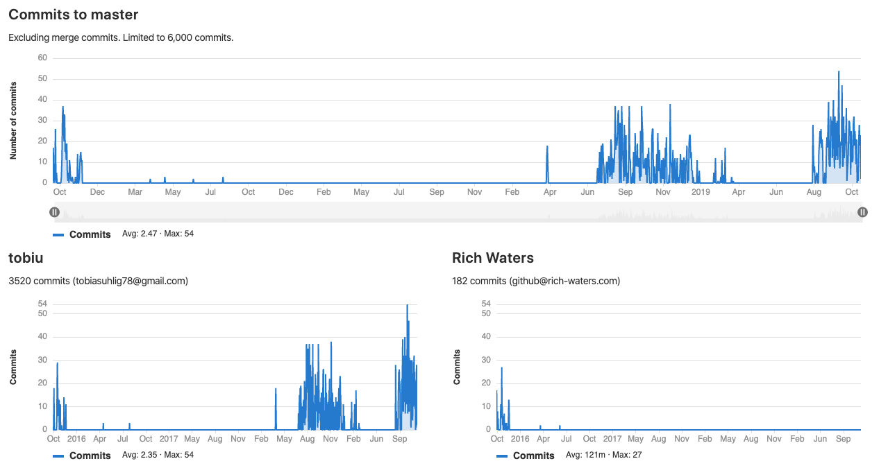

# Project history of neo.mjs
Rich and I already started the project (codename: Neoteric) in October 2015.

It was a rough time for workers, since there were no console logs possible.
Catching errors without any info which file or line number caused it was painful,
but we got it running in the first version (ES5 based) of the framework.

The project got a new momentum, once the Chrome flag was released, which made it possible
to use JS modules directly inside workers (imports). I created a second version of the framework at this point,
which is now fully based on top of ES8.

Just to make a point on how much time & effort has already been spent on neo.mjs prior to the public release:

***3720 commits in total.***

3520 commits Tobias Uhlig

&nbsp;&nbsp;&nbsp;182 commits Rich Waters

&nbsp;&nbsp;&nbsp;&nbsp;&nbsp;&nbsp;&nbsp;8 commits Arthur Rubens

&nbsp;&nbsp;&nbsp;&nbsp;&nbsp;&nbsp;&nbsp;2 commits Kevin Cassidy

&nbsp;&nbsp;&nbsp;&nbsp;&nbsp;&nbsp;&nbsp;1 commits Herb Jellinek

&nbsp;&nbsp;&nbsp;&nbsp;&nbsp;&nbsp;&nbsp;1 commits Nils Dehl

I would also like a ***big*** thank you to everyone who provided feedback prior to the public release!

Best regards
Tobi

Copyright (c) 2015 - today, Tobias Uhlig & Rich Waters