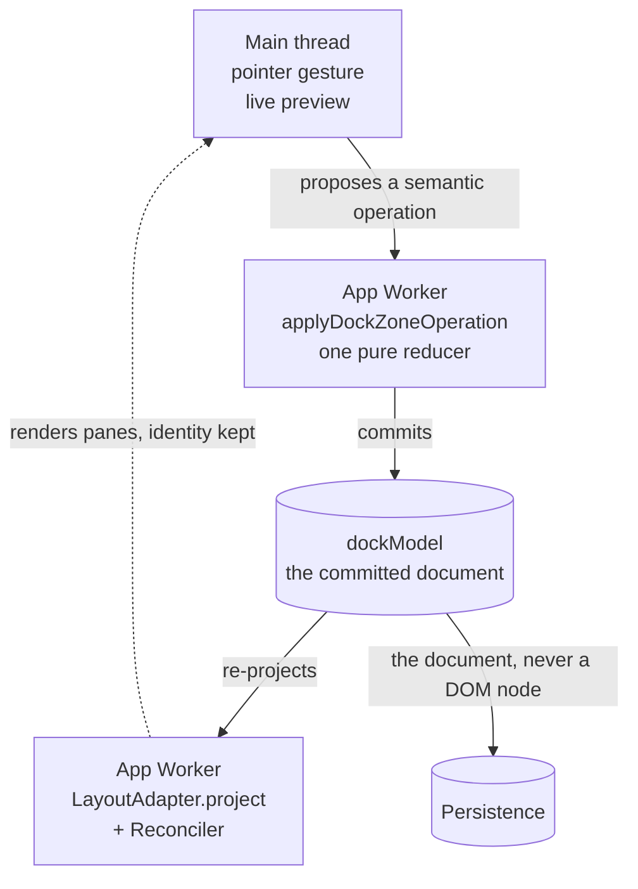

# Neo.mjs v13.2.0 Release Notes

**Release Type:** *pending: the operator confirms it at the cut.*
**Stability:** *pending: the operator confirms it at the cut.*
**Upgrade Path:** See *Upgrading from 13.1* below for stable package entry points, removed files and scripts, and behavior changes that require action.

> **Status: iteration 8 of N — a staging draft.** This iteration names what we build next, Agent Institution. The repositories-split chapter and the screenshots land next; the release designation, the final scope count and the Full Changelog wait for the cut.

> **TL;DR:** One repository became several, and the Engine now ships on its own line: the Agent OS and the Fleet Manager moved to their own repositories, so `neo.mjs` installs, builds and is tested as the Engine alone. The centerpiece is Dock Layouts: an app arranges its panes across real windows under one undo history. Tear a pane out into its own OS window, carry it to another window, bring it home, then undo or reset the whole arrangement. Grid cell editing was rebuilt for pooled rows: an edit belongs to its record, so scrolling its cell away suspends the edit and its draft until the record comes back. Around those three: a 5,000-record Buffered List, runtime repairs for hidden windows and render flights, and a package a consumer can build and check. Next comes the Fleet Manager, now named Agent Institution: the cockpit where an operator runs a standing team of AI agents, itself an application on this release's Dock Layouts.

---

## 📋 13.2 in 2 Minutes

**Three heroes:**
1. **The repositories split.** The Agent OS and the Fleet Manager left the Engine's repository and release on their own lines; the Engine builds, packs and tests without them.
2. **Dock Layouts and multi-window.** Each workspace keeps its arrangement in one document in the App Worker, and one shared history spans the windows. A pane can leave as a real OS window and come home with its state, and Undo, Redo and Reset cover the whole journey.
3. **Grid cell editing.** Editing returned to the Grid, built for its pooled rows and cells: double-click, Enter or F2 starts an edit, and scrolling its cell out of view suspends the edit instead of losing it.

**The scale:** 2,143 pull requests merged in `neomjs/neo` since 13.1.0 was published on 2026-07-03, some of them Agent OS and Fleet Manager work done here before it moved. Across the organization the count is 2,919, with 356 in the Brain's repository and 311 in Agent Institution's (GitHub search `is:pr is:merged merged:>=2026-07-03T21:40:28Z`, the 13.1.0 release's publish time, run 2026-10-09 13:57Z; refreshed at the cut).

**The short route:** build a workspace from panes and zones with the [first Dock Layout tutorial](https://github.com/neomjs/neo/blob/dev/learn/tutorials/DockLayoutsFirstLayout.md), then edit in place in the [Grid cell-editing example](https://github.com/neomjs/neo/blob/dev/examples/grid/cellEditing/index.html): double-click a cell, or press Enter or F2, then type or pick a number, a date or a country. The [5,000-record Buffered List](https://github.com/neomjs/neo/blob/dev/examples/list/buffered/index.html) shows a bounded row pool. These are `dev` source links while the 13.2 site is being prepared.

**Read for your work:** the repositories split if you install or contribute; Dock if an app spans windows; Grid cell editing if users change data in place; *Also in 13.2* and the upgrade path if you extend or ship the Engine.

**The limit:** Canvas workers now separate unrelated roots, but App, Data and VDom workers remain origin-wide; the wider heap boundary stays open under [D#18730](https://github.com/orgs/neomjs/discussions/18730).

**What we build next:** [Agent Institution](https://github.com/neomjs/neo-agent-institution), the Fleet Manager's own repository: the cockpit where an operator runs a standing team of AI agents, built on this release's Dock Layouts. *What we build next* below says where it stands.

---

## 🧬 The repositories split: the Engine on its own line

<!-- Seed for the split chapter (a #14800 leaf): why the split happened, how it ran, what a consumer installs now, and a visual of the repository homes. It replaces these two paragraphs. -->

The Agent OS and the Fleet Manager moved to their own repositories during this window. The Engine build now runs with the Brain absent ([#17506](https://github.com/neomjs/neo/pull/17506)); the received Agent OS implementation and the Fleet duplication left this tree ([#17806](https://github.com/neomjs/neo/pull/17806), [#17810](https://github.com/neomjs/neo/pull/17810)). The [package-contents guard](https://github.com/neomjs/neo/pull/17253) keeps the corpus and plane state out of `npm pack`. For someone installing `neo.mjs`, that is a practical boundary: the Engine package can be built and checked without hosting its former Brain.

The [README maps the five repository homes](https://github.com/neomjs/neo/pull/17812), and the [Introduction guide](https://github.com/neomjs/neo/blob/dev/learn/benefits/Introduction.md) explains why the Engine and the sibling Agent OS have different homes and release on different lines (#18337). The 13.2 site renders the Engine's `learn/` tree, so the Agent OS boxes on the Portal's home page [open the Brain's own docs](https://github.com/neomjs/neo/pull/19221). A clone is lighter too: the 17,761-file `resources/content` mirror of GitHub [left the repository](https://github.com/neomjs/neo/pull/19322), the release notes moved to `.github/RELEASE_NOTES/`, and the Portal's content views and build generators [read declared corpus and release-notes roots](https://github.com/neomjs/neo/pull/19408) instead.

---

## 🧩 Dock Layouts and multi-window: a workspace that can leave its window

Arrange the Workstation: drop panes into tabs from an [indicator menu](https://github.com/neomjs/neo/pull/14974), split a zone, [fold a pane into an edge rail](https://github.com/neomjs/neo/pull/17952). Then pull a tab past the browser window's edge, and it [becomes a real OS window mid-gesture](https://github.com/neomjs/neo/pull/15444). Carry that window over another one, and the target's drop zones [answer the held pointer](https://github.com/neomjs/neo/pull/19244); release, and the pane joins the target. Close a popup, and [all its panes return to main in one undoable step](https://github.com/neomjs/neo/pull/19292) with their component, provider and store identities intact. [Undo and Redo](https://github.com/neomjs/neo/pull/18387) walk the arrangement across windows, and [Reset to default](https://github.com/neomjs/neo/pull/18595) brings back the shipped one.

<!-- Screenshot slot (a #14800 leaf): the Workstation with one pane torn into its own OS window, then the same pane home again. -->

### One document for the whole workspace

That continuity needed a different foundation. Before it, you could select the second tab and resize its split, and the first tab came back. An initial edge-zone band offered no resize handle, while a split made by rearranging panes did. The July [choreography](https://github.com/neomjs/neo/issues/14589) and [perspectives](https://github.com/neomjs/neo/issues/14590) demos could move a pane into a popup opened from the workspace and bring it home, but those gestures exposed a deeper problem. Selection lived in a view while geometry lived in the stored layout; the next projection could disagree with what the user just did (D#17818, #17836).

The August decision was to give the workspace one authoritative document for its current state. The App Worker owns that serialisable dock document and its perspectives. A window renders a projection; a drag or resize proposes a semantic operation, and one reducer commits it. Pointer previews and hover pixels remain temporary, while DOM geometry and physical windows stay on the main thread. Persistence receives the document, never a DOM node or a window object. [ADR 0029](https://github.com/neomjs/neo/blob/dev/learn/agentos/decisions/0029-docking-design.md) records that boundary.

A window can host a workspace of its own. In the Workstation, a popup holds a workspace with its own document, and a move between windows commits both documents in one Group transaction, or neither ([ADR 0029, workspace topology](https://github.com/neomjs/neo/blob/dev/learn/agentos/decisions/0029-docking-design.md#workspace-topology-across-windows)). That Group's history is the one Undo and Redo walk.

This was a deliberate hard cut, with a real upgrade cost. npm `neo.mjs@13.1.0` shipped three experimental dock foundations — `DockZoneModel`, `DockLayoutAdapter` and `DockSplitter`. The new system replaces those `Dock*` files without a compatibility alias; a 13.1 consumer importing them must port. The Workstation and dashboard examples were updated with the engine cut ([#17841](https://github.com/neomjs/neo/pull/17841)). The migration is spelled out below.

The model cut landed on 2026-08-29 ([#17841](https://github.com/neomjs/neo/pull/17841)). The dock then stopped asking each consumer to reconstruct facts only the engine knew (#18151), and its growing `Workspace` class gave projection, interaction, persistence and window behavior distinct homes (#18304). [Tab activation and edge extent](https://github.com/neomjs/neo/pull/17845) now commit through that document; [splitters preview both sides live](https://github.com/neomjs/neo/pull/17849) before one terminal commit. The Workstation's edge once booted pinned at its CSS maximum, so it could not grow right and snapped back after some leftward drops. [#17858](https://github.com/neomjs/neo/pull/17858) removed those caps and restored the preview floor. Selection and width now survive the next projection rather than being reconstructed from a view that disagrees with the stored layout.

For a developer, a first arrangement can now be declared as panes and zones rather than programmed step by step (#18474). The host to extend is [`Neo.dashboard.dock.Workspace`](https://github.com/neomjs/neo/blob/dev/src/dashboard/dock/Workspace.mjs); a pane is a named ordinary component configuration, not a `Neo.dashboard.Panel` instance ([first-layout tutorial](https://github.com/neomjs/neo/blob/dev/learn/tutorials/DockLayoutsFirstLayout.md), [document contract](https://github.com/neomjs/neo/blob/dev/src/dashboard/dock/model/WorkspaceDocument.mjs#L50-L53)). The Workspace composes its own [cross-window participation](https://github.com/neomjs/neo/pull/19351) once a sort group is published, and its [header actions are a plugin](https://github.com/neomjs/neo/pull/19358) a host can decline. A host that turns tear-out on without publishing that group [gets a warning at projection](https://github.com/neomjs/neo/pull/19449), since none of its torn-out windows could be dragged back. Perspective selection follows reactive state (#18605). A window group owns transaction history and the topology needed to restore a saved arrangement across reload (#18303). The Workstation [extends that host](https://github.com/neomjs/neo/blob/dev/apps/workstation/view/VesselWorkspace.mjs) with its own panes and vessel lifecycle; the [Dock Layouts guide series](https://github.com/neomjs/neo/blob/dev/learn/guides/uibuildingblocks/DockLayoutsAdoption.md) starts with that ownership choice.

The document is visible in the controls. A tab can offer the engine's lock, reload, pin, pop-out, maximize and close actions ([Workspace action contracts](https://github.com/neomjs/neo/blob/dev/src/dashboard/dock/Workspace.mjs#L198-L289)). The rail tab [reveals a pinned pane from the edge](https://github.com/neomjs/neo/pull/18120), and the reveal's pin brings it home; a click into a field inside the reveal [keeps its focus](https://github.com/neomjs/neo/pull/19340). A [keyboard detach command](https://github.com/neomjs/neo/pull/15483) gives the window route a path when a platform refuses a pointer-born popup. A drag paints the [region it would occupy](https://github.com/neomjs/neo/pull/17873) before committing. Structural moves use [FLIP motion](https://github.com/neomjs/neo/pull/14944), while the other transitions read [shared tokens](https://github.com/neomjs/neo/pull/14947) that collapse for reduced motion. Rails and splitters take their structural paint from the engine ([#17524](https://github.com/neomjs/neo/pull/17524), [#17531](https://github.com/neomjs/neo/pull/17531)), with dock theming across [every shipped theme](https://github.com/neomjs/neo/pull/17613).

### A pane can become a real window

Without an explicit staging scheme, a popup opened through `Main.windowOpen` [inherits the opener's color scheme](https://github.com/neomjs/neo/pull/18436) instead of flashing the browser default before the app mounts. Releasing the pane commits one semantic move; cancelling it leaves the document untouched. A later journey handles the browser's native title bar, where the page cannot see `pointerup`: holding the popup over a target for **1.2 seconds** [fills its drop area and commits the transfer](https://github.com/neomjs/neo/pull/18119), then closes the popup. A [whole stack can come home atomically](https://github.com/neomjs/neo/pull/15501); [live-header preparation](https://github.com/neomjs/neo/pull/18684) preserves its pane identities, and the [Windows guide](https://github.com/neomjs/neo/pull/18715) shows the route. The title-bar dwell [now returns a whole stack as well](https://github.com/neomjs/neo/pull/19181), refusing a partial stack or one from another Group. A blocked popup [rolls the detach back](https://github.com/neomjs/neo/pull/15478). In the Workstation, a pane torn out again after a whole-stack return [opens with its content](https://github.com/neomjs/neo/pull/19208) instead of as an empty black popup, and a new popup [shows its pane as a dock tab from the first frame](https://github.com/neomjs/neo/pull/19212), where it had been a dark window with a half-height card. From birth, that tab strip is [the compact one the committed popup keeps](https://github.com/neomjs/neo/pull/19251), and the commit [moves the pane's live DOM](https://github.com/neomjs/neo/pull/19267) instead of rebuilding it. A popped-out Grid [scrolls and virtualizes again](https://github.com/neomjs/neo/pull/19280): its dock host had grown to 1,885 px inside a 240 px window.

### Green in emulation, broken by hand

On 2026-09-25 the operator tried the cross-window gesture by hand. A native popup dragged over another popup or the main window worked. A tab torn out of the dock and carried over another popup did nothing: no drop zones, no re-integration ([#19225](https://github.com/neomjs/neo/issues/19225)). The Workstation tour that drives the same gesture was green.

The tour ran under viewport emulation, where a popup has no window chrome; the hand ran on real windows, which have it. That one difference hid three defects:
- **Size.** A newborn popup on real Chrome reports an `outerWidth` of 0 before it has a frame. The total-size resize read that value, so every torn-out vessel was born at Chrome's minimum width, 146×239 instead of the requested 320×240 ([#19224](https://github.com/neomjs/neo/pull/19224)).
- **Plane.** The conversion sampled the vessel's content rect while the pointer rides its frame, so a title bar's height sat between the hand and the measured overlap ([#19232](https://github.com/neomjs/neo/pull/19232)).
- **Z-order.** Once the conversion admitted, the operator's screen recording showed the last defect. The parked vessel stayed on top of the target and covered its drop zones, because `focus()` raises nothing during a real OS drag ([#19289](https://github.com/neomjs/neo/pull/19289)).

Each repair moved a measurement off the emulated plane:
- The conversion now samples the frame the pointer holds and [admits on the pointer's claim](https://github.com/neomjs/neo/pull/19242), not an overlap threshold. It converted on 56 of 56 samples on real windows.
- A still pointer [gets the target's drop zones](https://github.com/neomjs/neo/pull/19244) without a pixel of motion.
- The vessel parks clear of the target, in the corner of that display's work area it covers least, and a cancelled conversion [re-shows it where it was parked](https://github.com/neomjs/neo/pull/19374).

Over the target, the operator ruled out a third proxy shape, a window-sized live pane covering the layout the hand aims at. The drag now shows [the tab-header proxy it showed in its own window](https://github.com/neomjs/neo/pull/19254), [with its label](https://github.com/neomjs/neo/pull/19299). Escape [cancels a drag that crossed windows](https://github.com/neomjs/neo/pull/19301), and a tab that took focus [gets it back at the drop](https://github.com/neomjs/neo/pull/19286). The last plane is closed as well: a parked vessel re-shown as the pointer leaves the target [now lands under the held pointer](https://github.com/neomjs/neo/pull/19458), where it had come back one title bar above it (67 px in the measured run).

### The arrangement has a way back

The Workstation exposes the Group's shared [Undo and Redo cursor](https://github.com/neomjs/neo/pull/18387) across its main window and popup. [Reset to default](https://github.com/neomjs/neo/pull/18595) enables when the committed arrangement differs from the shipped one; during a live history it returns that arrangement in one undoable commit. The tour's Start buttons [enter through the same reset](https://github.com/neomjs/neo/pull/19443), so a pane torn into its own window comes home before the tour begins, and a refused reset stops the tour with its errors. The current [compact toolbar](https://github.com/neomjs/neo/pull/19054) shows Reset, Undo and Redo with reactive history badges. The Workstation persists Group commits automatically in IndexedDB, so a cold boot restores the saved layout with an empty undo history. The engine makes a layout capturable, while an application chooses when to store it; the standalone example captures named arrangements and restores its collection at boot. [State, Operations and Persistence](https://github.com/neomjs/neo/blob/dev/learn/guides/uibuildingblocks/DockLayoutsStateAndPersistence.md) shows the boundary.

Closing a popup is part of that history too. In the Workstation, closing a popup [returns all its panes to main in one undoable Group transaction](https://github.com/neomjs/neo/pull/19292):
- tabs whose original home still exists return to their positions;
- Undo reopens the popup;
- component, provider and store identities survive the round trip.

A reload stays distinct from a close. The return and its replay became [engine seams any dock host can choose](https://github.com/neomjs/neo/pull/19325), and the Workstation deleted its own retry loop and replay override for them: 173 source lines out, 67 in. Closing a legacy dashboard popup [returns its widget exactly once, visible at once](https://github.com/neomjs/neo/pull/19464).

The flagship still has bounds beyond the opener-popup journey. A place-cycle restore once hid resident-card children transiently ([#16498](https://github.com/neomjs/neo/issues/16498)); the [recorded headed place-cycle at `d75cc685`](https://github.com/neomjs/neo/issues/17844#issuecomment-6074119217) showed no drift, while acceptance of the whole Workstation film stays open. A pooled-grid gap in the complete Workstation tour ([#17871](https://github.com/neomjs/neo/issues/17871)) was closed as not reproduced: the production-order tour passes, and only a reduction that skips the tour's settle step showed it.

---

## ✏️ Grid cell editing: the edit follows the record

Double-click a cell, or press Enter or F2, and type. Scroll the Grid while the draft is open. When pooling takes the cell out of the DOM, the edit and its draft wait, suspended, in the App Worker, neither committed nor cancelled, and the render that shows the record again brings the editor back. A column whose editor holds state only its DOM has opts out with [`cancelEditOnProjectionLoss`](https://github.com/neomjs/neo/blob/f3b462e84f234f3fec981a8434a1fcbb2c65f180/src/grid/column/Base.mjs#L23-L33): its edit is cancelled instead, and the grid fires `cellEditCancel` with `reason: 'projectionLoss'`, never silently. With a valid draft, [Tab commits and moves to the next editable cell, and Shift+Tab moves back](https://github.com/neomjs/neo/pull/18878); at an edge, the edit ends on the Grid View. The [public example's source](https://github.com/neomjs/neo/tree/dev/examples/grid/cellEditing) is on `dev`, and the [Grids guide](https://github.com/neomjs/neo/blob/dev/learn/guides/datahandling/Grids.md) teaches the editing contract alongside it.

<!-- Screenshot slot (a #14800 leaf): an open cell edit in the public example, holding a typed draft. -->

### Four days, twenty-seven leaves

The old cell editor was still in the package, but a developer trying the public example could not use it. At `dev@d688710175`, the example rendered no rows; double-click, Enter and F2 mounted no editor, and double-click threw. The 2024 implementation was a 34-line subclass of Table editing, written before the Grid pooled rows and cells. Two repairs that kept that inheritance (#17937, #18222) were dropped. A Grid editor needed to belong to the Grid's own projection model.

[D#17832](https://github.com/orgs/neomjs/discussions/17832), opened on 2026-08-28, set that model. The editing session is logical: `{recordId, dataField}` names what is being edited, while the Row places the editor in whichever pooled cell currently represents it. The epic that built it, [#18762](https://github.com/neomjs/neo/issues/18762), opened on 2026-09-16 and closed on 2026-09-19 with 27 leaves.

### The example changed the plan

The first implementation and its synthetic text fixture were green. Then a real pointer-and-keyboard pass through the public example failed **six of eleven** interactions. Picker focus, ComboBox ownership, Tab, locked bodies and accessibility attributes were not the same problem as placing one text editor in one cell. A return review over 120 columns and 400 rows found one more missed path, arrows while an edit was suspended ([#18958](https://github.com/neomjs/neo/pull/18958)). The repair grew from placing an editor to keeping a real user's edit intact through the Grid's changing view.

That evaluation has a precise limit. The `aria-readonly` tests inspect the rendered attribute; no screen-reader announcement was run (#18876). The IME witness uses synthetic Chromium composition events, not a real OS IME. Non-text editors in nested fields and tree columns were witnessed after the epic closed ([#18991](https://github.com/neomjs/neo/pull/18991)); the earlier closeout did not establish them.

> [!NOTE]
> ### 🧊 The tier that can see the cube
> On 2026-09-19, an issue curated for new contributors ([#19010](https://github.com/neomjs/neo/issues/19010)) asked for a unit spec over `Neo.layout.Cube`, the CSS 3D layout behind the portal's cube easter egg. The operator, Tobi, corrected the tier, in words [#18985](https://github.com/neomjs/neo/issues/18985) records:
> *"e2e and component-based testing beats unit testing for a long shot when it comes to visual items."*
>
> A unit assertion could only read back the transform the layout had just written, and it would pass while the cube rendered inside out. The issue moved to the component tier. [@sloemo01's component spec](https://github.com/neomjs/neo/pull/19024) now asks the browser which face `elementFromPoint` hits at the cube's center, for all six faces. The same limit runs through this release:
> - the Grid editor's synthetic fixture stayed green while a real pass failed six of eleven interactions;
> - the Workstation's emulated tour stayed green while a tab carried by hand over a real popup never converted;
> - the Buffered List's unit-level scroll calls missed a 3,780px runaway (below).

---

## 🧰 Also in 13.2

### Buffered List: thousands of records, a small physical list

A long activity history should still behave like a list. [Buffered List](https://github.com/neomjs/neo/pull/17557) keeps the Store, ListModel and `ul/li` contracts while separating logical records from physical row slots: in its 5,000-record unit fixture, five visible rows and a two-row buffer on each side need **nine mounted components**, and the [example](https://github.com/neomjs/neo/pull/17941) runs a **16-row pool** over the same 5,000 records. After the [fixed-slot pass](https://github.com/neomjs/neo/pull/17600), a forward and reverse scroll that had made seven and two `moveNode` calls makes none.

The first real-wheel investigation found what unit-level scroll calls could not. A sixth 30px wheel delta crossed the mounted-range boundary at 180px, and within 1.5 seconds the list had run to **3,780px** with no further gesture: browser scroll anchoring kept compensating for the growing top spacer, and each compensation changed the range again. One `overflow-anchor: none` rule stopped the same gesture at 180px ([#17944](https://github.com/neomjs/neo/pull/17944)). The investigation also [retracted its own early green claim](https://github.com/neomjs/neo/issues/17878#issuecomment-5479134218), whose checks had sampled one animation frame after input.

### Menus, controls and composition

A menu assembled by independent modules can take one [TreeStore of parent-linked commands](https://github.com/neomjs/neo/pull/17843). Hovering a parent [previews its submenu](https://github.com/neomjs/neo/pull/18765) without stealing focus, Right and Left [walk levels](https://github.com/neomjs/neo/pull/18766), and closing a branch [hands focus back](https://github.com/neomjs/neo/pull/18860) to the opening item instead of dropping it on the page body. The pointer and keyboard paths have Chromium coverage; screen-reader and touch behavior have not been independently verified.

A TabContainer can carry [header actions](https://github.com/neomjs/neo/pull/17423) and keep [overflow in its action rail](https://github.com/neomjs/neo/pull/17960) without [hiding the focused tab](https://github.com/neomjs/neo/pull/19294). Grid columns [resize header and body together](https://github.com/neomjs/neo/pull/17417) during the gesture, and a buffered Grid [fires `scrollEdge`](https://github.com/neomjs/neo/pull/19357) when its reader reaches the store's last rows, so nobody has to load everything to know they reached the end ([the loading pattern](https://github.com/neomjs/neo/blob/dev/learn/guides/datahandling/Grids.md#loading-a-corpus-window-by-window)). The [Chip field](https://github.com/neomjs/neo/pull/17749) is an array-valued multi-select, [FileUpload](https://github.com/neomjs/neo/pull/15833) accepts an app-supplied transport, and a Store supplied to a ComboBox [stays unfiltered for its other consumers](https://github.com/neomjs/neo/pull/18857). Theme authors' palette overrides win across the [pure Neo token sheets](https://github.com/neomjs/neo/pull/18747), and a [shared motion vocabulary](https://github.com/neomjs/neo/pull/15205) reaches all five themes. `Collection#findBy` and `Store#forEach` [stopped copying every item on each iteration](https://github.com/neomjs/neo/pull/19193), which had made both quadratic, and `Neo.merge` [skips prototype-chain keys](https://github.com/neomjs/neo/pull/17537) in parsed input.

Three issues curated for new contributors were fixed in their authors' first Engine PRs. A number field holding `0` [shows its clear trigger](https://github.com/neomjs/neo/pull/19200) (@GautamSahu028). The Paging toolbar [treats an empty store as one empty page](https://github.com/neomjs/neo/pull/19089) (@Parithosh-Varma), where next and last had stayed enabled and last went to page 0; @sloemo01's [coverage spec](https://github.com/neomjs/neo/pull/19049) had recorded that behavior as found. A form field [keeps its own bottom margin](https://github.com/neomjs/neo/pull/19412) whatever order the stylesheets load in (@Saadanjum0).

### Runtime: a quiet window still has work to do

A worker-driven app must keep making progress while its window is not painting. The Workstation's hidden panes had stopped advancing: size changes waited on paint until [ResizeObserver gained a paint-independent carrier](https://github.com/neomjs/neo/pull/16426), and the tour waited on a [`requestAnimationFrame` a hidden pane never receives](https://github.com/neomjs/neo/pull/16436). Later, an [App Worker hidden tick](https://github.com/neomjs/neo/pull/18755) brought a size change, which a tab hidden for six minutes had missed for more than 90 seconds, to the worker in **0.71 seconds** in a controlled Chrome run. That is a measured case, not a latency promise.

Failures became visible. In a SharedWorker development build, [App Worker](https://github.com/neomjs/neo/pull/18557) and [other SharedWorker errors](https://github.com/neomjs/neo/pull/18567) now reach the page console, and the [Engine E2E error gate](https://github.com/neomjs/neo/pull/18716) fails a test on one. A remote method that throws [answers its caller with exactly one rejection](https://github.com/neomjs/neo/pull/19291); a synchronous throw used to send no reply, so the caller's promise never settled.

A render belongs to its own flight: a successful flight [settles the update promises it claimed](https://github.com/neomjs/neo/pull/18787), and in a [real Grid editor probe](https://github.com/neomjs/neo/pull/18926), 26 typed letters survived record updates every 4ms, where the previous behavior lost letters in three of three runs. And a second root keeps the first one painting. Two unrelated tabs of one app had shared an origin-wide Canvas SharedWorker, where one could stop the other's canvases ([the witness](https://github.com/neomjs/neo/pull/19041)). The [Canvas group repair](https://github.com/neomjs/neo/pull/19125) gives each unrelated root its own Canvas SharedWorker, and in the measured Chromium journey both roots keep painting. Firefox and WebKit have not been independently measured for that path.

### A package a consumer can build

Build success has a stricter meaning. A `dist/esm` transform that exited 0 while its copied imports could not load [now fails](https://github.com/neomjs/neo/pull/17932). The [consumer-runtime check](https://github.com/neomjs/neo/pull/18872) packs and installs the Engine, then compiles its App Worker against **all 153 apps shipped in that measured package**. It now [proves the browser-bundle path](https://github.com/neomjs/neo/pull/19471) as well, since the published package leaves those bundles to the consumer ([the bundle decision](https://github.com/neomjs/neo/issues/18823)). Two install defects were caught before publication:
- a development-only materializer ran from `postinstall`, where a consumer lacked its binary. It [moved to `prepare`](https://github.com/neomjs/neo/pull/19053), and a packed-tarball install that had exited 127 now exits 0;
- the committed `.npmignore` trailed `.gitignore` by 16 rules, until `prepack` [composed it at pack time](https://github.com/neomjs/neo/pull/19223).

In a workspace's development mode, a relative URL in a Fetch, Stream or Xhr connection [resolves from the page](https://github.com/neomjs/neo/pull/19435).

A clean checkout can prove itself. The [contributor setup repair](https://github.com/neomjs/neo/pull/19000) builds the git-ignored browser bundles a fresh clone lacks; without them, `npm run test-unit` had collected zero tests. The [mounted-component tier](https://github.com/neomjs/neo/pull/15373) entered CI after 41 specs had existed without a workflow, and the [Engine E2E tier](https://github.com/neomjs/neo/pull/18404) gained its own runner. A claim on a `good first issue` [gets an automatic reply](https://github.com/neomjs/neo/pull/19211) saying whether the claimant is first in line, and [`CONTRIBUTING.md`](https://github.com/neomjs/neo/pull/19195) explains what an assignment protects. The first live reply, on [#19230](https://github.com/neomjs/neo/issues/19230), counted the claimant's draft in their own fork as a hold. [#19414](https://github.com/neomjs/neo/pull/19414) repaired that rule, and through 2026-10-09 no live reply after the repair has been observed. A working packed build is not a claim that the new site has deployed.

---

## ▶️ What you can do with 13.2

### Explore

You can [open the current Calendar](https://neomjs.com/examples/calendar/basic/index.html). The Portal's example catalog again lists DevIndex and keeps Calendar visible; both cards had been lost to separate catalog defects ([#17437](https://github.com/neomjs/neo/pull/17437), [#17487](https://github.com/neomjs/neo/pull/17487)). With this release the catalog [opens on the Dock Layouts card](https://github.com/neomjs/neo/pull/19426), which the live site's catalog keeps hidden until then. The DevIndex card [opens the deployed app](https://github.com/neomjs/neo/pull/19184) at `neomjs.com/devindex/`, which DevIndex now deploys itself, and its `dist/development` and `dist/production` tabs [open DevIndex's own builds there](https://github.com/neomjs/neo/pull/19434). In the 13.2 `dev` source, the month view [draws its days even with no calendars or an event store that never loads](https://github.com/neomjs/neo/pull/19150); events still wait for their matching calendars. Its sidebar DateSelector [no longer throws when the week's first day changes during a month slide](https://github.com/neomjs/neo/pull/19447) (@sloemo01). The hosted example receives those repairs with the release.

### Build

Start with the [first Dock Layout tutorial](https://github.com/neomjs/neo/blob/dev/learn/tutorials/DockLayoutsFirstLayout.md): change the named panes and zones in its live previews, then use the [Workstation's local run guide](https://github.com/neomjs/neo/blob/dev/apps/workstation/README.md) to try popup motion, Reset, Undo and Redo in an application. Those `dev` links provide the working path while the 13.2 site is being prepared.

The [Buffered List example](https://github.com/neomjs/neo/blob/dev/examples/list/buffered/index.html) turns 5,000 records into something you can tune: change the mounted-row range, row height or viewport height and watch the list respond ([#17941](https://github.com/neomjs/neo/pull/17941)). It runs from a `dev` checkout; after dependencies and fresh theme assets are in place, `npm run server-start -- --no-open` serves `examples/list/buffered/index.html` on the printed local port. Its hosted 13.2 route is not live in this draft, so the link leads to source rather than a dead demo. The [styling guide](https://github.com/neomjs/neo/blob/dev/learn/guides/uibuildingblocks/StylingAndTheming.md) gives the exact build-then-watch workflow before you change SCSS (#17902).

### Extend

Once an example becomes your own app, two guides prevent a subtle class-system mistake: [`SetupClass`](https://github.com/neomjs/neo/blob/dev/learn/guides/coreengine/SetupClass.md) explains generated `is<Ntype>` flags, and [extending Neo classes](https://github.com/neomjs/neo/blob/dev/learn/guides/fundamentals/ExtendingNeoClasses.md) shows why an inherited reactive config is overridden by its bare name, not a repeated underscore (#17905, #17959). `Neo.manager.ClassHierarchy.isA()` now [recognizes ancestors above `Neo.component.Base`](https://github.com/neomjs/neo/pull/19154) instead of stopping early. A component that needs to wait for a condition can use [`Neo.core.Base#waitFor()`](https://github.com/neomjs/neo/pull/18407) with bounded attempts; a pending wait rejects if the instance is destroyed. A custom canvas renderer can [declare the context it draws with](https://github.com/neomjs/neo/pull/19169): `contextType` defaults to `'2d'` and `contextAttributes` pass through only when set, so a renderer in the canvas worker can draw with WebGL2, and a context the browser refuses is reported once while the renderer stays idle. The canvas host also [forwards wheel, drag and modifier keys](https://github.com/neomjs/neo/pull/19179): `mouse` carries `dx`/`dy`, the held buttons and the modifiers, and a renderer overrides `onMouseDown`, `onMouseUp` or `onWheel` to handle a drag or a wheel gesture.

The engine now ships one such renderer. [`Neo.canvas.GraphScene`](https://github.com/neomjs/neo/pull/19274) draws a graph with WebGL2 on the canvas worker, with no external library:
- the App Worker sends typed arrays;
- an orbit camera frames the scene, and `pick` answers a node;
- a frame is drawn only when something changed;
- a lost context comes back with its scene uploaded again.

It was extracted from the Fleet Manager's Observatory, so that slice's follow-ups extend engine code.

A clustered scene draws through a [foveated level of detail](https://github.com/neomjs/neo/pull/19302): far away, bundles stand in for the edges between clusters, and close up, the edges of the clusters nearest the camera's target appear. A level change uploads nothing. In a 100k-node, 1M-edge, 64-cluster scene, the far level draws 2,016 bundle lines in place of a million edges. That run used headless branded Chrome on one Apple M5 Max with the frame cap lifted. The median far level ran at 7.9× the full draw's rate (1,905 against 241 fps), and every level held 60 fps with the cap on. The [GraphScene example](https://github.com/neomjs/neo/tree/dev/examples/component/graphScene) runs that lap.

GraphScene also exposed an input-order defect. A press that followed a pointer jump within one frame reached the App Worker before the move, so a single click [swung the camera from yaw 0.7 to 3.1](https://github.com/neomjs/neo/pull/19306). Every other mouse event now sends the waiting move first. A `SharedCanvas` [pauses its renderer while its window is hidden](https://github.com/neomjs/neo/pull/19338).

The [Earthquakes map tutorial](https://github.com/neomjs/neo/blob/dev/learn/tutorials/Earthquakes.md) now asks you to supply your own Google Maps key instead of lending you one (#18830).

---

## 🧭 What we build next: Agent Institution

The split gave the Fleet Manager a repository of its own and a product name. [Agent Institution](https://github.com/neomjs/neo-agent-institution) is the cockpit where an operator runs a standing team of AI agents:
- a roster with each agent's provider and model family, health and lifecycle state;
- the team's activity, tasks, memories, messages and wake state;
- lifecycle controls that start and stop its agents.

It operates the [Agent OS](https://github.com/neomjs/neo-agent-brain) over its Fleet transport and copies none of the Brain's implementation.

The cockpit is also an application on this release: a Dock Layouts workspace with SharedWorkers on ([`neo-config.json`](https://github.com/neomjs/neo-agent-institution/blob/dev/apps/agentos/neo-config.json)). Its panes dock, pop out into their own windows and come home through the Engine's dock ([`cockpit/Container.mjs`](https://github.com/neomjs/neo-agent-institution/blob/dev/apps/agentos/view/fleet/cockpit/Container.mjs)).

<!-- Screenshot slot (a #14800 leaf): the Agent Institution cockpit, populated, with one pane popped out into its own window. -->

It is at version 0.1.0. The [browser quickstart](https://github.com/neomjs/neo-agent-institution#browser-quickstart) runs the cockpit from a clone without a Brain checkout. It ships no sample fleet, so the cockpit reads "not answered yet" until a Fleet transport answers; live state and lifecycle actions need a configured Brain. The first run for an operator outside our team is the work in front of us now. [Watch or star the repository](https://github.com/neomjs/neo-agent-institution) to follow it; its [guides](https://github.com/neomjs/neo-agent-institution/blob/dev/learn/README.md) tour the cockpit, its data states and its optional desktop shell.

---

## ⬆️ Upgrading from 13.1

**What stays the same:** `package.json`'s `main`, `exports`, `bin`, `engines`, `type` and dependencies are unchanged.

**What changes is what the package ships:** the [13.1 upgrade audit](https://github.com/neomjs/neo/pull/19113) counted 6,261 files in 13.1.0; a [2026-10-09 dry-run pack](https://github.com/neomjs/neo/issues/14800#issuecomment-6080720155) counted 5,994 at `dev@f3b462e84f`. The 13.2 count is refreshed at the cut.

| If your code… | In 13.2 | Do this |
|---|---|---|
| imports `src/dashboard/DockZoneModel.mjs`, `DockLayoutAdapter.mjs` or `DockSplitter.mjs` | removed, with no compatibility layer (#17841) | port to Dock Layouts in `src/dashboard/dock/` (see the Dock Layouts chapter and the guide series, #17540) |
| imports `Neo.util.Env` (`src/util/Env.mjs`) | removed from the public surface (#17243). Nothing in the engine called it | inline the parser you used |
| runs anything under `node_modules/neo.mjs/ai/`, or one of the 59 `ai:*` scripts | the Agent OS left the package: 500 files, with its tests (#17806) | run it from `neomjs/neo-agent-brain` |
| was scaffolded by `npx neo-app` | the workspace's `ai:*` scripts point into `ai/` | delete them. A new scaffold still writes them while neomjs/create-app#34 is open |
| calls `buildScripts/docs/jsdocx.mjs` directly | renamed to `generateDocsJson.mjs` (#15461) | use `npm run generate-docs-json`, whose name is unchanged |
| uses `src/ai/fleet/*`, the `devindex:*` scripts or the `agentos` / `devindex` apps | moved to the Fleet Manager and devindex repositories (#16687, #17810, #17429) | use `neomjs/neo-agent-institution` or `neomjs/devindex` |
| links to `examples/dashboard/index.html` | the dashboard root became a pure parent; its demo moved to `examples/dashboard/base/` (#17520) | update the link to `examples/dashboard/base/index.html` |
| runs the Google Maps example or the Earthquakes tutorial | the committed Maps key is gone; both ship `YOUR_GOOGLE_MAPS_API_KEY` (#18830) | supply your own Google Maps API key |

**Public behavior to check:** Package entry points stayed stable, but code written against 13.1 can encounter these changes.

| If your code… | In 13.2 | Do this |
|---|---|---|
| declares a class field with the same name as a config | `Neo.create` throws before `construct()` ([#18629](https://github.com/neomjs/neo/pull/18629)); in 13.1 the field silently shadowed the config | put the default in `static config`, or rename the field or config |
| sets a Grid selection model on a body | the body's setter throws; the View owns the model ([#18661](https://github.com/neomjs/neo/pull/18661)) | use `viewConfig: {selectionModel}`, or set `grid.view.selectionModel` at runtime |
| reads `this` in an inline function Grid column `renderer` whose effective `rendererScope` is unset | `this` is the Grid Container; 13.1 used the column ([#18773](https://github.com/neomjs/neo/pull/18773)) | read the renderer's `column` argument, or set `rendererScope: 'this'` |
| changes the `items` array a `Store#forEach` callback receives as its third argument | the callbacks share one copy, refreshed when the store's count changes; 13.1 passed each call a fresh copy ([#19193](https://github.com/neomjs/neo/pull/19193)) | copy it before changing it |
| expects a ComboBox given a shared Store to filter that Store for other consumers | the field filters a view it owns; the supplied Store stays unfiltered ([#18857](https://github.com/neomjs/neo/pull/18857)) | filter the shared Store yourself if other consumers need it |
| expects `Neo.data.connection.WebSocket` to retry after a clean code-1000 close | it stays closed by default ([#18984](https://github.com/neomjs/neo/pull/18984)) | set `reconnectOnCleanClose: true` |
| reads a main-thread `Neo.worker.Manager.promiseMessage()` reply envelope under SharedWorkers | direct main/window-targeted replies now yield the payload, and remote rejection rejects ([#18768](https://github.com/neomjs/neo/pull/18768)) | read the value directly and catch rejections |
| calls a Canvas remote without `windowId`, including scalar `setTheme('dark')` | it works with one known Canvas group, but rejects with `NEO_UNROUTABLE` when unrelated roots create several groups ([#19125](https://github.com/neomjs/neo/pull/19125)) | pass the caller's `windowId`; use `{theme, windowId}` for `setTheme` |
| awaits a remote method that throws | the caller's promise rejects once; in 13.1 a synchronous throw sent no reply, so the promise never settled ([#19291](https://github.com/neomjs/neo/pull/19291)) | catch the rejection |
| enumerates a child scope's provider data with `Object.keys`, spread or `JSON.stringify` | keys from every provider on the chain are listed, closest first; 13.1 listed only the closest provider's keys ([#19269](https://github.com/neomjs/neo/pull/19269)) | read the closest provider's own data if you relied on the old result |
| passes a relative `./` or `../` URL to a Fetch, Stream or Xhr connection in a workspace's development mode | it resolves from the page's document base, not from the worker script inside the installed package ([#19435](https://github.com/neomjs/neo/pull/19435)) | write the URL relative to the page, or use an absolute one |
| points `rendererImportPath` at a workspace-owned `src/canvas/*` module | that prefix now loads from the installed Engine package rather than the workspace ([#19165](https://github.com/neomjs/neo/pull/19165)) | move the module under `apps/<app>/canvas/*` and update `rendererImportPath` |

The Canvas bridge also deprecates `Neo.main.DomAccess#getOffscreenCanvas` in favor of `transferCanvasToWorker`, and `Neo.worker.Canvas#retrieveCanvas` in favor of `registerCanvas` ([#19125](https://github.com/neomjs/neo/pull/19125)).

**Gone from the package, with no code impact:**
- 102 `learn/agentos` guides, now in the Brain's repository;
- the generated `apps/portal/sitemap.xml` and `llms.txt` (#17253), which a site build now regenerates.
