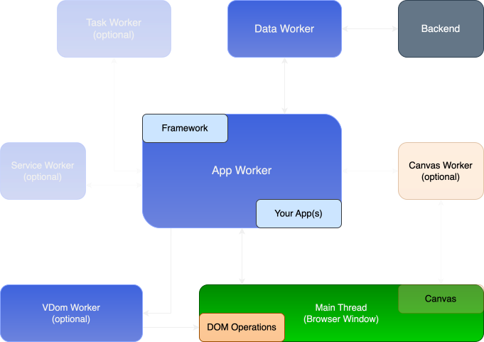

<p align="center">
  
</p>
</br>
<p align="center">
  <a href="https://npmcharts.com/compare/neo.mjs?minimal=true"></a>
  <a href="https://www.npmjs.com/package/neo.mjs"></a>
  <a href="https://www.npmjs.com/package/neo.mjs"></a>
  <a href="https://join.slack.com/t/neomjs/shared_invite/zt-6c50ueeu-3E1~M4T9xkNnb~M_prEEOA"></a>
  <a href="https://discord.gg/6p8paPq"></a>
  <a href="./CONTRIBUTING.md"></a>
</p>

# Build Ultra-Fast, Desktop-Like Web Apps. Period. :zap:
🚀 **Break Free from UI Freezes — Experience True Multithreading & Uncompromised Responsiveness.**

💻 ***Neo.mjs v10 isn't an upgrade — it's a new operating system for the web. Where others optimize at the margins, we reinvented the engine.***

Imagine web applications that never jank, no matter how complex the logic, how many real-time updates they handle, or how
many browser windows they span. Neo.mjs is engineered from the ground up to deliver **desktop-like fluidity and scalability**.
**While it excels for Single Page Apps (SPAs), Neo.mjs is simply the best option for browser-based multi-window applications**,
operating fundamentally different from traditional frameworks.

By leveraging a **pioneering Off-Main-Thread (OMT) architecture**, Neo.mjs ensures your UI remains butter-smooth, even during computationally intensive tasks like complex data processing or advanced graphics rendering. The main thread is kept free for one purpose: **flawless user interactions and seamless DOM updates.**

<p align="center">
  <a href="https://youtu.be/pYfM28Pz6_0"></a>
  <a href="https://youtu.be/aEA5333WiWY"></a>
</p>

</br></br>
## 🚀 Why Choose Neo.mjs? Solving the Toughest UI Challenges
Traditional single-threaded frontend frameworks often struggle with performance bottlenecks and UI freezes, especially for
large-scale, data-intensive, or real-time applications. Neo.mjs offers a fundamentally different solution, designed for
**uncompromising performance, enhanced security, and superior developer experience.**

1. **Eliminate UI Freezes with True Multithreading**:
   > *"The browser's main thread should be treated like a neurosurgeon: only perform precise, scheduled operations with zero distractions."*</br></br>
   — Neo.mjs Core Philosophy
    
   Neo.mjs's OMT architecture inherently prevents UI freezes. With v10's optimized rendering pipeline, your UI will remain even *more*
   consistently responsive, even during intense data processing or complex graphics rendering. It achieves an astonishing
   rate of **over 40,000 delta updates per second** in optimized environments. This translates to an engine with vast untapped
   potential, limited only by user interaction, not the framework.
 
2. **Unmatched Developer Experience: Transpilation-Free ESM**:
   Say goodbye to complex build steps for development. Neo.mjs apps run **natively as ES Modules directly in the browser**.
   This means **zero builds or transpilations** in dev mode, offering instant reloads and an **unmatched debugging experience**.
   You modify code, and your app updates in real-time.
 
3. **Inherent Security by Design**:
   By prioritizing direct DOM API manipulation over string-based methods (like `innerHTML`), Neo.mjs fundamentally reduces
   the attack surface for vulnerabilities like Cross-Site Scripting (XSS), building a more robust and secure application from the ground up.
 
4. **Declarative, Consistent, & Reusable Architecture**:
   Neo.mjs's unique **unified class config system** allows you to define components, layouts, and logic in a clean, declarative,
   and highly consistent way. This significantly reduces boilerplate, improves maintainability, and makes complex UI composition surprisingly straightforward.

5. **Scalability for Enterprise & Beyond**:
   Whether building sophisticated enterprise dashboards, data-intensive Gen AI interfaces, or desktop-like multi-window applications,
   Neo.mjs's modular, worker-driven architecture effortlessly scales. Components are persistent, stateful instances that can be unmounted,
   moved, and even remounted across browser windows without losing their logic or state. This is key to preventing the "re-rendering madness"
   common in other frameworks.

</br></br>
## 📊  Real-World Win: Crushing UI Lag in Action
Imagine a developer building a stock trading app with live feeds updating every millisecond. Traditional frameworks often choke,
freezing the UI under the data flood. With Neo.mjs, the heavy lifting happens in worker threads, keeping the main thread free.
Traders get real-time updates with zero lag, and the app feels like a native desktop tool. Now, imagine extending this with
**multiple synchronized browser windows**, each displaying different real-time views, all remaining butter-smooth.
That’s Neo.mjs in action—solving problems others can’t touch.

</br></br>
## 🌟 Key Features (and How They Supercharge Your App)

* **Persistent Component Instances**: Components maintain their state and logic even when their DOM is removed or moved.
  No more wasteful re-creations – just surgical, efficient updates.

* **Reactive State Management**: Built-in reactivity ensures dynamic, efficient updates between components and state providers,
  all handled off the main thread.

* **Hierarchical State Management**: Seamlessly manage state between parent and child components with nested state providers.
  Components intelligently bind to the closest provider, combining data for powerful, maintainable patterns.

* **Clean Architecture (MVVM-inspired)**: View controllers ensure a clear separation of concerns, isolating business logic
  from UI components for easier maintenance, testing, and team collaboration.

* **Multi-Window & Single-Page Applications (SPAs)**: Easily build and manage complex applications that require multiple
  browser windows or traditional SPAs, all powered by the same underlying multi-threaded architecture without requiring any native shell.

* **No npm Dependency Hell**: Neo.mjs apps run with **zero runtime dependencies**, just a few dev dependencies for tooling.
  This means smaller bundles, fewer conflicts, and a simpler dependency graph.

* **Cutting-Edge Use Cases**: Ideal for **data-intensive applications, real-time dashboards, web-based IDEs, banking
  applications, and complex multi-window Gen AI interfaces** where performance and responsiveness are non-negotiable.

<p align="center">
  
</p>
*Diagram: A high-level overview of Neo.mjs's multi-threaded architecture (Main Thread, App Worker, VDom Worker, Canvas Worker, Data Worker, Service Worker, Backend). Optional workers fade in on hover on neomjs.com.*

</br></br>
## 🔍 Neo.mjs vs. The Rest: Key Differentiators
Wondering how Neo.mjs stacks up against React, Angular, or Vue.js? Here’s the breakdown:

| Feature                   | Neo.mjs                                        | React / Angular / Vue.js                            |
| :------------------------ | :--------------------------------------------- | :------------------------------------------ |
| **UI Responsiveness** | **Guaranteed smooth**: Heavy tasks off-main-thread; main thread free for UI. | **Prone to jank**: Main thread handles all logic + UI, easily blocked. |
| **Multithreading** | Native OMT architecture for core app logic, VDom, data, & graphics. | Single-threaded by default; requires complex workarounds (e.g., Web Workers for *specific* tasks). |
| **Dev Mode Experience** | **No transpilation, instant reloads**: Native ES Modules directly in browser. | Build tools (Webpack, Babel) required for dev; slower reloads. |
| **Component Persistence** | State survives DOM changes; instances move across windows. | Full re-renders common; state often lost on unmount unless managed externally. |
| **Security** | Direct DOM API, inherently XSS-resistant by design. | Relies heavily on careful string sanitization; higher XSS risk if not diligent. |
| **Multi-Window Apps** | Seamless, browser-native multi-window support. | Complex to achieve; hacky or unsupported natively. |
| **Bundle Size** | Zero runtime dependencies for lean apps.       | Can be large with many third-party dependencies. |

**Neo.mjs Edge**: True multithreading, a no-build development mode, and a scalable, secure architecture combine to deliver a framework that's faster to build with and fundamentally faster and more stable to run.

</br></br>
## 📦 Declarative Class Configuration: Build Faster, Maintain Easier

Neo.mjs’s class config system allows you to define and manage classes in a declarative and reusable way. This simplifies class creation, reduces boilerplate code, and improves maintainability.

```javascript
import Component from '../../src/component/Base.mjs';

class MyComponent extends Component {
    static config = {
        className   : 'MyComponent',
        myConfig_   : 'defaultValue', // Reactive property
        domListeners: {               // Direct DOM event binding
            click: 'onClick'
        }
    }

    // Automatically called when myConfig_ changes
    afterSetMyConfig(value, oldValue) {
       console.log('myConfig changed:', value, oldValue);
    }

    // Handled in the App Worker, main thread remains free
    onClick(data) {
        console.log('Clicked!', data);
    }
}

export default Neo.setupClass(MyComponent);
```

For more details, check out the [Class Config System documentation](https://neomjs.com/dist/production/apps/portal/index.html#/learn/gettingstarted.Config).

</br></br>
## 🚀 Jump In: Your First Neo.mjs App in Minutes

Run this command:

```bash
npx neo-app@latest
```

This one-liner sets up everything you need to start building with Neo.mjs, including:

* A new app workspace.
* A pre-configured app shell.
* A local development server.
* Launching your app in a new browser window—all in one go.

:book: More details? Check out our [Getting Started Guide](./.github/GETTING_STARTED.md)

:student: Make sure to dive into the [Learning Section](https://neomjs.com/dist/production/apps/portal/#/learn/gettingstarted.Setup)

Next steps:

* :star: **Experience stunning Demos & Examples here**: [Neo.mjs Examples Portal](https://neomjs.com/dist/production/apps/portal/#/examples)
* Many more are included inside the repos [apps](https://github.com/neomjs/neo/tree/dev/apps)
  & [examples](https://github.com/neomjs/neo/tree/dev/examples) folders.
* :blue_book: All Blog Posts are listed here: [Neo.mjs Blog](https://neomjs.com/dist/production/apps/portal/#/blog)

</br></br>
## :handshake: Join the Community

:speech_balloon: Have questions? Join our [Slack channel](https://join.slack.com/t/neomjs/shared_invite/zt-6c50ueeu-3E1~M4T9xkNnb~M_prEEOA) and connect with other developers.

:hammer_and_wrench: Want to contribute? Check out our [Contributing Guide](https://github.com/neomjs/neo/blob/dev/CONTRIBUTING.md).

</br></br>
Copyright (c) 2015 - today, [Tobias Uhlig](https://www.linkedin.com/in/tobiasuhlig/)
