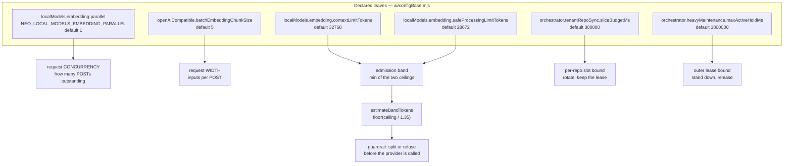
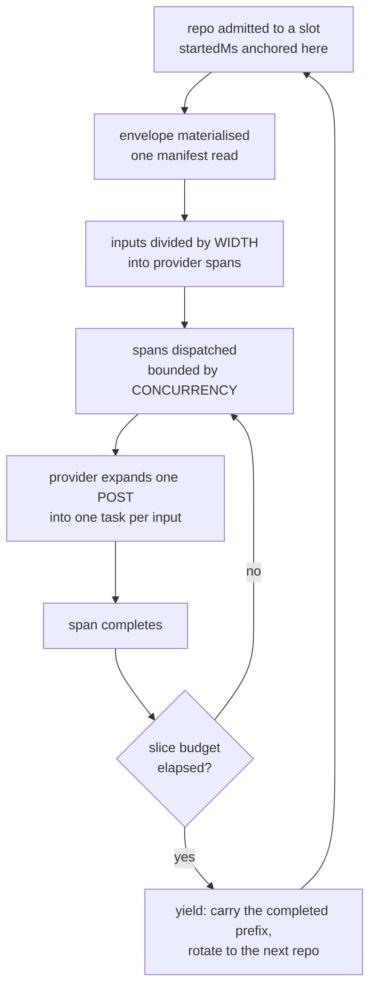
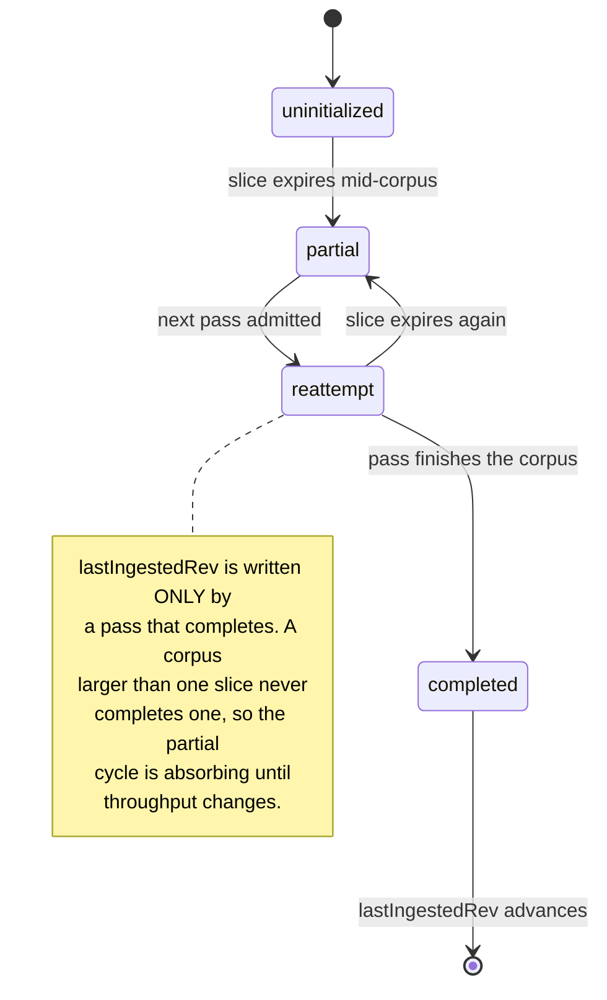
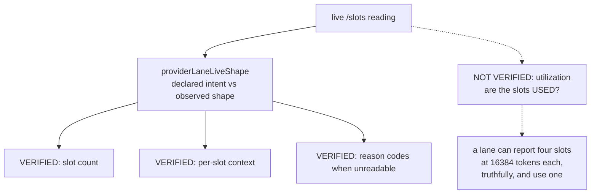
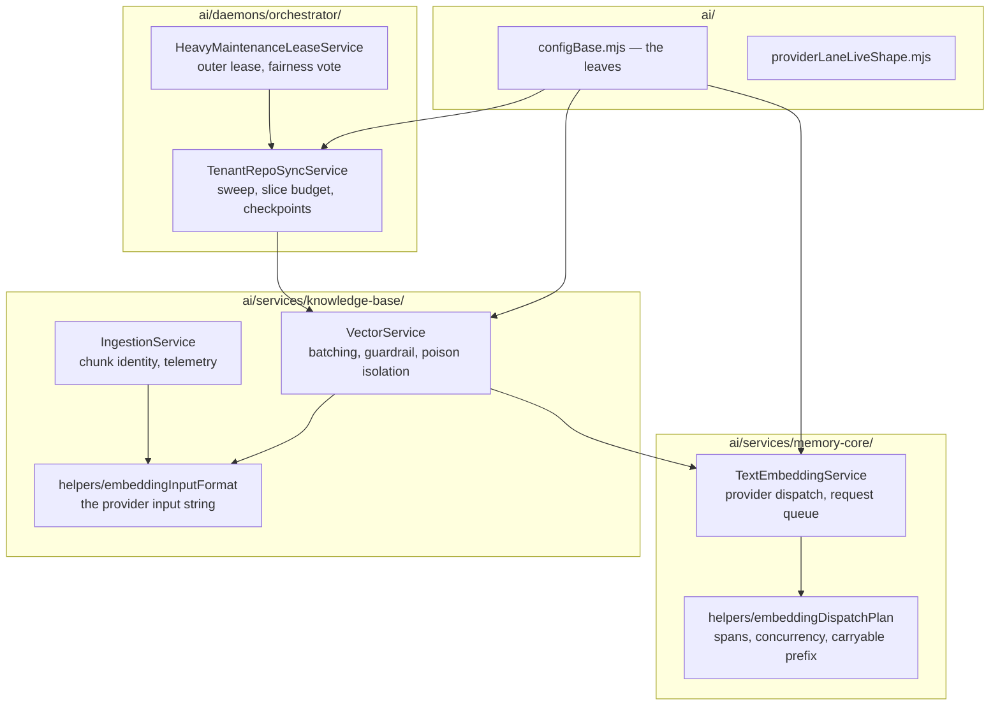

# The Embedding Lane: Where a Corpus Becomes Vectors

A subsystem can be composed entirely of careful parts and still be wrong as a whole.

The embedding lane is the clearest example Neo has. Every layer in it was added
deliberately, by someone solving a real problem, with a docblock explaining the
reasoning. A width clamp reserved a provider slot. A queue kept the client from
competing with itself. A budget bounded how long one repository could hold a
slot. A guardrail refused inputs the provider would reject. Each is defensible
in isolation.

Read together, they bounded a lane declaring four parallel slots to one request
at a time — and no single file said so. The composition was only discoverable by
instrumenting a running deployment, because the lane has no owning document and
no owning subsystem: `TextEmbeddingService` lives under `ai/services/memory-core/`,
`VectorService` under `ai/services/knowledge-base/`, the geometry leaves in
`ai/configBase.mjs`, the slice and lease scheduling in `ai/daemons/orchestrator/`,
the shape verification in `ai/providerLaneLiveShape.mjs`. Four owners, no owner.

This guide is the map. It exists because establishing the behaviour below cost a
full session of plane reads and produced nine wrong intermediate claims before
converging — eight of which were answerable from content already in the
repository, sitting in a 492-line prose document, a deployment Compose comment,
an ADR, a ticket acceptance criterion, a parser docstring, and a merged PR.

## How to read this document

Two kinds of fact live here and they decay at different rates. Conflating them is
what makes a ground-truth guide dangerous rather than merely stale.

**Contract facts** — what the code does, the arithmetic, the field names, the
state machine. These change only when someone edits the code, so they are stated
plainly with the citation that lets you re-derive them.

**Plane facts** — what is deployed, what is materialised, which signal has
actually fired. These change without anyone editing anything. Each is written as
a **dated observation plus the command that re-reads it**, and a plane fact
stated in the timeless present is a defect in this document.

The distinction is not theoretical. Written one day earlier, this guide would
have said *"the tenant parser declines vendored trees"* — true of the contract,
false of the plane, because the deployed revision predated the exclusion. A
reader trusting it would have concluded a corpus was clean when ~86.7k vendored
chunks were still resident.

## 1. Authority map: which value decides what



**Contract.** `EMBEDDING_TOKEN_ESTIMATE_DRIFT_FACTOR = 1.35`
(`ai/embeddingSafeBand.mjs:42`) and `BYTES_PER_TOKEN_HEURISTIC = 3`
(`ai/services/memory-core/helpers/consumerFrictionHelper.mjs:122`). The band is
`min(contextLimitTokens, safeProcessingLimitTokens)`, then
`floor(ceiling / 1.35)`; byte estimates are `ceil(bytes / 3)`.

**The distinction the diagram exists to draw: width and concurrency are separate
contracts.** Width is a durability decision — how many inputs one failure or one
yield can cost. Concurrency is a throughput decision — how many of those may be
in flight. They were conflated: `parallel` was spent computing a *width*
(`parallel - 1`, to "reserve" a slot the client cannot hold open, since the server
assigns slots from its own queue), and the concurrency it declares was used by
nothing.

`NEO_LOCAL_MODELS_EMBEDDING_PARALLEL` is the SSOT for the intent and applies
across provider options. `LLAMA_ARG_N_PARALLEL` in a deployment's Compose is a
second declaration of the same fact and violates that SSOT; the two agreeing is
a deployment's responsibility, not a guarantee.

## 2. One slice, as it actually runs



**Contract.** The slice budget is anchored per repository at *admission*, not
per sweep (`ai/daemons/orchestrator/scheduling/tenantRepoSync.mjs`,
`createSliceBudgetPredicate`). A sweep-wide budget would be spent by the first
admitted repository and starve the tail — the per-repo anchoring is the fix, and
it is also why honouring every budget still occupies the exclusive heavy slot for
roughly `N × sliceBudgetMs`.

The predicate is consulted *between* spans and never before the first, so actual
occupancy is the budget plus one span envelope. That is the forward-progress
guarantee: at least one span always lands per acquisition, so the lane cannot
livelock against its own fairness bound.

**Plane, observed 2026-08-20 on an external tenant deployment.** The provider
slot log showed roughly twenty consecutive `launch → release → launch`
transitions with never two tasks in flight, while 86,946 chunks waited. One
13,725-token input consumed an entire five-minute slice and the repository
reported `embeddings=1` at budget expiry. Re-read with:

```bash
curl -s "$EMBEDDING_HOST/slots" | jq '[.[] | {id, state}]'
```

## 3. Checkpoint states, and the edge that cannot be traversed



**Contract.** The checkpoint advances on a completed pass. A deferred outcome is
*incomplete, not failed*: the checkpoint stays where it is, `consecutiveFailures`
is neither reset nor incremented, and `lastRunAttemptAt` advances so the next
due-check measures from this attempt. Leaving the streak untouched is the
load-bearing half — incrementing would climb toward the backoff cap for a
condition that is not the repository's fault.

The consequence is the shape of the incident: a corpus that cannot finish inside
one slice makes `partial` absorbing, and the lane runs forever reporting healthy
machinery over a knowledge base that never receives its content. This is why
throughput is a correctness concern here and not only a performance one.

## 4. Guard interaction: pairs whose joint outcome differs from either alone

```mermaid
flowchart TD
    subgraph pair1["slice budget × checkpoint"]
        A1["budget expires"] --> A2["deferred, not failed"] --> A3["checkpoint frozen"]
    end
    subgraph pair2["admission band × provider tokenizer"]
        B1["ceil(bytes / 3) estimate"] --> B2["provider's real tokenizer differs"] --> B3["admitted input the provider refuses,<br/>or refused input it would have taken"]
    end
    subgraph pair3["starvation watchdog × lease holder"]
        C1["waiter starves"] --> C2["watchdog names the holder"] --> C3["holder consults no bound<br/>so naming changes nothing"]
    end
    subgraph pair4["carry arithmetic × concurrency"]
        D1["completions arrive out of order"] --> D2["count × width names a span<br/>containing inputs that never landed"] --> D3["binding guard fails CLOSED<br/>work conservation silently off"]
    end
```



**The fourth pair is the one worth internalising**, because its failure signature
is silence. The carry computed a completed span as
`completedChunkCount * chunkSize` — a count multiplied by a width — which names a
range only while completions arrive in issue order. Add concurrency and a span can
land after a hole; the product then claims inputs that never completed. The
positional-binding guard refuses a non-densely-indexed carry, so the outcome was
never a corrupt vector: it was work conservation switching itself off, with the
lane re-purchasing the same vectors on every retry and nothing in the logs.

**A guard that fails closed converts a wrong answer into a silent loss.** That is
usually the right trade, and it means the loss needs its own report — otherwise
the safety property hides the regression it prevented.

## 5. Verified axes, and the one that is not



**Contract.** `ai/providerLaneLiveShape.mjs` reads the live `/slots` endpoint and
compares observed shape against declared intent. Its own docblock states the
boundary: *"liveness answers 'can the provider respond?', never 'is the provider
shaped the way this deployment intends?'"*. It is pure by construction, never
throws, and emits greppable reason codes rather than prose — because those codes
reach an operator through the deployment-state snapshot, where a renamed string
silently breaks whatever matched on it.

**Shape is verified; utilization is not.** Both statements in the gap node can be
true simultaneously, and for a period they were. A verification layer that
answers the adjacent question confidently is more dangerous than one that answers
nothing, because its green is acted upon.

## 6. Code locality: the ownership vacuum



Nothing here is a mistake in isolation. The vacuum is that no box owns *the lane*,
so a defect spanning three of them belongs to nobody, and the person who finds it
is whoever happened to be measuring that week.

## Traps this document exists to remove

Each of these cost a real session, and each was answerable from something already
committed.

- **The 32 GiB memory ceiling looks unjustified until you read the Compose
  comment that derives it.** KV cache is *linear*, not quadratic:
  `ctx × layers × kv_heads × head_dim × 2 × 2`. The n² term is the attention score
  matrix and scales with `UBATCH`, which is what the ceiling is actually sized
  for. Asking for more memory before reading that derivation is asking a
  deployment to pay for a misreading.
- **Fused attention is not an unexplored win.** It was attempted and produced no
  reduction; the same Compose comment records it.
- **A guard's docblock describes what the guard does, never that anything calls
  it.** A generation-election store can document that an input-strategy change
  *"invalidates every existing vector"* while no code in this lane constructs such
  a generation. Before asserting a mechanism exists, grep for a **call site** — a
  function named in a comment is not a function that is called.
- **Vendored trees are excluded by contract and may still be resident on a
  plane.** The exclusion is a parser change; the resident rows are a deployment
  fact. Ask both questions separately.
- **Absence of a re-embed trigger is not the same as one being expensive.**
  Incremental selection collects existing ids and skips them, and the provider
  input string is *derived* — not a member of a chunk's `hashInputs` — so changing
  the input format does not change any chunk id. Re-ingestion therefore re-embeds
  nothing. `parserVersion` **is** a hash input, which makes it the only mechanism
  that re-mints ids today, and nothing schedules it.

## Related

- `learn/agentos/KnowledgeBase.md` — the corpus this lane feeds.
- `learn/agentos/cloud-deployment/TenantIngestionModel.md` — ingestion
  configuration, triggers and telemetry; this guide does not duplicate its scope.
- `learn/agentos/decisions/0019-aiconfig-reactive-provider-ssot.md` — the remedy
  shape this guide borrows: make the mechanism readable rather than asking for
  more care.
- `learn/agentos/decisions/0022-heavy-maintenance-scheduling-fairness.md` —
  cooperative yield only; the lane never preempts a live holder.
