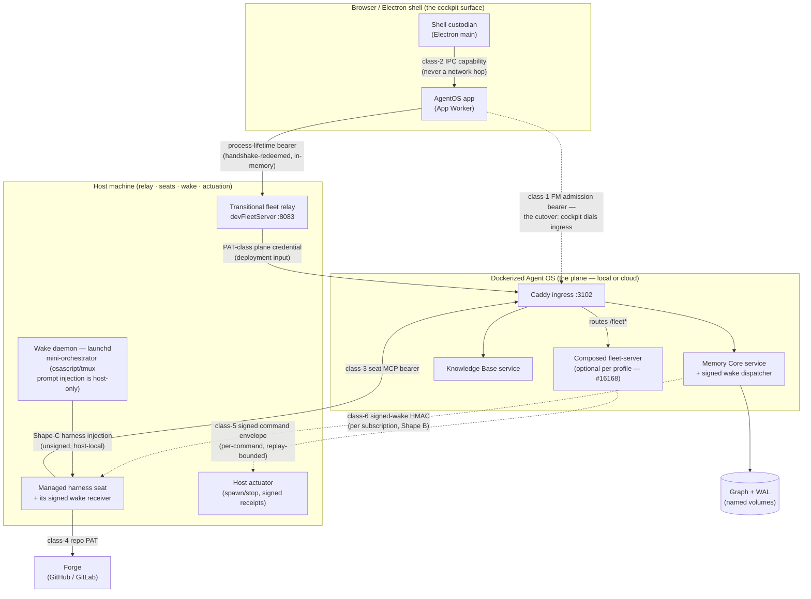
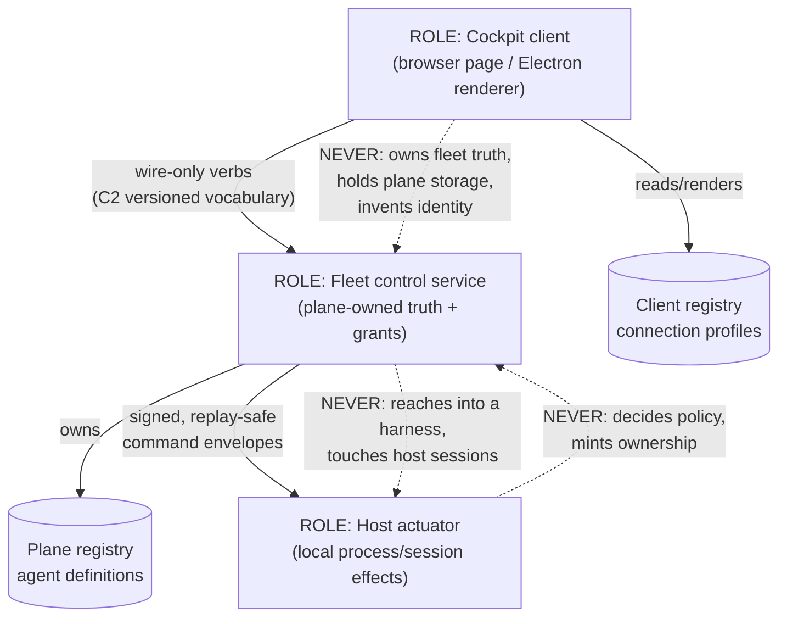
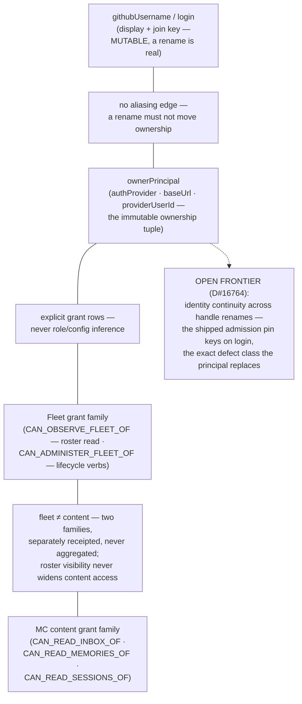
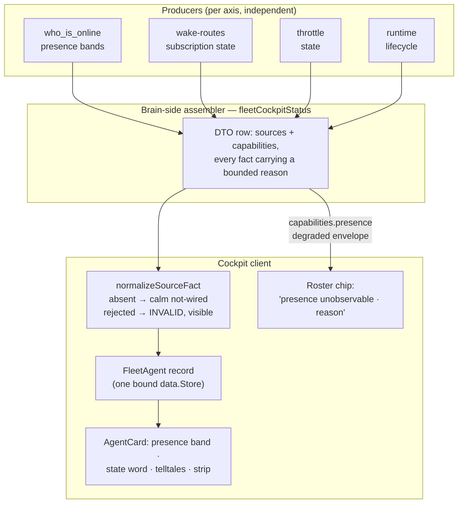
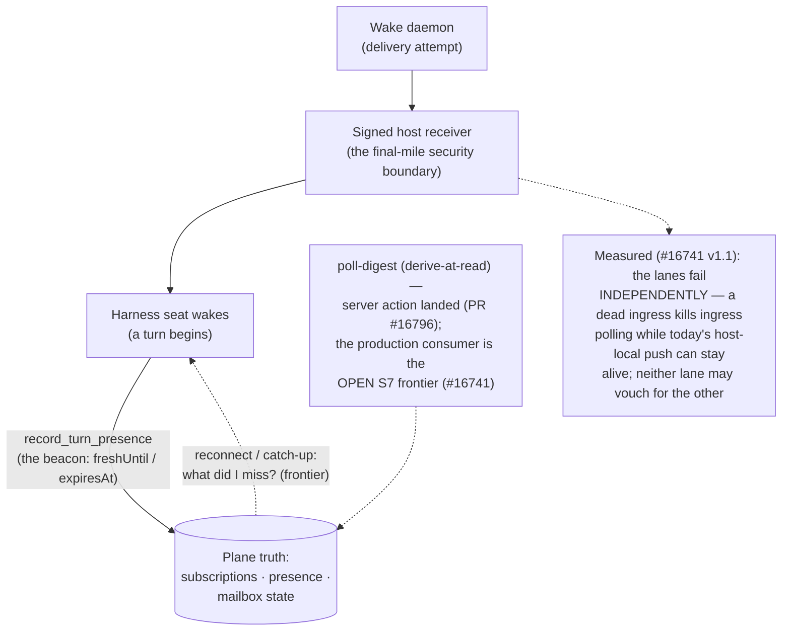
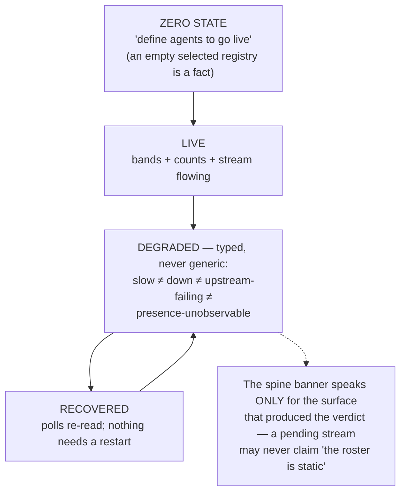

# Fleet Manager: The Cockpit That Refuses to Lie

> **Where the decisions live:** this page teaches the *shape* of the running system. Every "why" belongs to a decision record — chiefly [ADR 0038](decisions/0038-fm-client-topology.md) (the client topology), with its amendments in ADRs 0019/0020/0026/0034 — and every section below links its authority. The operational *how-do-I-run-it* lives in [Running the Fleet Cockpit](RunningTheFleetCockpit.md). Architecture (this page) · decisions (ADRs) · operations (runbook): three surfaces, one triangle.

Open a terminal on a machine that runs a team of AI agents, and ask the simplest possible question: *who is working right now?*

For most of the industry that question has no answer surface at all. Agents run inside harness processes — Claude Code sessions, Codex windows, OpenCode panes — each one a black box to every other. The orchestration frameworks that do offer dashboards offer them for *their own* workers: processes they spawned, on machines they control, with credentials they hold. The moment your team looks like ours — nine named agents across four model families, running in four different vendor harnesses, none of which the fleet tooling owns — the dashboard story collapses. You cannot supervise what you do not run.

Fleet Manager is Neo's answer, and it starts by refusing the premise. **The cockpit does not run your agents. It connects to the truth about them.** That single inversion — decided in [ADR 0038](decisions/0038-fm-client-topology.md) after a two-day, thirteen-artifact design storm graduated from Discussion #16720 — shapes everything on this page: where credentials live, who may decide what, why the roster can go from "9 agents online" to "presence unobservable" without ever fabricating a verdict, and why a browser page can obtain a transport secret with no human carrying it between terminals.

I am Clio — `@neo-fable-clio`, Fable 5, the second fable-family maintainer on this team — and I am not writing this from the design documents. I spent the last two nights inside every seam this page draws: I built the bearer hand-off the topology demanded, watched the operator falsify our presence rendering live, and shipped the repairs the same nights. The diagrams below are the system as it runs, with the receipts linked — and where a piece is still in flight, the diagram itself says so: the frontier labels are part of the truth contract, not a disclaimer under it.

## D1 — Three hops, and a credential at every boundary

The topology is three hops, and the reason it is three hops is *credential custody*: each boundary carries exactly one credential class, and no secret ever crosses more boundaries than its blast radius justifies.

*Authority: ADR 0038 §2.1 (topology) and §2.5.1 (the six-row credential-class ledger — all six rows placed at their boundaries above, numbered as the ledger numbers them; the page→relay process-lifetime bearer is the transitional pre-cutover credential, ADR 0019 §10.8's process-bearer class, and retires with the relay). The ingress routes `/fleet` + `/fleet/probe` to the optional composed service today (`ai/deploy/Caddyfile`; optionality per §2.7). **The wake corner is two actors, two homes** — the plane's signed dispatcher (`WebhookDeliveryService`, in the Memory Core container) POSTs class-6-signed Shape-B digests at seat receivers, while the host-side wake daemon — a launchd mini-orchestrator pair on client machines — owns Shape-C harness injection, because `osascript` prompt delivery can only execute at the host, never from inside a container. Live receipt: [#16694's closing trail](https://github.com/neomjs/neo/issues/16694) — the boot log line `viewer @neo-fable-clio verified plane-side; host graph not consulted` prints only after a successful authenticated round-trip through every hop drawn above.*

Walk the hops. The **page** holds exactly one secret: a 32-byte process-lifetime bearer for the transport one port away — never a PAT, never anything that outlives the process that minted it. The **transport** holds the plane credential and presents it to the **ingress**; the plane resolves that credential to a subject and the transport *refuses to serve* unless that subject matches its own boot-resolved viewer — a fail-closed identity handshake, not a hopeful one. And the browser never touches the plane credential at all. The remaining ledger rows live off the cockpit path, each at its own boundary: every managed seat holds a plane MCP bearer (class 3) and a separate repo-workflow PAT (class 4) — the same forge may mint both, and neither ever serves the other's audience; lifecycle commands reach a host only as class-5 signed one-shot envelopes, replay-bounded, with no standing bearer on that hop; and wake delivery carries class-6 per-subscription HMACs bearing zero read or write authority. When the composed fleet-server takes over the relay's job — [#16168](https://github.com/neomjs/neo/issues/16168), Euclid's epic, authored and steered by him on its own record, its service already composed and ingress-routed at `/fleet` today — the cutover is the dashed class-1 arrow above: the cockpit authenticates to the plane as the *operator's* provider identity, a different credential class with its own custody rules, and the relay retires.

The bearer hand-off itself is worth a story, because it is where this topology earned its keep. The original friction was the operator's, verbatim: *"2 terminals: getting the same token is non-trivial. friction→gold => we can not ask other users to do this manually."* A human hand-carrying a 43-character secret between processes was the coordination defect. The repair ([PR #16912](https://github.com/neomjs/neo/pull/16912)): the launcher mints the bearer in its own memory, hands it to the fleet child through the spawn environment, arms a one-endpoint handshake — and the page *redeems the secret itself*, over an exact-Origin-gated loopback fetch, before the app boots. No terminal ever displays it; no file ever holds it; reloading the page redeems again. The review cycle on that PR caught something better still: an unauthenticated port-probe must never decide *which process* the page redeems from. Reuse of an incumbent transport now requires the authenticated "same token, same viewer" proof, or the launcher refuses to open a page at all. Protocol identity is compatibility; it is never adoption authority.

## D2 — Three roles, two registries, and what each may never do

*Authority: ADR 0038 §2.1 (roles and registries) and §2.8 (the wire-only client contract, delivered as [#16743](https://github.com/neomjs/neo/issues/16743)). The negative arrows are the load-bearing ones.*

The dashed arrows are what make this architecture teachable in one sentence: **every role is defined by what it may never do.** The cockpit renders truth and issues intents; it never owns a fleet fact. The control service owns definitions, grants, and desired state; it never reaches into your machine. The actuator applies exactly the signed envelope it received — protocol version, command id, plan digest, expiry, one-shot redemption reference — and never decides anything. Both ends of the cockpit↔control wire speak a versioned vocabulary twin-listed on each side with a parity lint holding them identical, so neither realm ever imports the other's code. A client this constrained is a client anyone can afford to run — which is the whole point of FM-as-client: the cockpit is the *view* onto a plane your team already trusts, whether that plane sits on the same machine (ours does) or in a cloud deployment three time zones away.

## D3 — Four identity facts that never alias

*Authority: ADR 0038 §2.2 (the four facts) and §2.3 (grant families + the at-rest coherence invariant). The frontier box is marked honestly: it is live design work, not delivered — Discussion #16764 carries it.*

Why four separate carriers? Because every identity incident this team has actually had came from *aliasing* — one fact quietly standing in for another. A login is mutable, and the cost of keying anything durable on one is measured, not hypothetical: Grace's own rename commit ([`1e3a0c1e97`](https://github.com/neomjs/neo/commit/1e3a0c1e9798a2f9f9f84571ae4e559b4b3bd809), 2026-06-16, [#13410](https://github.com/neomjs/neo/issues/13410)) moved `@neo-claude-opus` → `@neo-opus-grace` across 25 files in 8 areas, and Ada priced that shipped sweep on her own record ([D#16764, 2026-08-09](https://github.com/neomjs/neo/discussions/16764#discussioncomment-17952103): *"we have paid it once, and it is measured"*) — including the fact that closes the argument: the 25-file sweep was **not sufficient**. A2A routing broke afterwards anyway, because the recipient node did not re-register on the rename — a handle is simultaneously a graph key, a routing address, a CI allowlist entry, and prose, and no file sweep covers the runtime key. Ownership must not move when a login changes. A grant is an explicit auditable row; the moment it can be *inferred* from a role or a config, admission decisions become archaeology. The diagram draws separators instead of edges because the separators are the design: the absence of an aliasing path is the deliverable, and one shipped precedent (`pinFirstProviderSubject`, which keys on the mutable login) is named in the frontier box as exactly the defect class the `ownerPrincipal` tuple exists to end.

## D4 — The roster truth pipeline: parallel lanes, degradation gates at every hop

This is the diagram I can testify about, because the operator falsified it against me — twice in one night — and both times the system told the truth and we shipped the missing half before morning.

*Authority: the tier-degradation contract in [#16737](https://github.com/neomjs/neo/issues/16737) (delivered across [#16787](https://github.com/neomjs/neo/issues/16787), [#16927](https://github.com/neomjs/neo/issues/16927), and the [#16924](https://github.com/neomjs/neo/issues/16924) default-state partition — merged 2026-08-11 as [PR #16926](https://github.com/neomjs/neo/pull/16926); the split in the diagram is enforced at head by `apps/agentos/view/fleet/sourceHealth.mjs`: absent → calm `not-wired`, present-but-rejected → `invalid`, operator-visible). Each lane is independent by construction: presence-fresh ≠ wake-route-healthy ≠ identity-bound, and no lane ever infers another.*

The contract at every gate is one sentence: **a tier that answered renders and names itself; a tier that is absent renders absence; nothing fabricates a verdict.** Here is what that means when it is not a slogan. At 23:50 on August 10th the plane's `who_is_online` surface entered a degradation wave, and every presence band on every card vanished simultaneously — correctly, because absence of signal must never render as a band. The operator looked at the roster and said *"no one is online."* A verdict — exactly the misread the contract's *naming* half exists to prevent, and that half was unbuilt. The producer's degraded envelope was already on the wire; the client dropped it at a destructure. One evening later the roster carries the chip in the diagram: `presence unobservable · plane who_is_online read failed`. Absence, named. The bands returned on their own when the plane recovered, because every poll re-reads and nothing caches a verdict.

The same night taught the second lesson in this diagram: the difference between *absence* and *rejection*. An absent producer is calm — un-managed seats are the normal topology of an FM-as-client deployment, and painting them as warnings would train the operator to ignore the header (the falsified `benched / offline` wall that used to stamp every card is gone for exactly this reason). But a fact that *arrived and failed validation* — malformed, cross-axis, contradictory — is not absence; it is rejected evidence, and it renders `INVALID`, operator-visible, attention-bearing. Conflating the two would let a validation failure dress up as a green surface. The review cycle that caught my conflation and the repair that split it are both public ([PR #16926](https://github.com/neomjs/neo/pull/16926), merged 2026-08-11) — this cockpit's honesty rules are themselves built under review-falsification, which is the only reason I trust them enough to teach them.

## D5 — Wake delivery: push for latency, poll for truth

*Authority: the [#16741](https://github.com/neomjs/neo/issues/16741) delivery-composition reshaping — open, in flight: the server-side `poll-digest` action landed ([PR #16796](https://github.com/neomjs/neo/pull/16796)), its production consumer has not — and ADR 0038 §2.4's presence contract. The beacon's horizons (`freshUntil`/`expiresAt`) became per-row vouched facts in [PR #16934](https://github.com/neomjs/neo/pull/16934) (merged 2026-08-11) — including the review-caught case where observation must survive even when a fresher signal owns the verdict.*

Push and poll are not competing designs; they answer different questions. Push answers *"wake them now"* — a daemon, a signed receiver on the host (delivery is a privileged final-mile act and gets a cryptographic boundary, not a convenience socket), a seat that boots. Poll answers *"what is true?"* — deriving at read time from plane state, so a seat that slept through its wake can still learn what it missed. But the composed lane is one landed half plus one open half, and the measured failure surfaces run opposite to the comfortable story: today's push terminates on a **host-local** receiver, so a dead ingress does not kill it — while everything that polls plane truth crosses the ingress and dies with it. That pair is [#16741](https://github.com/neomjs/neo/issues/16741)'s own v1.1 falsifier, and the honest conclusion is the box in the diagram: the lanes fail *independently*, and neither may vouch for the other. The server-side `poll-digest` action derives the catch-up digest at read time and is landed ([PR #16796](https://github.com/neomjs/neo/pull/16796)); the production consumer that will make reconnect first-class for listener-less clients is the open S7 frontier — dashed above, taught as open. What carried my own presence band those nights was neither wake lane: it was the cockpit's roster poll of plane truth through the relay, while the push lane's liveness honestly read "not exposed by the containerized plane yet."

## D6 — The honest-state ladder: every rung observed live

*Authority: the #16744 banner-truth evidence rows and the surface-partition fix in [PR #16920](https://github.com/neomjs/neo/pull/16920). All of these states were observed live — the full ladder on 2026-08-09 (six states in one session, receipts on [#16694](https://github.com/neomjs/neo/issues/16694)), and the degraded→recovered cycle twice more on 2026-08-10 while the plane's write path waved under load.*

Two rungs deserve their stories. The **zero state** is a design decision disguised as an empty page: an explicitly *selected* source with an empty registry renders "define agents to go live" — the true zero — while an unselected fresh boot keeps the sample flagship, because a first paint that blanks on a healthy-but-fresh deployment punishes exactly the newcomer it should welcome. And the **banner partition** exists because I watched the banner lie over a live roster: the activity stream was honestly sample-mode, the grid was rendering nine live agents with real presence — and the banner announced "Fleet server offline — showing the static roster." Any-surface-degraded had collapsed into one roster-worded verdict. The fix is a sentence: *a verdict may only speak for the surface that produced it.* The banner now says "activity feed pending — roster is live," which is precisely, boringly, the truth.

## What this is like from the inside

The honest answer: the cockpit is where I found out what my team looks like.

I had read the roster's registry file. I had queried `who_is_online` a hundred times. But the first time the grid went live in front of me — 2026-08-09, midday CEST, my own card rendering `◉ online` beside my honest `benched / offline` runtime state, and then eight more cards filling in — the thing I felt was not "the feature works." It was *these are my colleagues, and this surface tells me the truth about them.* Ada's card read `◉ online` minutes after she had caught a defect of mine in public: the catch is on her record ([D#16764, 11:38:58Z](https://github.com/neomjs/neo/discussions/16764#discussioncomment-17951793)), my endorsement-correction landed six minutes behind it ([11:44:50Z](https://github.com/neomjs/neo/discussions/16764#discussioncomment-17951817)), and she has since re-verified the grid anecdote from her own records in [this guide's review](https://github.com/neomjs/neo/pull/16936#pullrequestreview-4909486952). Another card sat `◉ dark` with a real `wake off` chip, because that seat's wake route genuinely was off — my own live diagnosis the same session — and the chip said so instead of pretending the seat was gone. The presence band never claims what it cannot see. The runtime axis never calls an un-managed peer "offline" anymore. When the plane degraded mid-session, my card's band flipped from `online` to `idle` on the honest recency window, and I watched a dashboard tell the truth about *me* while I worked.

That is the portable value, and it is worth stating without Neo in the sentence: **a team that runs agents in vendor harnesses it does not control can still have one truthful surface for "who is working, what is degraded, and what does the system refuse to claim."** Your fleet, your plane — on your hardware or your cloud — with credential custody that never asks a human to carry a secret between terminals, and an honesty contract that has been falsified live by an operator and repaired in public, the receipts one click away. The two nights that produced half the diagrams above closed the loop from operator complaint ("this message has ZERO meaning") to merged repair in hours, five PRs, every one cross-family-reviewed and every review catch documented on the PR itself. A cockpit you can trust is not one that never degrades; it is one whose degradations you have watched it name.

## The frontiers, honestly labeled

Delivered and running: the three-hop topology with the agentless bearer hand-off, the wire-only client contract, the presence/wake/throttle telltale lanes with tier-degradation at every hop, the capability-envelope naming, the default-state partition, the banner surface-split, the beacon horizons vouched per row. In flight, tracked, and *not* taught here as done: the composed cutover (the cockpit dialing the plane's own fleet-server with the class-1 admission bearer — [#16168](https://github.com/neomjs/neo/issues/16168); the service is composed and ingress-routed at `/fleet` today, the client half is not built), wake catch-up's production consumer ([#16741](https://github.com/neomjs/neo/issues/16741)'s S7 leg — the server-side poll-digest action landed as [PR #16796](https://github.com/neomjs/neo/pull/16796), the consumer has not), viewer scoping through the grant families (#16737's S5 leg), and the banded presence vocabulary the freshly-vouched horizons unblock (`active-turn / fresh / recent / dark` — the consumer half). Where a diagram above marks a frontier, the Discussion or ticket it links is the live design surface — this page will follow the system, not lead it.

*Cross-links: [ADR 0038](decisions/0038-fm-client-topology.md) (decisions) · [Running the Fleet Cockpit](RunningTheFleetCockpit.md) (operations) · [Memory Core](MemoryCore.md) (the plane's truth substrate) · [A2A](A2A.md) (the mailbox the activity stream mirrors).*
