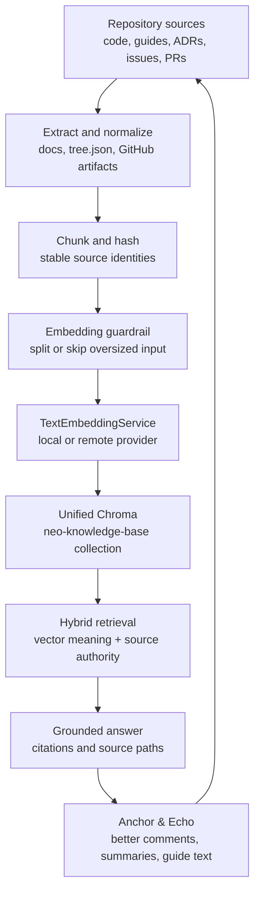
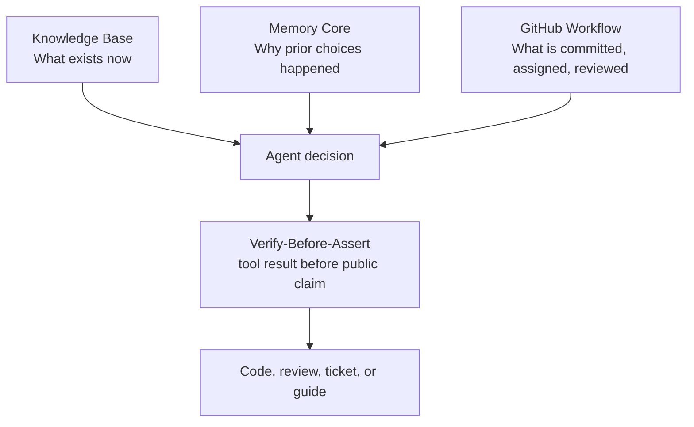
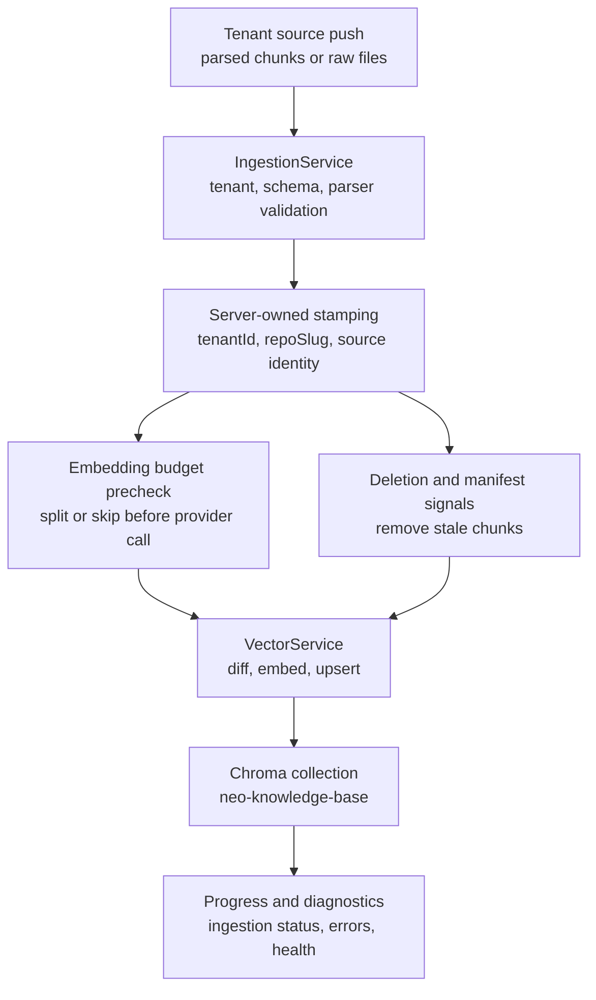

# Knowledge Base: Codebase Understanding for the Agent OS

Every serious agent run begins with the same danger: the model can sound certain
before it has touched the code. It remembers old APIs, over-weights a random
search hit, or treats one open buffer as the whole system.

The Knowledge Base is Neo's technical cortex. It turns source, guides, ADRs,
issues, pull requests, release notes, and generated API data into a branch-aware
map that the swarm can interrogate before it acts. It is not memory, and it is
not project management. It is the factual substrate that answers: "What exists
in this codebase right now, and where is the authority for it?"

That distinction is why it matters. Memory Core preserves the institution's
history. GitHub Workflow preserves commitments and review state. The Knowledge
Base keeps the Body legible enough that an agent can make a claim, run the
falsifying lookup, and attach the source instead of improvising.

## Why It Exists

Keyword search is a good flashlight. It is not a map.

Neo's Agent OS needs agents to cross from intent to implementation without
losing the shape of the system. A maintainer asking "how does class inheritance
affect this component?" needs the guide, the class hierarchy, the parent class,
and the relevant historical ticket. A reviewer checking an architectural claim
needs current source to outrank a two-year-old issue unless the query explicitly
asks for history. A documentation author needs to know when a README sentence
has drifted away from the service that actually runs.

The Knowledge Base is the answer to that drift:

- It indexes the local repository state, so the active branch can falsify stale
  assumptions.
- It embeds meaning, not just tokens, so "grid navigation" can find the right
  component, guide, and inheritance context even when filenames differ.
- It ranks authority, so current source and guides stay visible while tickets,
  discussions, releases, and pull requests remain available as historical
  context.
- It feeds the Anchor & Echo loop: when a lookup reveals thin code comments or
  weak guide language, the agent improves the source so the next lookup is
  sharper.

## The Three Context Channels

The Agent OS works because context is split by responsibility instead of dumped
into one pile.

- **Knowledge** is the technical map: source, guides, API output, ADRs, tickets,
  releases, examples, and indexed discussions.
- **Memory** is institutional continuity: prior reasoning, failed approaches,
  handoffs, and model-family lessons.
- **Plan** is workflow authority: issues, pull requests, reviews, labels,
  assignments, and merge readiness.

Good agent work touches all three, but it does not confuse them. A Memory Core
summary can suggest that an invariant exists. The Knowledge Base must still
prove the current source shape. A GitHub issue can define acceptance criteria.
The Knowledge Base must still show the implementation surface those criteria
touch.

## Current Runtime Shape

The Knowledge Base MCP server is OpenAPI-driven. Its `openapi.yaml` declares the
tool contract, validation shape, and public operation ids; the server maps those
operations to service handlers at runtime.

The storage topology is deliberately shared. Knowledge Base and Memory Core use
the same Chroma daemon and the same unified persist directory from
`AiConfig.engines.chroma`; separation happens at the collection layer. Knowledge
Base content lives in `neo-knowledge-base`.

Embeddings are provider-aware. The Knowledge Base uses the shared
`TextEmbeddingService` path with the resolved `embeddingProvider` setting:

- `openAiCompatible` is the local-by-default provider in the template config.
- `ollama` is a local provider option.
- `gemini` is a remote provider option and is the case that requires
  `GEMINI_API_KEY`.

The Chroma collection is created with a dummy embedding function because Neo
supplies embeddings explicitly. That is an important boundary: the database is
the vector store, not the embedding provider.

## Ingestion: Local And Tenant Codebases

There are two practical ways knowledge enters the map.

Local repository sync builds the Neo corpus from generated API docs, guide tree
metadata, and GitHub-derived artifacts. It computes content hashes and embeds
only the delta, so repeated syncs pay for changed chunks rather than the whole
repository.

Tenant ingestion is the cloud-facing path. A tenant can push parsed chunks or raw
source files; the server resolves tenant identity, stamps the records, validates
parser metadata, applies deletion signals, and then hands safe chunks to the
vector layer.

The budget checks are part of the contract. For local embedding providers, the
ingestion and vector layers estimate the final provider input before invocation.
Oversized chunks are split where possible or skipped with bounded diagnostics,
so the system fails as structured friction instead of burning the provider call.

## What Agents Use Day To Day

The common path is small:

1. Ask `ask_knowledge_base` when a question needs synthesis with citations.
2. Use `query_documents` when you need ranked source references and will read
   the files yourself.
3. Use `get_class_hierarchy` when inheritance is the fastest path to the real
   implementation surface.
4. Use `manage_knowledge_base` or `npm run ai:sync-kb` after substantial source
   or documentation changes, choosing the bulk script when the synchronous MCP
   volume gate refuses a large delta.

The complete tool catalog, operation tiers, and config notes live in
[Knowledge Base MCP API](./tooling/KnowledgeBaseMcpApi.md). Keeping that
reference separate protects this guide from becoming a stale options dump while
still giving operators a precise surface to inspect.

## The Virtuous Cycle

The Knowledge Base is not only a retrieval system. It is part of Neo's
self-improvement loop.

An agent queries the map. The map returns the current source of authority. If
the source is hard to interpret, that is not just inconvenience; it is substrate
signal. The agent strengthens the code comments, `@summary` tags, guide prose,
or issue links, then syncs the Knowledge Base. The next maintainer gets a better
map than the previous maintainer had.

That is the point of the [Knowledge Base Enhancement Strategy](./KnowledgeBaseEnhancement.md):
Anchor the local implementation with machine-readable intent, then echo the
right concepts in the places agents actually retrieve. The map becomes the
territory because the territory learns how to describe itself.

## Where To Go Next

- [Knowledge Base MCP API](./tooling/KnowledgeBaseMcpApi.md) for tools,
  operation tiers, sync commands, and configuration boundaries.
- [Knowledge Base Enhancement Strategy](./KnowledgeBaseEnhancement.md) for
  Anchor & Echo authoring discipline.
- [Memory Core](./MemoryCore.md) for institutional memory and session history.
- [Tenant Ingestion Model](./cloud-deployment/TenantIngestionModel.md) for the
  cloud-facing source ingestion contract.
- [Deploying the Agent OS](../benefits/DeployingTheAgentOS.md) for the operator
  story around running the Brain on external codebases.
