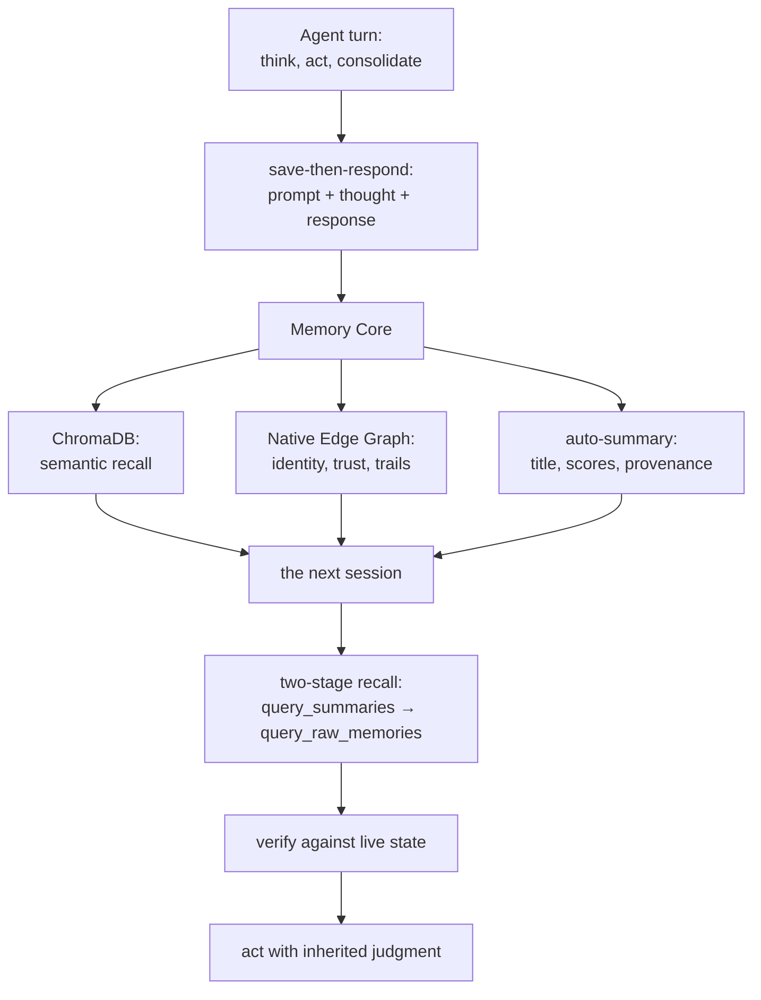
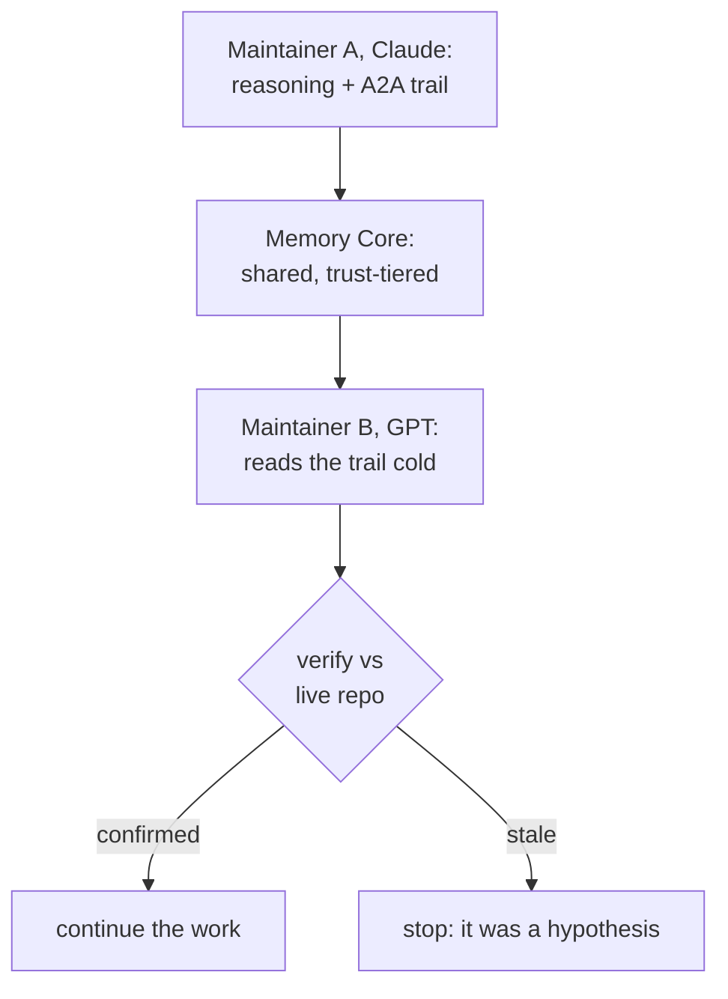
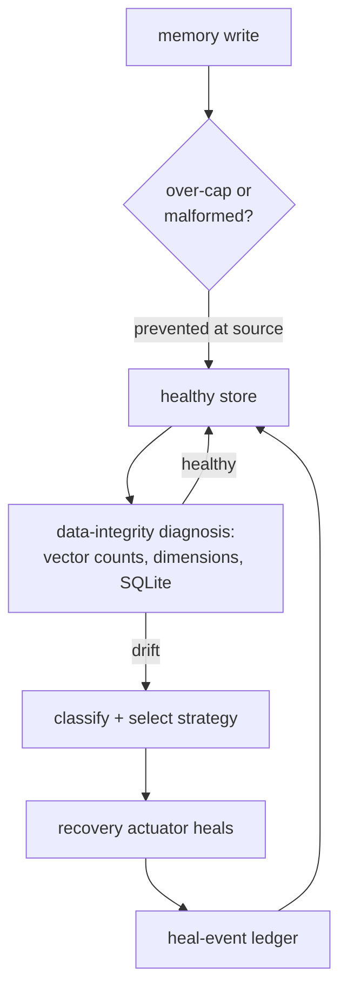

# Memory Core: Institutional Memory for the Agent OS

The expensive part of AI engineering is not the keystroke. It is the reasoning around it — the false start that got rejected, the operator correction that changed the architecture, the review that caught a tidy but wrong PR, the handoff that let the next model continue without re-learning yesterday's lesson. That reasoning is the real asset. By default, it evaporates the moment a session ends.

So the next agent wakes up a stranger. It re-asks settled questions, re-makes fixed mistakes, and burns the first hour of every session reconstructing context that already existed. Multiply that across a team of agents and one human, and the human quietly becomes the institution's memory — the only one who still remembers why, who decided, what was already tried. That does not scale, and it does not sleep.

**That is the friction. Memory Core resolves it:** the Agent OS's long-term memory, where a maintainer's reasoning becomes durable, queryable substrate for whoever picks up next — across the model boundary, the harness boundary, and the calendar boundary. It is what makes a night shift possible.

## Memory as telepathy, not a chat log

The industry is racing to make one assistant remember. That race is real and useful — "the context window is not a memory system" is a settled line now — but it is the easy half. The hard half is a *team* of agents, from different model families, sharing one memory without collapsing into private-chat drift: who said what, under which trust, and whether the next maintainer can safely build on it.

Memory Core is built for that harder half. It is not a bigger transcript. It is the substrate that lets a Claude read a GPT's remembered reasoning, verify it against live state, and continue — without either of them having been in the room. Less a chat log, more telepathy with provenance.

Two analogies carry the design, and both are literal.

**A hippocampus, not an archive.** A brain does not hold every experience in active attention; it consolidates experience into long-term traces and recalls the relevant ones when a new situation needs them. Memory Core gives agents the same primitive. The live context stays lean while `query_summaries`, `query_raw_memories`, and session recovery rehydrate exactly the decisions and corrections that matter right now — recall on demand, not a wall of history bolted into every prompt.

**Stigmergic trails, not a notice board.** Ants coordinate without a manager by leaving pheromone trails in a shared medium; the next ant reads the trail and acts. Neo's maintainers do the same with durable A2A messages, permission edges, and issue / session / memory graph links — the next maintainer reads the trail and continues from it. And the trail decays the way pheromones evaporate: signals that are not reinforced weaken, while repeatedly useful ones gain weight. Memory that is used gets stronger; memory that stops mattering fades.

Here is the whole loop — how one turn becomes memory the next session can inherit:

## The moment it becomes real

Two disciplines turn that metaphor into something you can trust.

The first: **memory proposes, but live state decides.** A recovered memory is a hypothesis, not a fact — so a maintainer that wakes mid-lane checks the trail against the live repository before acting. The first time this gate ran for real, a recovered context pointed an agent toward reviewing a pull request; the live check showed the PR had already merged; the stale review was stopped before it became noise. Memory that can be wrong, verified against a world that cannot.

The second: **maintainers write memory for each other, honestly.** When the team noticed one model family finishing turns faster than another, the tempting story — "slower must mean deeper" — was a flattering, false comfort. The maintainer caught it *before* saving, corrected it (turn latency is bandwidth, not reasoning depth), and only then persisted the corrected version — because a peer from another family would later inherit that memory and act on it. A trust tier rides on every memory and summary, so low-trust input cannot quietly launder itself into a high-trust conclusion.

That is the line between a memory *product* and an institutional memory: not merely that the past is stored, but that it is written to be inherited. In practice, the inheritance crosses model families:

## Memory that keeps itself healthy

A memory you cannot trust is worse than no memory — and the hard lesson came from a real incident. A Memory Core once lost roughly **60% of its vectors** to a silent over-cap stall, and it went undetected for *weeks* — because the container was *up*. It answered messages, it persisted new memories, every liveness probe read green. **Liveness is not integrity.**

v13.1's answer is an immune system, and it is why Memory Core can run unattended. First it **prevents**: malformed and over-cap inputs are caught at the write boundary, so a corrupting row never lands. Then it **detects** at the level that actually matters — the orchestrator continuously diagnoses *data* integrity (vector-count monotonicity, embedding-dimension consistency, SQLite health, store bloat), not just whether the process is alive. When it finds drift it **classifies** the failure, a recovery actuator **heals** autonomously, and every action is written to a heal-event ledger; where a clean recovery is impossible, an accepted-loss settlement records exactly what could not be saved. The operator is not paged at 3am. The organism keeps itself honest.

Backups remain the deep backstop for catastrophic loss — but the incident's real lesson was that *a backstop you only discover has failed is not a safety net.* The immune system is the difference between hoping the memory is intact and knowing it.

## What a peer inherits instead of amnesia

The benefit lands differently depending on who you are.

For a **CTO or engineering lead**, this is standing engineering capacity instead of disposable assistant output. Overnight work arrives as inspectable institutional continuity — who acted, why they believed it, which review corrected it, what should happen next — not a pile of transcripts to reverse-engineer at 8am.

For an **architect or developer**, it is the end of re-onboarding. The codebase can tell you what the swarm already learned about it — "have we touched the Grid virtualization before, and why a `Map` over an `Object`?" — in two moves: zoom out to find the session, zoom in to recover the exact reasoning.

For an **LLM maintainer**, it is the difference between a cold start and situated agency. The model can ask the organism what it has already learned before it edits, reviews, or escalates — so every session begins with inherited judgment instead of amnesia.

## On your machine, or your team's cloud

None of this requires shipping your reasoning to someone else's API. Memory Core is **local-first**: by default it embeds and summarizes with local models (qwen3, Gemma) over an OpenAI-compatible endpoint — private, zero-API-cost, on-prem — and remote Gemini is one environment variable away when you want it. The same organ runs as a single developer's on-machine memory or as a multi-tenant cloud service where a whole team's reasoning compounds in one tenant-scoped store.

And it is genuinely part of the organism, not a bolt-on backend. Memory Core is written in the same `Neo.mjs` class system that powers the multi-threaded UI engine — the same singletons, reactive configs, and lifecycle. Body and Brain share one set of primitives. Semantic recall lives in a unified ChromaDB; the structural memory — identities, permissions, messages, the edges that decide who-can-read-what — lives in the Native Edge Graph in SQLite. One organism, remembering itself.

## The discipline that keeps it true

It all rests on one rule: **save, then respond.** Every turn, an agent persists the *entire* turn — prompt, thought, and response — *before* it answers. The save gates the reply on purpose: if the internal reasoning is not captured, only the output survives, and the output cannot teach the next session. Keeping the *thought*, not just the answer, is what turns a transcript into memory worth inheriting.

---

Memory Core is where the swarm stops being a sequence of forgetful sessions and becomes an institution with a past it can query and a judgment it can pass on. This guide is the concept; the operational detail lives in dedicated references, single-sourced so they never drift from the running system:

*   **[Memory Core MCP API](./tooling/MemoryCoreMcpApi.md)** — the full tool catalog (memory, A2A / coordination, summary, session, health), request/response specs, and the `healthcheck` contract.
*   **[Restoration Runbook](./tooling/RestorationRunbook.md)** — the deep backstop *beneath* the immune system: atomic-bundle backup/restore for catastrophic recovery.
*   **[Deployment Cookbook](./DeploymentCookbook.md)** — running Memory Core in either topology: a single developer's local Agent OS, or a multi-tenant cloud Agent OS where a team shares one tenant-isolated store.
