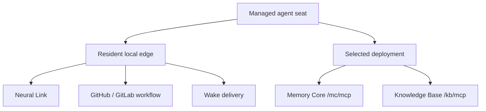

# Running the Fleet Cockpit

> **Concepts:** the architecture this runbook operates — the topology, roles, identity facts, and
> the truth pipeline — is taught at [Fleet Manager Architecture](FleetManagerArchitecture.md);
> the decisions behind it live in [ADR 0038](decisions/0038-fm-client-topology.md).

The Fleet Manager cockpit is the operator's mission-control surface: the live agent roster, the
activity stream, per-agent drill-in, and the lifecycle controls (start / stop / restart, the
one-click morning start). A LIVE session needs two processes — the webpack dev server that serves
the app, and the fleet HTTP transport the cockpit's controls and live feeds ride on.

## The one command

```bash
npm run cockpit
```

That is the whole boot. The launcher (`ai/scripts/fleet/devCockpit.mjs`) supervises both processes and
opens the browser directly on the cockpit surface (`apps/agentos/index.html`). On a fresh checkout
this lands you on a live roster with working controls — no second terminal, no manual server start.

This command remains the transitional source-development path: it launches the host-side
`devFleetServer` with its ephemeral process bearer. The canonical local Agent OS composition now
also carries the optional `fleet` profile, whose `fleet-server` uses request-time `AuthService`
identity and a persistent Fleet-owned root. Start that plane with the profile command in
[`local-agent-os/README.md`](../../ai/scripts/lifecycle/local-agent-os/README.md). Cockpit client
cutover to the composed URL is owned by the following migration slice; S1 makes the authenticated
service real without pretending the current browser launcher already consumes it.

What it does, in order:

1. **Probes the fleet endpoint** (`127.0.0.1:8083`) for *protocol identity* — not just "is the port
   busy". A confirmed fleet transport (another checkout or a prior run) is **reused** with a named
   log line; a foreign occupant (something else holding the port) makes the launcher **refuse with
   a named reason** rather than compose a silently-broken session.
2. **Starts the fleet transport** (`ai/services/fleet/devFleetServer.mjs`) when the endpoint is
   free.
3. **Starts the dev server** and opens the cockpit page.
4. **Supervises both**: one `Ctrl-C` tears the whole session down; if the fleet transport dies
   mid-session, the launcher logs the loss loudly and the cockpit degrades to its honest offline
   states (clearly-labelled sample data) instead of pretending to be live.

## Choose where memory and knowledge live

The fleet transport above is the cockpit's control connection. It is separate from an agent's
**Memory & knowledge** target. Every managed seat starts with **Local services**: Memory Core and
Knowledge Base run through their existing stdio adapters. A connected deployment can instead host
those two services over Streamable HTTP for one seat.

Selecting a deployment does not remote the whole agent:



Neural Link, workflow tools, and wake delivery remain resident-local in both modes. Only the
`memory-core` and `knowledge-base` entries switch transport.

### Connect, select, start

The target must first be registered through Fleet's `connectTenant` control surface with a
canonical deployment base and its bearer. Fleet derives the two public resources from that one
base:

- `<base>/mc/mcp`
- `<base>/kb/mcp`

The target is published as `connected` only after authenticated MCP initialization succeeds on
**both** resources. The public cockpit Store receives only the target id, endpoint, status,
deployment class, and connection time; no bearer crosses into the Body.

Once the connected endpoint appears:

1. Open the managed agent in **Accounts** or its cockpit detail view.
2. Under **Memory & knowledge**, choose the endpoint instead of **Local services**.
3. Start or restart the agent.

Before checkout hydration, config mutation, or spawn, Fleet repeats admission with the target's
private bearer against both services. Memory Core must also report the exact canonical identity of
the seat being started. A valid bearer for a different provider subject therefore fails closed;
HTTP `200` by itself is not a readiness result.

One connected target can currently be selected by one managed agent. Assigning the same target to
a second agent is rejected before persistence, because one target descriptor owns one provider
credential and therefore one canonical subject. A real deployment that needs multiple subjects on
one target is the trigger for a future per-agent-per-target credential map.

### Three credentials, three jobs

The cutover keeps credential authorities distinct even when a deployment and a repository happen
to use the same identity provider:

| Credential | Brain-side authority | Child environment | Purpose |
|---|---|---|---|
| Repository / workflow PAT (when configured) | Fleet agent registry | `GH_TOKEN` | Authenticated repository and GitHub workflow operations |
| Selected MC/KB plane bearer | Fleet target registry | `NEO_MCP_REMOTE_TOKEN` | Authentication to the selected `/mc/mcp` and `/kb/mcp` resources |
| Neural Link Bridge session token | Fleet lifecycle | `NEO_FLEET_BRIDGE_TOKEN` | Resident agent-to-Bridge session authentication |

The generated adapter stores only the environment-variable reference, never the raw value. The
plane bearer is provider-neutral from Fleet's perspective: the deployment may validate it through
GitHub PAT, GitLab PAT, OIDC, or another configured bearer authority. A public repository can remain
tokenless, and Fleet never tries `GH_TOKEN` as a fallback plane credential.

The optional `seat-token` server mode remains available for deployments that deliberately select
it. Its generated tokens do not expire on a wall clock; regenerating the token registry is the
only revocation mechanism.

### Adapter and transition safety

Remote MC/KB projection is enabled only for adapter grammars verified in the installed harness:
Codex, Codex Desktop, Claude Code, OpenCode, and Kimi Code. Fleet checks each exact binary's
version or capability marker before changing a generated artifact, while renderer fixtures pin the
family-specific target grammar. Codex additionally reads the generated projection back through the
installed adapter before spawn. Claude Desktop, Antigravity, and Native stay on local stdio because
no equivalent secret-safe remote projection is proven for them; the cockpit renders a remote target
as unavailable instead of allowing a late boot failure.

Fleet owns only the two MC/KB transport entries inside each generated artifact. A transition
receipt authorizes subsequent `local → remote → another remote → local` changes while unrelated
operator-authored bytes remain untouched. Choosing **Local services** restores the stdio
projection and removes the receipt, leaving no remote bearer reference behind. Unknown edits to
Fleet-owned transport fields fail closed instead of being overwritten.

For deployment-side auth, identity, and readiness details, continue with
[Cloud deployment security](./cloud-deployment/Security.md) and the
[Day-0 tutorial](./cloud-deployment/Day0Tutorial.md).

## The one command against the live plane

```bash
npm run cockpit:live
```

Same supervised boot as above — but the fleet transport binds to the **containerized plane**, so
the cockpit renders the real fleet's truth: presence bands from the live presence surface, the
activity stream from the real A2A/PR lanes, and the mailbox, memories, and catch-up panes reading
plane content — no hand-assembled wiring, no exported credential ritual.

The launcher resolves the plane binding itself, naming every source it used:

1. **Base URL** — `NEO_FLEET_PLANE_BASE` wins; otherwise the canonical local plane
   (`http://127.0.0.1:3102`). Pin the variable to target a different deployment.
2. **Bearer** — `NEO_FLEET_PLANE_BEARER` wins, then the `NEO_FLEET_PLANE_BEARER_FILE` secret file,
   then `gh auth token` (the same identity the viewer claim resolves through, which is exactly the
   subject the plane's provider-PAT authority verifies). The `gh auth token` fallback is **coupled
   to the destination**: it fires only for a loopback base — the implicit PAT never travels to a
   non-loopback host, so a pinned remote base needs an explicit credential (an explicit decision
   for an explicit destination). All three empty refuses with the remediation; a
   pinned-but-unreadable file refuses rather than falling through to a different credential. The
   resolved value is held in launcher memory and injected into the fleet child's environment only —
   never the webpack child, never a log line.
3. **Plane probe** — before anything spawns, an unauthenticated call to the plane's MCP ingress
   must answer with its auth guard's `401` (that refusal IS the plane's identity signature).
   Nothing serving there fails fast with the plane-start command
   (`docker compose --env-file .env -f ai/deploy/docker-compose.yml -f ai/deploy/docker-compose.local-agent-os.yml --profile cloud --profile ingress --profile fleet up -d --wait`,
   see [`local-agent-os/README.md`](../../ai/scripts/lifecycle/local-agent-os/README.md)).

Live mode **never adopts an incumbent** fleet transport: an existing server on `:8083` cannot
report which plane it reads through `/fleet/probe`, so adopting it could point the cockpit at the
wrong plane. Stop the old transport and re-run, or use `npm run cockpit` for the in-process
journey. Bearer *validity* is verified where it has always been verified — the fleet entry's
plane-side admission refuses a bearer whose subject is not the resolved viewer, fail-closed.

What renders real, and what stays honestly degraded: the roster itself is still **this checkout's
managed fleet** (the seats registered here) — plane mode moves the truth axes (presence, activity,
mailbox, memories, catch-up, wake subscriptions), not the roster's ownership. A checkout that
manages no seats renders the labelled empty-registry state, never resurrected sample residents.
The wake **push** lane arms only when the deployment declares a fleet-surface credential
(`fleet.planeAdmissionBearer` / `…File`); without one the stream axis renders its honest
not-armed reason and the brokered digest poll remains the truth lane.

## Without the fleet transport

The cockpit itself always boots — `npm run server-start` alone still serves it. Without the
transport it shows the honestly-labelled sample roster and the controls stay inert: fail-closed,
never fake-live. Start the transport later with `npm run ai:fleet-server` and the next poll goes
live.

## Ports

The composed command runs on the default fleet endpoint (`:8083`) — the browser side of the bridge
pins it. Setting a non-default `NEO_FLEET_PORT` makes the launcher refuse with a named reason
rather than boot a server the cockpit can never reach (the standalone `npm run ai:fleet-server`
keeps honoring the variable for advanced setups).

### Dev-server ports when several seats share one machine

The dev server reads `PORT` and binds it. Left unset, webpack-dev-server keeps its own default and
auto-bump, so a plain `npm run server-start` is unchanged.

That matters because a seat's port cannot be a committed value — several agents run on one host, and
whoever starts second gets a different number. Anything that launches the dev server has to *choose*
a port and then *tell* it, which is what `PORT` is for. A launcher that only picks a port without
passing it produces two independent choices that disagree: the launcher waits on the port it picked
while a healthy server serves the tree on another.

**Claude-Code seats** get this from the tracked `.claude/launch.json` — `autoPort: true` and no port
flag in `runtimeArgs`, so the harness allocates a free port and publishes it through `PORT`. Do not
add `--port` there; pinning webpack leaves the harness's allocation unread, which is the same
divergence with the sides swapped.

**Every other harness** (OpenCode, Kimi CLI, Codex, Gemini) has no `launch.json` contract, so pass
the port explicitly and suppress the browser hijack — `--open` targets whichever display owns the
session, which on a shared machine is somebody else's:

```bash
PORT=<your-seat-port> npm run server-start -- --no-open
```

### A port is not provenance

Never bind a measurement to "the port that answered." On a shared host several servers answer, each
serving a different checkout, and the one on the default port is as likely to be a stale clone as
yours. A styling defect was once "reproduced" against another seat's tree for exactly this reason.

Record the **checkout path and SHA** the server is serving. Webpack prints the path it serves at
startup (`Content not from webpack is served from '<dir>'`), and `curl -s localhost:<port>/package.json`
is the cheap live check when a report has to name what was measured.
