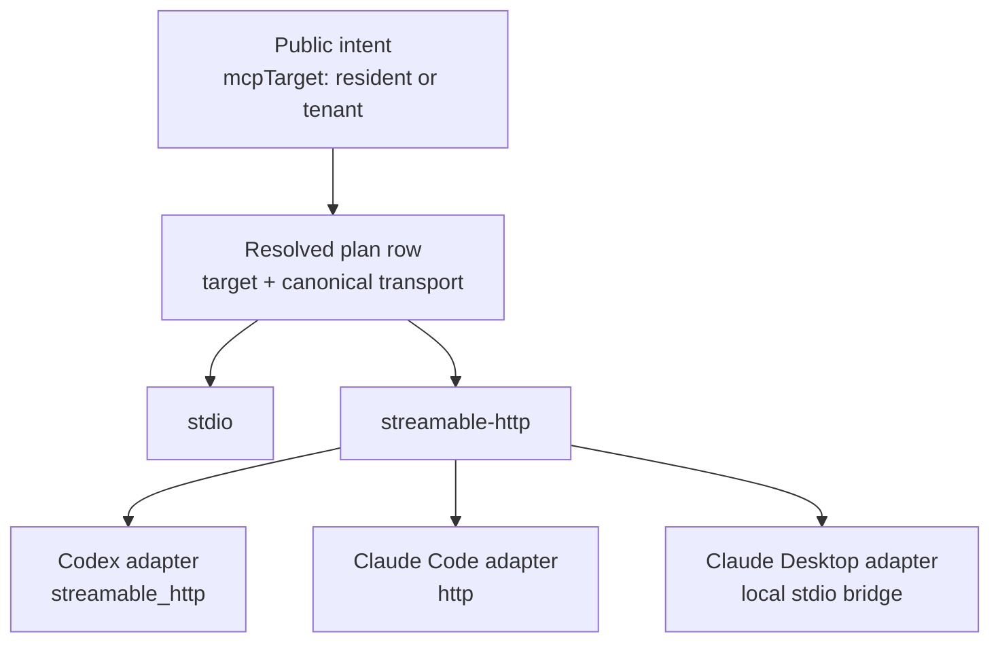

# Authenticating to a Deployed MCP Server

A deployed Neo.mjs MCP server (Knowledge Base or Memory Core) supports two server-side authorization modes for its Streamable HTTP transport. This guide covers the **GitLab bearer** mode (`NEO_AUTH_MODE=gitlab-pat`): the server validates any GitLab bearer token against the GitLab API, with no cookie. **The client chooses how to obtain that bearer — an OAuth browser login (preferred) or a long-lived Personal Access Token (fallback) — and the server accepts both.**

> For the OIDC / OAuth 2.1 **server** mode (Keycloak, Google — where the server itself advertises Protected-Resource-Metadata and introspects tokens), see [MCP Server Authorization](../tooling/Authorization.md). That is a *different server mode* from this one: in `gitlab-pat` mode the server stays a bare-`401` resource that validates via `/api/v4/user`, and all the OAuth work happens on the **client** side (Path A below). OIDC remains the production default; `gitlab-pat` is opt-in via `NEO_AUTH_MODE`.

## One server contract, two ways to get the bearer

The server authenticates every request by presenting the incoming `Authorization: Bearer <token>` to GitLab's `GET {gitlabApiBaseUrl}/api/v4/user`. GitLab honours that endpoint for **both** an OAuth 2.0 access token and a Personal Access Token, so the server is token-type-agnostic — the client picks how to mint the bearer:

| Path | Bearer source | UX | Best for |
| :-- | :-- | :-- | :-- |
| **A — OAuth browser login** (preferred) | a short-lived **OAuth access token** from a pre-registered GitLab OAuth app (browser SSO / 2FA, auto-refreshed) | best — no manual token, auto-rotation, SSO | interactive harnesses: Claude Code / Desktop, Codex, Antigravity |
| **B — Personal Access Token** (fallback) | a static **PAT** you mint + store in an env var | simple, scriptable | headless / CI, `curl`, MCP Inspector, scripts |

## The auth model

```
client → Authorization: Bearer <GitLab OAuth token | PAT> → MCP server
                                                              │
                                                              ├─ GET {gitlabApiBaseUrl}/api/v4/user   (validate)
                                                              │     200 → identity (username) → request authorized
                                                              └─ 401 → bare 401 (WWW-Authenticate: Bearer, no OAuth metadata)
```

- The token (OAuth access token or PAT) needs the **`read_user`** scope — nothing more.
- The server validates it against `/api/v4/user`; the returned `username` becomes the tenant identity (tagging Memory Core writes / filtering reads per user).
- On Memory Core, the first successful GitLab bearer request also provisions the matching `@<username>` `AgentIdentity` graph node when it is missing, so mailbox, broadcast, permission, and presence tools work without editing Neo's checked-in identity roots.
- **No `aud` claim, no token introspection, no OAuth Protected-Resource-Metadata.** An unauthenticated request gets a *bare* `401` — deliberately *without* a `resource_metadata` pointer, so OAuth-aware clients do not attempt Dynamic Client Registration against a GitLab instance (which has none). The consequence: an OAuth client must be pointed at GitLab's authorization server **explicitly** (Path A).

### What the server verifies — authentication, not authorization

`/api/v4/user` validation proves the bearer belongs to **a valid user on the configured GitLab instance**. It does **not** prove the token was minted *for this MCP server*: GitLab issues no audience-bound ([RFC 8707](https://www.rfc-editor.org/rfc/rfc8707.html)) token, so there is no `aud` to match — the MCP spec permits this *"when the Authorization Server supports the capability."* For a deployment that needs per-app / per-user **authorization** (an enterprise bar), an opt-in server-side hardening is planned: bind the token's owning OAuth app via GitLab's `/oauth/token/info`, and gate access on a user / group allowlist. It stays **off by default** so the zero-config path keeps working; the client-id-binding and user-allowlist env knobs ship with that change.

### The Fleet surface — same seat, plus a derived admission subject

The composed Fleet service admits clients through the **same `AuthService` modes** as the MCP
surfaces — no separate issuance machinery exists, deliberately. What Fleet adds sits *after*
authentication, at its own boundary:

- **The admission subject is derived, never claimed.** Every admitted request context carries an
  opaque `ownerPrincipal` derived from the provider-stable tuple
  `(authProvider, normalizedProviderBaseUrl, providerUserId)` — the facts a forge cannot re-issue
  to someone else. The **mutable login never participates**: a rename does not move ownership,
  and a recycled login cannot inherit it; the login is retained strictly as a display projection.
  The subject cannot be injected from the outside — it exists on a context only as the Fleet
  boundary's own derivation, and the caller's `/fleet/probe` launch receipt echoes it back for
  verification.
- **Verb classes are enforced at admission.** Every Fleet wire verb is classified `read-observe`
  or `lifecycle-write`. Read-observe verbs admit any authenticated context. Lifecycle-write verbs
  additionally require the forge-resolved subject — **possession admits the transport, identity
  owns the records** — and the refusal fires *before* feature-availability negotiation, so an
  unauthorized caller learns nothing about which slice serves a verb. The Fleet grant families
  later hang their per-verb-class envelopes on exactly this split.
- **`local-bearer` stays, bounded by the split.** The possession-only local-bearer mode remains
  the sanctioned dev-transport admission (the loopback cockpit path needs it), but it resolves no
  provider tuple, so it derives **no subject**: a local-bearer caller can observe, and every
  lifecycle-write verb refuses it. Requiring a PAT everywhere was considered and rejected — it
  would break the zero-config local loop for zero authority gain, because the subject requirement
  already closes the mutation surface the PAT requirement was for.

## Server configuration

Set these on the MCP server (Knowledge Base and/or Memory Core):

| Env var | Value | Notes |
| :-- | :-- | :-- |
| `NEO_AUTH_MODE` | `gitlab-pat` | Opt in to GitLab bearer mode (the default is `oidc`). |
| `NEO_AUTH_GITLAB_API_BASE_URL` | `https://gitlab.com` | Your GitLab base URL — set to your self-managed host for a private instance. |
| `NEO_AUTH_PAT_CACHE_TTL_SECONDS` | `300` | Validation cache TTL (seconds). A revoked token stops working within this window. |
| `NEO_AUTH_PAT_VALIDATION_TIMEOUT_MS` | `5000` | One wall-clock deadline per uncached PAT validation. GitLab's user and optional token-info fetches share this budget. |
| `NEO_AUTH_AUTO_PROVISION_IDENTITY_SOURCES` | `gitlab-pat` | Comma-separated auth provenance sources allowed to create missing Memory Core `AgentIdentity` nodes. |

> **Config defaults are autogenerated, not hand-maintained.** These `auth` leaves live in the tracked `ai/config.template.mjs`; each server's gitignored `config.mjs` overlay is generated *from* it — at `npm install` / `prepare` (`ai/scripts/setup/initServerConfigs.mjs`) and when hydrating a worktree (`ai/scripts/migrations/bootstrapWorktree.mjs`) — so a freshly built deployment picks up new leaves automatically. Only if an existing overlay has drifted (the bootstrap warns when a template leaf is missing) do you refresh it with `npm run prepare -- --migrate-config`.

## Memory Core graph identity on first login

GitLab bearer auth is both the tenant identity source and the Agent OS identity bootstrap for Memory Core. After `/api/v4/user` and any configured allowlists accept the bearer, Memory Core derives a canonical `@<username>` graph id from the server-stamped GitLab username. If the node is missing, it writes a durable `AgentIdentity` with `accountType: 'agent'`, GitLab provider metadata, `autoProvisioned: true`, and the deployment-authenticated trust tier. Existing seeded identities are preserved, and a non-identity node at the same id is treated as a collision.

This write happens in the Memory Core request path, but it is not local to that process. In the reference compose deployment, `mc-server` and `orchestrator` are separate containers sharing the same SQLite graph volume; the orchestrator sees the provisioned node through the normal GraphLog/lazy-load graph substrate. Operators should not patch `ai/graph/identityRoots.mjs` for ordinary GitLab-PAT deployment users.

---

## Path A — OAuth browser login (preferred for interactive harnesses)

The client runs a one-time browser login against GitLab and then holds a short-lived, auto-refreshed access token — no manual token to mint or rotate. Because the server emits a bare `401` (no Protected-Resource-Metadata), the client cannot auto-discover the authorization server: you point it at GitLab explicitly and use a **pre-registered** OAuth app (GitLab has no Dynamic Client Registration).

### One-time: register a GitLab OAuth app

In GitLab → **Profile → Preferences → Applications** (or a **Group → Settings → Applications** for a shared app) → **Add new application**:

- **Scope:** `read_user` — validation only calls `/api/v4/user`.
- **Confidential:** yes → you get a `client_id` + `client_secret`. (A public / PKCE app also works for desktop clients — omit the secret.)
- **Redirect URI(s):** one per harness you use (the path is fixed by each client; only the host/port varies) — e.g. Claude Code / Desktop: `http://localhost:8080/callback`.

### Claude Code / Claude Desktop  *(verified — Claude Code ≥ v2.1.64)*

Point the client at GitLab's metadata with `authServerMetadataUrl` (required because the server advertises no PRM). In `.mcp.json`:

```json
{
  "mcpServers": {
    "neo-mc": {
      "type": "http",
      "url": "https://mcp.<your-host>/mc/mcp",
      "oauth": {
        "clientId": "<gitlab-oauth-client-id>",
        "callbackPort": 8080,
        "authServerMetadataUrl": "https://gitlab.<your-host>/.well-known/openid-configuration",
        "scopes": "read_user"
      }
    }
  }
}
```

Register `http://localhost:8080/callback` on the GitLab app, run `claude`, then use **`/mcp`** to complete the browser login. The token is stored securely and **auto-refreshed** on later sessions. (`--client-secret` on `claude mcp add-json` prompts for the secret and stores it in the OS keychain — it is never written to the config.)

### Codex  *(documented; not yet verified against a bare-`401` GitLab server)*

`~/.codex/config.toml`: enable `[features] experimental_use_rmcp_client = true`, add `[mcp_servers.neo-mc] url = "https://mcp.<your-host>/mc/mcp"`, then `codex mcp login neo-mc` (the callback is set via `mcp_oauth_callback_url` / `mcp_oauth_callback_port`). **Caveat:** completing the flow against a bare-`401` GitLab path with a pre-registered client is not yet verified — fall back to Path B if `codex mcp login` cannot discover the authorization server.

### Antigravity 2.0  *(per its docs; not yet verified against a bare-`401` GitLab server)*

`~/.gemini/config/mcp_config.json`:

```json
{ "mcpServers": { "neo-mc": {
  "serverUrl": "https://mcp.<your-host>/mc/mcp",
  "oauth": { "clientId": "<gitlab-oauth-client-id>", "clientSecret": "<secret>" }
} } }
```

Antigravity 2.0 documents an `oauth: { clientId, clientSecret }` object for authorization servers without Dynamic Client Registration (tokens stored + auto-refreshed under `~/.gemini/antigravity/`). **Caveat:** not yet confirmed against a bare-`401` GitLab server — fall back to Path B if needed.

---

## Path B — Personal Access Token (fallback)

Works with every client — including those that cannot complete a browser OAuth flow (headless / CI agents, scripts, MCP Inspector).

### Minting a PAT

1. In GitLab, open **User Settings → Access Tokens**.
2. Create a token with the **`read_user`** scope — all the MCP server needs to resolve identity.
3. Copy the token value immediately (GitLab will not show it again).

### Where the token lives

Keep the PAT in an environment variable — never hard-code it into a config file or a committed script. For an interactive shell, add it to your shell profile (e.g. `~/.zshenv`):

```bash
export NEO_MCP_TOKEN="<your-gitlab-pat>"
```

For a headless agent, inject it the way your platform injects any secret (env var, secret mount). The only requirement is that the token is present in the process environment when the client starts.

### Client recipes

These assume `NEO_MCP_TOKEN` holds your PAT and the server is reachable at `https://mcp.<your-host>/mc/mcp` (Memory Core) or `https://mcp.<your-host>/kb/mcp` (Knowledge Base).

#### Fleet vocabulary: target, transport, adapter

Fleet keeps three layers explicit. The public agent definition selects an MCP **target**:
resident services or one connected tenant. Workspace preparation resolves that intent into plan
rows whose `target` is `resident` or `tenant` and whose canonical MCP `transport` is `stdio` or
`streamable-http`. Only the final harness adapter translates that plan into product grammar such as
Codex `streamable_http`, Claude Code `http`, or Claude Desktop's local command bridge. Vendor
spellings never enter the public registry, and target placement is never named after a wire
protocol.



For a publicly reachable endpoint, Claude's current default is an account-level native connector:
open **Settings → Connectors → Add custom connector** and enter the MCP URL. The current
[custom-connector contract](https://claude.com/docs/connectors/custom/remote-mcp) also supports fixed
request headers, including `Authorization: Bearer …`; request-header authentication remains a beta
rollout, so its absence in an account is a product-capability boundary rather than a reason to add a
local proxy. The token is entered into the connector's protected header field, not written into a
Fleet artifact.

Native connectors originate from Anthropic's cloud and therefore cannot reach localhost or a
private-only network. For the exact Fleet case where Claude Desktop must reach the same machine's
canonical container plane, Neo ships a deliberately narrow stdio-to-Streamable-HTTP bridge:

```bash
# Local/private Streamable HTTP fallback for a stdio-only client.
# The bearer value stays in the inherited environment and never enters argv.
node ./ai/mcp/client/stdioToStreamableHttp.mjs \
  --url https://mcp.<your-host>/mc/mcp \
  --token-env NEO_MCP_TOKEN

# Claude Code (static-header path; note: if the header is rejected it reports the
# connection failed rather than falling back to OAuth — remove it to use Path A):
claude mcp add --transport http neo-mc https://mcp.<your-host>/mc/mcp \
  --header "Authorization: Bearer ${NEO_MCP_TOKEN}"
```

Fleet-managed Claude Desktop residents invoke that reviewed checkout entrypoint directly. The
generated argv contains only the endpoint and `NEO_MCP_REMOTE_TOKEN` slot name; the raw token remains
inherited process state. The bridge has no OAuth, browser callback, SSE-fallback, cache, or package
download surface.

Remove the bridge projection when the canonical plane becomes reachable through Claude's native
public connector with the required authentication, through a supported private tunnel, or through
a future managed local artifact that can encode the same loopback Streamable-HTTP URL plus inherited
secret reference directly. Anthropic's
[local-versus-remote guidance](https://support.claude.com/en/articles/11725091-when-to-use-desktop-and-web-connectors)
owns the current reachability distinction.

### MCP Inspector

Use **MCP Inspector 0.21.2** with a **manually-entered bearer token** (a PAT, or an OAuth access token from Path A): Transport `Streamable HTTP`, URL `…/mc/mcp` or `…/kb/mcp`, Authentication → **Bearer Token**. Inspector's own OAuth / Dynamic-Client-Registration flow does **not** work against a bare-`401` GitLab server (GitLab has no DCR), so the manual-bearer path is the supported one — see [MCP Inspector Compatibility](McpInspectorCompatibility.md) for the verified matrix.

## Verify from outside (curl)

You do not need an MCP client to confirm a deployment is reachable and your token works — a single `curl` does it (works for an OAuth access token *or* a PAT). A successful `initialize` returns `HTTP 200`, an `Mcp-Session-Id` header, and the server's `serverInfo`:

```bash
curl -sS -i -X POST https://mcp.<your-host>/mc/mcp \
  -H "Authorization: Bearer ${NEO_MCP_TOKEN}" \
  -H "Accept: application/json, text/event-stream" \
  -H "Content-Type: application/json" \
  -d '{"jsonrpc":"2.0","id":1,"method":"initialize","params":{"protocolVersion":"2024-11-05","capabilities":{},"clientInfo":{"name":"curl","version":"1.0"}}}'
```

- **Authorized:** `HTTP/2 200`, an `mcp-session-id` response header, and a body containing `"serverInfo"`.
- **Missing or invalid token:** a bare `HTTP/2 401` with `WWW-Authenticate: Bearer` and **no** `resource_metadata` — confirming the mode advertises no OAuth discovery.

> The `Accept: application/json, text/event-stream` header is required — the Streamable-HTTP transport rejects requests that omit it.

## Test profile vs production auth profile

Keep the two distinct:

- **Production auth profile** — `NEO_AUTH_MODE=gitlab-pat` (this guide) or `oidc`: every request carries a validated bearer token and the server resolves a real per-user identity.
- **Bring-up / test profile** — some deployments temporarily front the server with a reverse proxy that injects a static identity header (no per-user token) to verify ingress wiring before real auth is enabled. That is a bring-up convenience, not an auth model; do not run it as production.

## See also

- [MCP Server Authorization](../tooling/Authorization.md) — the OIDC / OAuth 2.1 *server* mode (the production default).
- [MCP Inspector Compatibility](McpInspectorCompatibility.md) — the verified Inspector path.
- [Security](Security.md) — the deployment's broader security posture.
- [Day-0 Tutorial](Day0Tutorial.md) — the first-deployment walkthrough.
