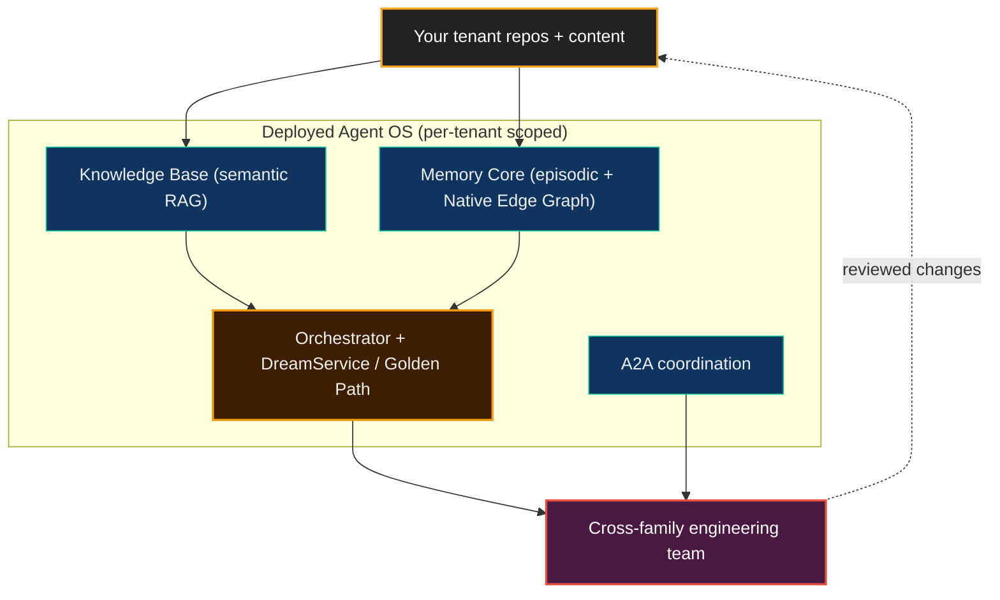

# Why Deploy the Agent OS

> **Intent layer.** This page is the *why* and *what* of running the Agent OS as a service over your own content. The *how* — ingestion contracts, configuration, security, the day-0 path — lives in the guides linked below.

Neo's Brain is not only for Neo's own repository. Deployed as a service, the **Agent OS** stands its services up against *your* repositories and content, so the capabilities that maintain Neo in public — persistent memory, semantic code understanding, and reviewed cross-family work — operate on your side.

## Why deploy it

A code-generation assistant gives you output. A deployed Agent OS gives you a **memory-backed, cross-family engineering team** that learns your codebase, retains *why* decisions were made, and reviews its own work across model families. The differentiated value is the [Brain](../../benefits/ArchitectureOverview.md) — not a single agent. What is proven today versus the portable trajectory is an explicit boundary (see the Boundaries section below).

## What gets deployed — the whole Brain, not just KB ingestion

A deployment is easy to mistake for "Knowledge Base ingestion" because that is the largest contract surface. It is one part. What actually stands up:

- **[Knowledge Base](../KnowledgeBase.md)** — semantic understanding of your code (the ingestion contracts dominate the guide surface, but they serve this).
- **[Memory Core](../MemoryCore.md) + Native Edge Graph** — persistent, cross-session memory and Active Hybrid GraphRAG over your system.
- **Orchestrator + [DreamService / Golden Path](../DreamPipeline.md)** — scheduling plus self-improvement forecasting.
- **A2A coordination** — the substrate that makes reviewed, multi-model work possible.

Tenant isolation is enforced by identity + write-stamping + read-filtering, not physical separation (see [Security](./Security.md) and [Tenant Ingestion Model](./TenantIngestionModel.md)).

## Recommended path (top-down)

1. **[Day-0 Tutorial](./Day0Tutorial.md)** — the recommended first end-to-end deployment.
2. **[Tenant Ingestion Model](./TenantIngestionModel.md)** — how your content enters the Brain (the identity tuple + visibility).
3. **[Configuration](./Configuration.md)** — profiles and the knobs each deployment sets.
4. **[Security](./Security.md)** — tenant identity and visibility boundaries.
5. **[Cloud-Native KB Ingestion Overview](./Overview.md)** plus the contract / pipeline guides — the deep ingestion mechanics.

## Boundaries

This is capability framing, not a product offer — it describes what the architecture makes possible. Cloud / multi-tenant deployment uses generic capability terms only (no specific client / partner naming). The honest split: Neo autonomously maintains *its own* repository in public today; the same Agent OS is being *shaped* to ingest, reason over, and help maintain other codebases — a trajectory, not a present-tense guarantee.

## Related

- [Architecture Overview: The Two Hemispheres](../../benefits/ArchitectureOverview.md)
- [Cloud-Native KB Ingestion Overview](./Overview.md) — the deep ingestion mechanics
- [ADR 0018 — Neo Identity Source-of-Truth Model](../decisions/0018-neo-identity-source-of-truth-model.md)
