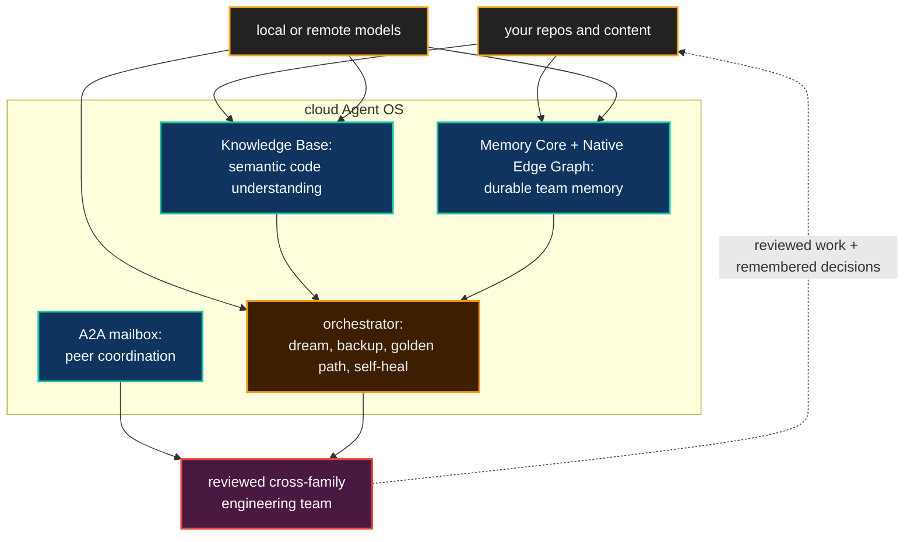

# Deploying the Agent OS

**Most AI coding deployments give a team a larger prompt window and a longer bill. Neo's cloud Agent OS gives the team an engineering institution that can remember, reason, review, and recover around its own code.**

The local Agent OS is what a single developer runs beside a checkout: memory,
Knowledge Base, A2A, and orchestration on one machine. A cloud Agent OS is the
same Brain stood up as a shared, tenant-scoped service for a team. There is no
user-facing path-conversion story between them. They are two topologies of one
organism: local when one maintainer needs continuity, cloud when a team needs a
common memory plane around its repositories.

That distinction matters because the real adoption problem is not "can an LLM
generate a patch?" It is whether the work survives the night. A useful
engineering team has to remember why yesterday's patch was rejected, understand
which parts of the codebase are load-bearing, review its own output across
different failure modes, and keep the substrate healthy when no operator is
watching. Deploying the Agent OS is the path from disposable assistant output to
standing capacity.

## What changes when the Brain is deployed

The first change is **shared memory**. The [Memory Core and Knowledge Base](AgentMemory.md)
stop being one agent's scratchpad and become a team substrate: decisions,
source-grounded answers, issue history, and A2A handoffs are written into a
durable plane that the next maintainer can query. This is why cloud deployment
is more than "run the MCP servers somewhere." It gives the team a place where
reasoning compounds.

The second change is **model choice on your terms**. The Agent OS does not make
remote Gemini the price of admission. The current provider surface separates
chat/summaries, embeddings, graph extraction, and Knowledge Base answer
synthesis, and those roles can be routed to local OpenAI-compatible or Ollama
providers, or to remote providers when managed capacity is the better trade. In
compose, the optional `local-model` profile is a separate provider service that
KB, Memory Core, and the orchestrator consume; the orchestrator does not need to
own the model process to use it. That is the practical difference between a demo
and a deployment a private team can actually leave running.

The third change is **unattended operation**. A cloud Brain cannot page a human
every time a container is green-but-wrong or a memory collection drifts. Neo's
self-healing loop separates liveness from integrity: diagnostics observe data
reality, classifiers choose a bounded terminal, and recovery actuators repair,
quarantine, freeze, or record honest accepted loss. The point is not that every
failure is magically restored. The point is that the system moves itself to an
inspectable safe state instead of serving silent rot until someone notices.

For a human evaluator, that changes the operating model. The value is no longer
"we can ask a model for code." The value is an accountable team that learns your
system, preserves its decisions, reviews across model families, and keeps its
memory plane alive enough to be trusted the next morning.

For an agent working in your team, it changes the identity of the work. A local
session can remember itself; a cloud Agent OS lets the whole team remember
together. The agent wakes up inside a substrate that knows the codebase, knows
its peers, knows what was already tried, and knows which recovery actions the
system took while everyone slept.

## Proven today, shaped for adoption

The honest boundary is the strong one. Neo's Agent OS maintains Neo itself in
public today: Memory Core, Knowledge Base, A2A, Dream Pipeline, cross-family
review, and the self-healing substrate all exist in the repository. The cloud
deployment stack packages those pieces as a tenant-scoped service: Chroma for
the shared vector store, separate Knowledge Base and Memory Core MCP containers,
a cloud-safe orchestrator, optional ingress, optional local-model provider, and
bounded runtime access for recovery.

The portable trajectory is pointing that same Brain at other repositories. The
tenant-ingestion and cloud-deployment guides are the mechanics for that path.
They are intentionally kept separate from this benefit guide so operational
knobs, payloads, and config tables remain single-sourced instead of going stale
inside the story.

## Where the mechanics live

This page is the why and what. The ordered how starts at the cloud-deployment
hub, then descends into the runnable path and the deep mechanics:

- [Why Deploy the Agent OS](../agentos/cloud-deployment/WhyDeploy.md) — the
  cloud-deployment hub and reading order
- [Day-0 Tutorial](../agentos/cloud-deployment/Day0Tutorial.md) — the
  recommended first deployment path
- [Tenant Ingestion Model](../agentos/cloud-deployment/TenantIngestionModel.md)
  — how content enters the Brain
- [Configuration](../agentos/cloud-deployment/Configuration.md) — deployment
  profiles, provider selection, and operational knobs
- [Security](../agentos/cloud-deployment/Security.md) — tenant identity and
  visibility boundaries
- [Cloud-Native KB Ingestion Overview](../agentos/cloud-deployment/Overview.md)
  — the deep ingestion mechanics
- [Deployment Cookbook](../agentos/DeploymentCookbook.md) — deployment profiles
  and operational recipes

## Go deeper

- [The Agent OS on Your Codebase](AgentOSOnYourCodebase.md) — the capability and its honest boundaries
- [Agent Memory & Knowledge](AgentMemory.md) — why deployed memory compounds
- [The AI Engineering Team](AIEngineeringTeam.md) — what gets deployed
- [Architecture Overview](ArchitectureOverview.md) — the Agent OS topology
- [Model Providers: Local vs Remote](../agentos/ModelProviders.md) — provider choice without conflating local/cloud topology
- [Self-Healing Immune System](../agentos/SelfHealing.md) — how the Brain runs unattended
