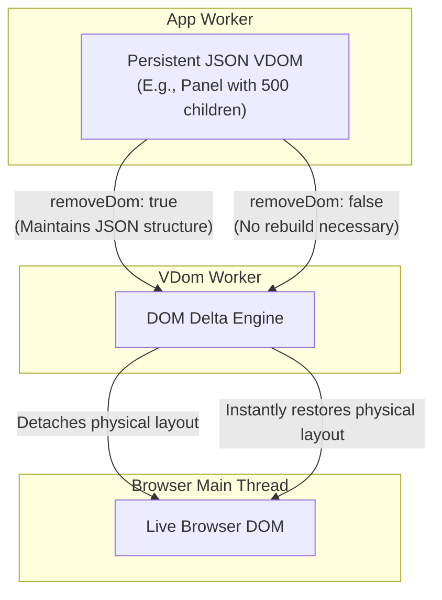

# JSON First UIs 

## The False Idol of the Virtual DOM

The original Virtual DOM was an attempt to decouple application logic from the slow, physical browser DOM. But in traditional, single-threaded frameworks, this promise fell short. 

Because the Virtual DOM in these legacy designs is still tightly coupled to Main Thread execution lifecycles and browser memory references, a complex UI update still causes cascading re-renders and main-thread locking.

## The Radical Choice

Neo.mjs made a modern, uncompromising choice: move all application logic out of the Main Thread and into Web Workers. 

However, Web Workers are physically blind. They exist in isolated threads and cannot read from or touch the live browser DOM. 

## The Great Decoupling: UIs as Pure JSON

This hard technical constraint forced a radical breakthrough. To bridge the gap between isolated application workers and the physical browser, Neo.mjs engineered a VDOM architecture where the **entire UI state must be represented as pure, serializable JSON.**

What began as a strict technical constraint became the ultimate architectural advantage. By reducing the UI to pure JSON living in an isolated thread, Neo.mjs completely decoupled the application from the physical browser. This unlocks three massive structural capabilities:

### 1. Structural Integrity (`removeDom`)

Pure JSON doesn't cost DOM rendering weight. 

In traditional frameworks, hiding a complex section of the UI (like a heavy data grid) requires dropping it from the render function entirely, effectively destroying its VDOM. When you need to show it again, the framework must expensively rebuild the entire tree from scratch.

In Neo.mjs, because the structure is just JSON, you simply set the `removeDom: true` boolean flag on a VDOM node. This instructs the VDOM Worker to detach that subtree from the live browser DOM, freeing up browser memory and paint performance.

**Crucially, the complete structural JSON tree remains perfectly intact and alive within the App Worker's memory.** When you flip the flag (`removeDom: false`), the engine instantly restores the DOM from the existing JSON blueprint without executing a single "render pass."

### 2. Multi-Window Teleportation

JSON has no physical location. Because the App Worker holds the UI state as pure JSON, it is inherently window-agnostic. 

If running as a `SharedWorker`, this JSON UI state can be piped to—and synchronized across—multiple independent Main Threads simultaneously. This is the foundational mechanic that enables Neo.mjs to detach and teleport live, complex components seamlessly across entirely different browser tabs and popup screens. 

### 3. Surgical, Disjoint Updates

Treating the UI as pure data allows Neo.mjs to perform incredibly surgical updates, completely bypassing the "cascading traverse" required by traditional frameworks.

Imagine a Toolbar containing 10 Buttons. 
If you change the background color of the Toolbar (Parent) and the text of just **one** Button (Child), a traditional framework must diff the entire Toolbar subtree.

Neo.mjs does not re-render the other 9 buttons. The engine treats the component tree as a collection of disjoint JSON sets. It generates a precise update payload containing only:
1.  The newly styled Toolbar (with lightweight placeholders for its children).
2.  The single updated Button.

The other 9 buttons are completely untouched in the cycle. This surgical data precision is what empowers the Application Engine to manage tens of thousands of real-time nodes across multiple windows while effortlessly maintaining 60 FPS. You are no longer constrained by the rendering bottlenecks of the legacy web.

> [!TIP]
> **Curious about the low-level implementation?**
> Learn exactly how Neo.mjs handles disjoint payloads, atomic batches, and teleportation in our deep-dive guide: 
> **[Asymmetric VDOM Updates](../guides/fundamentals/AsymmetricUpdates.md)**
