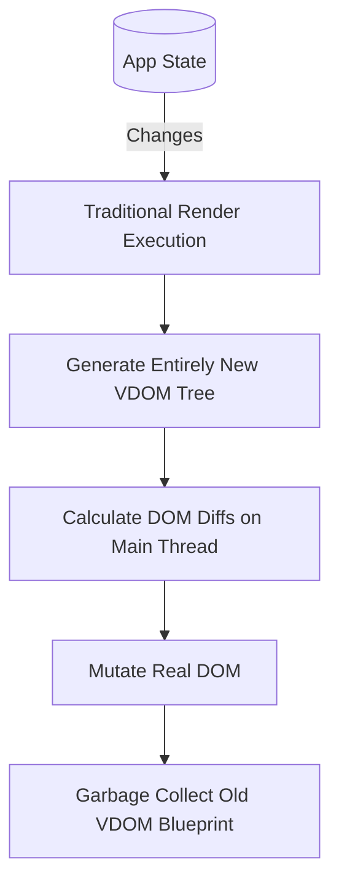
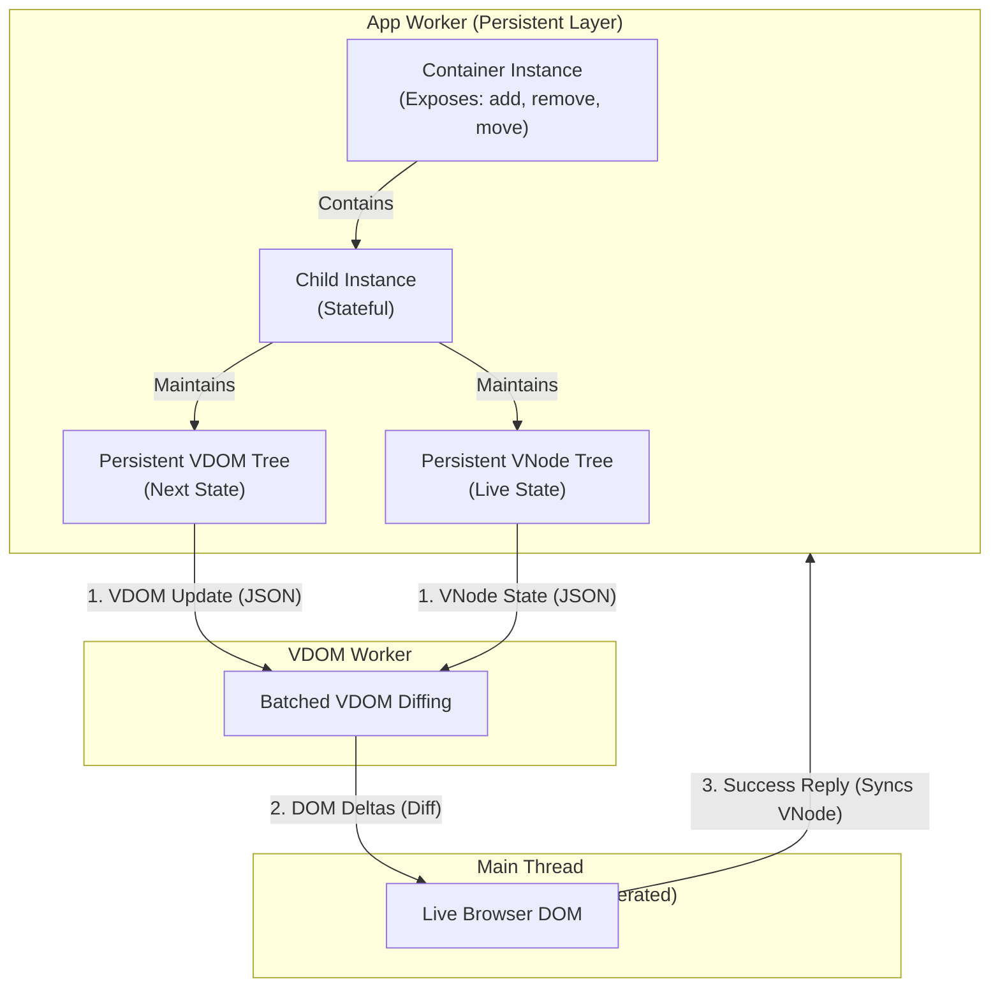

# Object Permanence & Component Trees

## The Flawed Status Quo: The Transient Web

Web UI development has long been trapped in a cycle of constant destruction. We build complex, stateful applications, but traditional Virtual DOM frameworks (like React or Vue) treat them like disposable documents. 

In these traditional, single-threaded frameworks, your source code acts as an ephemeral render function. When the application state changes, these functions execute to produce a transient blueprint of your UI. Once that blueprint is rendered into the real browser DOM, the original, structured identity of the component is lost—it melts away like plastic.

This constant destruction requires massive workarounds. To fake persistence in this destructive cycle, developers are forced into a labyrinth of Hooks, dependency arrays, and artificial memoization just to keep state alive between render passes.

## The Paradigm Shift: The Application Engine

Neo.mjs rejects the throwaway render function. It is a modern **Application Engine**, and it treats UIs not as documents, but as living, continuous applications executing inside isolated Web Workers.

When building a UI in Neo.mjs, the engine employs two distinct layers of persistent Scene Graphs. Instead of melted plastic, Neo.mjs components are engineered like **Lego Technic**. They are persistent objects that retain their exact semantic identity at all times.

### Layer 1: The Persistent Component Tree

Neo.mjs relies on an Object-Oriented foundation (`Neo.component.Abstract`). All config objects in your code are consumed and permanently replaced by living, stateful class instances. 

These instances exist continuously inside the App Worker's memory. This is the core proof of true Object Permanence: because they are permanent memory references, `Neo.container.Base` classes expose powerful runtime mutation APIs:
- `container.add(component)`
- `container.insert(index, component)`
- `container.remove(component, destroy)`
- `container.move(component, newIndex)`

You do not just update props and hope the framework redraws the container correctly over time. You can surgically grab an existing component and move it, unmount it, and remount it at runtime—without ever destroying its internal JavaScript instance or state.

### Layer 2: The Persistent VDOM & VNode Trees

Below the component abstraction, each instance maintains its own persistent **VDOM tree** (the intended *next* state) and **VNode tree** (the currently rendered *live* DOM state). 

Because the VDOM is a living object you can directly address and modify, you can mutate a component's VDOM tree multiple times synchronously. The engine batches these changes logically before sending the final diff to the VDOM worker.

## The Superpowers of True Persistence

This robust double-layer of permanence unlocks architectural super-powers that are fundamentally impossible in traditional frameworks:

1. **True Mobility (Multi-Window):** Because components are persistent memory instances, you can physically detach a complex component (like a data grid) using `remove(cmp, false)` and reattach it to another container—even across entirely different browser windows—without losing its internal state, its scrolling position, or resetting its VDOM structure. 
2. **AI-Native Introspection (Neural Link):** In transient frameworks, AI agents are essentially blind; they can only read static source code. Because Neo.mjs components exist as continuous, addressable objects in memory, AI Agents using the **Neural Link** can physically connect to the active runtime. They can introspect the entire living Scene Graph, trace data flows, and dynamically mutate state or hot-patch methods live without ever reloading the application. Neo.mjs is the first UI architecture built ground-up for autonomous AI collaboration.

> [!TIP]
> **Curious about the low-level implementation?**
> Discover exactly how Neo.mjs separates the declarative component tree abstraction from the imperative VDOM layer in our deep-dive guide: 
> **[Declarative Component Trees VS Imperative Vdom](../guides/fundamentals/DeclarativeComponentTreesVsImperativeVdom.md)**
