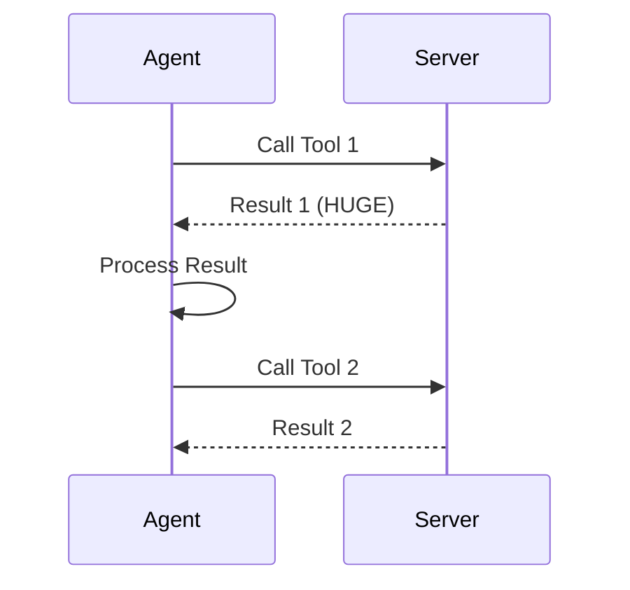
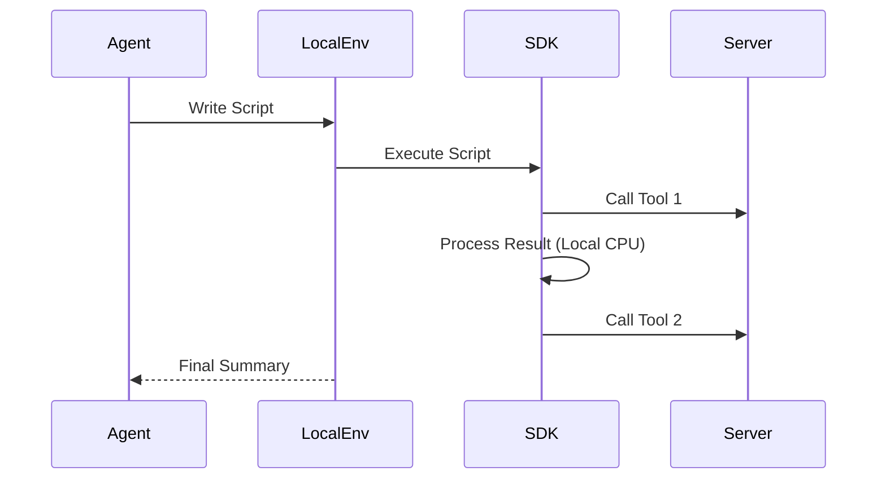

# Agent OS: A Type-Safe Execution Environment for Autonomous Software Development

**Abstract**
The Model Context Protocol (MCP) has standardized how AI agents connect to tools, but traditional "Tool Use" architectures suffer from significant scalability issues. We define this as the **"Context Window Tax"**: the O(n·k) token cost incurred by passing intermediate results through the Large Language Model (LLM) for every step of a multi-step workflow. This report introduces **Neo.mjs Agent OS**, a "Thick Client" architecture that shifts control flow from the LLM to a secure, local execution environment. By exposing toolchains as a type-safe JavaScript SDK rather than chat interfaces, we achieved a **12x increase in development velocity** (from 21.7 to 266.5 tickets/week) and enabled autonomous self-healing capabilities that were previously impossible.

---

## 1. Introduction: The Context Window Tax

In the standard "Thin Client" pattern (popularized by early MCP implementations), the AI agent acts as a passive orchestrator. To perform a task, it enters a chatty loop:

1.  Request tool definition (Tokens consumed: Tool Schema)
2.  Call tool (Tokens consumed: Arguments)
3.  Receive result (Tokens consumed: **Full Output**)
4.  Decide next step (Tokens consumed: Reasoning)

We define the cost of a workflow $W$ with $n$ steps as:

$$ Cost(W) = \sum_{i=1}^{n} (Context_{prev} + ToolDef_i + Result_i) $$

Critically, $Result_i$ often contains massive, unfiltered data (e.g., a 10,000-line log file or a full database dump) needed only for a trivial check (e.g., "is there an error?"). This "Context Window Tax" leads to three failure modes:
*   **Latency:** Round-trip times to the LLM (often 500ms - 2s) accumulate linearly.
*   **Cost:** Token consumption explodes, often exceeding $0.50 per simple debugging run.
*   **Fragility:** The LLM's reasoning degrades as the context window fills with noise.

## 2. The "Thick Client" Architecture (Agent OS)

To eliminate this tax, we implemented the **"Thick Client"** pattern (also known as **Code Execution**). In this model, the agent does not call tools one by one. Instead, it writes and executes a script.

### 2.1 The Neo.mjs AI SDK
Unlike generic script runners that require ad-hoc file generation, Agent OS provides a pre-built, **type-safe SDK** (`ai/services.mjs`).

*   **Runtime Type Safety:** We utilize **Zod** to dynamically generate validation schemas from the underlying OpenAPI specifications. This acts as a "Just-In-Time Compiler," catching hallucinated method signatures or invalid types *before* execution, mimicking the safety of TypeScript without the build step.
*   **Zero-Config Lifecycle:** Services use an async initialization pattern (`await Service.ready()`), handling database connections, authentication, and health checks automatically.

### 2.2 Architectural Comparison

**Thin Client Flow (Standard MCP):**


**Thick Client Flow (Agent OS):**


## 3. Empirical Evaluation

We evaluated the Agent OS architecture over a 10-month period, comparing the development velocity of the Neo.mjs project across three distinct eras.

### 3.1 Metric: Ticket Velocity
We measured the number of GitHub issues resolved per week.

*   **Baseline (Pre-AI):** v8.x - v9.x era (Jan 2025 - Jul 2025).
    *   Velocity: **~21.7 tickets/week**
*   **Early AI (Tool Use):** v10.x era (Jul 2025 - Nov 2025).
    *   Velocity: **~28.1 tickets/week** (+29% improvement)
*   **Agent OS (Code Execution):** v11.x era (Nov 2025 - Present).
    *   Velocity: **~266.5 tickets/week** (**+1128% improvement**)

The shift from "Tool Use" to "Code Execution" resulted in a **12x increase** in productivity compared to the baseline.

### 3.2 Case Study: Autonomous Infrastructure Repair

In Release v11.9.0, a feature update introduced a breaking change: timestamp formats in our vector database (ChromaDB) drifted from ISO Strings to Numbers, causing silent query failures.

**The "Thin Client" Approach (Simulation):**
To fix 2,000 records, a standard agent would need to:
1.  Page through records (limit 100).
2.  Pass 100 records to the LLM context.
3.  Ask LLM to identify strings.
4.  Ask LLM to generate update payloads.
5.  Repeat 20 times.
*Estimated Cost:* ~500k tokens. *Estimated Time:* ~10 minutes.

**The "Thick Client" Execution (Actual):**
The Agent OS solved this autonomously:
1.  **Diagnosis:** Wrote a diagnostic script (`debug_session_state.mjs`) to inspect the raw collection schema locally.
2.  **Remediation:** Wrote a migration script (`migrate_timestamps.mjs`) using the SDK.
    *   Iterated 2,000 records in memory.
    *   Parsed timestamps using `Date.parse()` (0 LLM inference cost).
    *   Executed batch updates.
3.  **Result:** 2,000 records fixed in **< 3 seconds**. Zero token bloat.

```javascript
// The actual remediation logic written by the agent
for (let i = 0; i < batch.ids.length; i++) {
    const currentTimestamp = batch.metadatas[i].timestamp;
    if (typeof currentTimestamp === 'string') {
        // Local CPU processing, not LLM inference
        const numericTimestamp = Date.parse(currentTimestamp);
        updates.ids.push(batch.ids[i]);
        updates.metadatas.push({ ...batch.metadatas[i], timestamp: numericTimestamp });
    }
}
await collection.update({ ids: updates.ids, metadatas: updates.metadatas });
```

## 4. Conclusion

The "Agent OS" is not just a branding exercise; it is a necessary architectural evolution for AI-driven development. By moving the control flow from the chat window to a local, type-safe execution environment, we effectively eliminate the Context Window Tax.

The data is clear: **Giving agents the ability to execute code doesn't just make them faster; it changes the fundamental unit of work they can achieve.**

---
*Data verification and reproduction scripts available in the [Neo.mjs Repository](https://github.com/neomjs/neo).*
