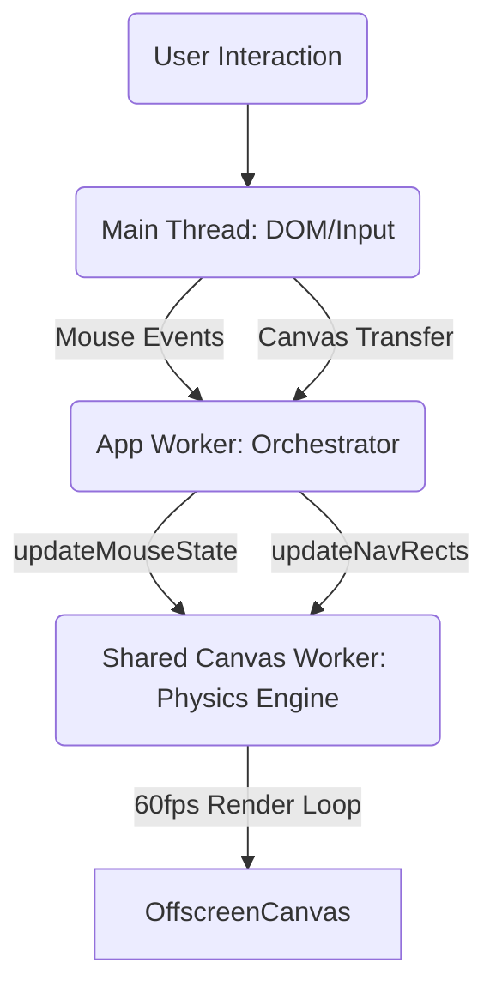

# Zero-Allocation Effects with Shared Workers

This guide explores the "Luminous Flux" visual engine (the Sonic Waves effect in the Portal App header) as a masterclass in advanced Neo.mjs architecture. It demonstrates how to combine **True Multithreading**, **Shared Workers**, and the **OffscreenCanvas API** to achieve high-performance, non-blocking visual effects.

## When to Use This Architecture

**Use Shared Worker + OffscreenCanvas when:**
- ✅ You need guaranteed 60fps animation regardless of main thread load.
- ✅ Your effect has complex physics/particle systems (many calculations per frame).
- ✅ The visual state can be self-contained (doesn't need constant DOM reads).
- ✅ You're targeting modern browsers (OffscreenCanvas support required).

**Stick with simpler patterns when:**
- ❌ Your animation is simple (basic CSS transitions/keyframes work fine).
- ❌ You need tight DOM integration (reading layout every frame).
- ❌ You need to support older browsers.

## The Challenge

We wanted to create a visually rich, interactive background for the Portal header:
-   **Complex Visuals:** 3D ribbons, neon tubes, particle systems ("Neo Ether"), and shockwaves.
-   **Interactivity:** Physics that react to mouse movement and clicks.
-   **Performance:** A strict requirement for **60fps** on high-refresh displays.
-   **Constraints:** It must **never** block the Main Thread (UI responsiveness) or the App Worker (Business Logic).

## The Architecture: Split Topology

To solve this, we used a split architecture that leverages the unique strengths of different threads.



### 1. The App Worker: The Orchestrator
**File:** `apps/portal/view/HeaderCanvas.mjs`

The App Worker component is the "handle" for the effect. It doesn't draw anything. Instead, it manages the lifecycle and state.

*   **Lifecycle Management:** When the component mounts, it instantiates the rendering graph in the Shared Worker. When it unmounts, it cleans it up.
*   **DOM Synchronization:** It uses `ResizeObserver` and `getDomRect` to track the exact position of the canvas and its sibling navigation buttons.
*   **Input Bridging:** It captures user events (`mousemove`, `click`), normalizes the coordinates relative to the canvas, and forwards them to the Shared Worker.

### 2. The Shared Worker: The Physics Engine
**File:** `apps/portal/canvas/HeaderCanvas.mjs`

This is where the magic happens. By running in a Shared Worker, the rendering loop is completely isolated. Even if the App Worker is busy processing heavy data or the Main Thread is busy with DOM layout, the animation continues smoothly.

## Setting Up the Architecture

### Step 1: Create the App Worker Component
```javascript
// apps/portal/view/HeaderCanvas.mjs
class HeaderCanvas extends Canvas {
    async afterSetOffscreenRegistered(value, oldValue) {
        if (value) {
            // Import canvas logic into Canvas Worker
            await Portal.canvas.Helper.importHeaderCanvas();

            // Initialize the renderer
            await Portal.canvas.HeaderCanvas.initGraph({
                canvasId: me.getCanvasId(),
                windowId: me.windowId
            });

            // ... setup ResizeObserver, event handlers
        }
    }
}
```

### Step 2: Create the Canvas Worker Logic
```javascript
// apps/portal/canvas/HeaderCanvas.mjs
class HeaderCanvas extends Base {
    static config = {
        singleton: true,
        remote: {
            app: ['initGraph', 'updateMouseState', ...]
        }
    }

    render() {
        // Your render loop
        setTimeout(me.renderLoop, 1000 / 60)
    }
}
```

### Step 3: Bridge User Input
```javascript
// In your App Worker component
onMouseMove(data) {
    Portal.canvas.HeaderCanvas.updateMouseState({
        x: data.clientX - this.rect.x,
        y: data.clientY - this.rect.y
    });
}
```

## Zero-Allocation Rendering

Achieving 60fps requires more than just a separate thread; it requires careful memory management to avoid Garbage Collection (GC) stutters. We implemented a **Zero-Allocation** strategy for the render loop.

### 1. TypedArray Buffers
We do not create new objects or arrays during `render()`. Instead, we use pre-allocated `Float32Array` buffers to store wave geometry.

```javascript
// Pre-allocated in updateResources()
me.waveBuffers.fgA = new Float32Array(fgCount);
me.waveBuffers.fgB = new Float32Array(fgCount);

// In the render loop, we write directly to indices
bufA[i] = centerY + sine - offsetY + noiseA + shockY;
```

### 2. Gradient Caching
Creating `CanvasGradient` objects is expensive. We create them only once when the canvas resizes and cache them.

```javascript
// updateResources()
const grad1 = ctx.createLinearGradient(0, 0, width, 0);
// ... add stops ...
me.gradients.grad1 = grad1;

// render()
drawStrand(bufA, me.gradients.grad1, ...);
```

## The "Luminous Flux" Theme

The visual effect is a procedural generation composed of four layers. Here is how each is implemented:

### 1. Neo Ether (Background)
A particle system with "nebula" orbs and "dust" specs that react to mouse repulsion.

**Implementation:**
Each particle tracks its `x`, `y`, `vx`, `vy`, and `alpha`.
*   **Physics:** We calculate the distance to the mouse. If it's within a threshold (`maxDist`), we apply a repulsion force vector.
*   **Nebulae vs. Dust:** "Nebulae" are larger, slower, and have higher mass (less repulsion). "Dust" is smaller, faster, and reacts sharply.

```javascript
// Interaction: Mouse Repulsion
let dx = p.x - me.mouse.x,
    dy = p.y - me.mouse.y,
    dist = Math.sqrt(dx*dx + dy*dy),
    maxDist = p.isNebula ? 150 : 100;

if (dist < maxDist && dist > 0) {
    let force = (maxDist - dist) / maxDist;
    // Push away (Nebulae are heavier)
    let mass = p.isNebula ? 5 : 1;
    p.x += (dx / dist) * force * (2 / mass);
    p.y += (dy / dist) * force * (2 / mass);
    // Brighten slightly on interaction
    p.alpha = Math.min(p.baseAlpha + force * (p.isNebula ? 0.05 : 0.5), 0.8);
}
```

### 2. Ambient Helix
A subtle, background sine wave with a volumetric ribbon fill. It uses a very low opacity gradient to create "depth of field" behind the sharp foreground.

```javascript
// Calculate Points (Direct to Buffer)
for (let i = 0; i < count; i++) {
    let x = i * step;
    // Two sine waves, 180 degrees out of phase
    bufA[i] = centerY + Math.sin((x * 0.01) + t) * amp;
    bufB[i] = centerY + Math.sin((x * 0.01) + t + Math.PI) * amp;
}
```

### 3. Split Stream (Foreground)
Two intertwined neon strands ("DNA") that flow across the screen. This is the most complex layer.

*   **Adaptive Geometry:** The strands flow loosely around text buttons (cosine envelope) but tighten into a "high-gravity orbit" around square social icons (cubed envelope).
*   **Frequency Modulation:** The wave frequency changes based on proximity to UI elements, creating a "time dilation" effect.

```javascript
// Collision Detection & Adaptive Geometry
if (distX < span) {
    let envelope;
    if (isIcon) {
        // TIGHT ORBIT: Cubed for sharper falloff
        let normDist = distX / span;
        envelope = Math.pow((1 + Math.cos(Math.PI * normDist)) / 2, 3);
    } else {
        // WIDE FLOW: Standard smooth cosine
        envelope = (1 + Math.cos(Math.PI * distX / span)) / 2;
    }
    // ... apply envelope to offsetY ...
}
```

## Semantic State Visualization

A key innovation in the Header Canvas is the use of the canvas itself to provide semantic feedback for UI states (Active and Hover), replacing traditional CSS effects. This creates a deeply integrated "living UI".

### 1. The "Energy Surge" (Active State)
A semantic highlighting effect that makes the currently active navigation item glow.

**Implementation Challenge:**
We needed to highlight the active section *without* disrupting the flow or adding clashing geometry (like a bounding box or overlay).

**Solution: Localized Redraw**
We use a **Multi-Pass Rendering** technique. After the main stream is drawn, we perform a second pass that draws *only* the segment of the stream corresponding to the active item's position.
*   **Visuals:** This segment is drawn with `strokeStyle: 'white'` (simulating heat) and a high `shadowBlur` (glow).
*   **Animation:** We apply a faster alpha oscillation ("nervous pulse") to this segment, making the energy feel "excited" compared to the calm rest of the stream.
*   **Zero-Cost Physics:** We reuse the *same* geometry buffers (`waveBuffers`) calculated for the main stream. No new physics are run.

```javascript
// drawActiveOverlay(ctx, width)
// 1. Find the active rect (Zero-Allocation: use for-loop)
for (const r of me.navRects) {
    if (r.id === me.activeId) {
        rect = r;
        break;
    }
}

// 2. Set "Energy" styles
ctx.strokeStyle = '#FFFFFF';
ctx.shadowBlur  = 20;
ctx.globalAlpha = 0.6 + (Math.sin(me.time * 3) * 0.2); // Fast pulse

// 3. Draw segment (Inline loop to avoid closures)
ctx.beginPath();
ctx.moveTo(startI * step, bufA[startI]);
for (let i = startI + 1; i <= endI; i++) {
    ctx.lineTo(i * step, bufA[i]);
}
ctx.stroke();
```

### 2. The "Preview Glow" (Hover State)
We replaced the standard CSS `background-color` hover effect with a canvas-based glow. This solves contrast issues (ghost buttons on complex backgrounds) and reinforces the visual theme.

*   **Bridge Pattern:** The `HeaderToolbar` (App Worker) captures `mouseenter` events and updates the `hoverId` in the `HeaderCanvas` (Shared Worker).
*   **Visual Distinction:** Unlike the Active state (White, Pulsing), the Hover state is drawn in **Cyan** (Theme Highlight) with a **Static Alpha** (No Pulse). This clearly distinguishes "current location" from "interaction focus".
*   **Priority:** The Hover effect is drawn *after* the Active effect, ensuring interaction feedback is always visible.

```javascript
// drawHoverOverlay(ctx, width)
// ... find rect ...

// Hover Style: Cyan, Static
ctx.strokeStyle = themeColors.hover; // e.g. Cyan
ctx.shadowBlur  = 15;
ctx.globalAlpha = 1; // No pulse = Stable feedback

// Edge Handling:
// Special logic clamps the drawing range near the canvas edge to prevent visual artifacts.
endX = Math.min(width - 3, rect.x + rect.width + pad);
```

## Shockwaves
Interactive pulses triggered by clicks. They displace the waves and repel particles.

**Implementation:**
We track a list of active `shockwaves`. Each frame, we increment their `age` and calculate their `radius`.
*   **Wave Displacement:** In `calculateStrandGeometry`, we check if a point is near the shockwave radius. If so, we add a sine-based pulse to its `y` position.
*   **Particle Repulsion:** In `drawParticles`, we push particles outward if they are caught in the blast radius.

```javascript
// Pulse shape: Sine wave based on distance from center relative to radius
if (Math.abs(dist) < radius && Math.abs(dist) > radius - 60) {
    let pulse = Math.sin((dist / radius) * Math.PI * 10) * (1 - (wave.age / wave.life)) * 20;
    shockY += pulse;
}
```

## Common Pitfalls

### ❌ Don't: Assume `requestAnimationFrame` exists
When using Shared Workers (`useSharedWorkers: true`, required for multi-window apps), `requestAnimationFrame` is not available. However, in the default Dedicated Worker mode, it is.

**✅ Do:** Use Feature Detection
To support both modes, check if `requestAnimationFrame` is available.

```javascript
// Top of your file
const hasRaf = typeof requestAnimationFrame === 'function';

// In your render loop
if (hasRaf) {
    requestAnimationFrame(this.renderLoop);
} else {
    setTimeout(this.renderLoop, 1000 / 60);
}
```

### ❌ Don't: Create objects in the render loop
```javascript
// BAD: Creates garbage every frame
for (let i = 0; i < count; i++) {
    let point = {x: ..., y: ...};  // 🔥 GC pressure
}
```

**✅ Do:** Write to pre-allocated buffers
```javascript
// GOOD: Zero allocations
bufA[i] = centerY + sine - offsetY;
```

### ❌ Don't: Forget to clean up
```javascript
// Component unmount MUST call:
await Portal.canvas.HeaderCanvas.clearGraph()
// Otherwise: Zombie render loops eating CPU forever
```

## Conclusion

This implementation proves that Neo.mjs is not just for business apps; it's a capable engine for creative coding. By respecting the "Zero-Allocation" contract and effectively splitting responsibilities between workers, you can build immersive, desktop-class experiences on the web.

## Learn More

- [OffscreenCanvas MDN](https://developer.mozilla.org/en-US/docs/Web/API/OffscreenCanvas)
- [Web Workers vs Shared Workers](https://developer.mozilla.org/en-US/docs/Web/API/Web_Workers_API)
