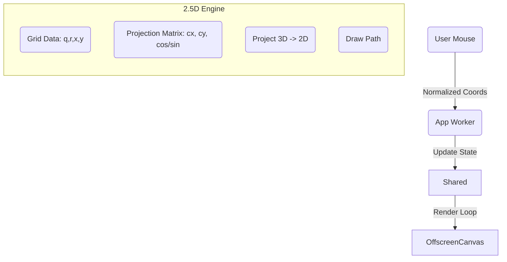

# The Neural Fabric: 2.5D Projection & Hexagonal Grids

The "Neural Fabric" (Services Canvas) visualizes the Neo.mjs Application Engine as a structured, engineered lattice. It represents the "Motherboard" or "VDOM Registry" where components live, are inspected, and are mutated by intelligent agents.

While **Neural Swarm** deals with autonomous, organic behaviors, and **Neural Timeline** deals with data coordination, the **Neural Fabric** solves a different challenge: **High-Performance 3D Visualization in a 2D Context.**

## When to Use This Pattern

**Use the 2.5D Projection pattern when:**
- ✅ You need 3D aesthetics (perspective, rotation, depth) but cannot afford the overhead of WebGL/Three.js.
- ✅ You need to visualize structured grid data (Hexagonal, Isometric).
- ✅ You require precise pixel-perfect control over lines and fills (which is harder in raw WebGL).
- ✅ You need 60fps performance on integrated graphics (mobile/laptops).

**Stick with WebGL/Three.js when:**
- ❌ You need real lighting, shadows, or complex materials.
- ❌ You have full 3D models (OBJ/GLTF).
- ❌ You need Z-buffering (pixels occluding each other perfectly).

## The Challenge: 3D without the Weight

We wanted a "Cybernetic Motherboard" look: a 3D hexagonal grid that tilts, rotates with the mouse, and has depth (parallax).
-   **Problem:** Loading a full 3D engine (Three.js/Babylon) adds 600KB+ to the bundle and introduces significant GPU overhead for what is essentially a line-drawing effect.
-   **Solution:** Implement a lightweight "2.5D" manual projection engine inside a standard 2D Canvas context.

## The Architecture: "The Matrix in a Loop"

The architecture relies on a **Shared Worker** (Physics/Render) and an **App Worker** (Controller), similar to other canvases. The core innovation here is the **Projection Pipeline**.



### 1. The Manual Projection Engine
Instead of a heavy matrix library, we implement a specific "Floor Perspective" projection. We only need to rotate around X (Pitch) and Y (Yaw).

**The Math (Inlined for Speed):**
We rotate the point `(x, y, z)` around the center `(cx, cy)` and then project it based on `z` depth.

```javascript
// ServicesCanvas.mjs
project(x, y, z) {
    let dx = x - cx, dy = y - cy, dz = z;

    // 1. Rotate Yaw (Y-axis)
    let x1 = dx * cosY - dz * sinY;
    let z1 = dz * cosY + dx * sinY;

    // 2. Rotate Pitch (X-axis)
    let y2 = dy * cosX - z1 * sinX;
    let z2 = z1 * cosX + dy * sinX;

    // 3. Perspective Divide
    let scale = fov / (fov + z2);

    return {
        x: x1 * scale + cx,
        y: y2 * scale + cy,
        scale: scale
    };
}
```

**Optimization:** We re-use a single `projectionPoint` object to avoid creating garbage `bject`s every frame.

### 2. Hexagonal Data Structure (The Buffer)

We don't store "Hexagon Objects". We store a **Structure of Arrays (SoA)** in a `Float32Array`.
A hexagonal grid is defined by Axial Coordinates `(q, r)`.

**Buffer Layout (Stride: 8 floats per node)**
| Index | Property | Description |
|-------|----------|-------------|
| 0, 1 | `q`, `r` | Axial Coordinates (Grid Topology) |
| 2, 3 | `x`, `y` | Screen Space Center (Pre-calculated) |
| 4 | `scale` | Visual size (0-1) for open/close animations |
| 5 | `energy` | Interaction state (0-1) |
| 6 | `buildCharge` | Accumulator for Super Hex formation |
| 7 | `colorIdx` | Palette index |

**Why Axial Coordinates?**
They make neighbor lookups fast. In a hex grid, every neighbor is at `(q+dq, r+dr)`. We don't need complex graph traversal; just math.

### 3. Visual Logic: The "Cybernetic Loop"

The visual story is one of **Cause and Effect**. It's not random; it's a simulation of work.

#### Phase 1: The Neural Agent (Runner)
**"The Work Packet"**
Agents travel along the grid lines. They are not particles; they are **State Machines**.
-   **State 0 (Moving):** Finds a path to a target node.
-   **State 1 (Scanning):** Orbits a node, "reading" it.

#### Phase 2: The Construct (Super Hex)
**"The Result"**
When an Agent finishes scanning, it injects `BuildCharge` into the node. If charge > Threshold, a **Super Hex** is born.

**The "Implode/Upload" Effect:**
We use particle effects to sell the state change:
1.  **Birth:** Particles `implode` (fly inward) from the radius to the center. Metaphor: **Allocation**.
2.  **Life:** The Super Hex expands and glows.
3.  **Death:** Particles `upload` (fly upward/outward) as the Hex vanishes. Metaphor: **Release/Sync**.

```javascript
// ServicesCanvas.mjs
if (sh.state === 2 && sh.age > 30) {
    // Done - Trigger Upload
    me.spawnParticles(x, y, 12, 'upload'); // Fly up!
    me.superHexes.splice(i, 1);
}
```

## Visual Layers: Managing Depth in 2D

Since we are in a 2D canvas, we don't have a Z-buffer. We must manually manage draw order (Painter's Algorithm) to create depth.

1.  **Kernel Layer (Background):** A huge, slow-moving grid drawn first. Represents the "Deep Core".
2.  **Strata Layer (Mid):** Randomly placed floating clusters. Drawn with lower opacity.
3.  **Fabric Layer (Foreground):** The main interactive grid. Drawn last for sharpness.
4.  **Agents & Particles:** Drawn on top of everything.

**Parallax Trick:**
Each layer moves at a different speed relative to the mouse, creating a compelling 2.5D "Deep Space" feel without actual 3D geometry.

```javascript
// Kernel pans slowly
let panX = Math.sin(time * 0.2) * 20;

// Strata pans faster
let panX = Math.sin(time * 0.15) * 30;
```

## Terminology Check

To align with the "Application Engine" narrative, we use specific terms:
-   **Neural Fabric:** The grid itself.
-   **Constructs:** The merged Super Hexes.
-   **Agents:** The moving packets (Runners).
-   **Kernel:** The deep background layer.

## Conclusion

The Neural Fabric proves that you don't need a heavy 3D engine to build immersive, spatial interfaces. By understanding the math of **Projection** and the efficiency of **TypedArrays**, Neo.mjs delivers "Sci-Fi UI" performance on the web.

