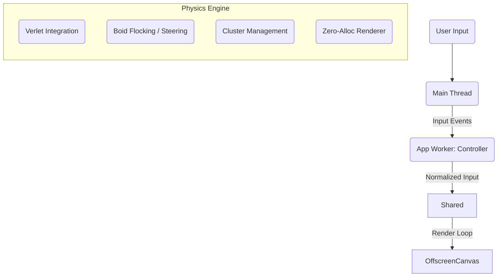

# The Neural Swarm: Simulating an "Agent-Native" OS

The "Neural Swarm" (Home Hero Canvas) is more than just a background effect; it is a living simulation designed to visualize the core philosophy of Neo.mjs: **An Application Engine inhabited by Agents.**

While `HeaderCanvas.mjs` ("Luminous Flux") demonstrates *procedural* generation, and `TicketCanvas.mjs` ("Neural Timeline") demonstrates *data-driven* visualization, the **Neural Swarm** demonstrates **Autonomous Simulation**. It is a self-contained ecosystem where entities have agency, memory, and physics-based interactions.

## When to Use This Pattern

**Use the Autonomous Simulation pattern when:**
- ✅ You need to visualize complex, self-organizing systems (graphs, networks, swarms).
- ✅ The visuals need to feel "alive" and "intelligent" rather than just repetitive animations.
- ✅ You require massive scale (hundreds/thousands of entities) with 60fps performance.
- ✅ You want interactions to feel physical (drag, throw, explode) rather than scripted.

**Stick with other patterns when:**
- ❌ You need precise, pixel-perfect control over every element (use DOM or SVG).
- ❌ The data is strictly linear or tabular (use the Coordinator Pattern from Neural Timeline).
- ❌ You are visualizing static data without relationships.

## The Challenge: Visualizing the Invisible

The challenge was to visualize the "Neo.mjs Application Engine" concept. How do you show that a framework is multi-threaded, scalable, and agent-ready?

We established three metaphors:
1.  **The Graph (Topology):** The application state isn't a static tree; it's a dynamic cluster of connected nodes (Components/Services).
2.  **The Swarm (Agents):** The logic isn't just "running"; it's being actively maintained by "Seeker Drones" (Agents) that traverse the graph.
3.  **The Pulse (Data):** Information flows visibly between nodes.

Technically, this required simulating **150+ Nodes, 20+ Agents, and 50+ Data Packets** with complex force-directed physics, Boid flocking behaviors, and mouse interaction—all on a 4K screen at 60fps, without blocking the main thread.

## The Architecture: The "Living" Shared Worker

We leverage the same **App Worker (Controller) <-> Shared Worker (Physics)** split used in the other canvases, but with a key difference: **State Persistence.**

In the Neural Swarm, the Shared Worker holds the *authoritative state* of the simulation. The App Worker merely hints at inputs (mouse position, resize events).



### 1. The Physics Engine (Verlet Integration)
Standard Euler integration (`pos += vel`) wasn't stable enough for the elastic connections we wanted. We needed nodes that could be "thrown" and would spring back.

We implemented a custom physics solver that handles:
-   **Cluster Cohesion:** Child nodes are tethered to parents with "soft springs."
-   **Flow Fields:** Parent nodes drift along procedural currents (Simplex Noise), preventing the graph from looking static.
-   **Containment:** A gentle gravitational field keeps the swarm centered, preventing it from drifting off-screen over time.

### 2. The "Zero-Allocation" Data Structure

To achieve 60fps with this many entities, **Garbage Collection (GC) is the enemy.** We allocate memory *once* at startup and never again.

We use a **Structure of Arrays (SoA)** approach backed by `Float32Array`.

**Node Buffer Layout (Stride: 9 floats per node)**
| Index | Property | Description |
|-------|----------|-------------|
| 0, 1 | `x`, `y` | Position |
| 2, 3 | `vx`, `vy` | Velocity |
| 4 | `radius` | Visual size (breathing base) |
| 5 | `layer` | Parallax depth (0=Back, 1=Mid, 2=Front) |
| 6 | `parentId` | Connection topology (-1=Root, -2=Drifting) |
| 7 | `phase` | Animation offset for breathing effect |
| 8 | `energy` | Interaction state (0.0 to 1.0) |

**Why this matters:**
-   **Cache Locality:** The CPU can pre-fetch data efficiently.
-   **Zero GC:** We overwrite numbers; we never create objects.
-   **Transferable:** We can theoretically snapshopt the entire buffer and send it to another thread instantly.

## The "Ghost in the Shell": Agent Behaviors

The visual "Soul" of the simulation comes from the **Seeker Drones**. These aren't just random particles; they run a Finite State Machine (FSM) coupled with [Boids](https://en.wikipedia.org/wiki/Boids) steering behaviors.

### State 1: Seek (The Hunt)
The agent selects a random "Parent Node" as a target. It applies a **Steering Force** to turn towards the target while maintaining momentum.
```javascript
// Steering = Desired - Velocity
let desiredX = (targetX - x) / dist * maxSpeed;
let steerX = (desiredX - vx) * maxForce;
vx += steerX;
```

### State 2: Scan (The Interaction)
Upon reaching the target, the agent enters a "Scanning" state.
-   **Visuals:** It orbits the node, drawing a "scanning ring."
-   **Physics:** It slows down (`friction = 0.9`).
-   **Effect:** It transfers "Energy" to the node (`node.energy = 1.0`).

### State 3: Wander (The Patrol)
If no targets are valid, the agent drifts using Perlin noise, simulating a "patrol" mode until a new target is acquired.

## Visual Polish: The "Luminous Flux" Aesthetic

The visual style is carefully tuned to convey "High-Tech Organic."

### 1. The Golden Spiral Initialization
Random placement looks messy. Grid placement looks artificial.
We initialize nodes using a **Golden Spiral (Fibonacci)** distribution. This ensures:
-   Uniform screen coverage (no clumps or holes).
-   Organic, flower-like starting topology.
-   Deterministic visual balance.

### 2. Composite Shockwaves (Chromatic Aberration)
When the user clicks, we don't just draw a circle. We render a **Composite Shockwave** to simulate high-energy displacement.

```javascript
// 1. Cyan Channel (Lagging Fringe)
ctx.strokeStyle = '#00BFFF';
ctx.arc(x, y, radius * 0.99, ...); // Slightly smaller

// 2. Blue Channel (Leading Fringe)
ctx.strokeStyle = '#3E63DD';
ctx.arc(x, y, radius * 1.01, ...); // Slightly larger

// 3. White Core (Hot Center)
ctx.strokeStyle = '#FFFFFF';
ctx.arc(x, y, radius, ...);
```
This creates a subtle "RGB Split" or chromatic aberration effect at the edges of the explosion, making it feel volumetric.

### 3. Dynamic Parallax
Depth isn't static. It's a multiplier on mouse movement.
-   **Front Layer (2):** Moves 1:1 with mouse.
-   **Mid Layer (1):** Moves 0.5:1.
-   **Back Layer (0):** Moves 0.2:1.

This creates a 2.5D "Deep Space" feel as you move the cursor.

## Optimization Techniques

### 1. Inlined Physics Math
We do not use a `Vector2` class. Function calls and object creation are too expensive inside a triple-nested loop (Nodes x Nodes x Connections).
**Bad:** `let dist = vec1.dist(vec2);`
**Good:** `let dx = x1-x2, dy = y1-y2; let dist = Math.sqrt(dx*dx + dy*dy);`

### 2. Connection Culling (Spatial Hashing alternative)
Drawing lines between all 150 nodes would require 11,000 checks ($N^2$).
We optimize by:
1.  **Topology Check:** Only check connections if nodes share a `parentId` or are Parent-Child.
2.  **Distance Check:** `if (distSq < threshold) ...` (avoids `Math.sqrt` for far-away nodes).

### 3. Canvas State Batching
Context state changes (`ctx.fillStyle`) are expensive. We batch rendering by entity type/layer.
1.  Draw all Connections (one `strokeStyle`).
2.  Draw all Nodes (batch by color if possible, though we vary opacity).
3.  Draw all Agents.

## Conclusion

The Neural Swarm is a testament to the power of the **Shared Worker** architecture. By offloading the simulation to a dedicated thread and adhering to strict memory disciplines, we created a rich, interactive, and "living" background that runs smoothly on consumer hardware, proving that the web can deliver desktop-class graphical experiences.
