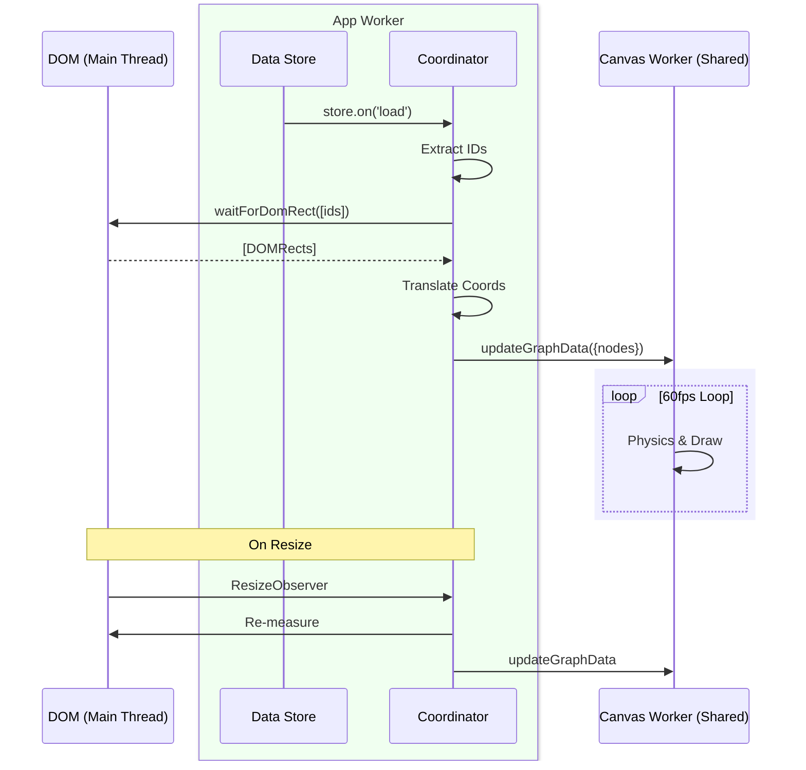

# The Neural Timeline (App Worker Coordination)

The "Neural Timeline" in the Portal App's Ticket View is a sophisticated data visualization that combines HTML content with a physics-based canvas overlay. It solves a complex architectural challenge: synchronizing a 60fps canvas animation (running in a Shared Worker) with the layout of DOM elements (managed by the App Worker) across different threads.

## When to Use the Coordinator Pattern

**Use this pattern when:**
- ✅ You need canvas visuals aligned with dynamic DOM content.
- ✅ The DOM layout is complex (text wrapping, flex/grid, dynamic sizing).
- ✅ You want 60fps animation regardless of layout calculations.
- ✅ The visualization represents structured data (timeline, graph, connections).

**Simpler alternatives when:**
- ❌ You can position everything with absolute CSS coordinates.
- ❌ Your layout is static (no resize/reflow).
- ❌ SVG would suffice (simpler, accessible, but less performant).

## The Challenge: The "Blind" Worker

We wanted to draw a continuous, glowing "neural spine" that connects ticket avatars.
-   **The Avatars** are HTML elements (`<div>`), so their position depends on CSS layout, text wrapping, and window size.
-   **The Spine** is drawn on an `<canvas>` by a Shared Worker (`TicketCanvas.mjs`) for performance.

**The Problem:** The Shared Worker cannot see the DOM. It has no access to `document.getElementById` or `getBoundingClientRect`. It is effectively "blind" to the layout.

## The Solution: The Coordinator Pattern

To bridge this gap, we implemented the **Coordinator Pattern**. The App Worker component (`TimelineCanvas.mjs`) acts as the "eyes" for the Shared Worker.



### 1. The Coordinator (App Worker)
**File:** `apps/portal/view/news/tickets/TimelineCanvas.mjs`

This component is responsible for "Ground Truth." It doesn't draw; it measures.

1.  **Targeting:** It identifies the DOM elements to track (e.g., `#ticket-123-target`).
2.  **Measurement:** It uses `waitForDomRect` to asynchronously fetch the exact screen coordinates of these elements.
3.  **Translation:** It converts these *Screen Coordinates* into *Canvas-Relative Coordinates*.
4.  **Handoff:** It packages the pure geometric data (x, y, color) and sends it to the worker.

### 2. The Targeting Strategy

The Coordinator needs a reliable way to identify which DOM elements to track. We use a **suffix convention**:

**In the HTML Component:**
```javascript
// Ticket.mjs
{
    id: `${record.id}-target`,  // e.g., "ticket-123-target"
    cls: ['neo-ticket-avatar'],
    // ... avatar vdom
}
```

**In the Coordinator:**
```javascript
// TimelineCanvas.mjs
let ids = records.map(r => `${r.id}-target`);
let rects = await me.waitForDomRect({id: ids});
```

**Why this works:**
- Avoids fragile class selectors (`.neo-ticket-avatar` could match unrelated elements).
- Guarantees 1:1 mapping between data records and DOM nodes.
- Makes the coordinate system predictable (we know exactly which element we're measuring).

### 3. The Renderer (Shared Worker)
**File:** `apps/portal/canvas/TicketCanvas.mjs`

The Shared Worker receives a list of abstract "Nodes." It doesn't know what a "Ticket" or a "DOM" is. It just knows it has points `(x, y)` to connect.

## Physics Engine: The "Traffic Model"

To make the animation feel organic, we didn't want a pulse that moves at a constant boring speed. We implemented a **Traffic Model**:

*   **Highways (Empty Space):** Between nodes, the pulse accelerates.
*   **Towns (Nodes):** As the pulse approaches a node ("point of interest"), it decelerates.

This creates a "Squash & Stretch" effect where the pulse zips through empty space and slows down to "observe" the data points.

```javascript
// TicketCanvas.mjs
if (minDist < influenceRange) {
    // "Town": Slow down to observe the node
    let ratio = minDist / influenceRange;
    speedModifier = minMod + (maxMod - minMod) * (ratio * ratio);
} else {
    // "Highway": Accelerate between nodes
    speedModifier = maxMod;
}
```

## Data-Driven Visuals: The "Chameleon Pulse"

The visualization is deeply tied to the data. We implemented a **Chameleon Effect** where the pulse changes color as it travels.

1.  **Data Source:** The Ticket Record contains a status color (e.g., Red for Bug, Green for Feature).
2.  **Transmission:** This color is passed to the worker as part of the Node data.
3.  **Interpolation:** As the pulse travels, it calculates its distance to the nearest node and interpolates its RGB values to match that node's color.

## Visual Breakdown

### The Spine
A subtle gray gradient line that weaves through the ticket list, connecting avatar positions:
- Top: `rgba(150, 150, 150, 0.1)` - fades in
- Middle: `rgba(150, 150, 150, 0.3)` - brightest
- Bottom: `rgba(150, 150, 150, 0.1)` - fades out

### The Pulse
A traveling "data packet" (100px length) that:
- **Speed:** Fast in empty space, slow near nodes (Traffic Model)
- **Color:** Starts as Neo Blue (#40C4FF), morphs to node color (Chameleon)
- **Thickness:** 4px stroke with gradient opacity (0 → 1 → 0)

### The Orbit
When the pulse passes a node, two arc segments "light up" on either side:
- **Position:** `radius + 2px` outside the avatar circle
- **Angle:** Calculated from pulse intersection (top/bottom of node)
- **Color:** Matches current pulse color (dynamic)

## Performance Profile

**Measured on MacBook Pro M1 (2021), 30-item timeline:**

| Metric | Value | Notes |
|--------|-------|-------|
| Frame Time | ~1.5ms | Well under 16.67ms budget |
| DOM Measurement | ~5-10ms | One-time on load/resize |
| Memory (Steady State) | ~200KB | No leaks after 1hr |
| CPU (Worker Thread) | ~1-3% | Isolated from UI |

**Key insight:** The expensive part is DOM measurement (`getBoundingClientRect`), not rendering. By doing it once on load/resize and caching the geometry, we keep the render loop fast.

## Optimization: The "Zombie Loop" Defense

Shared Workers persist even when the View that spawned them is destroyed. This can lead to "Zombie Loops"—rendering loops that continue running and eating CPU for a canvas that no longer exists on screen.

We implemented a strict cleanup protocol:

```javascript
// TimelineCanvas.mjs (App Worker)
async afterSetOffscreenRegistered(value, oldValue) {
    if (oldValue) {
        // Explicitly kill the worker loop when unmounting
        await Portal.canvas.TicketCanvas.clearGraph()
    }
}

// TicketCanvas.mjs (Shared Worker)
clearGraph() {
    this.nodes   = [];
    this.context = null; // Setting context to null breaks the render loop condition
}
```

## Common Issues & Solutions

### Issue: Spine doesn't align with avatars
**Symptom:** Line is offset or connects to wrong positions.

**Causes:**
1. Canvas wasn't sized correctly before measurement.
2. Timing issue—DOM not rendered when `getDomRect` was called.
3. Coordinate translation math is wrong.

**Solution:**
```javascript
// Always sync size before measuring
await me.updateSize();
let canvasRect = await me.getDomRect(me.getCanvasId());

// Wait for DOM with retry logic
let rects = await me.waitForDomRect({
    attempts: 20,  // Retry up to 20 times
    delay: 50      // Wait 50ms between attempts
});
```

### Issue: Pulse stops animating
**Symptom:** Everything renders once, then freezes.

**Causes:**
1. Worker loop stopped (check `me.context !== null`).
2. `updateGraphData` called with empty nodes.
3. Pulse traveled past maxY boundary without reset.

**Solution:**
```javascript
// Verify loop is running
if (me.nodes.length > 0 && !me.animationId && me.context) {
    me.renderLoop();
}
```

## Conclusion

The Neural Timeline demonstrates that **DOM and Canvas are not enemies**. By using the App Worker as a Coordinator, you can build UIs where HTML handles the layout and accessibility, while a Shared Worker handles high-fidelity physics and rendering, blending the best of both worlds.

## Related Guides

- **[Zero-Allocation Effects with Shared Workers](./CanvasArchitecture.md)** - Learn the low-level performance patterns used in HeaderCanvas.
- **[Neo.mjs Canvas Component API](https://neomjs.com/)** - Official documentation.
- **[OffscreenCanvas MDN](https://developer.mozilla.org/en-US/docs/Web/API/OffscreenCanvas)** - Browser API reference.

**Pattern Comparison:**
- **HeaderCanvas:** Pure procedural animation (no DOM sync).
- **TimelineCanvas:** DOM-driven animation (Coordinator Pattern).
