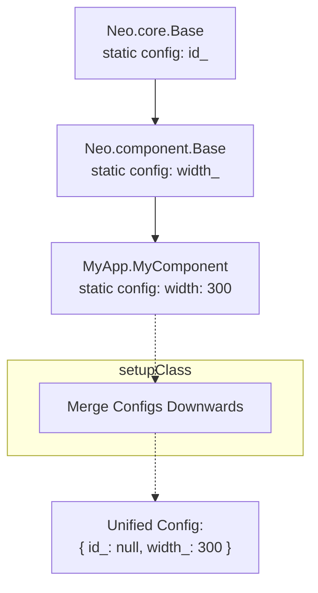
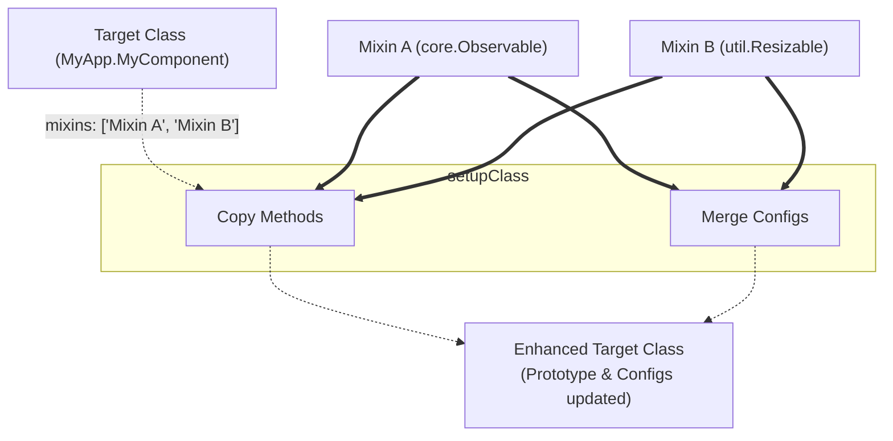

# Class Compilation (`Neo.setupClass`)

To solve the `constructor` trap and enable declarative configurations, Neo.mjs must know exactly how a class is structured before it creates an instance. In native JavaScript, defining a class is a static, one-time operation—once the `class {}` block is evaluated, its prototype is largely fixed. 

Neo.mjs introduces a crucial **compilation step** that occurs *after* a class is defined but *before* it is ever instantiated. This step is the forge where standard JS classes are granted their framework superpowers, managed by `Neo.setupClass()`.

Every class definition in the Neo.mjs ecosystem must end by passing the class through this meta-compiler:

```javascript readonly
import Base from './Base.mjs';

class MyComponent extends Base {
    static config = {
        className: 'MyApp.MyComponent',
        mySetting_: true
    }
}

// The crucial compilation step
export default Neo.setupClass(MyComponent);
```

## What Does `setupClass` Do?

`Neo.setupClass` acts as a class factory. It performs several critical, heavy-lifting operations that transform a standard JS class into a powerful, declarative Neo component.

### 1. Prototype Chain Walking & Config Merging

The most important job of `setupClass` is to build a unified configuration blueprint. It does this by walking up the prototype chain (from the current class all the way up to `core.Base`), extracting the `static config` object from each level.

It then merges these configs downwards. This allows a subclass to easily override a specific default property without needing to redefine the entire configuration block from its parent.



> **Crucial Rule:** You define a config as reactive by adding a trailing underscore (e.g., `width_`) exactly **once** in the prototype chain. If you extend a class and want to change the default value of an already reactive config, you **must not** use the underscore (e.g., use `width: 300`). Using the underscore again will cause `Neo.setupClass` to throw an error, protecting you from breaking the inheritance chain.

### 2. Generating the Reactive Config API

As `setupClass` merges the configs, it actively hunts for any property name ending with a trailing underscore (e.g., `mySetting_`).

This trailing underscore is the declarative signal for the Neo Config System. When the compiler encounters one, it automatically generates a public getter and setter on the class prototype (stripping the underscore). 

It wires these generated getters and setters into the `core.Config` system, guaranteeing that whenever this property is accessed or changed at runtime, the framework's `beforeSet`, `beforeGet`, and `afterSet` lifecycle hooks will fire.

### 3. Applying Overwrites

Before finalizing the unified blueprint, `setupClass` checks a global `Neo.overwrites` object.

This is a profoundly powerful theming and configuration mechanism. It allows you to globally modify the default `static config` of a class *without* modifying its source code or extending it.

```javascript readonly
// Example: Globally change the default width of all generic components
Neo.overwrites = {
    Neo: {
        component: {
            Base: {
                width_: 500
            }
        }
    }
};
```

When `Neo.setupClass(Neo.component.Base)` runs, it intercepts this overwrite and surgically injects `width_: 500` directly into its static config prototype.

### 4. Mixin Resolution

Complex UI components often need to share horizontal features (like being "Observable" or "Resizable") that don't fit cleanly into a single vertical inheritance tree. Since JavaScript only supports single inheritance, Neo provides a robust Mixin system.

`setupClass` parses the `mixins` array defined in the static config. It extracts both the methods and the configurations from the mixin classes and copies them directly onto the target class's prototype and config object.



*   **Method Copying:** Methods from the mixin are attached to the target class prototype. `setupClass` tracks where methods came from using an internal `_from` property to cleanly prevent collisions if multiple mixins define the same method.
*   **Config Merging:** If a mixin defines reactive configs, those are seamlessly integrated into the target class's blueprint and processed to generate getters and setters.

### 5. The "Gatekeeper" Pattern (Mixed Environments)

`setupClass` includes a critical check at the very beginning: if the class namespace already exists, it immediately returns the existing class instead of recompiling it.

This "first one wins" strategy is the secret to Neo's ability to safely mix environments. For example, a production application running minified code can dynamically load unbundled ESM modules (like the LivePreview editor). If the unbundled module tries to `import` a core class that the main app has already loaded, the `setupClass` gatekeeper ensures the existing, minified version is used, preventing catastrophic namespace collisions.

By the end of the `setupClass` phase, the class is fully armed. It has a unified prototype, integrated mixins, and shiny new reactive getters and setters. But a reactive property is only as good as its runtime update mechanism. What happens when multiple properties depend on each other during a complex state update? The compiler's job is done; it's time for the runtime engine to take over.