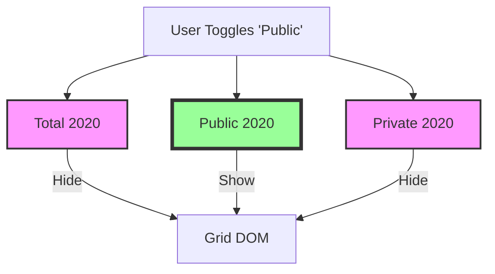
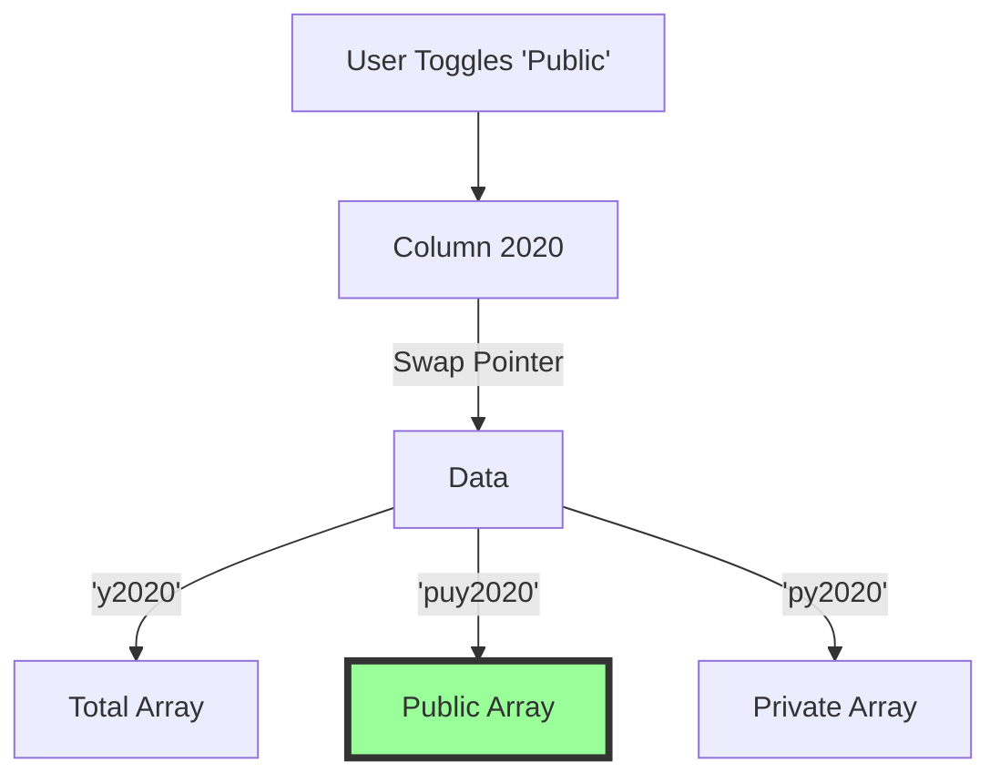
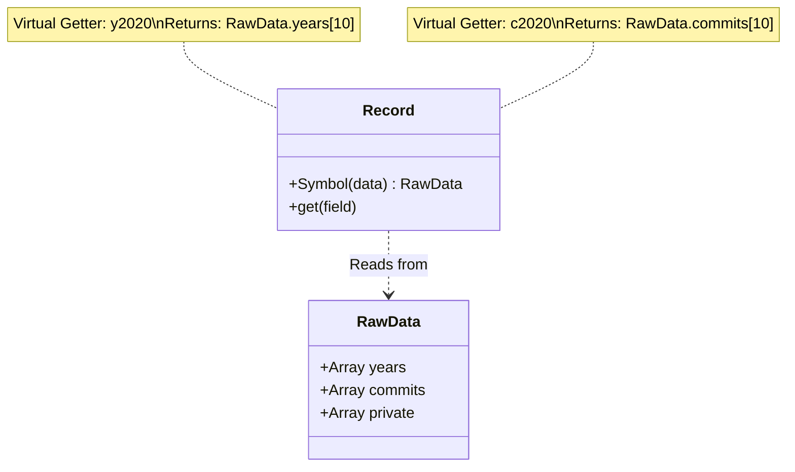

# Dynamic Grids & Virtualization

Neo.mjs Grids are designed for high performance with massive datasets. This is achieved through **Virtualization** (rendering only visible rows and columns) and **Row/Cell Pooling** (recycling DOM nodes).

Advanced applications often need to reconfigure the Grid at runtime, such as swapping data sources or changing column definitions. This guide explains how the Grid handles these dynamic changes efficiently, contrasting "Naive" approaches with the Neo.mjs "Dynamic Binding" pattern.

## The Challenge: Multi-Dimensional Data

Imagine building a dashboard like **DevIndex** that tracks developer activity over 15 years. For each year, you have three metrics:
1.  **Total** Contributions
2.  **Public** Contributions
3.  **Private** Contributions

### The Naive Approach: Column Hiding

The traditional "Industry Standard" approach is to create a column for *every* possible metric (15 years * 3 metrics = 45 columns) and toggle their visibility.



**Why this fails at scale:**
*   **Memory Bloat:** You are instantiating 45 column components, even if only 15 are visible.
*   **VDOM Overhead:** The VDOM engine must diff 45 columns every render, checking `hidden` flags.
*   **State Management:** Syncing the visibility state of 45 columns is complex and error-prone.

### The Neo.mjs Approach: Dynamic Data Binding

Instead of creating 45 columns, Neo.mjs encourages creating just **15 columns** (one for each year) and changing the **data source pointer** (`dataField`) at runtime.



**Why this wins:**
*   **Constant Overhead:** You only pay for the columns the user *sees* (15).
*   **Instant Toggle:** Changing `dataField` is an O(1) operation per column.
*   **Zero DOM Trash:** The column component stays in place. The Row cells stay in place. Only the *text content* updates.

## Implementing Dynamic Binding

You can change the `dataField` of a `Neo.grid.column.Base` instance at runtime.

### How it Works Internally

When you update `column.dataField = 'newField'`:

1.  **State Sync:** The column automatically updates the Grid Body's internal `columnPositions` map. Crucially, it does this **in-place** to preserve the column's spatial order, ensuring virtualization logic remains correct.
2.  **View Refresh:** The Grid triggers a `createViewData` call.
3.  **Row Recycling:** The Grid rows are **not** destroyed. They are recycled. The `Row` component uses the new `dataField` to look up the column configuration and render the correct cell content.

### Code Example

```javascript
// Controller logic
onDataModeChange(mode) {
    const grid = this.getReference('my-grid');
    
    grid.columns.items.forEach(column => {
        // Switch binding based on mode
        if (column.text === 'Revenue') {
            // Determines which field on the Record to read
            column.dataField = mode === 'gross' ? 'grossRevenue' : 'netRevenue';
        }
    });
}
```

## Zero Overhead Records (Virtual Fields)

To support this dynamic binding without bloating memory, Neo.mjs Models support **Virtual Fields**.

If your raw data is stored in compact arrays (e.g. `[2020_val, 2021_val, ...]`), you don't want to copy these values onto the Record instance as `record.y2020`, `record.y2021`, etc. That duplicates memory.

**Virtual Fields** exist only as getters on the prototype. They read directly from the raw data source on-the-fly.



**Configuration:**

```javascript
class Contributor extends Model {
    static config = {
        fields: [{
            name: 'yearsArray', // Raw storage
            type: 'Array'
        }, {
            name     : 'y2020',
            type     : 'Integer',
            virtual  : true, // <--- ZERO STORAGE
            calculate: data => data.yearsArray[10] // O(1) Access
        }]
    }
}
```

## Pooling & Recycling Architecture

Neo.mjs uses a "Fixed-DOM-Order" strategy for both rows and cells. This eliminates `insertNode`, `removeNode`, and `moveNode` operations during scrolling, achieving true O(1) performance.

### Vertical Virtualization (Row Pooling)

1.  **Fixed Pool:** The Grid creates a fixed number of `Row` components (Visible Rows + Buffer).
2.  **Visual Translation:** As you scroll vertically, rows are visually moved using CSS transforms (`translate3d`).
3.  **Content Recycling:** When a row scrolls off the top, it is "teleported" to the bottom. Its `record` and `rowIndex` configs are updated to reflect the new data.

### Horizontal Virtualization (Cell Pooling)

Similar to rows, the Grid only renders cells for the columns currently in the view (plus a small buffer).

1.  **Column Positions:** The Grid Body maintains a `columnPositions` collection that maps dataFields to X-coordinates.
2.  **Cell Recycling:** As you scroll horizontally, cells that go off-screen are reused for new columns coming into view.
3.  **Hide Modes:**
    *   `hideMode: 'removeDom'` (Default): Cells are recycled. The DOM node count per row remains constant (`cellPoolSize`).
    *   `hideMode: 'visibility'`: Cells are hidden (`visibility: hidden`) but kept in DOM. Useful for complex components that shouldn't be detached (e.g., Maps).

### Implications for Cell Components

If you use `Neo.grid.column.Component` (e.g., Sparklines, Buttons):

*   **Instance Reuse:** The component instance inside a cell is **reused** for different records (vertical scroll) AND different columns (horizontal scroll recycle).
*   **Performance:** Avoid heavy initialization logic in `afterSetRecord` if possible. Use `set()` to update lightweight configs.

## Dynamic Stores

You can swap the entire `store` of a Grid at runtime:

```javascript
grid.store = newStoreInstance;
```

*   The Grid will unbind listeners from the old store.
*   It will bind listeners to the new store.
*   It will refresh the view (recycle rows) to show the new data.
*   **Note:** The old store is NOT destroyed automatically. You must manage its lifecycle.
