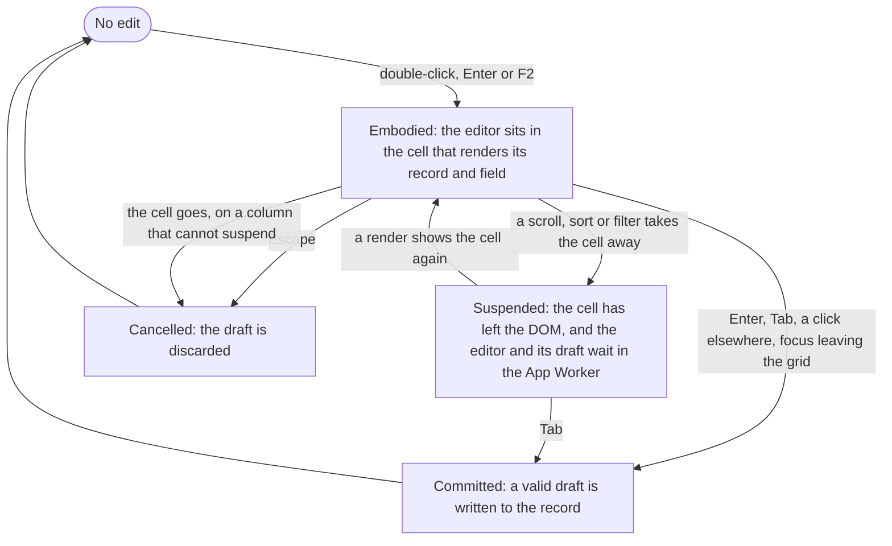

# Neo.mjs Grids

The `Neo.grid.Container` is a powerful and highly performant component for displaying tabular data. It is designed to
handle large datasets with ease, thanks to its virtual rendering engine, which only renders the DOM for the visible
rows and columns.

## Key Features

- **High Performance:** Optimized for handling large amounts of data through virtual rendering.
- **Flexible Data Model:** Integrates seamlessly with `Neo.data.Store` and `Neo.data.Model`.
- **Rich Column Types:** Supports various column types, including component-based columns.
- **Advanced Selection Models:** Offers a variety of selection models for rows, cells, and columns.
- **Sorting and Filtering:** Built-in support for column sorting and data filtering, including header filters.
- **Cell Editing:** Built-in support for editing cell values directly within the grid.
- **Customizable:** Easily extendable and customizable to fit your needs.

## Basic Grid Setup

Creating a grid is straightforward. You need a `Neo.grid.Container`, define your `columns`, and provide a `store`.

```javascript live-preview
import GridContainer from '../grid/Container.mjs';
import Store         from '../data/Store.mjs';
import Viewport      from '../container/Viewport.mjs';

class MainView extends Viewport {
    static config = {
        className: 'MainView',
        layout   : {ntype: 'fit'},
        items    : [{
            module: GridContainer,
            store : { // Inline store configuration
                model: {
                    fields: [
                        {name: 'firstname', type: 'String'},
                        {name: 'lastname',  type: 'String'}
                    ]
                },
                data: [
                    {firstname: 'Tobias', lastname: 'Uhlig'},
                    {firstname: 'Rich',   lastname: 'Waters'}
                ]
            },
            columns: [
                {text: 'Firstname', dataField: 'firstname'},
                {text: 'Lastname',  dataField: 'lastname'}
            ]
        }]
    }
}
MainView = Neo.setupClass(MainView);
```

In this example, we create a simple grid with two columns. The `dataField` in each column configuration maps to a
field in the store's model. You can further customize the grid's behavior and appearance
by providing `body` and `headerToolbarConfig`.

## Integrating with Stores

The `store` config is central to the `Neo.grid.Container`, as it provides the data to be displayed.
You have several flexible ways to define and provide a store:

### 1. Inline Store Configuration (Plain JavaScript Object)

This is the most common approach for simple grids, where the store's model and data are defined directly within the
grid's configuration. The grid automatically creates a `Neo.data.Store` instance from this object.

```javascript readonly
store: {
    model: {
        fields: [
            {name: 'id',   type: 'Number'},
            {name: 'name', type: 'String'}
        ]
    },
    data: [
        {id: 1, name: 'Item 1'},
        {id: 2, name: 'Item 2'}
    ]
}
```

### 2. Store Class Reference

For more complex data handling or reusable store logic, you can define a separate `Neo.data.Store` class and provide a
reference to it. The grid will then instantiate this class.

```javascript readonly
import MyCustomStore from './MyCustomStore.mjs'; // Assuming MyCustomStore extends Neo.data.Store

// ...
store: MyCustomStore
```

### 3. Pre-created Store Instance

If you need to share a single store instance across multiple grids or manage its lifecycle externally, you can create
the store instance beforehand and pass it directly to the grid.

```javascript readonly
import Store from '../data/Store.mjs';

const mySharedStore = Neo.create(Store, {
    model: { /* ... */ },
    data: [ /* ... */ ]
});

// ...
store: mySharedStore
```

Regardless of the method chosen, the grid's `beforeSetStore` hook (as seen in `Neo.grid.Container.mjs`) ensures that the
`store` property always resolves to a valid `Neo.data.Store` instance, providing a consistent and robust API.

### 4. Centralized Store Management with `Neo.state.Provider`

For more complex applications, `Neo.state.Provider` offers a powerful way to manage multiple stores centrally and share
them across various components using the binding system. This approach promotes better organization and reusability of
your data.

First, define your stores within a `Neo.state.Provider`'s `stores` config:

```javascript readonly
import Provider from '../state/Provider.mjs';
import Store    from '../data/Store.mjs';

class AppStateProvider extends Provider {
    static config = {
        className: 'AppStateProvider',
        stores: {
            users: {
                module: Store,
                model : {fields: ['id', 'name']},
                data  : [{id: 1, name: 'Alice'}, {id: 2, name: 'Bob'}]
            },
            products: {
                module: Store,
                model : {fields: ['id', 'item', 'price']},
                data  : [{id: 1, item: 'Laptop', price: 1200}, {id: 2, item: 'Mouse', price: 25}]
            }
        }
    }
}
Neo.setupClass(AppStateProvider);
```

Then, in your `GridContainer` (or any other component), you can bind to these stores using the `bind` config. The
`Neo.state.Provider` will automatically inject the correct store instance.

```javascript live-preview
import GridContainer from '../grid/Container.mjs';
import Provider      from '../state/Provider.mjs';
import Store         from '../data/Store.mjs';
import Viewport      from '../container/Viewport.mjs';

class AppStateProvider extends Provider {
    static config = {
        className: 'AppStateProvider',
        stores: {
            users: {
                module: Store,
                model : { fields: ['id', 'name'] },
                data  : [{id: 1, name: 'Alice'}, {id: 2, name: 'Bob'}]
            }
        }
    }
}
Neo.setupClass(AppStateProvider);

class MainView extends Viewport {
    static config = {
        className: 'MainView',
        layout   : {ntype: 'fit'},
        // Attach the state provider to the viewport
        stateProvider: AppStateProvider,
        items    : [{
            module: GridContainer,
            // Bind the grid's store config to the 'users' store defined in the state provider
            bind: {
                store: 'stores.users'
            },
            columns: [
                {text: 'ID',   dataField: 'id'},
                {text: 'Name', dataField: 'name'}
            ]
        }]
    }
}
MainView = Neo.setupClass(MainView);
```

This pattern is particularly beneficial for:
* **Centralized State:** All application-level stores are defined in one place, making them easy to locate and manage.
* **Reusability:** Stores can be easily shared and reused across different parts of your application without manual
*   instantiation and passing.
* **Decoupling:** Components become more decoupled from direct store instantiation, relying instead on the state provider
  to inject the necessary data.
* **Testability:** Centralized stores can be more easily mocked or swapped for testing purposes.

## Columns

Columns are the building blocks of a grid. You can configure them with various options.

### Column Types

Neo.mjs provides several specialized column types:

- `Neo.grid.column.Base`: The default column type.
- `Neo.grid.column.Index`: Displays the row number.
- `Neo.grid.column.Component`: Renders a Neo.mjs component inside each cell.
- `Neo.grid.column.Currency`: For formatting currency values.
- `Neo.grid.column.AnimatedChange`: Animates cell value changes.
- `Neo.grid.column.AnimatedCurrency`: Animates currency cell value changes.
- `Neo.grid.column.Progress`: Renders a progress bar component.

You can specify the column type using the `type` config:

```javascript readonly
{
    type: 'index',
    text: '#'
}
```

### Custom Rendering

For more complex cell content, you can use a `renderer` function. The renderer receives an object with details
about the cell, record, and store.

```javascript readonly
{
    text    : 'Full Name',
    renderer: data => `${data.record.firstname} ${data.record.lastname}`
}
```

### Nested Record Fields

The grid supports displaying data from nested objects within your records. Simply use a dot-separated path for the
`dataField` config.

Given a record like:
```json
{
  "id": 1,
  "user": {
    "firstname": "John",
    "lastname" : "Doe"
  }
}
```

You can define your columns like this:
```javascript readonly
columns: [
    {text: 'Firstname', dataField: 'user.firstname'},
    {text: 'Lastname',  dataField: 'user.lastname'}
]
```
The `examples/grid/nestedRecordFields` example provides a live demonstration of this feature.

### Header Filters

Grids can include header filters, allowing users to filter data directly from the column headers. To enable this feature,
set the `showHeaderFilters` config to `true` on the `Neo.grid.Container`.

```javascript live-preview
import GridContainer from '../grid/Container.mjs';
import Store         from '../data/Store.mjs';
import Viewport      from '../container/Viewport.mjs';

class MainView extends Viewport {
    static config = {
        className: 'MainView',
        layout   : {ntype: 'fit'},
        items    : [{
            module           : GridContainer,
            showHeaderFilters: true, // Enable header filters
            store            : {
                model: {
                    fields: [
                        {name: 'city',       type: 'String'},
                        {name: 'population', type: 'Number'}
                    ]
                },
                data: [
                    {city: 'New York',    population: 8419000},
                    {city: 'Los Angeles', population: 3980000},
                    {city: 'Chicago',     population: 2716000},
                    {city: 'Houston',     population: 2320000}
                ]
            },
            columns: [
                {text: 'City',       dataField: 'city',       filterable: true},
                {text: 'Population', dataField: 'population', filterable: true}
            ]
        }]
    }
}
MainView = Neo.setupClass(MainView);
```

For a column to be filterable, you must also set its `filterable` config to `true`. The grid automatically provides a
text input filter for string fields and a number input filter for number fields. More complex filter types can be
implemented by extending `Neo.grid.header.Filter`.

## Sorting

Neo.mjs grids provide built-in support for sorting data by one or more columns. Sorting is primarily managed by the
grid's underlying `Neo.data.Store`.

### Enabling Sorting

To enable sorting for a column, ensure the `sortable` config is set to `true` on the `Neo.grid.Container` (which is its
default value). Then, simply click on a column header to sort the data by that column. Clicking again will reverse the
sort direction.

```javascript live-preview
import GridContainer from '../grid/Container.mjs';
import Store         from '../data/Store.mjs';
import Viewport      from '../container/Viewport.mjs';

class MainView extends Viewport {
    static config = {
        className: 'MainView',
        layout   : {ntype: 'fit'},
        items    : [{
            module: GridContainer,
            sortable: true, // Default is true, but explicitly shown here
            store : {
                model: {
                    fields: [
                        {name: 'name', type: 'String'},
                        {name: 'age',  type: 'Number'}
                    ]
                },
                data: [
                    {name: 'Alice',   age: 30},
                    {name: 'Bob',     age: 24},
                    {name: 'Charlie', age: 35},
                    {name: 'David',   age: 28}
                ]
            },
            columns: [
                {text: 'Name', dataField: 'name'},
                {text: 'Age',  dataField: 'age'}
            ]
        }]
    }
}
MainView = Neo.setupClass(MainView);
```

### Initial Sorting

You can define an initial sort order for your store using the `sorters` config.

```javascript readonly
store: {
    model: { /* ... */ },
    data: [ /* ... */ ],
    sorters: [{
        property : 'name',
        direction: 'ASC' // 'ASC' for ascending, 'DESC' for descending
    }]
}
```

### Programmatic Sorting

You can also sort from code, through the grid's store: `sort()` replaces the sorters with one, and assigning `sorters`
replaces them with any number.

```javascript readonly
myGrid.store.sort({property: 'age', direction: 'DESC'});

myGrid.store.sorters = [{
    property : 'name',
    direction: 'DESC'
}];
```

## Filtering

Beyond header filters, you can programmatically filter the grid's data using the `filters` config on the store.
This allows for more complex filtering logic and dynamic updates.

### Applying Filters

To apply filters, set the `filters` config on your store. This config accepts an array of filter objects.

```javascript live-preview
import GridContainer from '../grid/Container.mjs';
import Store         from '../data/Store.mjs';
import Viewport      from '../container/Viewport.mjs';

class MainView extends Viewport {
    static config = {
        className: 'MainView',
        layout   : {ntype: 'fit'},
        items    : [{
            module: GridContainer,
            store : {
                model: {
                    fields: [
                        {name: 'product', type: 'String'},
                        {name: 'price',  type: 'Number'}
                    ]
                },
                data: [
                    {product: 'Laptop', price: 1200},
                    {product: 'Mouse',  price: 25},
                    {product: 'Keyboard', price: 75},
                    {product: 'Monitor', price: 300}
                ],
                filters: [{
                    property: 'price',
                    operator: '>=',
                    value   : 100
                }] // Initial filter: price >= 100
            },
            columns: [
                {text: 'Product', dataField: 'product'},
                {text: 'Price',  dataField: 'price'}
            ]
        }]
    }
}
MainView = Neo.setupClass(MainView);
```

Each filter object typically has:
- `property`: The data field to filter on.
- `operator`: The comparison operator (e.g., `'='`, `'>'`, `'<='`, `'like'`).
- `value`: The value to compare against.

### Clearing Filters

To clear all filters, simply set the `filters` config to `null` or an empty array.

```javascript readonly
myGrid.getStore().filters = null;
// or
myGrid.getStore().filters = [];
```

### Adding Filters Programmatically

You can dynamically add or modify filters by getting the current filters, adding new ones, and then setting the `filters`
config again.

```javascript readonly
const store = myGrid.getStore();
const currentFilters = store.filters ? [...store.filters] : [];

currentFilters.push({
    property: 'product',
    operator: 'like',
    value   : 'o' // Filter products containing 'o'
});

store.filters = currentFilters;
```

## Plugins

Neo.mjs grids support various plugins to extend their functionality. Plugins are typically enabled by setting a
configuration property on the `Neo.grid.Container` or `Neo.grid.Body`. Cell editing is a plugin too, and has a section
of its own below.

### Animated Row Sorting

To animate row sorting, set the `animatedRowSorting` config to `true` on the `Neo.grid.Body` (via `body`).
The current `AnimateRows` plugin is a flat-store row sorting/filtering affordance. Do not use it as a
TreeGrid expand/collapse animation path; TreeGrid structural animation must follow the
[pooled row contract](./PooledGridAnimation.md).

```javascript readonly
const myGrid = Neo.create(GridContainer, {
    body: {
        animatedRowSorting: true
    },
    // ...
});
```

## Selection Models

The grid's selection behavior is controlled by one selection model, owned by the grid's view: configure it through
`viewConfig` (a `RowModel` is the default; `null` selects nothing), and write `grid.view.selectionModel` at runtime.

Available selection models in `Neo.selection.grid`:
- `RowModel`: Selects entire rows.
- `CellModel`: Selects individual cells.
- `ColumnModel`: Selects entire columns.
- And combinations like `CellRowModel`, `CellColumnModel`, `CellColumnRowModel`.

```javascript readonly
import {RowModel} from '../../../src/selection/grid/_export.mjs';

const myGrid = Neo.create(GridContainer, {
    // ...
    viewConfig: {
        selectionModel: RowModel
    }
});
```

## Cell Editing

A grid that renders only what is visible meets a hard question the moment someone types into it. The cell under the
caret does not belong to its record. The body keeps a small pool of rows, and each row a pool of cell slots, so the
node you are typing into goes to another record as soon as the grid scrolls. There are three obvious answers for the
draft inside it, and each one fails someone. Writing it saves a half-typed value for the user who only scrolled to look
something up. Throwing it away loses what they typed. Keeping the row alive stops pooling it, and the grid no longer
scales.

The grid takes none of them. An edit is a session in the App Worker, keyed by what does not move: the record's id and
the column's `dataField`. Its editor is an ordinary form field, and the grid only *embodies* it, in whichever cell
renders that record and field at the moment. When pooling takes that cell away, the session waits, suspended, with its
draft, and the next render that shows the cell embodies the editor again. Scrolling never commits an edit, and never
cancels one.



The `examples/grid/cellEditing` example is a fuller version of the preview below. It adds a country picker, a choice of
selection models, and a checkbox that turns editing off and on.

### Turning It On

Set `cellEditing: true` on the `Neo.grid.Container`, and mark the columns it may edit with `editable`. A column's
`editor` is the config its field is created from. Without one, a cell edits with a `Neo.form.field.Text`.

```javascript live-preview
import CellModel     from '../selection/grid/CellModel.mjs';
import DateField     from '../form/field/Date.mjs';
import GridContainer from '../grid/Container.mjs';
import NumberField   from '../form/field/Number.mjs';
import Viewport      from '../container/Viewport.mjs';

class MainView extends Viewport {
    static config = {
        className: 'MainView',
        layout   : {ntype: 'fit'},
        items    : [{
            module        : GridContainer,
            cellEditing   : true,
            columnDefaults: {editable: true},

            // Enter and F2 edit the selected cell, so keyboard editing needs a model that selects cells
            viewConfig: {selectionModel: CellModel},

            store: {
                keyProperty: 'githubId',
                model: {
                    fields: [
                        {name: 'firstname',    type: 'String'},
                        {name: 'githubId',     type: 'String'},
                        {name: 'randomDate',   type: 'Date'},
                        {name: 'randomNumber', type: 'Int'}
                    ]
                },
                data: [
                    {firstname: 'Tobias', githubId: 'tobiu',      randomDate: '2024-12-20', randomNumber: 100},
                    {firstname: 'Rich',   githubId: 'rwaters',    randomDate: '2024-12-18', randomNumber: 90},
                    {firstname: 'Nils',   githubId: 'mrsunshine', randomDate: '2024-12-19', randomNumber: 70}
                ]
            },

            columns: [{
                dataField: 'firstname',
                text     : 'Firstname'
            }, {
                dataField: 'randomNumber',
                text     : 'Number (step 5)',
                editor   : {module: NumberField, maxValue: 100, minValue: 0, stepSize: 5}
            }, {
                dataField: 'randomDate',
                renderer : ({value}) => new Intl.DateTimeFormat('default').format(value),
                text     : 'Random Date',
                editor   : {module: DateField, clearable: false, maxValue: '2024-12-20', minValue: '2024-12-10'}
            }, {
                dataField: 'githubId',
                editable : false,
                text     : 'Github Id'
            }]
        }]
    }
}
MainView = Neo.setupClass(MainView);
```

`editable` is reactive. Turning it off on a column while one of its cells is being edited cancels that edit.

### Starting an Edit

- A double-click on an editable cell edits it.
- Enter or F2 edits the selected cell. With a selected row and no selected cell — under `RowModel`, the default —
  they edit that row: in the column of the grid's last edit, or the row's first editable column, scrolled into sight
  when it is out of it. With neither a cell nor a row selected, the keyboard starts nothing.
- Space starts nothing. A column that is not editable refuses the double-click, Enter and F2 alike.
- The editor opens with its whole value selected, so typing replaces the value instead of appending to it.
- One editor exists at a time. Activating another cell commits the current draft first.

Inside the editor, the keys and the pointer belong to the field: the navigation keys never scroll the grid, and a drag
selects text instead of drag-scrolling it.

### Ending an Edit

| Gesture | What happens |
|---|---|
| Enter | Commits the draft. Focus returns to the grid, and a model that selects cells keeps the edited cell selected, so the arrow keys go on from there. |
| Escape | Discards the draft. Focus returns to the grid. |
| Tab, Shift+Tab | Commits, and edits the next or previous editable cell: across locked columns, past columns that cannot be edited, and on into the next or previous record. Past the last editable cell, or before the first, the edit ends with focus on the grid. |
| A click on another cell | Commits, and selects that cell. |
| Focus leaving the grid | Commits. |

A model that selects rows keeps the edited record's row selected for as long as the edit lasts, and moves it along as
Tab walks into another record. However the edit ends, the arrow keys go on from that row, and Enter edits it again.

A commit writes a valid draft to its record. An invalid draft keeps its editor: Enter, Tab, a click on another cell and
focus leaving the grid all leave the edit open and write nothing. While no edit is open, Tab is the browser's own.

A field with a picker, like the example's `DateField`, keeps the picker inside the edit. Its trigger opens the picker,
and so does Alt+ArrowDown, the key the WAI-ARIA date-picker pattern names; plain ArrowDown stays the date input's own.
Focus moving into the picker does not end the edit, and a day picked there becomes the draft. Escape closes an open
picker first, and the next Escape cancels the edit. Enter commits, as in any other editor, and opens no picker: in a
grid, Enter belongs to the edit, so the grid gives its editors `showPickerOnEnter: false`.

### What Scrolling Does to an Edit

Pooling takes a cell out of the DOM in two ways: a vertical scroll hands its row to another record, and a horizontal
scroll moves its column out of the mounted window. For an open edit the two are the same event:

- A scroll that keeps the cell rendered keeps the editor, and its focus.
- A scroll that takes the cell away suspends the edit. The editor and its draft wait in the App Worker.
- The render that shows the cell again embodies the editor, with the draft as it was.

The store moves records too, and the edit follows the same rules. A sort or filter that takes the edited record out of
the pool and back suspends the edit and restores it. An update to another field of the edited record repaints its cell
and leaves the editor, the draft and focus alone. An update to the edited field itself keeps the draft, and Enter
writes the draft over the new value. Removing the record removes the editor with it.

Locking or unlocking a column moves it to another body. The editor stays out of every cell until the bodies have
swapped their columns, then returns with its draft.

A suspended edit still answers Tab and Shift+Tab: they commit it and edit the next or previous cell. When the draft is
invalid, its cell is scrolled back into sight and its editor takes focus, so the user sees why nothing moved on.

An IME composition in flight when its row leaves the pool survives as the draft. The composed text reaches the field
as it is typed, so there is nothing that only the DOM holds.

### Editors That Cannot Be Suspended

Suspension relies on the editor keeping its state in the App Worker, and the engine's form fields do: the draft is the
field's value. An editor that keeps state only in its DOM cannot be suspended. Give its column
`cancelEditOnProjectionLoss: true`: when pooling takes the cell away, the edit is cancelled instead, its draft
discarded, and the grid announces it. A lock change that moves such a column to another body cancels its edit too.

An edit that starts on a cell that is not rendered yet is different. Tab to a cell out of sight scrolls it into sight
and starts its edit before the cell renders, and the cell's first render embodies it: an edit that was never embodied
has no embodiment to lose.

### Listening for Cancelled Edits

No cancel is silent: the grid fires `cellEditCancel` with `{dataField, reason, record}` for every edit it cancels. A
commit fires nothing.

| `reason` | The edit was cancelled because |
|---|---|
| `escape` | Escape was pressed. |
| `notEditable` | the column's `editable` was turned off. |
| `disabled` | the plugin's `disabled` was turned on. |
| `destroy` | the plugin was destroyed while its grid lives on. |
| `projectionLoss` | pooling took away the cell of a column that cannot be suspended. |
| `api` | code called the plugin's `cancelEdit()` without a reason. |

```javascript readonly
const myGrid = Neo.create(GridContainer, {
    cellEditing: true,

    listeners: {
        cellEditCancel({dataField, reason, record}) {
            console.log(`The ${dataField} edit ended without a write: ${reason}`)
        }
    }
    // ...
});
```

### Turning Editing Off

The plugin's `disabled` config cancels an open edit and ignores every activation until it is turned off again. This
is what the example's "Disable CellEditing" checkbox does:

```javascript readonly
myGrid.getPlugin('grid-cell-editing').disabled = true;
```

### Accessibility

While a grid edits, the cells of its columns that cannot be edited carry `aria-readonly="true"`, and the editable ones
carry nothing. The marks follow the configuration: a column turned non-editable at runtime is read-only in every
rendered row, and a disabled or destroyed plugin leaves no cell read-only.

## Performance and Big Data

The grid is designed for exceptional performance, especially when dealing with large datasets. Its virtual rendering
engine ensures that only the visible parts of the grid (rows and columns) are rendered in the DOM, significantly
reducing memory consumption and improving rendering speed.

### Optimizing Virtual Rendering

You can fine-tune the virtual rendering behavior with the `bufferRowRange` and `bufferColumnRange` configs in the
`body`. These settings define how many extra rows and columns to render outside the visible area to provide a
smoother scrolling experience.

```javascript readonly
const myGrid = Neo.create(GridContainer, {
    body: {
        bufferRowRange   : 5, // Render 5 extra rows above and below the visible area
        bufferColumnRange: 2  // Render 2 extra columns to the left and right of the visible area
    },
    // ...
});
```

### Row Height

The `rowHeight` config on the `Neo.grid.Container` plays a crucial role in the grid's rendering calculations. Ensuring
an accurate `rowHeight` is essential for the virtual rendering engine to correctly determine the number of visible rows
and the scrollable area. While the default value of `32px` is often suitable, you should adjust it if your grid rows
have a different fixed height.

The `examples/grid/bigData` example showcases the grid's performance with a large dataset, allowing you to
dynamically adjust the number of rows and columns.
