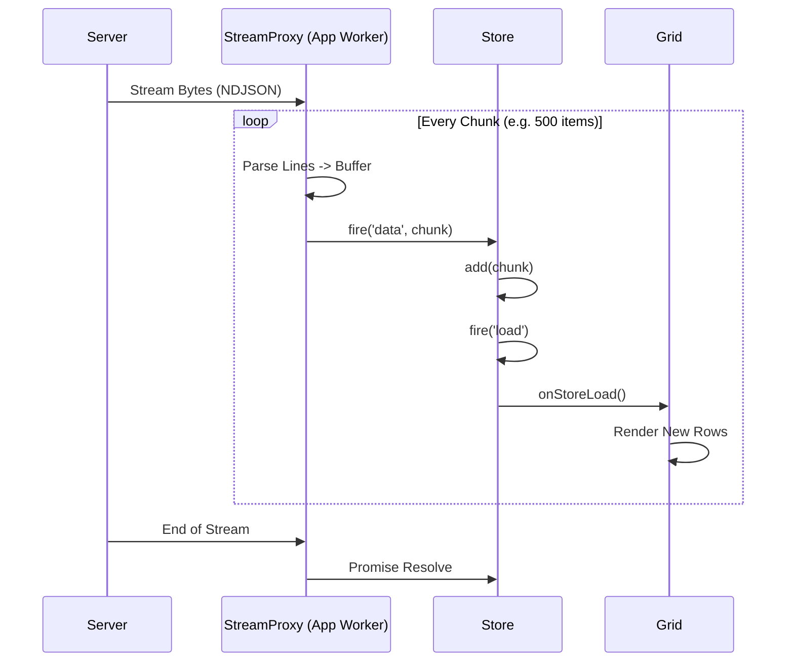

# Streaming Data & Progressive Rendering

## The Problem: Data at Scale

In traditional Single Page Applications (SPAs), loading a large dataset (e.g., 10,000+ rows) usually involves a "Loading Spinner of Death." The application fetches a massive JSON file, waits for the *entire* download to finish, parses the *entire* string into an object, and then attempts to render it.

This approach has three critical bottlenecks:
1.  **Time-to-First-Render (TTFR):** The user sees nothing until 100% of the data is downloaded and processed.
2.  **Memory Spikes:** Parsing a 10MB JSON string requires loading the entire string *and* the resulting object graph into memory simultaneously, often causing GC pauses.
3.  **UI Blocking:** Processing 10,000 records in one synchronous loop can freeze the main thread (or the Worker thread in Neo.mjs), making the UI unresponsive.

## The Solution: Streaming & Chunking

Neo.mjs introduces a **Streaming Data Architecture** that solves these problems by treating data as a *stream* rather than a *file*.

1.  **Stream:** We use the modern `fetch` API with `ReadableStream` to process bytes as they arrive from the network.
2.  **NDJSON (JSONL):** We use **Newline Delimited JSON** format. Instead of one giant array `[{...}, {...}]`, the server sends one JSON object per line.
3.  **Chunking:** The proxy buffers incoming records into manageable chunks (e.g., 500 items).
4.  **Progressive Rendering:** The Store ingests these chunks immediately and the Grid renders them *while the rest of the data is still downloading*.

### The Flow



## Implementation

To enable streaming, you simply configure your Store to use the `Neo.data.proxy.Stream` module and point it to a `.jsonl` resource.

### 1. The Store Configuration

```javascript
import Store       from '../../src/data/Store.mjs';
import StreamProxy from '../../src/data/proxy/Stream.mjs';

const myStore = Neo.create(Store, {
    model: MyModel,
    // Use the proxy config instead of 'url'
    proxy: {
        module   : StreamProxy,
        url      : '../resources/data.jsonl',
        chunkSize: 500 // Optional: Adjust batch size (default: 500)
    }
});

myStore.load();
```

### 2. The Data Format (JSONL)

Your data **MUST** be in Newline Delimited JSON format. This means each line is a valid, standalone JSON object.

**Correct (.jsonl):**
```json
{"id": 1, "name": "Item 1", "value": 100}
{"id": 2, "name": "Item 2", "value": 200}
{"id": 3, "name": "Item 3", "value": 300}
```

**Incorrect (Standard JSON):**
```json
[
    {"id": 1, "name": "Item 1", "value": 100},
    {"id": 2, "name": "Item 2", "value": 200}
]
```

## Progressive Loading & "Turbo Mode"

Streaming pairs perfectly with the Store's **"Turbo Mode"** (`autoInitRecords: false`).

When loading 50,000 records:
1.  **Turbo Mode:** The Store skips instantiating heavyweight `Neo.data.Model` classes for every row. It stores raw data objects.
2.  **Streaming:** The Store receives 500 raw objects at a time.
3.  **Grid:** The Grid renders the first 500 rows immediately (milliseconds).
4.  **Background:** The remaining 49,500 rows stream in the background. The scrollbar handle shrinks as the total count grows, but the UI remains interactive.

## Performance Impact

Benchmarks (10k Records, Local Network):

| Metric | Standard JSON | Streaming JSONL | Improvement |
| :--- | :--- | :--- | :--- |
| **Time to First Render** | ~450ms | **~40ms** | **10x Faster** |
| **App Worker Block** | High (200ms+ freeze) | **Zero (Chunked)** | **Responsive UI** |
| **Memory Peak** | 2x File Size | **O(ChunkSize)** | **Constant** |

> **Note:** In Neo.mjs, the **Main Thread** (which handles DOM painting) is *never* blocked by data processing, regardless of the method used. However, blocking the **App Worker** (with a massive `JSON.parse`) freezes all application logic, making the UI feel unresponsive to clicks or interactions. Streaming solves this by processing data in micro-tasks, keeping the App Worker alive and responsive.

1.  **Chunk Size:** Keep `chunkSize` between 100 and 1000.
    -   Too small (e.g., 1): Too many events/updates. Overhead kills performance.
    -   Too large (e.g., 5000): Delays the first render.
2.  **Sorting:** Streaming assumes the server sends data in the order you want to display it (usually). If you need client-side sorting, the Store will resort the *entire* dataset every time a chunk arrives (if `autoSort` is true), which is expensive.
    -   **Recommendation:** Pre-sort your JSONL file on the server/build-step. Disable `autoSort` on the Store during load.
3.  **Filtering:** Similar to sorting, filtering happens on the full dataset.
    -   **Recommendation:** Use `Neo.data.Store`'s `remoteFilter` if possible, or accept that filtering will update as data streams in.
