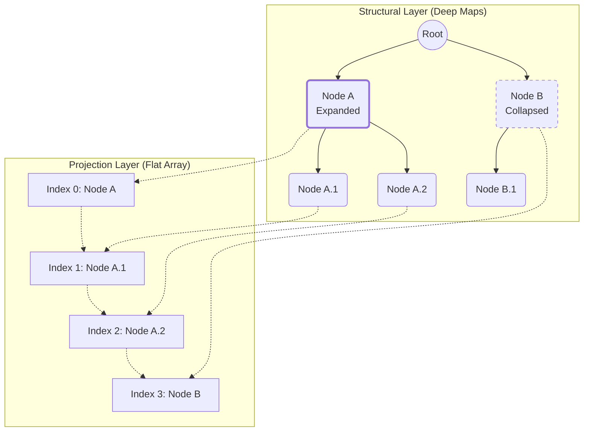
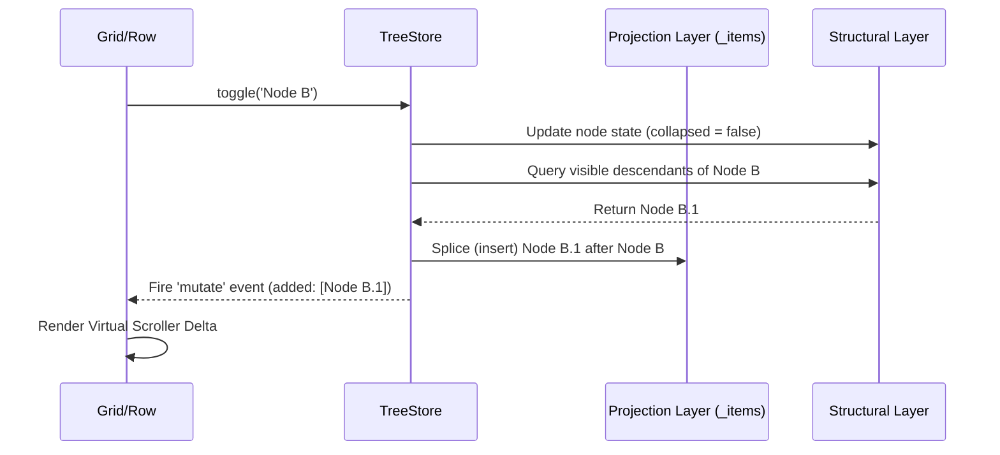
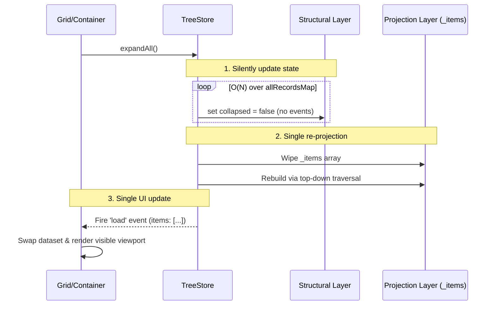

# TreeStore and Hierarchical Data

> **"The fastest garbage collector is the one that never runs."**

Neo.mjs provides high-performance support for hierarchical data through the `Neo.data.TreeStore` and `Neo.data.TreeModel` classes. This architecture was forged against a flagship application, explicitly designed to render massive TreeGrids (e.g., 50,000+ live-updating records) while maintaining absolute, unyielding O(1) rendering performance.

To understand why `TreeStore` is engineered this way, we must examine why traditional industry solutions fail at this scale.

## The Problem: Deep Data vs. Flat UI

Traditional UI grids (even enterprise leaders like AG Grid or Bryntum) often struggle when bridging the gap between deep, nested tree data and the flat arrays required by high-performance virtual scrollers. When frameworks try to map a tree to a grid, they usually fall into one of three traps:

1.  **The Monolithic Render (No Virtualization):** Render the entire tree into the DOM at once. This works for 100 rows, becomes sluggish at a few thousand, and crashes the browser tab or runs out of memory at 50,000+ rows (especially when each row contains complex components).
2.  **The Recursive Scroller (CPU Bound):** The scroller recursively calculates visible rows on every single scroll event. This causes severe scroll-jank (dropped frames) because the main thread or worker is burning cycles calculating tree depths instead of just rendering the delta.
3.  **The Flat Array Mirror (Memory Bound):** The engine converts the tree into a flat array of wrappers (`[{node: A, depth: 0}, {node: A.1, depth: 1}]`). This approach is better for rendering, but when dealing with 50,000+ records, keeping two copies of the tree in memory (the raw data and the massive wrapper array) causes severe memory bloat. Every time a node expands, collapses, or updates, it triggers massive array allocations and massive V8 Garbage Collection (GC) pauses.

Furthermore, if the grid allows dynamic updates (live data feeds), constantly recalculating these arrays or tearing down DOM nodes destroys performance and severes long-running connections (like `OffscreenCanvas` contexts).

## The Neo.mjs Solution: The "Hierarchical Rows" Pattern

The `Neo.data.TreeStore` solves this by acting as a highly optimized architectural bridge. It absorbs the complexity of the hierarchy and exposes a simple, flat array of **only the currently visible nodes** to the grid.

The complexity is managed entirely by the data layer, allowing UI components like `Neo.grid.Container` to render TreeGrids without knowing they are rendering a tree.

> **`TreeStore` is not grid-only.** The Projection Layer is what a virtual scroller needs, so the grid is the most demanding consumer — but it is not the only shape. Components that render **one level at a time** — a cascading menu, a breadcrumb, a column browser — never touch the projection at all. They read the Structural Layer through `getChildren()` and let the hierarchy stay collapsed while they render it. `Neo.menu.List` works this way. If your consumer renders a level rather than a scrollable flat list, read the [Reading one level](#reading-one-level) section below rather than the projection semantics above.

### The RecordFactory: Bypassing the ORM Memory Trap

Before discussing how the TreeStore manages state, we must address the fundamental problem of data instantiation at scale.

In traditional enterprise frameworks (like ExtJS or Bryntum), the default approach is a heavy Object-Relational Mapping (ORM) pattern. When you load 50,000 records into their Stores, the framework loops through the raw JSON and instantiates 50,000 heavy `Model` class instances. Furthermore, each field within that record might be its own custom instance. This "Heavy OOP" approach creates massive memory overhead, guarantees crippling Garbage Collection pauses, and makes 60fps scrolling impossible.

Neo.mjs shatters this paradigm via the `Neo.data.RecordFactory`:

1.  **A Single Source of Truth:** A `Store` (including `TreeStore`) instantiates exactly **ONE** `Neo.data.Model` (e.g., `TreeModel`). This single instance acts as the configuration schema and rule-engine for the entire dataset.
2.  **Zero-Overhead Prototypes:** The `RecordFactory` reads this single Model and dynamically generates a lightweight `Record` class on the fly. It attaches getter and setter functions directly to the prototype of this generated class.
3.  **Raw Data Encapsulation:** When a record is instantiated, the raw JSON object is stored internally via a unique `Symbol` (`this[dataSymbol]`).
4.  **O(1) Property Access:** When you call `record.name`, the prototype getter simply retrieves `this[dataSymbol].name` directly from the raw JSON.

The result? Even if you fully instantiate 50,000 records, you are only storing 50,000 extremely lightweight shells around the original raw JSON. You are not duplicating 50,000 heavy Model instances. This translates to radically lower memory pressure and perfectly smooth 60fps rendering because the Garbage Collector never has to panic.

*(Note: For absolute peak performance, `TreeStore` also supports "Turbo Mode", which bypasses even these lightweight shells entirely. See the "Advanced Features" section below).*

### The Dual-Layer Architecture

Unlike a standard `Store` which manages a single flat array, `TreeStore` maintains two distinct states:

#### 1. The Structural Layer
The Structural Layer consists of deep, hierarchical native `Map` objects (`#childrenMap`, `#allRecordsMap`). These maps hold the complete tree structure and all data nodes (both visible and hidden) in O(1) accessible memory.
- **Zero Duplication:** It intentionally avoids using a secondary `Neo.collection.Base` for `#allRecordsMap` to prevent memory bloat and "flat array" impedance mismatches. It holds the raw records exactly once.

#### 2. The Projection Layer
The Projection Layer is the inherited `_items` array. This is a dynamically updated, flattened array containing *only* the currently expanded (visible) nodes. UI components bind directly to this array.


```mermaid
graph TD
    subgraph "Structural Layer (Deep Maps)"
    Root((Root)) --> A(Node A <br/> Expanded)
    Root --> B(Node B <br/> Collapsed)
    A --> A1(Node A.1)
    A --> A2(Node A.2)
    B --> B1(Node B.1)

    classDef collapsed stroke-dasharray: 5 5;
    classDef expanded stroke-width:3px;

    class A expanded;
    class B collapsed;
    end

    subgraph "Projection Layer (Flat Array)"
    F1[Index 0: Node A]
    F2[Index 1: Node A.1]
    F3[Index 2: Node A.2]
    F4[Index 3: Node B]

    F1 -.-> F2
    F2 -.-> F3
    F3 -.-> F4
    end

    A -.-> F1
    A1 -.-> F2
    A2 -.-> F3
    B -.-> F4

    %% B1 is hidden because B is collapsed
```

When a user clicks to expand "Node B", the `TreeStore` retrieves "Node B.1" from the Structural Layer and mathematically splices it into the Projection Layer right after "Node B". The Grid sees a simple array insertion and renders the delta instantly.

## TreeModel: The Hierarchical Blueprint

To power this architecture, the data must adhere to a specific schema. `Neo.data.TreeModel` extends the standard `Model` to provide the requisite fields:

- **`parentId`**: The foreign key linking a node to its parent. Root nodes have a `parentId` of `'root'` (or `null`).
- **`isLeaf`**: A boolean indicating if the node can have children.
- **`collapsed`**: A boolean indicating the visual expansion state of the node.
- **`depth`**: An integer tracking the nesting level (0 for roots, 1 for their children, etc.). Used by the `Tree` column to calculate CSS indentation.
- **`childCount`**: The total number of immediate children a node possesses.

### Accessibility (WAI-ARIA): Write-Time Penalty for Read-Time Supremacy

The `TreeModel` also includes explicit fields for accessibility:
- **`siblingCount`**
- **`siblingIndex`**

**Why is this critical?** Screen readers rely on WAI-ARIA attributes (`aria-level`, `aria-posinset`, `aria-setsize`, `aria-expanded`) to navigate complex grids. The user needs to know "I am on child 2 of 5 at level 3".

*Architectural Note:* In many frameworks, these positional values are calculated dynamically via getters or during the view's render loop. **This is a fatal flaw for performance at scale.**

In Neo.mjs, `siblingCount` and `siblingIndex` are maintained directly on the record. While this requires O(N) operations during data mutations (when adding or removing a node, we must iterate and update the stats of all its siblings in the Structural Layer), it guarantees **O(1) read performance in the `grid.Row` hot-path rendering loop.**

Since virtual scrolling occurs at 60-120fps and mutations are comparatively rare, this explicit architectural trade-off ensures the UI never stutters while calculating accessibility attributes. Every row in the Neo.mjs TreeGrid is fully accessible without sacrificing a single frame of performance.

## Working with the TreeStore

### Reading one level

`items` is the **Projection Layer** — the currently *visible* nodes. Since `collapsed` defaults to `true`,
searching it for a parent key returns nothing for an unexpanded branch:

```javascript readonly
// Wrong for a collapsed branch: the projection cannot see its children.
treeStore.find('parentId', 'node-a'); // => []

// Right: reads the Structural Layer. O(1) to find the child array, O(k) to hydrate its k entries.
treeStore.getChildren('node-a');      // => [record, record, …]

// Root level. 'root' is the default, so the argument is optional.
treeStore.getChildren();
```

`getChildren()` returns a **new array of hydrated records**, so Turbo Mode (`autoInitRecords: false`)
callers get real records rather than the raw objects held internally, and mutating the returned array
cannot corrupt the store. It returns `[]` for a leaf or an unknown key.

**Expansion and filtering do not affect it; sorting does.** Visibility is a property of the Projection
Layer, so a collapsed or filtered-out branch still returns its children. Order is not: `doSort()`
reorders the child arrays in the Structural Layer itself, so returned siblings follow the store's
current sort. That is deliberate — it lets a level-at-a-time consumer inherit ordering from the tree
instead of implementing its own.

This holds for an incremental insertion too, including one confined to a collapsed branch: a mutation
with no visible delta re-applies the active sorters to the levels it touched, so a hidden child does
not sit in arrival order waiting for an expansion to fix it. The condition is the store's own —
`autoSort` **and** configured sorters, the same predicate `Collection.Base` guards every sort with.
A store that sets `autoSort: false` keeps declaration order everywhere, hidden and visible alike.

Reach for `collectAllDescendants()` instead when you want an entire subtree; `getChildren()` is
deliberately one level deep. And note that reading children this way **does not expand anything** —
expansion is a view-state concern, and a level-at-a-time consumer should never mutate it just to render.

### Building a tree from paths

Plugin and module architectures address hierarchy by **path**, not by parent key. A contributor
declares where it belongs — `'View/Tools/Inspect'` — without knowing which siblings exist, or which
of them already created the intermediate groups. `materializePath()` is the entry point for that
shape:

```javascript readonly
// Creates 'View', 'View/Tools' and the leaf, correctly parented, in one mutation.
treeStore.materializePath('View/Tools/Inspect', {iconCls: 'fa fa-search'});

// A second contributor under the same prefix. 'View' and 'View/Tools' already exist,
// so only the new leaf is added — they converge on ONE group, in either order.
treeStore.materializePath('View/Tools/Highlight');

// Re-declaring a path is a no-op that still returns the leaf, so callers need no
// "does this exist yet" branch of their own.
const leaf = treeStore.materializePath('View/Tools/Inspect');
```

**Node ids are the path itself**, so `'A/B/C'` creates the ids `'A'`, `'A/B'` and `'A/B/C'`. Identity
is therefore a deterministic function of the prefix: whoever materializes a prefix first, every later
contributor resolves to that same node. Ids drawn from insertion counters would let two contributors
racing the same prefix produce two groups, which is exactly the defect this method removes. A key
supplied in the payload does not override this — the path always wins.

**Order is handled for you, and it matters.** `splice()` resolves `depth` from the parent record and
re-parents a node whose parent it cannot find to `'root'` — silently, and without re-adopting it when
the parent arrives later. Adding path-derived records by hand is therefore only safe ancestors-first:

```javascript readonly
// Wrong: 'A' does not exist yet when its child is ingested, so the child is
// detached to the root and stays there even after 'A' arrives.
treeStore.add([
    {id: 'A/B', parentId: 'A',    name: 'B'},
    {id: 'A',   parentId: 'root', name: 'A', isLeaf: false}
]);
```

`materializePath()` emits ancestors before descendants in a single call, which is what makes that path
unreachable.

The **Structural Layer keeps ownership of the derived invariants**: `depth`, `childCount`,
`siblingIndex` and `siblingCount` are calculated on ingestion, never written by the materializer. An
incremental contribution therefore maintains the same ARIA state as a bulk load, and fires the store's
normal `mutate` event instead of rebuilding.

A segment may contain the separator when escaped, so `'a\\/b/c'` is the two-level path `a/b` → `c`.
Change the grammar per store with `pathNormalizer: {separator: '.'}`. An ambiguous path — leading,
trailing or doubled separator — throws rather than resolving to a guess.

Two things it deliberately does not do. It does not **merge** into a node that already exists: an
ancestor synthesized on demand keeps the fields it was created with, and a later explicit declaration
of that same path resolves to it rather than updating it. And it does not **reconcile deletions** —
removing a leaf leaves its now-empty ancestors in place, because whether an empty group should
disappear is a consumer policy rather than a store invariant.

The transform itself lives in `Neo.data.normalizer.Path`, the sibling of `Neo.data.normalizer.Tree`:
same category of reshaping, different input encoding. Use the normalizer directly through a
`Neo.data.Pipeline` when path-addressed data arrives from a remote source in bulk.

### Adding a node that already exists

`add()` resolves nodes by key, not by object identity. A record whose key is already in the store
**replaces** the node in its parent's child array rather than joining it there, so re-reading the same
config, fixture or API response is idempotent and needs no "does this exist yet" branch of its own:

```javascript readonly
treeStore.add({id: 'Group', parentId: 'root', name: 'Group', isLeaf: false});
treeStore.add({id: 'Group', parentId: 'root', name: 'Group', isLeaf: false});

treeStore.getChildren('root');       // one entry — the second add replaced the first
treeStore.get('Group').siblingCount; // 1
```

Both halves of the Structural Layer end up on the same record, so what `getChildren()` returns is what
`get()` returns, and the derived ARIA fields describe the level that actually exists. What this is not
is a **merge**: the node is replaced by the payload you pass, so a field you omit is re-derived from
the defaults rather than inherited from the node it replaced.

An auto-healed node — one whose declared parent was absent, re-parented to `'root'` as described above
— carries `depth: 0`. The depth resolved against the missing parent describes a level the node does
not end up on.

### Expanding and Collapsing

The primary way users interact with a TreeStore is by toggling node visibility.

```javascript readonly
// Expand a node
treeStore.expand('node-a');

// Collapse a node
treeStore.collapse('node-a');

// Toggle the current state
treeStore.toggle('node-b');
```

When you call `expand()` or `collapse()`, the `TreeStore` calculates the exact number of visible descendants and splices them into/out of the flat `_items` array. This triggers a targeted `mutate` event, prompting the virtual scroller to update only the affected rows.


```mermaid
sequenceDiagram
    participant UI as Grid/Row
    participant Store as TreeStore
    participant Proj as Projection Layer (_items)
    participant Struct as Structural Layer

    UI->>Store: toggle('Node B')
    Store->>Struct: Update node state (collapsed = false)
    Store->>Struct: Query visible descendants of Node B
    Struct-->>Store: Return Node B.1
    Store->>Proj: Splice (insert) Node B.1 after Node B
    Store-->>UI: Fire 'mutate' event (added: [Node B.1])
    UI->>UI: Render Virtual Scroller Delta
```

#### Bulk Operations (`expandAll` / `collapseAll`)

If you want to expand or collapse the entire 50,000-row tree at once, firing 50,000 individual `splice` and `mutate` events would instantly freeze the browser.

To solve this, `TreeStore` provides highly optimized bulk methods:

```javascript readonly
// Bulk operations
treeStore.expandAll();
treeStore.collapseAll();
```

Instead of performing individual mutations, these methods:
1. **Silently Iterate:** They iterate through the entire Structural Layer, silently setting `collapsed = false` (or `true`) on all non-leaf nodes without firing any change events.
2. **Re-Project:** They completely wipe the flat `_items` array and perform a single, top-down recursive traversal to rebuild the entire Projection Layer in one pass.
3. **Single Render:** They fire a single `load` event. The UI simply swaps out the old data array for the new one and performs a single DOM update for the currently visible viewport.

This turns a potentially O(N^2) catastrophe of cascading splices into a clean, O(N) single-pass operation that executes in milliseconds.


```mermaid
sequenceDiagram
    participant UI as Grid/Container
    participant Store as TreeStore
    participant Struct as Structural Layer
    participant Proj as Projection Layer (_items)

    UI->>Store: expandAll()
    Note over Store, Struct: 1. Silently update state
    loop O(N) over allRecordsMap
        Store->>Struct: set collapsed = false (no events)
    end

    Note over Store, Proj: 2. Single re-projection
    Store->>Proj: Wipe _items array
    Store->>Proj: Rebuild via top-down traversal

    Note over Store, UI: 3. Single UI update
    Store-->>UI: Fire 'load' event (items: [...])
    UI->>UI: Swap dataset & render visible viewport
```

### Advanced Features & Extreme Performance

#### "Turbo Mode" (Soft Hydration)
To achieve extreme performance and minimal memory footprint, `TreeStore` fully supports "Turbo Mode" via the `autoInitRecords: false` config.

Instead of instantiating heavy `Record` class instances for every node (which could be tens of thousands and crush the V8 Garbage Collector), it uses raw JavaScript objects (POJOs). Lightweight Records are only created on-demand when accessed via `get()`. This provides massive memory savings.

But what happens when you filter by a calculated field that doesn't exist on the raw JSON? We use **Soft Hydration**. When filtering or sorting, the Store dynamically calculates only the required fields on the raw objects and auto-caches them, bypassing full record instantiation until a row actually enters the visible viewport.

#### Ancestor-Aware Filtering
Unlike a flat data store where filtering simply hides non-matching rows, a TreeGrid must preserve the hierarchical context. If you search for a deeply nested file, hiding its parent folders would break the tree.

`TreeStore` overrides the default filtering logic:
1. It evaluates every node recursively.
2. If a descendant matches the filter, all of its ancestors are forced to be kept and automatically expanded (`collapsed = false`), even if the ancestors fail the filter test.
3. If an ancestor explicitly matches the filter, all of its descendants are kept visible.

#### Hierarchical Sorting
Similarly, a standard flat sort would destroy parent-child relationships (e.g., an alphabetical sort would mix all parents and children globally). `TreeStore` applies active Sorters individually to each parent's array of children within the Structural Layer, then re-projects the flat array to maintain a contiguous visual hierarchy.

## The Technical Reality: Why This Matters

The `TreeStore` and its underlying `RecordFactory` are not just theoretical exercises; they are the foundation that makes the impossible possible in the browser.

By aggressively separating the data layer (the O(1) Structural maps) from the rendering layer (the flat Projection array), and by fundamentally bypassing the "Heavy OOP" trap with Zero-Overhead Prototypes, Neo.mjs allows you to hold 50,000 live, updating, hierarchical records in memory without crashing the V8 engine.

When you integrate this data architecture with the `Neo.grid.Container` and the `Neo.grid.column.Tree`, the result is a masterclass in extreme performance. The Grid applies strict, zero-mutation CSS `translate3d` to recycle a small pool of DOM nodes, while the multi-threaded architecture (App Worker for state, VDOM Worker for diffs, Canvas Worker for inline charts) ensures the Main Thread is never blocked.

The `Tree` column natively maps the `TreeModel` fields (`aria-expanded`, `aria-level`, `aria-setsize`, `aria-posinset`) directly to the recycled rows, ensuring the UI is both natively performant and fully accessible to screen readers at any scale.

It is the definition of "Zero-Overhead" software engineering.
