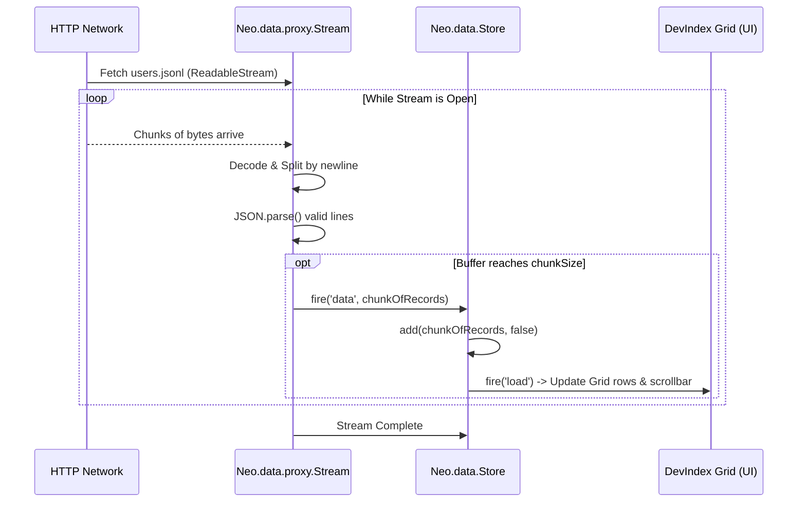

# The Backend (The "Fat Client" Twist)

If you have been looking through the DevIndex application architecture, you might be wondering: *"Where is the backend API? Where is the database? Where are the Express or FastAPI routes?"*

The answer is the twist that defines the DevIndex architecture:  
**There is no traditional application backend.**

The DevIndex application is a pure **"Fat Client"** (an architecture where the browser application handles almost all business logic, data processing, and state management, rather than relying on a server). The entire backend is literally just a static `users.jsonl` file served over HTTP.

This architectural choice represents a departure from modern "Thin Client" trends (where the server does all the heavy lifting like sorting, filtering, and pagination) and a return to the power of the client-side, enabled by the multi-threaded capabilities of the Neo.mjs engine.

---

## Why a Fat Client?

There is also a very pragmatic reason: **Hosting Constraints.**

DevIndex and Neo.mjs are Free and Open Source Software (FOSS) projects (MIT license), and the DevIndex application is simply deployed on GitHub Pages. GitHub Pages is a static site hosting service. This means it only serves static files directly to the browser. You technically cannot run a Node.js server, a database, or any dynamic backend process on it.

By generating a static `.jsonl` file via the Data Factory (the Spider and Updater services) and serving it directly to the browser, we achieve:
1. **Zero Infrastructure Costs:** No need for expensive database clusters or active Node.js servers to handle user queries.
2. **Infinite Scalability:** The application is completely static. Serving it to 10 users or 10,000 users requires the exact same server effort (just serving static files via CDN).
3. **Instant Interactive Performance:** We literally stream in all 50,000+ developers at once, keeping the entire dataset in memory. Because everything resides within the App Worker, subsequent operations like sorting by `totalContributions` or filtering by `countryCode` happen in milliseconds. This provides a near-instant user experience with **zero additional backend traffic** or network latency.

---

## The Data Format: Hyper-Optimized JSONL

To make streaming 50,000+ developer profiles feasible, the `users.jsonl` file is heavily optimized. It uses a Newline Delimited JSON (NDJSON) format where every line is a valid JSON object.

Notice how the keys are minified (`l` for `login`, `n` for `name`, `tc` for `totalContributions`) and the historical yearly data is compressed into flat arrays (`y`, `cy`, `py`) to eliminate repetitive key strings:

```json readonly
{"l":"tobiu","tc":30457,"fy":2011,"lu":"2026-02-22T16:45:41.755Z","y":[0,0,0,0,0,0,0,7,886,5993,4792,2993,3562,3727,5839,2658],"cy":[0,0,0,0,0,0,0,0,683,4703,3511,2104,2337,2778,3863,1666],"py":[0,0,0,0,0,0,0,0,0,0,0,0,0,0,0,0],"tr":["neomjs/neo",19039],"n":"Tobias Uhlig","i":1177434,"lc":"Germany","cc":"DE","c":"Open to work","fl":73,"li":"tobiasuhlig","h":1,"s":0,"w":"https://neomjs.com/","hm":{"v":16,"a":1.64,"c":8}}
```

---

## The Streaming Architecture

Downloading a massive JSON file and calling `JSON.parse()` on it would freeze the browser and require waiting for the entire payload to arrive before showing any data. 

Instead, the DevIndex uses `Neo.data.proxy.Stream`.

### How the StreamProxy Works

The `StreamProxy` utilizes modern browser `fetch` and `ReadableStream` APIs to process the data incrementally. As bytes arrive over the network, it decodes them into text, splits them by newline, and parses individual JSON objects.



### Progressive Chunk Size

To provide an immediate "Time To First Content" while maintaining high throughput, the proxy uses a `progressiveChunkSize` strategy. 
It starts by firing `data` events in small chunks (e.g., 100 records) so the UI can render instantly. As the stream progresses, it dynamically ramps up the chunk size (up to 10,000 records per chunk) because the user already has data on screen, and bulk processing becomes more efficient.

---

## Data Handling & "Turbo Mode"

Having the data in the browser is only half the battle. Storing and sorting 50,000 objects in memory requires extreme optimization.

If the `Neo.data.Store` instantiated a full `Neo.data.Record` class instance for every single developer as it arrived, the memory overhead and CPU cost would be catastrophic. 

Instead, the DevIndex store uses **"Turbo Mode"** (`autoInitRecords: false`).

```javascript readonly
// apps/devindex/store/Contributors.mjs
class Contributors extends Store {
    static config = {
        model: ContributorModel,
        autoInitRecords: false, // <-- Turbo Mode Enabled
        proxy: {
            module: StreamProxy,
            progressiveChunkSize: true,
            url   : '../../apps/devindex/resources/users.jsonl'
        }
        // ...
    }
}
```

In Turbo Mode, the Store holds onto the **raw POJOs** (Plain Old JavaScript Objects) exactly as they were parsed from the JSON stream. `Neo.data.Model` instances are created "just-in-time" only when absolutely necessary (e.g., when a specific row is selected or edited).

### "Soft Hydration" for Sorting and Filtering

If the Store holds raw objects with minified keys (`tc`), how does the Grid sort by the conceptual `totalContributions` field?

The `Neo.data.Store` implements **"Soft Hydration"**. When a sort or filter operation is triggered, the Store checks if the objects have the canonical field names. If not, it uses the `resolveField` method to dynamically calculate or map the field from the raw data using the logic defined in the Model, caching the result on the raw object for subsequent operations.

---

## Zero-Overhead Virtual Fields

The `Contributor` model demonstrates the power of `Neo.data.RecordFactory`. 

The raw data contains compact arrays for historical data (`y`, `cy`, `py`). However, the Grid needs discrete fields to display columns like "Commits 2024" or "Total 2023".

The Model dynamically generates these fields:

```javascript readonly
// apps/devindex/model/Contributor.mjs
addYearFields() {
    let currentYear = new Date().getFullYear(),
        fields      = [...this.fields];

    for (let i = currentYear; i >= 2010; i--) {
        // Commits Only for specific year
        fields.push({
            name     : `cy${i}`,
            type     : 'Integer',
            virtual  : true,
            calculate: data => {
                const firstYear = data.fy || data.firstYear;
                if (!firstYear) return 0;
                return (data.commitsArray || data.cy)?.[i - firstYear] || 0
            }
        });
        // ...
    }
    this.fields = fields;
}
```

Because these are marked as `virtual: true`, the `RecordFactory` creates **prototype-based getters** on the generated Record class. When you access `record.cy2024`, it dynamically reads from the raw array index. 

This means we can add 60+ yearly data fields (Total, Commits, Private) to the model, and it adds **0 bytes** of memory overhead to the individual record instances or raw objects!

---

## Summary

The DevIndex Backend is a masterclass in exploiting client-side capabilities:
1. **No Application Server:** Driven entirely by a static JSONL file.
2. **Streamed Delivery:** `StreamProxy` delivers data progressively without blocking the UI.
3. **Turbo Mode Storage:** `autoInitRecords: false` prevents massive memory allocation.
4. **Zero-Overhead Modeling:** Virtual fields provide complex data access without data duplication.