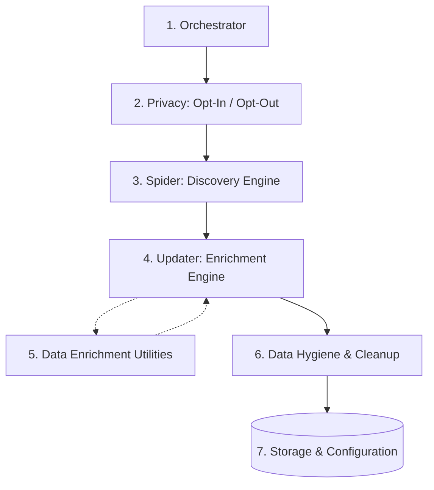

# The Data Factory

Welcome to the DevIndex backend engine. We call it the **Data Factory**.

Unlike a simple script that scrapes a static "Top 100" list, the DevIndex is powered by a robust, automated, multi-stage pipeline designed to autonomously discover, enrich, and filter GitHub developers at scale. It operates continuously, ensuring the index remains a living, self-curating, and highly accurate reflection of the global open-source ecosystem.

This section contains deep-dive architectural guides into each of the specialized micro-services that make up the factory.

---

## A Symphony of Micro-Services

The Data Factory is built on the philosophy of separation of concerns. It is composed of independent services that work together in a strict sequence, orchestrated by a central CLI and GitHub Actions pipeline.

Here is how the data flows from discovery to display:

### 1. The Orchestrator
Everything begins with the **[Orchestrator](Orchestrator.md)**. It manages the CLI (`cli.mjs`), the command router (`Manager.mjs`), and the hourly GitHub Actions pipeline. The Orchestrator ensures that services run in a privacy-first, atomic sequence (e.g., processing Opt-Outs before discovering new users).

### 2. Privacy & Control (Opt-In / Opt-Out)
Before any discovery happens, the pipeline processes user agency requests via the **[Opt-In](OptIn.md)** and **[Opt-Out](OptOut.md)** services. These automated, secure endpoints allow developers to explicitly control their presence in the index, reversing or enforcing blocklists immediately.

### 3. The Spider (Discovery Engine)
The **[Spider](Engine.md)** is a multi-strategy graph crawler. Its job is to find *who* to track. By employing a weighted random-walk strategy—including "Network Walking" (followers of followers) and "Temporal Slicing"—the Spider deliberately breaks out of mainstream "Filter Bubbles" to discover highly skilled but hidden talent across the long tail of the open-source ecosystem.

### 4. The Updater (Enrichment Engine)
Once the Spider finds a candidate, the **[Updater](Updater.md)** takes over. This is the "Worker Bee" of the factory. It fetches deep, multi-year contribution matrices via GraphQL and public organization memberships via the REST API. Most importantly, the Updater enforces the **Meritocracy Logic**—pruning candidates whose total contributions fall below the dynamically rising entry bar.

### 5. Data Enrichment Utilities
During the Updater phase, the raw data is passed through specialized utilities like the **[Heuristics Engine & Location Normalizer](DataEnrichment.md)**. These services compute "Cyborg Metrics" (Velocity, Acceleration, Consistency) to identify automated bots versus organic human titans, and accurately map free-text user locations to standard ISO country codes.

### 6. Data Hygiene & Cleanup
Because the pipeline discovers thousands of users autonomously, data entropy is inevitable. The **[Cleanup](DataHygiene.md)** service acts as the garbage collector. It enforces blocklists, expires users who have been in the "Penalty Box" (failed API updates) for over 30 days, and canonically sorts all JSON files to prevent massive, noisy Git diffs.

### 7. Storage & Configuration
Underpinning all of these services is the **[Storage & Configuration](Storage.md)** layer. It provides a simple, JSON-backed flat-file database abstraction with atomic-ish writes. Crucially, the Storage service enforces the **50,000 User Meritocracy Cap**, automatically dropping the lowest performers to ensure the frontend application remains highly responsive and competitive.

---

## Exploring the Factory

The guides in this section will walk you through the codebase, the exact GraphQL queries, the error recovery algorithms, and the ethical design decisions (like the "Safe Purge Protocol" and the "Right to be Forgotten") that allow the DevIndex to operate autonomously at a massive scale.

Start your deep dive with the **[Orchestrator](Orchestrator.md)** to understand how the pipeline is assembled.
