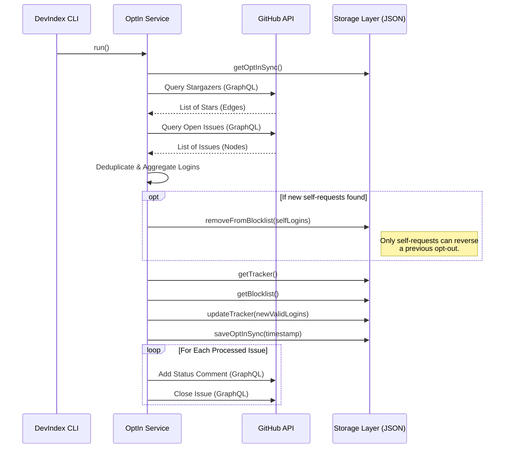

# Opt-In Service Architecture

The **Opt-In Service** ([`DevIndex.services.OptIn`](https://github.com/neomjs/neo/blob/dev/apps/devindex/services/OptIn.mjs)) is a crucial component of the DevIndex discovery pipeline. It provides an automated, secure, and privacy-respecting mechanism for developers to opt themselves in or nominate others to be indexed by the DevIndex.

This service processes two distinct streams of data from the `neomjs/devindex-opt-in` repository:
1.  **Stargazers ("Quick Star"):** An implicit, highly secure way for users to opt themselves in.
2.  **Issue Templates:** A structured way to opt in oneself or nominate a list of other developers.

---

## Architectural Flow

The following sequence diagram illustrates the core processing loop of the `OptIn` service.



---

## Data Streams & Processing Logic

The service must strictly differentiate between "Self" requests (where identity is verified by GitHub authentication) and "Nomination" requests (where the identity is unknown and the nominee might have previously opted out).

### 1. Stargazers ("Quick Star")
When a user stars the opt-in repository, GitHub implicitly verifies their identity. 
*   **Action:** The user's login is added to the `tracker.json` queue.
*   **Blocklist Reversal:** If the user previously opted out (and is thus on the `blocklist.json`), starring the repository serves as verified consent to reverse the blocklist entry.

### 2. Issue Templates
The service parses open issues tagged with the `devindex-opt-in` label. It distinguishes between two template types based on the issue body content.

#### A. "Self" Opt-In
*   **Trigger:** Issue does not contain the `### GitHub Usernames` markdown block.
*   **Verification:** The issue author's login is automatically extracted via the GraphQL query.
*   **Action:** Identical to the Stargazer flow. The user is added to the tracker, and any existing blocklist entry is reversed.

#### B. "Nominate Others"
*   **Trigger:** Issue contains the `### GitHub Usernames` markdown block.
*   **Parsing:** The service uses regex to extract usernames from the Markdown body, safely ignoring formatting artifacts (like bullet points or brackets).
*   **Validation:** Every nominated username is explicitly validated against the GitHub REST API (`users/:login`) to prevent typos from polluting the tracker.
*   **Privacy Boundary:** **Crucially, nominations CANNOT reverse a blocklist entry.** If a nominated user previously opted out, their privacy is respected, and the nomination is skipped.

## Pipeline Integration

The Opt-In service is executed automatically every hour via a GitHub Actions workflow (`.github/workflows/devindex-pipeline.yml`), integrated directly into the broader DevIndex discovery pipeline.

### Execution Order & Privacy

A critical design decision in the pipeline is the execution order:
1.  **Opt-In Service** runs first.
2.  **Opt-Out Service** runs immediately after.

**Why this order matters:**
If a user were to both "Star" the opt-in repository *and* the opt-out repository within the same hourly window, we must determine which intent takes precedence. 

By running the Opt-Out service *last*, we guarantee that **privacy is always the default fallback**. If there are conflicting signals within the same hour, the final action taken by the pipeline will be to blocklist the user and purge their data. This ensures we never accidentally index someone who explicitly signaled their desire to be removed during that cycle.

---

## Code Example: Issue Processing & Feedback

A key architectural goal is to provide immediate, automated feedback. The `closeIssues` method generates a highly detailed comment based on the exact state of each nominated user:

```javascript readonly
async closeIssues(issues, existingTracker, currentBlocklist) {
    let alreadyTracked, blocked, commentBody, lLogin, newlyAdded;

    for (const issue of issues) {
        commentBody = '';
        
        if (issue.type === 'others') {
            if (issue.validLogins?.length > 0) {
                commentBody = 'Thank you for your nominations!\\n\\n';
                
                alreadyTracked = [];
                blocked        = [];
                newlyAdded     = [];

                issue.validLogins.forEach(u => {
                    lLogin = u.toLowerCase();

                    if (currentBlocklist.has(lLogin)) {
                        blocked.push(u);
                    } else if (existingTracker.has(lLogin)) {
                        alreadyTracked.push(u);
                    } else {
                        newlyAdded.push(u);
                    }
                });

                if (newlyAdded.length > 0) {
                    commentBody += '**Successfully Added to Queue:**\\n' + newlyAdded.map(u => `- @${u}`).join('\\n') + '\\n\\n';
                }
                
                if (alreadyTracked.length > 0) {
                    commentBody += '**Already in Queue (Skipped):**\\n' + alreadyTracked.map(u => `- @${u}`).join('\\n') + '\\n\\n';
                }
                
                if (blocked.length > 0) {
                    commentBody += '**Opted Out (Skipped):**\\n' + blocked.map(u => `- @${u}`).join('\\n') + '\\n*(Note: Users who have explicitly opted out can only opt back in themselves.)*\\n\\n';
                }

                if (issue.invalidLogins?.length > 0) {
                    commentBody += '**Failed Validation (Not Found):**\\n' + issue.invalidLogins.map(u => `- ${u}`).join('\\n') + '\\n\\n';
                }
            } 
            // ... failure fallbacks ...
        }
        
        // Post comment and close issue via GraphQL...
    }
}
```

This ensures the user who opened the issue understands exactly what happened to each of their nominations, saving the maintainer from manual support requests while strictly enforcing privacy boundaries.
