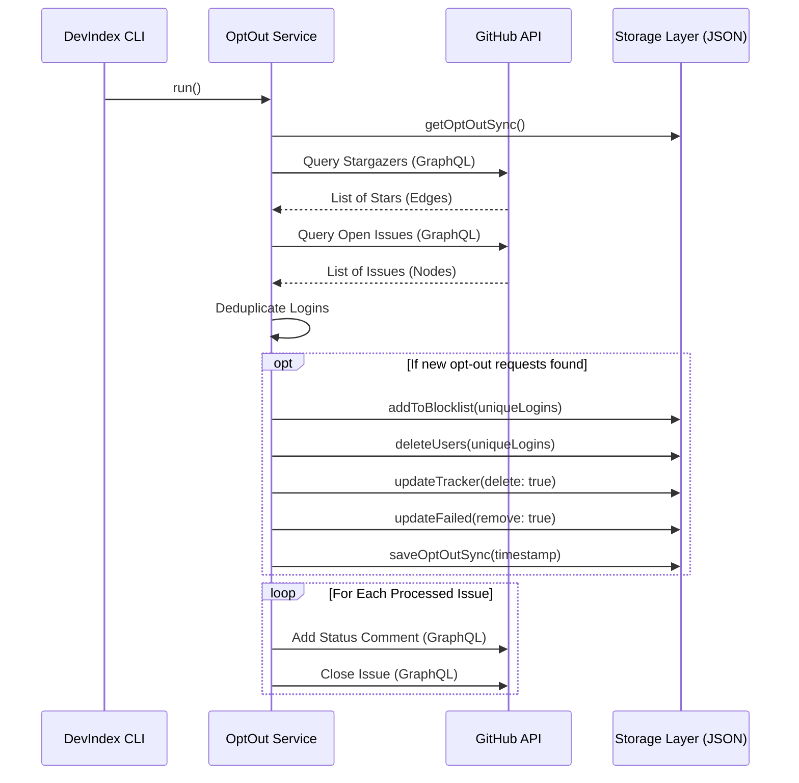

# Opt-Out Service Architecture

The **Opt-Out Service** ([`DevIndex.services.OptOut`](https://github.com/neomjs/neo/blob/dev/apps/devindex/services/OptOut.mjs)) is a foundational component of the DevIndex discovery pipeline. It provides an automated, secure, and privacy-first mechanism for developers to remove themselves from the DevIndex and prevent future indexing.

This service processes two distinct streams of data from the `neomjs/devindex-opt-out` repository:
1.  **Stargazers ("Quick Star" / Stealth):** An implicit, highly secure, and traceless way for users to opt out.
2.  **Issue Templates (Audit Log):** A structured way to opt out that leaves a public confirmation record.

---

## Architectural Flow

The following sequence diagram illustrates the core processing loop of the `OptOut` service.



---

## Data Streams & Processing Logic

Unlike the Opt-In service, the Opt-Out service does not accept third-party nominations. Every opt-out request must be cryptographically tied to the GitHub account being removed.

### 1. Stargazers ("Quick Star" / Stealth)
When a user stars the opt-out repository, GitHub implicitly verifies their identity. This is the preferred method for privacy-conscious users as it leaves no permanent public issue trace.
*   **Action:** The user's login is gathered.

### 2. Issue Templates (Audit Log)
The service parses open issues tagged with the `devindex-opt-out` label.
*   **Verification:** The issue author's login is automatically extracted via the GraphQL query. Because the user must be authenticated with GitHub to open the issue, their identity is cryptographically verified.
*   **Action:** The user's login is gathered.

---

## The Removal Pipeline

Once a list of unique, verified usernames is gathered (from stars and issues), the `OptOut` service executes a sweeping removal across all data stores:

1.  **`addToBlocklist()`:** The user is added to `blocklist.json`. This is the most critical step; it prevents the Spider from ever re-discovering or re-adding the user in the future.
2.  **`deleteUsers()`:** The user's rich profile data is permanently purged from `users.jsonl` (the active database served to the UI).
3.  **`updateTracker({ delete: true })`:** The user is removed from `tracker.json` to stop the Updater from attempting to refresh their data.
4.  **`updateFailed(remove: true)`:** If the user was in the "penalty box" (failed API updates), they are removed from `failed.json` for complete data hygiene.

---

## Issue Feedback Loop

If the opt-out was triggered via an issue, the service provides an automated confirmation before closing the ticket. This acts as a verifiable receipt for the user.

```javascript readonly
async closeIssues(issueIds) {
    for (const issueId of issueIds) {
        // Add Comment
        const commentQuery = `
            mutation($subjectId: ID!, $body: String!) {
                addComment(input: {subjectId: $subjectId, body: $body}) {
                    clientMutationId
                }
            }`;
        
        await GitHub.query(commentQuery, {
            subjectId: issueId,
            body: 'Your opt-out request has been processed. You have been removed from the active DevIndex databases and added to the blocklist.\\n\\nIf you wish to be re-indexed in the future, you may submit an Opt-In request.\\n\\n*This issue has been automatically closed.*'
        }, 3, `OptOut Comment ${issueId}`);

        // Close Issue
        const closeQuery = `
            mutation($issueId: ID!) {
                closeIssue(input: {issueId: $issueId}) {
                    clientMutationId
                }
            }`;
        
        await GitHub.query(closeQuery, { issueId: issueId }, 3, `OptOut Close ${issueId}`);
    }
}
```

This strict, automated approach guarantees that privacy requests are honored immediately, securely, and permanently without requiring human intervention from the maintainer.
