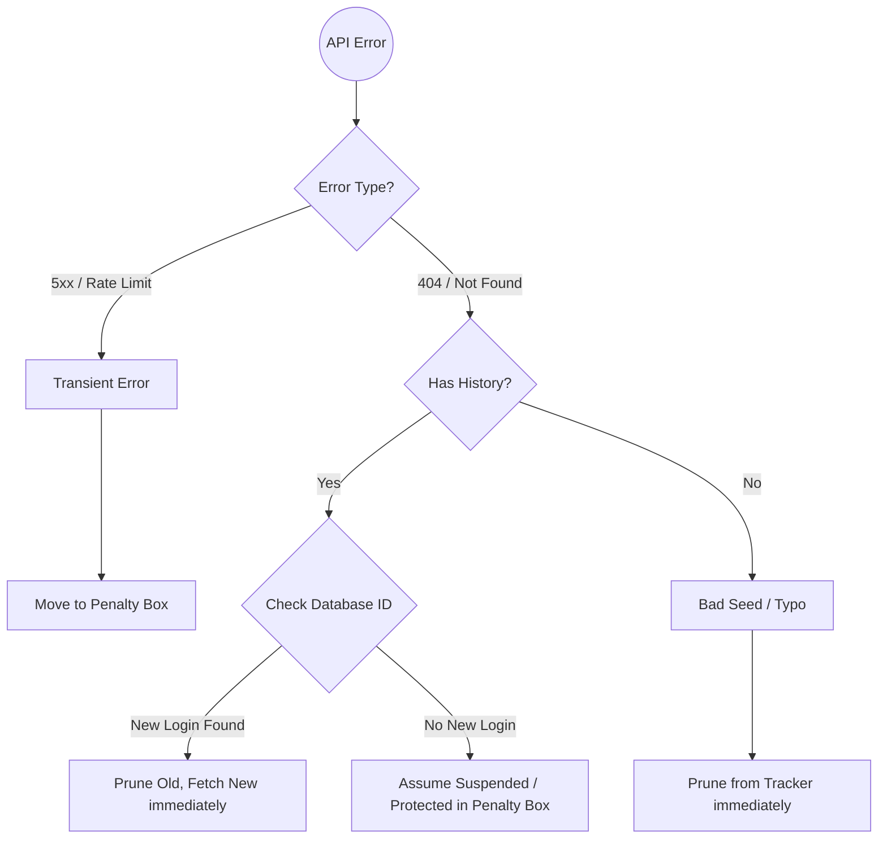

# The Updater Service (Enrichment Engine)

The **Updater Service** ([`DevIndex.services.Updater`](https://github.com/neomjs/neo/blob/dev/apps/devindex/services/Updater.mjs)) is the most complex component of the DevIndex Data Factory. While the Spider discovers *who* to track, the Updater is responsible for fetching, aggregating, and minifying the deep historical data required for the frontend visualizations.

It acts as a highly resilient "Worker Bee," taking a batch of usernames from the `tracker.json` queue and converting them into the rich, minified JSON objects stored in `users.jsonl`.

---

## Core Workflow

The Updater processes users in parallel batches. For each user, it executes a strict four-step workflow.


### 1. Fetch (The GraphQL Matrix)

#### Transparency & The Basic Profile
The Updater begins by fetching the user's basic profile and public social accounts. To maintain absolute transparency and trust with the developer community, the exact GraphQL query used to fetch personal data is documented below. The DevIndex does not request or store private email addresses or private repository details.

```javascript readonly
const profileQuery = `
    query { 
        rateLimit { remaining limit resetAt }
        user(login: "${username}") { 
            createdAt 
            avatarUrl 
            name 
            location
            company
            bio
            followers { totalCount }
            isHireable
            hasSponsorsListing
            sponsorshipsAsMaintainer { totalCount }
            twitterUsername
            websiteUrl
            socialAccounts(first: 5) {
                nodes {
                    provider
                    url
                }
            }
        } 
    }`;
```

#### The Multi-Year Contribution Matrix
To build the historical charts on the frontend, the DevIndex requires the total contribution count for *every year* since the user created their account. 

Fetching this sequentially (one API call per year) is too slow. Fetching it all at once often results in GitHub API timeouts (`502 Bad Gateway` or `504 Gateway Timeout`) for prolific users. The Updater implements a smart **Chunking Strategy**:

```javascript readonly
// We split the years into chunks of 4 to prevent 502/504 errors on large accounts.
const yearChunks = [];
const chunkSize  = 4; 
for (let y = startYear; y <= currentYear; y += chunkSize) {
    const end = Math.min(y + chunkSize - 1, currentYear);
    yearChunks.push({ start: y, end });
}

// Fetch year chunks sequentially to be safe
for (const chunk of yearChunks) {
    try {
        await fetchYears(chunk.start, chunk.end); // Fast Path
    } catch (err) {
        // Fallback: If the 4-year chunk times out, try year-by-year
        for (let y = chunk.start; y <= chunk.end; y++) {
            await fetchYears(y, y); 
        }
    }
}
```

### 2. Enrich
While GraphQL is powerful, it has limitations. Specifically, querying an organization via GraphQL requires the `read:org` scope, even for public organizations. To keep the required permissions minimal, the Updater fetches public organization memberships via the v3 REST API simultaneously.

### 3. Filter (The Meritocracy Logic)
Once the data is aggregated, the Updater enforces the DevIndex threshold. If a user's `total_contributions` falls below the dynamically calculated minimum threshold (and they are not on the allowlist), they are marked for immediate deletion. This ensures that only the highest-performing developers remain as the index approaches its `maxUsers` cap.

---

## Safe Purge Protocol (Self-Healing)

The internet is chaotic. Users change their names, accounts get suspended, and APIs fail. The Updater is built with extreme defensiveness, implementing a "Safe Purge Protocol" to categorize and handle errors without manual intervention.



### 1. Transient Errors (The Penalty Box)
If a fetch fails due to a network timeout or a GitHub rate limit, the user is moved to the `failed.json` map (the "Penalty Box") and their `lastUpdate` timestamp in the tracker is refreshed. This pushes them to the back of the queue, allowing the system to retry them naturally on a subsequent pass.

### 2. The Rename Problem (Database ID Resolution)
The most sophisticated recovery mechanism handles account renames.
If a user changes their GitHub handle, querying their old login returns a fatal `404 NOT_FOUND`. A naive scraper would delete their history.

Instead, the Updater leverages the immutable integer `databaseId` (stored as `i` in the rich profile):

```javascript readonly
// ID-Based Rename Handling
if (isFatal && richUser && richUser.i) {
    try {
        const newLogin = await GitHub.getLoginByDatabaseId(richUser.i);
        if (newLogin && newLogin.toLowerCase() !== lowerLogin) {
            console.log(`[${login}] 🔄 RENAME DETECTED -> ${newLogin}`);

            // 1. Mark old login for removal
            indexUpdates.push({ login, delete: true }); 
            prunedLogins.push(login); 

            // 2. Fetch data for new login immediately to preserve their spot
            const newData = await this.fetchUserData(newLogin);
            // ...
        }
    } 
    // ...
}
```

### 3. Bad Seeds vs. Protected Users
If a `404` occurs and it is *not* a rename:
*   **No History (Bad Seed):** If the user is pending (`lastUpdate: null`) and has never been indexed, they are likely a typo or an organization mistaken for a user by the Spider. They are aggressively **Pruned**.
*   **Has History (Protected):** If the user exists in the rich data store but suddenly returns a `404`, we assume their account was temporarily flagged or suspended by GitHub (common for very active OSS contributors). They are **Protected** and moved to the Penalty Box to avoid erasing years of historical tracking data over a temporary glitch.

---

## Checkpointing & State Persistence

Processing complex GraphQL queries and REST calls takes time. To ensure that progress is not lost if the process is interrupted (e.g., by a runner timeout or a network failure), the Updater uses a chunked persistence strategy.

Instead of writing to disk after every single user, or waiting until the end of a massive run, it flushes its internal state to the `Storage` layer at regular intervals (defined by `config.updater.saveInterval`, typically every 10 users):

```javascript readonly
// Checkpoint Save
if (results.length >= saveInterval) {
    await this.saveCheckpoint(results, indexUpdates, failedLogins, recoveredLogins, prunedLogins);
    // Reset arrays...
}
```

The `saveCheckpoint` method is an atomic operation that synchronizes:
1. New enriched profiles to `users.jsonl`
2. Updated timestamps to `tracker.json`
3. Erased profiles from pruning
4. Addition/Removals from the `failed.json` Penalty Box

This guarantees that the database remains perfectly consistent, even if the Node.js process is forcefully terminated mid-run.

---

## Rate Limit Protection

Because the Updater consumes significant GraphQL query points, it constantly monitors the quota. Before processing *every chunk*, it checks the `core` limit. If it drops below a critical threshold (e.g., 50 requests remaining), it instantly triggers a graceful shutdown. 

```javascript readonly
if (GitHub.rateLimit.core.remaining < 50) {
    console.warn(`[Updater] ⚠️ RATE LIMIT CRITICAL: Stopping gracefully.`);
    break; 
}
```

This prevents the Action from failing violently and ensures that all progress made up to that point is safely checkpointed to disk.