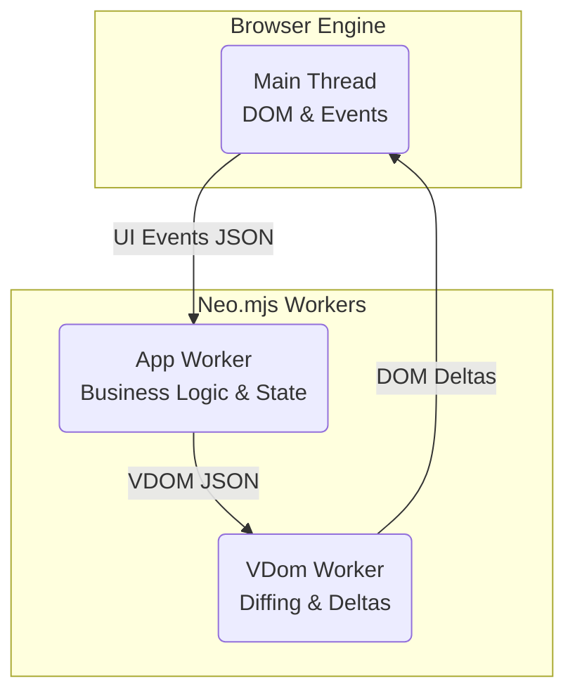

# App Shell & MVVM: The DevIndex Architecture

The DevIndex application is built with the Neo.mjs framework, which utilizes a revolutionary architecture: it runs almost entirely outside the browser's main thread. This guide details how the DevIndex frontend is structured to leverage this "Off-Main-Thread" paradigm, along with a hybrid approach to MVC and MVVM patterns.

> **Explore the Source:** You can find the complete source code for the DevIndex application here: [GitHub: apps/devindex](https://github.com/neomjs/neo/tree/dev/apps/devindex).

## The "Fat Client" Philosophy

Before diving into the components, it's crucial to understand the core philosophy of DevIndex: it is a pure **"Fat Client"**. 

Unlike traditional web apps that rely on a server for sorting, filtering, and pagination, DevIndex streams in a single `users.jsonl` file on startup. From that point forward, the client literally does *everything*. All 50,000+ developer records are held in memory within the App Worker. Every filter, every sort, and every view transition happens instantly on the client side without ever hitting a backend server again. 

*(For a deep dive into how this streaming works, see [The Backend Twist](#/learn/Backend)).*

## The Minimal Main Thread

If you inspect the source of the DevIndex application's entry point (`apps/devindex/index.html`), you will notice how remarkably empty it is:

```html readonly
<!DOCTYPE HTML>
<html>
<head>
    <meta name="viewport" content="width=device-width, initial-scale=1">
    <meta charset="UTF-8">
    <title>DevIndex</title>
</head>
<body>
    <script src="../../src/MicroLoader.mjs" type="module"></script>
</body>
</html>
```

The `<body>` tag is completely empty. The only script loaded is `MicroLoader.mjs`.

The main thread of the browser is intentionally kept as idle as possible. It has three primary responsibilities:
1. **Starting Workers**: Bootstrapping the Neo.mjs multi-worker environment.
2. **Delegating UI Events**: Capturing native DOM events (like scroll or click), serializing them as JSON, and delegating them to the App Worker.
3. **Applying Delta Updates**: Receiving minimal Virtual DOM diffs and applying them efficiently via the `domApiRenderer`.

By keeping the main thread clear of application logic, data processing, and state management, the DevIndex application ensures the UI remains fluid and responsive, completely immune to "jank" even under heavy computational load.

## The App Worker: Where DevIndex Lives

After the MicroLoader boots up the framework, it spawns the application inside a dedicated background thread known as the **App Worker**.



*(Note: For more on how other workers like the Canvas and Data workers fit in, see the [OffscreenCanvas & Rendering](#/learn/frontend/OffscreenCanvas) and [The 50k-Row Grid](#/learn/frontend/TheGrid) guides.)*

The entry point for DevIndex in the App Worker is `app.mjs`:

```javascript readonly
import Overwrites from './Overwrites.mjs';
import Viewport   from './view/Viewport.mjs';

export const onStart = () => Neo.app({
    mainView: Viewport,
    name    : 'DevIndex'
});
```

This is where the magic happens. The entire application—every component, every piece of state, every network request—runs within this App Worker.

## Viewport and Lazy Loading

The root component of the application is the `Viewport` (`apps/devindex/view/Viewport.mjs`). It defines the declarative layout using Neo.mjs's JSON-based Virtual DOM blueprints. 

Crucially, DevIndex utilizes **lazy loading** for its main sections to keep the initial bundle size minimal:

```javascript readonly
items: [{
    module: Header,
    flex  : 'none'
}, {
    ntype    : 'container',
    flex     : 1,
    layout   : {ntype: 'card', activeIndex: null},
    reference: 'main-content',
    items    : [
        {module: () => import('./home/MainContainer.mjs')},
        {module: () => import('./learn/MainContainer.mjs')}
    ]
}]
```

Notice the `module: () => import(...)` syntax. The framework will only fetch and execute the code for the Home (Grid) or Learn (Documentation) sections when the routing logic dictates they should be visible.

## A Hybrid Approach: MVC meets MVVM

DevIndex organizes its codebase using a blend of classic Model-View-Controller (MVC) for its data layer and Model-View-ViewModel (MVVM) for its UI components.

### 1. The MVC Foundation

At the top level of the `apps/devindex` folder, you will find a traditional MVC directory structure:
*   **Model**: `model/Contributor.mjs` defines the schema and virtual fields for the developer data.
*   **Store**: `store/Contributors.mjs` acts as the collection manager, holding the 50,000+ records in memory.
*   **View**: Folders like `view/home/` contain the visual components (e.g., `GridContainer.mjs`).

### 2. The MVVM UI Layer (Hierarchical Architecture)

While the data layer leans MVC, the UI components utilize a powerful, instance-based MVVM pattern. Instead of global controllers or single-store monoliths, DevIndex attaches **State Providers** and **View Controllers** directly to specific container instances within the component tree.

These providers and controllers form a **hierarchical chain**:

*   **Hierarchical State Providers (ViewModel)**: 
    When a component requests data (e.g., `bind: { text: data => data.title }`), the framework searches up the component tree. If the current component's State Provider doesn't have the data, it checks the parent's State Provider, and so on. This creates a deeply nested chain of merged data access. The `ViewportStateProvider` holds global UI state, while the `MainContainerStateProvider` might hold the specific `Contributors` store.

*   **Hierarchical View Controllers**:
    Event handling works the same way. When a button is configured with a string-based listener (e.g., `handler: 'onButtonClick'`), the framework doesn't look in a global registry. It walks up the component tree to find the *closest* View Controller that implements the `onButtonClick` method. This elegantly encapsulates logic exactly where it's needed, preventing bloated, monolithic controllers.

For a deeper dive into how these controllers manage filtering and global state, see the [State Management & Controls](#/learn/frontend/StateAndControls) guide.

## Summary

By running its entire architecture inside an App Worker, DevIndex achieves true concurrency. While the Main Thread paints, the App Worker handles state changes, lazy loads modules, and coordinates with other workers. Combined with a hierarchical MVVM approach and a "Fat Client" philosophy, this ensures that even when processing 50,000 developer records, the UI remains perfectly fluid and maintainable.