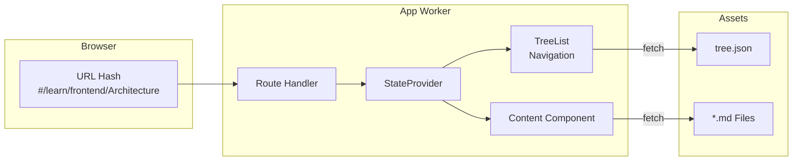
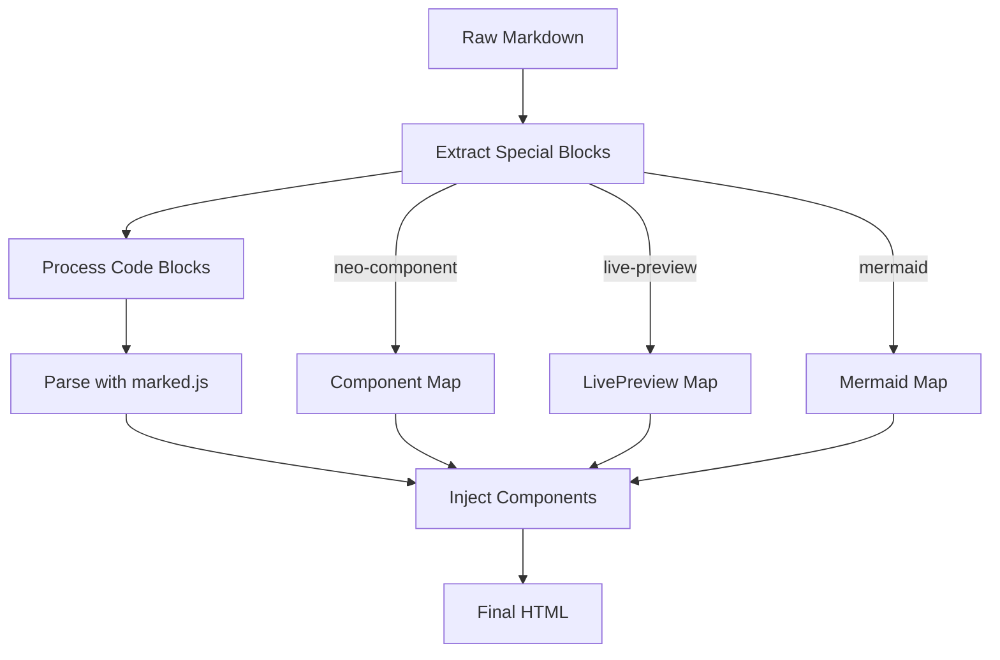

# The Markdown Content Engine

The DevIndex application isn't just a data grid; it's a fully-featured documentation portal. The "Learn" tab you're reading right now is powered by a sophisticated **Markdown Content Engine** that dynamically fetches, parses, and renders documentation files—all while executing entirely off the Main Thread.

This guide explores the architecture behind Neo.mjs's content rendering system: how `tree.json` provides the navigation structure, how `Neo.component.Markdown` transforms raw Markdown into interactive components, and how the routing system ties everything together for a seamless single-page application experience.

---

## The Three Pillars of the Content Engine

The Markdown Content Engine is built on three core concepts:

1. **The Navigation Tree** (`tree.json`): A hierarchical JSON manifest that defines the structure and relationships of all documentation pages.
2. **The Markdown Component** (`Neo.component.Markdown`): A specialized renderer that transforms Markdown into interactive HTML, complete with syntax-highlighted code blocks, live previews, and embedded diagrams.
3. **The Routing System**: A hash-based router that maps URLs to specific documentation records, enabling deep linking and browser history integration.



---

## The Navigation Manifest: tree.json

Every documentation section in Neo.mjs is defined by a `tree.json` file. This JSON manifest describes the hierarchical structure of the content, including parent-child relationships, display names, and unique identifiers.

### Structure of tree.json

```json readonly
{"data": [
    {"name": "Introduction & Overview", "parentId": null,                           "id": "Introduction"},
    {"name": "Methodology",             "parentId": null,                           "id": "Methodology"},
    {"name": "The Data Factory",        "parentId": null,          "isLeaf": false, "id": "DataFactory"},
        {"name": "Spider Engine",       "parentId": "DataFactory",                  "id": "data-factory/Engine"},
        {"name": "Updater Engine",      "parentId": "DataFactory",                  "id": "data-factory/Updater"},
    {"name": "Frontend Architecture",   "parentId": null,          "isLeaf": false, "id": "Frontend"},
        {"name": "App Shell & MVVM",    "parentId": "Frontend",                     "id": "frontend/Architecture"}
]}
```

Each record contains:

| Property   | Description                                                                 |
|------------|-----------------------------------------------------------------------------|
| `id`       | The unique identifier, which also maps to the file path (e.g., `frontend/Architecture` → `frontend/Architecture.md`) |
| `name`     | The display label shown in the navigation tree                              |
| `parentId` | Reference to the parent node (or `null` for root items)                     |
| `isLeaf`   | When `false`, indicates a folder/category with children                     |
| `collapsed`| Optional: Whether the node starts collapsed in the TreeList                 |
| `hidden`   | Optional: Hides the item from navigation while keeping it routable          |

### How tree.json is Loaded

The `Neo.app.content.TreeList` component is responsible for fetching and populating the navigation. When the `contentPath` config is set, it automatically triggers a store load:

```javascript readonly
// src/app/content/TreeList.mjs
doLoadStore() {
    if (Neo.isFunction(this.store?.load)) {
        this.store.load({url: `${this.contentPath}tree.json`})
    }
}
```

The `contentPath` is defined centrally in the StateProvider, which tells the `TreeList` where to fetch the JSON from:

```javascript readonly
// apps/devindex/view/learn/MainContainerStateProvider.mjs
data: {
    contentPath: Neo.config.basePath + 'learn/guides/devindex/',
    // ...
}
```

By decoupling the path from the component, the rendering engine remains highly reusable. (In fact, the main Neo.mjs Portal app uses this exact same architecture to dynamically serve multiple different "decks" of documentation).

---

## The Markdown Renderer: Neo.component.Markdown

At the heart of the Content Engine is `Neo.component.Markdown`—a sophisticated component that transforms raw Markdown text into fully interactive HTML. Unlike simple Markdown parsers, this component implements a **multi-pass compilation strategy** to handle dynamic content.

### The Rendering Pipeline

When the `value` config of a Markdown component changes, it triggers a complex rendering pipeline:



### Pass 1: Extraction

Before parsing, the Markdown content is scanned for special code blocks that need custom handling. These are extracted and replaced with placeholder `<div>` elements:

```javascript readonly
// src/component/Markdown.mjs
processNeoComponentsBlocks(contentString, map) {
    return contentString.replace(regexNeoComponent, (match, code) => {
        const key = IdGenerator.getId('learn-content-component');
        map[key] = JSON.parse(code);
        return `<div id="${key}"></div>`
    })
}
```

This protects dynamic content from being mangled by the standard Markdown parser.

### Pass 2: Syntax Highlighting

Standard code blocks (marked with `readonly`) are processed asynchronously using HighlightJS:

```javascript readonly
// Asynchronous highlighting with fallback
HighlightJs.highlight(code, lang, windowId)
    .catch(err => {
        console.warn(`Highlighting failed for '${lang}', falling back to plaintext.`);
        return HighlightJs.highlight(code, 'plaintext', windowId);
    })
```

### Pass 3: Markdown Parsing

The modified content (with placeholders) is then parsed using the `marked` library:

```javascript readonly
html = marked.parse(content);
```

### Pass 4: Component Injection

Finally, the renderer iterates over the extracted component maps and instantiates actual Neo.mjs components into the placeholder DIVs:

```javascript readonly
// Lazy-load and instantiate LivePreview components
if (Object.keys(neoDivs).length > 0) {
    const LivePreviewModule = await import('../code/LivePreview.mjs');
    const LivePreviewClass  = LivePreviewModule.default;

    Object.keys(neoDivs).forEach(key => {
        instance = Neo.create({
            ...baseConfigs,
            module  : LivePreviewClass,
            parentId: key,
            value   : neoDivs[key].code
        });
        me.activeComponents.push(instance);
    });
}
```

**Lazy Loading Optimization:** Heavy dependencies like Mermaid diagrams and LivePreview editors are imported dynamically via `await import()` only when their blocks are detected. This minimizes the initial bundle size.

---

## Special Markdown Features

The Markdown component supports several enhanced block types beyond standard Markdown:

### 1. Syntax-Highlighted Code Blocks

Standard fenced code blocks with a language identifier are automatically highlighted:

```markdown
\```javascript readonly
const greeting = 'Hello, Neo.mjs!';
console.log(greeting);
\```
```

### 2. Live Preview Blocks

Code blocks marked with `live-preview` render an interactive code editor with real-time output:

```markdown
\```javascript live-preview
Neo.create({
    module: Neo.button.Base,
    text  : 'Click Me!'
})
\```
```

### 3. Neo Component Blocks

Embed any Neo.mjs component directly in documentation using `neo-component`:

```markdown
\```json neo-component
{
    "module": "Neo.button.Base",
    "text": "I'm a real button!"
}
\```
```

### 4. Mermaid Diagrams

Create flowcharts, sequence diagrams, and more using Mermaid syntax:

```markdown
\```mermaid
flowchart LR
    A[Start] --> B[End]
\```
```

### 5. Ticket References

When `replaceTicketIds` is enabled, references like `#1234` are automatically converted to clickable links:

```markdown
This feature was added in #9262.
```

---

## Routing and Deep Linking

The Content Engine integrates seamlessly with Neo.mjs's hash-based routing system, enabling bookmarkable URLs and browser history navigation.

### Route Configuration

The MainContainerController defines route patterns that map URL hashes to handler methods:

```javascript readonly
// apps/devindex/view/learn/MainContainerController.mjs
static config = {
    routes: {
        '/learn'          : 'onRouteDefault',
        '/learn/{*itemId}': 'onRouteLearnItem'
    }
}
```

The `{*itemId}` wildcard captures the entire path after `/learn/`, allowing nested paths like `/learn/frontend/Architecture`.

### Route Handling

When a route matches, the handler updates the StateProvider, which triggers a cascade of reactive updates:

```javascript readonly
async onRouteLearnItem({itemId}, value, oldValue) {
    let stateProvider = this.getStateProvider(),
        store         = stateProvider.getStore('tree');

    // Update the current page record in state
    stateProvider.data.currentPageRecord = store.get(itemId);

    // Expand parent nodes and scroll to the item in the tree
    if (!oldValue?.hashString?.startsWith('/learn')) {
        await tree.expandAndScrollToItem(itemId)
    } else {
        tree.expandParents(itemId)
    }
}
```

### Content Fetching

The Content component is bound to `currentPageRecord` via the StateProvider. When this record changes, it triggers a fetch of the corresponding Markdown file:

```javascript readonly
// src/app/content/Component.mjs
async doFetchContent(record) {
    let path = me.getContentPath(record);

    if (record.isLeaf && path) {
        data    = await fetch(path);
        content = await data.text();
        me.value = content;  // Triggers the Markdown rendering pipeline
    }
}
```

The `getContentPath` method constructs the full URL from the record's `id`:

```javascript readonly
// apps/devindex/view/learn/Component.mjs
getContentPath(record) {
    let path = this.getStateProvider().getData('contentPath');
    return path + `${record.id}.md`
}
```

For example, a record with `id: "data-factory/Engine"` and `contentPath: ".../learn/guides/devindex/"` resolves to `.../learn/guides/devindex/data-factory/Engine.md`.

---

## The StateProvider: Binding It All Together

The `MainContainerStateProvider` acts as the central nervous system, managing shared state and coordinating between the TreeList, Content component, and navigation controls:

```javascript readonly
// Key state properties
data: {
    contentPath       : null, // Base path for content files
    currentPageRecord : null, // The currently displayed page
    nextPageRecord    : null, // For "Next Page" navigation
    previousPageRecord: null, // For "Previous Page" navigation
    countPages        : null  // Total page count for navigation
}
```

When `currentPageRecord` changes, the StateProvider automatically calculates the previous and next pages by iterating through the tree store:

```javascript readonly
case 'currentPageRecord': {
    let store = me.getStore('tree'),
        index = store.indexOf(value);

    // Find previous leaf node
    for (i = index - 1; i >= 0; i--) {
        record = store.getAt(i);
        if (record.isLeaf && !me.recordIsHidden(record, store)) {
            previousPageRecord = record;
            break
        }
    }

    // Find next leaf node
    for (i = index + 1; i < countPages; i++) {
        record = store.getAt(i);
        if (record.isLeaf && !me.recordIsHidden(record, store)) {
            nextPageRecord = record;
            break
        }
    }

    me.setData({previousPageRecord, nextPageRecord});
}
```

This enables the "Previous" and "Next" navigation buttons to work correctly, even when some pages are hidden.

---

## Sections Panel: Auto-Generated Table of Contents

As the Markdown is parsed, the Content component extracts headline information (`##` and `###` tags) and populates a `sections` store:

```javascript readonly
// src/app/content/Component.mjs
onHeadline(tag, text, index) {
    const sideNavTitle = text.replaceAll('`', '');
    
    // Push headline data to the sections store
    this.headlineData.push({
        id      : index, 
        name    : sideNavTitle, 
        sourceId: this.id, 
        tag
    });

    return `<${tag} class="neo-${tag}" data-record-id="${index}">${headline}</${tag}>`
}
```

The SectionsContainer binds to this store and renders an interactive table of contents. Combined with an IntersectionObserver, the current section is automatically highlighted as you scroll through the content.

---

## Summary

The Markdown Content Engine demonstrates Neo.mjs's power to build sophisticated, interactive documentation portals using the same component architecture as data-intensive applications:

1. **`tree.json`** provides a declarative navigation manifest, loaded into a reactive TreeList component
2. **`Neo.component.Markdown`** implements a multi-pass rendering pipeline, supporting syntax highlighting, live previews, embedded components, and diagrams
3. **Hash-based routing** enables deep linking and browser history integration
4. **StateProvider** coordinates all components through declarative data binding
5. **All logic executes in the App Worker**, keeping the Main Thread free for smooth scrolling and interactions

This architecture makes it trivial to add new documentation sections: simply create a Markdown file and add an entry to `tree.json`. The Content Engine handles the rest.
