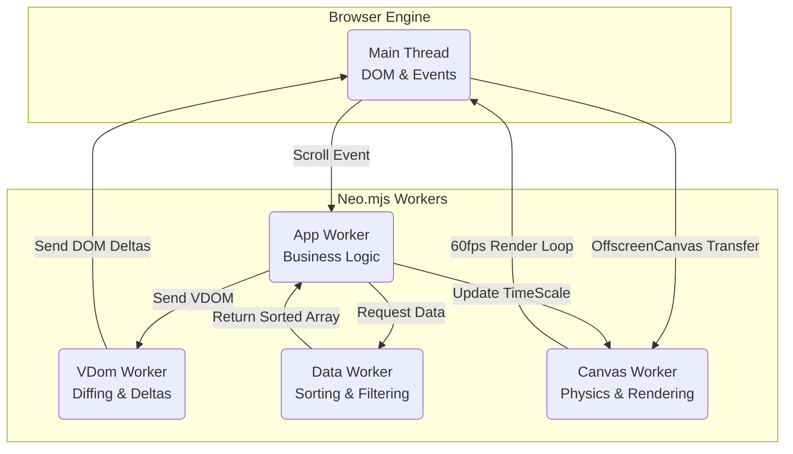

# The Ultimate Flex: OffscreenCanvas & Parallel Rendering

Most frontend frameworks measure performance by how quickly they can render a simple "Hello World" or update a to-do list. 

With DevIndex, we wanted to build something different. We wanted a **stress test**. 

We set an impossible goal for traditional architectures: 
1. Stream 50,000 complex records into memory.
2. Render a highly interactive, 3D particle simulation in the application header.
3. Render live, animated data charts ("Living Sparklines") inside every single row of the grid.
4. **Maintain a buttery-smooth 60 frames per second (fps) while the user aggressively scrolls the massive grid.**

If you attempt this in a standard, single-threaded application (like a typical React or Vue app), the browser will instantly freeze. The Main Thread simply cannot calculate 50k virtualized DOM nodes *and* execute heavy physics for 50+ canvas animations simultaneously.

The secret to achieving this "impossible" performance lies in the **Dedicated Canvas Worker**.

---

## The Quintuple-Threaded Architecture

Neo.mjs treats the browser like a true multi-core operating system. To achieve our goal, we split the massive workload of the grid and the visual effects across five independent actors.



1. **The Main Thread:** Completely unblocked. It applies tiny DOM delta-updates and captures scroll events.
2. **The App Worker:** The orchestrator. It manages business logic, MVVM bindings, and generates the new Virtual DOM for the visible grid rows.
3. **The VDom Worker:** Receives the new Virtual DOM from the App worker, compares it against the previous state, and calculates the minimal DOM deltas.
4. **The Data Worker:** Takes the heavy lifting of sorting, filtering, and aggregating the 50,000-row dataset away from the App Worker.
5. **The Canvas Worker:** Receives ownership of the `<canvas>` DOM nodes via the `OffscreenCanvas` API. It runs complex physics and draws pixels independently of the other four threads.

*Note: Because DevIndex is a single-window application, we configure Neo.mjs to use a **Dedicated Worker** for the canvas. This is a crucial optimization because it grants us access to the browser's native `requestAnimationFrame` (`rAF`) inside the worker, ensuring perfect synchronization with the display's refresh rate.*

---

## The "Luminous Flux" Header (The Flex)

The header of the DevIndex features a complex visual theme called "Luminous Flux"—a 3D simulation of intertwining neon strands and interactive "Neo Ether" particles.

### The "Speed Up" Flex

When you grab the scrollbar of a 50k-row grid and yank it downwards, you generate a massive spike in CPU load as the engine calculates which rows to mount and unmount. 

In a traditional app, this is where background animations stutter or halt entirely as the Main Thread drops frames.

In DevIndex, we do the exact opposite. **We intentionally *double* the animation speed of the complex 3D header when you scroll.**

Why? Simply to prove that we can.

```javascript readonly
// apps/devindex/view/home/MainContainerController.mjs (App Worker)
onGridIsScrollingChange(data) {
    // 1. Grid fires scroll event
    // 2. Controller updates global state
    this.setState('isScrolling', data.value);
}
```

When the user scrolls, the App Worker catches the event and updates the global `isScrolling` state. The Canvas component, which is bound to this state, sends a message to the Canvas Worker. 

The Canvas Worker receives the message and smoothly ramps the physics `timeScale` to 2x. It proves, visually and viscerally, that the heavy layout thrashing happening on the Main Thread has absolutely zero impact on the Canvas Worker's render loop.

---

## "Living Sparklines" (50+ Canvases)

Rendering a single complex header animation is impressive. Rendering animations inside a virtualized grid containing 50,000 records is a completely different beast.

Every row in the DevIndex grid features a 15-year historical activity graph. We didn't want static images; we wanted "Living Sparklines" where glowing data packets visually traverse the timelines, creating the aesthetic of a busy server room.

How do you animate 50+ visible `<canvas>` tags simultaneously without melting the user's GPU?

### 1. The Sparse Animation Strategy

The secret is smoke and mirrors. We do not actually animate every visible sparkline at once. 

The `Neo.canvas.Sparkline` singleton running in the Canvas Worker uses a **Master Loop**. Every few hundred milliseconds, it randomly selects *one* idle chart from the visible pool and spawns a "Data Packet" pulse.

```javascript readonly
// src/canvas/Sparkline.mjs (Canvas Worker)
renderLoop() {
    let now = performance.now();

    // 1. Spawn new pulse? (Random interval 200ms - 1.2s)
    if (now - this.lastPulseSpawn > (Math.random() * 1000 + 200)) {
        
        // Find charts that are visible but not currently animating
        let candidates = Array.from(this.items.values())
                              .filter(item => !this.activeItems.has(item));

        if (candidates.length > 0) {
            // Pick a random winner and start its animation
            let winner = candidates[Math.floor(Math.random() * candidates.length)];
            this.activeItems.add(winner);
            this.lastPulseSpawn = now;
        }
    }
    
    // 2. Animate the active subset...
}
```

This "Sparse Animation Strategy" reduces the GPU load to that of a single active chart, while the human eye perceives the entire grid as dynamic and alive.

### 2. Zero-Allocation Physics

To maintain a strict 16ms frame budget (60fps), the Canvas Worker must never trigger the browser's Garbage Collector (GC). Creating new objects or arrays inside a render loop is strictly forbidden, as GC pauses cause visible micro-stutters.

We implemented a rigorous **Zero-Allocation** strategy for the physics engine:

*   **TypedArray Buffers:** Wave geometry for the header is calculated and written directly into pre-allocated `Float32Array` buffers.
*   **Cached Gradients:** Generating `CanvasGradient` objects is computationally expensive. We generate the gradients once when the canvas resizes, cache them (`this.gradients.grad1`), and reuse them infinitely in the render loop.
*   **Geometry Caching:** For the sparklines, the point coordinates (`x, y`) and segment distances are calculated exactly once when the data loads. The animation loop simply interpolates a glowing dot along these pre-calculated, cached paths.

---

## Conclusion

The DevIndex application is more than just a developer directory; it is a blueprint for the future of high-performance web applications. 

By aggressively splitting responsibilities across a Quintuple-Threaded architecture (Main, App, VDom, Data, and Canvas Workers) and adhering to strict memory management principles like Zero-Allocation, Neo.mjs empowers developers to build desktop-class experiences—like real-time trading dashboards or complex data visualizations—directly in the browser, without compromise.
