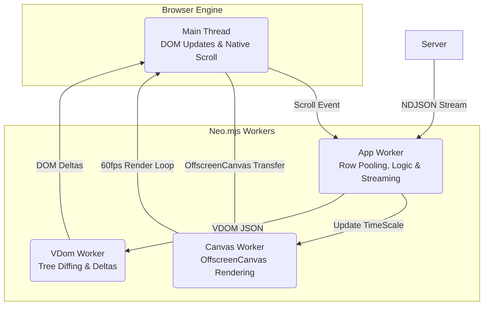

# The World's Fastest Data Grid: Architecture & Virtualization

**Status:** Implementation  
**Audience:** Frontend Engineers, UI Architects  
**Prerequisites:** Understanding of [App Shell & MVVM](#/learn/frontend/Architecture) and [The Backend Twist](#/learn/Backend).

The `Neo.grid.Container` is one of the most complex and heavily optimized components within the Neo.mjs platform. For the DevIndex application, rendering 50,000+ active user records—complete with multiple custom cell components—necessitated a complete rewrite of the grid's core scrolling and rendering engine. 

This guide details how the grid achieves O(1) rendering performance, constant memory usage, and instant Time-to-First-Render (TTFR), effectively making it the world's fastest web-based data grid.

---

## 1. How It Works: The Quadruple-Threaded Architecture

The grid's performance relies entirely on the Neo.mjs multi-worker architecture. It aggressively delegates heavy lifting to dedicated workers, ensuring the Main Thread remains completely unblocked and focused on single-task efficiency: applying DOM mutations.



- **Main Thread:** Only applies structural and attribute deltas to the DOM. Execution time is typically 2-5ms per batch.
- **App Worker:** Manages grid row pooling, cell component lifecycles, streaming NDJSON data, as well as sorting and filtering.
- **VDom Worker:** Calculates diffs between Virtual DOM trees in parallel.
- **Canvas Worker:** Renders high-fidelity visuals (like sparklines) independently at 60 FPS.

---

## 2. Deep Dive: Streaming Data & The Data Model

**Go back to the grid and watch the scrollbar on a fresh load.**

Notice how it starts small (500 users) and gradually shrinks as more data loads? That's streaming in action. You were browsing the first 500 users while the remaining 49,500 streamed into memory in the background.

Rendering 50,000 records (~22MB of data before gzip) traditionally requires downloading and parsing a massive payload before the first render can occur, resulting in a locked UI, massive memory spikes (O(N)), and a loading spinner.

### O(1) Memory and Progressive Rendering

DevIndex revolutionizes this by streaming **NDJSON** (Newline Delimited JSON) via `Neo.data.proxy.Stream`. Instead of parsing an entire array at once, the `StreamProxy` uses `TextDecoderStream` to parse the file line-by-line, yielding chunks of records.

```javascript readonly
// Conceptual representation of StreamProxy processing
for await (const chunk of stream) {
  // Only the current chunk is in memory!
  await processChunk(chunk);
  
  if (buffer.length === 500) {
    yield buffer;  // Pass to Store
    buffer = [];   // GC previous chunk
  }
}
```

### Inspect Your Own Data

The grid loads data in a **compact array format** to save bandwidth:
```json
// What comes over the wire (compact arrays):
{"l":"tobiu","tc":30457,"fy":2011,"lu":"2026-02-22T16:45:41.755Z","y":[0,0,0,0,0,0,0,7,886,5993,4792,2993,3562,3727,5839,2658]}

// What the grid uses internally (hydrated objects):
{
  "login": "tobiu",
  "totalContributions": 30457,
  "y2025": 2658,
  "y2024": 5839
}
```

Open DevTools → Network tab and look at the `users.jsonl` response. This compact format saves roughly 70% in payload size. Combined with "Turbo Mode" (`autoInitRecords: false`), CPU overhead during data load drops to near zero, resulting in an exceptionally fast Time-to-First-Render.

---

## 3. Deep Dive: Pooling & Fixed-DOM-Order

Remember when you scrolled the grid and it never stuttered? That's because of the **Fixed-DOM-Order Strategy**.

Traditional Virtual DOM frameworks struggle with massive lists because scrolling triggers thousands of structural DOM changes (`insertBefore`, `removeChild`). Even with virtualization, reconciling large trees causes severe Garbage Collection (GC) pauses.

### What You DON'T See (But Would in React)

When you scroll 10 rows in the grid:

**React/Vue (Structural Changes):**
```text
[DOM Inspector]
removeChild(Row 0)    ← Layout recalc
removeChild(Row 1)    ← Layout recalc  
removeChild(Row 2)    ← Layout recalc
...
insertChild(Row 10)   ← Layout recalc
insertChild(Row 11)   ← Layout recalc
insertChild(Row 12)   ← Layout recalc
= 20+ operations, 100ms total
```

**Neo.mjs (Attribute Changes Only):**
```text
[DOM Inspector]
Row[0].style.transform         = "translate3d(0, 500px, 0)"
Row[0].childNodes[1].innerHTML = "Contributor 10"
Row[1].style.transform         = "translate3d(0, 550px, 0)"
Row[1].childNodes[1].innerHTML = "Contributor 11"
= 4 operations, 2ms total
```

The VDOM children array (`vdom.cn`) and the actual DOM order of the rows **never change**. If your viewport fits 20 rows, the grid creates exactly 26 `Row` instances. Rows that leave the viewport are **recycled in place**. 

Because there are absolutely no structural node insertions or removals during a scroll event, the browser avoids expensive layout recalculations. The GPU handles the `translate3d` shifts effortlessly.

*(Note: This virtualization applies horizontally to columns as well, utilizing "Full Pool Rendering" for cells).*

---

## 4. Deep Dive: OffscreenCanvas & Performance Theater

Because `OffscreenCanvas` operates in its own Canvas Worker, heavy visual animations have **zero impact** on the grid's scrolling performance or the Main Thread.

### Sparse Animation

A large screen might mount 40 visible rows, which means 40 visible sparkline canvases. Animating all of them simultaneously would overload the GPU. 

Instead, the Canvas Worker uses **Sparse Animation**. The `Sparkline` singleton runs a master loop that randomly selects only 1 or 2 idle charts to "pulse" with a data packet at any given time. This creates a continuous "alive" aesthetic for the entire grid while maintaining the CPU/GPU footprint of a single chart. 

### The "Show Off" Effect

By **doubling** the rendering load during a scroll event (accelerating the header canvas animation), we visually demonstrate the multi-worker isolation. The fact that scrolling stays smooth proves the Canvas Worker and App Worker do not interfere with each other.

## 5. The Architectural Advantage

By moving the heavy lifting off the main thread and employing strict virtualization, the Neo.mjs grid fundamentally alters the performance characteristics compared to traditional single-threaded approaches:

| Area of Impact | Traditional Single-Threaded Frameworks | Neo.mjs Quadruple-Threaded Architecture |
| :--- | :--- | :--- |
| **Data Parsing & TTFR** | Must download and parse the entire JSON payload before the first render, blocking the UI. | Streams NDJSON in small chunks, rendering the first rows instantly while the rest load in the background. |
| **Scroll Rendering** | Destroys and recreates DOM nodes (`insertBefore`, `removeChild`), causing layout thrashing and Garbage Collection pauses. | Recycles a fixed number of DOM nodes via CSS `transform`, resulting in zero structural DOM mutations during scroll. |
| **Main Thread Load** | Handles data sorting, VDOM diffing, and DOM updates simultaneously, leading to UI jank under load. | Receives only pre-calculated JSON deltas. Its sole responsibility is applying these minimal DOM updates. |
| **Memory Footprint** | Holds the massive raw JSON string and the full array of instantiated components in memory. | Processes data in small chunks (O(1) memory for parsing) and only instantiates components for the visible viewport. |
| **Complex Animations** | Heavy visual operations compete for main thread time with data processing and DOM updates. | Runs entirely in a dedicated Canvas Worker via `OffscreenCanvas`, ensuring a stable frame rate regardless of grid activity. |

---

## 6. FAQ: The Questions You're Probably Asking

**Q: The scrollbar works perfectly. How is that possible with streaming data?**  
A: The scrollbar is a separate virtualized component (`Neo.grid.VerticalScrollbar`) that subscribes to `store.count`. As chunks arrive, the scrollbar's handle dynamically shrinks, giving real-time feedback on total size.

**Q: When I sort by "Total Contributions," does it re-sort the entire 50k records?**  
A: Yes! But it's instant because:
1. We use Turbo Mode (raw objects, not Model instances).
2. Calculated fields (`totalContributions`) use prototype-based getters (zero overhead).
3. The sort happens in the App Worker (non-blocking).
4. The grid only re-renders visible rows (26 updates, not 50,000).

**Q: The header animation speeds up when I scroll. Is that a bug?**  
A: That's intentional! It's our "Show Off" feature. By intentionally increasing the rendering load during scroll, we prove that heavy canvas operations cannot block the App Worker's scrolling logic.

**Q: How do you handle 50+ canvas contexts without crashing?**  
A: When the grid is idle, the "Living Sparklines" use a Sparse Animation strategy where only a random subset of 1 or 2 are actively pulsing at any given frame. However, if you scroll or filter the grid, we trigger **all** changed canvases with an animation simultaneously. This is a full-blown stress test designed on purpose to prove that the Canvas Worker does not block the Main Thread or the App Worker's scrolling logic. Furthermore, geometry distances and gradients are calculated once and cached.
