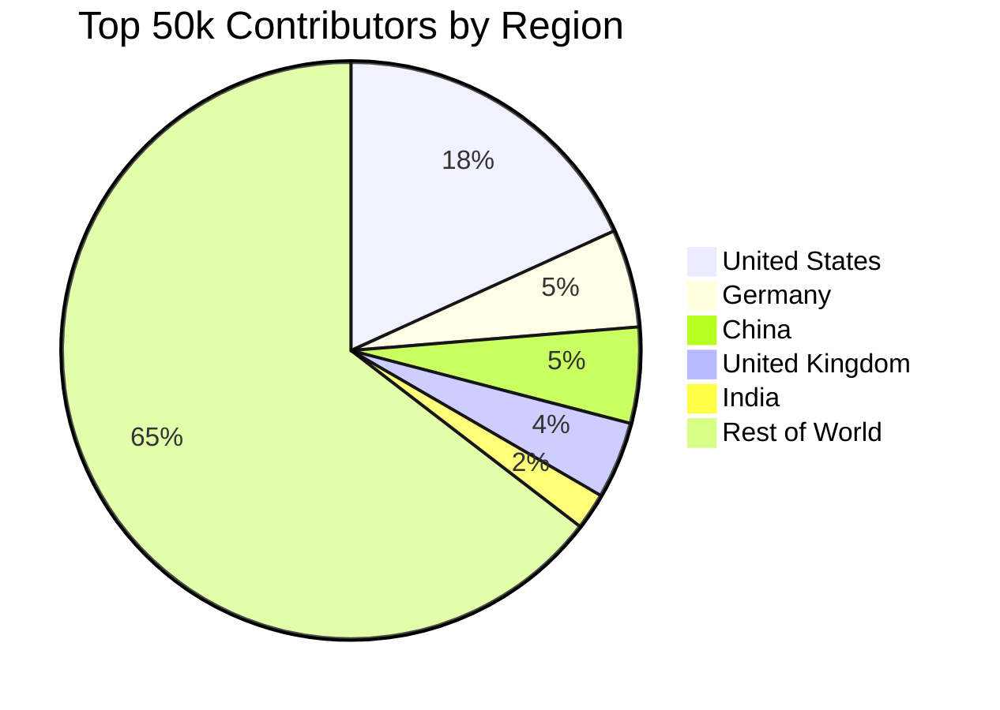

# Persona Guide: Policy Makers & Gov Funding

Open-source software (OSS) is the invisible infrastructure of the modern digital economy. It powers everything from global banking systems to national security infrastructure. Yet, unlike physical infrastructure (roads, bridges, power grids), this digital infrastructure is overwhelmingly maintained by unpaid volunteers.

DevIndex provides empirical, undeniable data for policymakers, economists, and government funding bodies to visualize the disparity between open-source consumption and production on a global scale. 

This guide explains how to use DevIndex to uncover the macro-economic realities of the FOSS (Free and Open Source Software) ecosystem.

## 1. Visualizing the Global Disparity

By utilizing the **Country** filter in the Controls panel (`≡`), policymakers can isolate the top 50,000 global contributors by region. When you filter by country, the footer of the grid dynamically updates to show the *Total Contributions* generated by those specific developers. 

This reveals staggering disparities. The following data (as of February 23, 2026) highlights the structural and incentive gaps across different nations:

### The "Unpaid Infrastructure" Overperformers
Some nations punch massively above their weight class, generating a disproportionate amount of the world's open-source infrastructure with little to no national funding strategies.

*   **Germany (2,746 slots | 5.49% of global top 50k):**
    With a population of 84 million (~1.05% of the global population), Germany represents an over **5x overperformance** relative to its size. The total contributions generated by these 2,746 ultra-prolific developers represent an enormous, largely unpaid infrastructure investment. The ratio of this multi-billion-dollar output to the actual FOSS funding allocated by the German government is indefensible.
*   **United Kingdom (2,157 slots | 4.31% of global top 50k):**
    With a population of 68 million (~0.85% of the global population), the UK shows over a **5x overperformance**. Similar to Germany, this represents massive per-capita OSS output with no meaningful national FOSS strategy to support the maintainers carrying this load.
*   **United States (9,101 slots | 18.20% of global top 50k):**
    With a population of 340 million (~4.2% of global), the US shows over a **4.3x overperformance**. While the US benefits from some indirect OSS funding (NSF grants, DARPA, corporate tax incentives for foundations), the financial support is still nowhere near proportional to the actual economic value output, but it is notably better than zero.

### The Structural & Ecosystem Gaps
Conversely, some of the world's largest tech economies are conspicuously missing or underrepresented in the ultra-prolific tier.

*   **India (1,028 slots | ~2.06% of global top 50k):**
    With a population of 1.4 billion (~17.5% of the global population), India is underperforming by roughly **8.5x** relative to its size. In absolute terms, this is less than half the output of the UK with 20 times the population. 
    This is *not* a talent gap; it is a structural and incentive gap. Given India's $200B+ IT services export industry, the country is consuming open-source infrastructure at massive scale but contributing back at a fraction of its potential. Issues like time poverty, lack of local corporate FOSS incentives, and the brain drain of top talent to FAANG companies create a scenario where developers cannot afford to do unpaid open-source work.
*   **China (2,686 slots | ~5.37% of global top 50k):**
    Also with a population of 1.4 billion, China underperforms by roughly **3.2x** relative to its population. However, in absolute terms, China produces nearly as many ultra-prolific contributors as Germany. 
    The story here is ecosystem fragmentation rather than a talent gap. Massive internal platforms (like Gitee), language barriers, and the Great Firewall mean Chinese developers often do not contribute to the Western-centric GitHub graph at the same rate.
*   **Africa & South America:**
    Massive developer populations across these continents have almost zero representation in the ultra-prolific tier, highlighting global disparities in tech infrastructure, free time, and economic stability required to participate in unpaid global labor.

## 2. The Policy Argument: Funding the Foundation

The data provided by DevIndex doesn't need editorializing. When researchers and policymakers filter the index by country and see the raw output generated by their citizens—and compare that to the near-zero national budgets allocated to FOSS maintenance—the ratio speaks for itself.

If roads or water systems were maintained exclusively by volunteers working nights and weekends, governments would recognize it as a critical national security and economic risk. DevIndex provides the empirical data necessary to prove that our digital infrastructure is currently operating under exactly those precarious conditions.

This data should be used to justify and structure immediate national and institutional FOSS funding initiatives, moving from corporate charity to structured infrastructure maintenance.