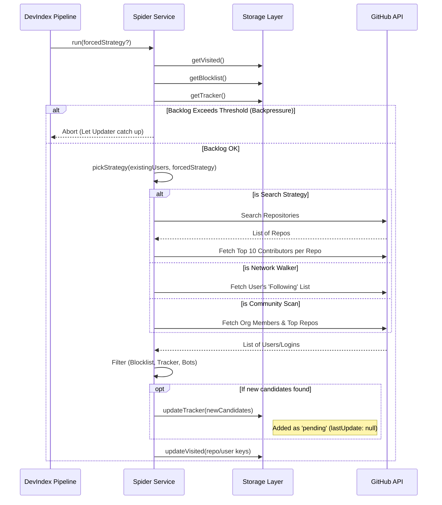

# The Spider (Discovery Engine)

The **Spider Service** ([`DevIndex.services.Spider`](https://github.com/neomjs/neo/blob/dev/apps/devindex/services/Spider.mjs)) is the core discovery engine for the DevIndex application. Its primary responsibility is to autonomously traverse the GitHub social graph and repository ecosystem to find new, qualified developer profiles to add to our tracking queue (`tracker.json`).

Unlike a simple, linear scraper that repeatedly scans the same "Top 100" lists, the Spider is designed as a **Multi-Strategy Graph Crawler**. It employs a weighted "Random Walk" architecture to deliberately avoid "Filter Bubbles" and discover high-value contributors who might otherwise remain hidden.

---

## The "Filter Bubble" Problem

A major challenge in building a comprehensive developer index is that the most famous repositories do not necessarily house all the best engineers. Many highly skilled developers—"Hidden Whales"—work on niche projects, foundational infrastructure, or within specific communities that don't accrue tens of thousands of stars.

If a discovery engine only relies on basic queries like "find repositories with >1000 stars", it will repeatedly scan the same mainstream projects (React, Vue, Linux, etc.), completely ignoring the vibrant "long tail" of the open-source ecosystem.

---

## In-Depth: Discovery Strategies & Tuning

To ensure broad and equitable coverage, the `pickStrategy()` method uses a weighted probability distribution to select one of several distinct discovery methods on each execution run.

### Strategy Evolution (Approaching 50k Users)

The probability weights assigned to each strategy are dynamic and have evolved as the DevIndex matured. 

When the index was entirely empty, strategies like "Community Scan" and "Core: High Stars" were heavily prioritized to build a foundational base and ensure diversity from day one. However, as the index approaches our `maxUsers` cap (currently 50,000), the focus has shifted. The **Network Walker** is currently our strongest engine. Traversing the established graph yields the highest density of new, high-quality candidates, leveraging the "wisdom of the crowd" we have already indexed.

### 1. Network Walker (30% Probability)
**The Concept:** "Great engineers follow other great engineers."
*   **Mechanism:** This strategy selects a random, already-indexed user and fetches the list of people they are *following* on GitHub.
*   **Rationale:** This acts as a "Depth-First" social graph traversal. A senior architect might only have 50 followers and 100 stars on their personal repos, but they are likely followed *by* other senior engineers we have already found. This strategy breaks out of star-count echo chambers.

### 2. Core: High Stars with Dynamic Slicing (25% Probability)
**The Concept:** "Find the builders of established projects."
*   **Mechanism:** Performs a standard repository search based on star counts, but crucially utilizes **Dynamic Range Slicing**.
*   **Rationale:** The GitHub Search API hard-limits results to the top 1,000 matches. A generic query for `stars:>1000` hits this ceiling immediately.
*   **Optimization:** The Spider uses a cubic function (`Math.pow(Math.random(), 3)`) to randomly select a lower bound, heavily skewing towards the densely populated 1,000-5,000 star range. It then queries a narrow slice (e.g., `stars:1500..2500`). This ensures we systematically index the entire "long tail" of established projects without hitting API truncation.

### 3. Discovery: Keyword / Dictionary Attack (20% Probability)
**The Concept:** "Find specialists in specific technical domains."
*   **Mechanism:** Selects a random technical term from a predefined dictionary (e.g., `compiler`, `wasm`, `physics`, `neural`) and searches for repositories matching that topic with a lower star threshold (`stars:>50`).
*   **Rationale:** This specifically targets niche but highly complex fields. An open-source physics engine might only have 200 stars, but its contributors are likely exceptional engineers we want to index, regardless of mainstream popularity.

### 4. Discovery: Temporal Slicing (15% Probability)
**The Concept:** "Find the hidden gems of the past decade."
*   **Mechanism:** Generates a random one-week date range within the last 10 years and searches for repositories created in that specific window with `stars:>50`.
*   **Rationale:** GitHub's default search strongly biases towards recently active or continuously popular projects. Temporal slicing ensures we discover foundational projects that may be "complete" and no longer actively accruing stars, but whose creators remain highly experienced veterans.

### 5. Community Scan & Stargazer Leaps (10% Combined)
*   **Community Scan (5%):** Scans the public members and top repositories of specific diversity-focused organizations (e.g., `PyLadies`, `WomenWhoCode`). This ensures our indexing proactively reaches beyond algorithmic biases.
*   **Stargazer Leap (5%):** Selects a random indexed user and fetches the repositories they have *starred*, then scans those repos for contributors. This connects isolated clusters of repositories that share similar audiences but lack direct contributor overlap.

---

## Architectural Flow

The following sequence diagram illustrates the core processing loop of the `Spider` service.



---

## Resilience & Safety Mechanisms

The Spider is an aggressive crawler. To prevent it from overwhelming the system or burning through API quotas unnecessarily, it implements several critical safety features.

### 1. The Backpressure Valve
The subsequent **Updater Service** requires significantly more API quota to perform deep analysis on each candidate discovered by the Spider. To prevent the `tracker.json` backlog from ballooning out of control, the Spider implements a backpressure valve:

```javascript readonly
const pendingCount = existingUsers.filter(u => u.lastUpdate === null).length;

if (pendingCount >= config.spider.maxPendingUsers) {
    console.log(`[Spider] Backpressure Valve Triggered...`);
    console.log(`[Spider] Aborting discovery run to let the Updater catch up.`);
    return; // Halt the run
}
```
This guarantees that the DevIndex pipeline prioritizes analyzing the candidates it has already found over blindly accumulating more.

### 2. Rate Limit Monitoring & Graceful Degradation
The Spider constantly monitors the GitHub API Rate Limit headers (`core` and `search` buckets). If the remaining quota drops below a safe threshold (e.g., `<50` for core requests), it will log a critical warning (including estimated recovery time) and immediately halt the current operation, saving a checkpoint before exiting.

### 3. Checkpointing
During long-running strategies (like paginating through search results), the Spider periodically saves its progress to `tracker.json` and `visited.json`. If a run is interrupted by a rate limit or a network failure, the data is not lost, and the next run will avoid re-scanning the same resources.