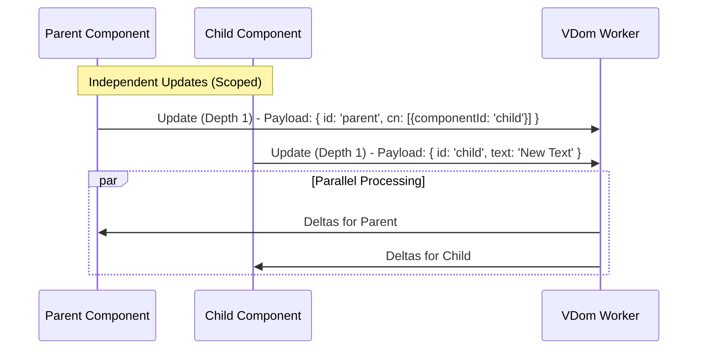
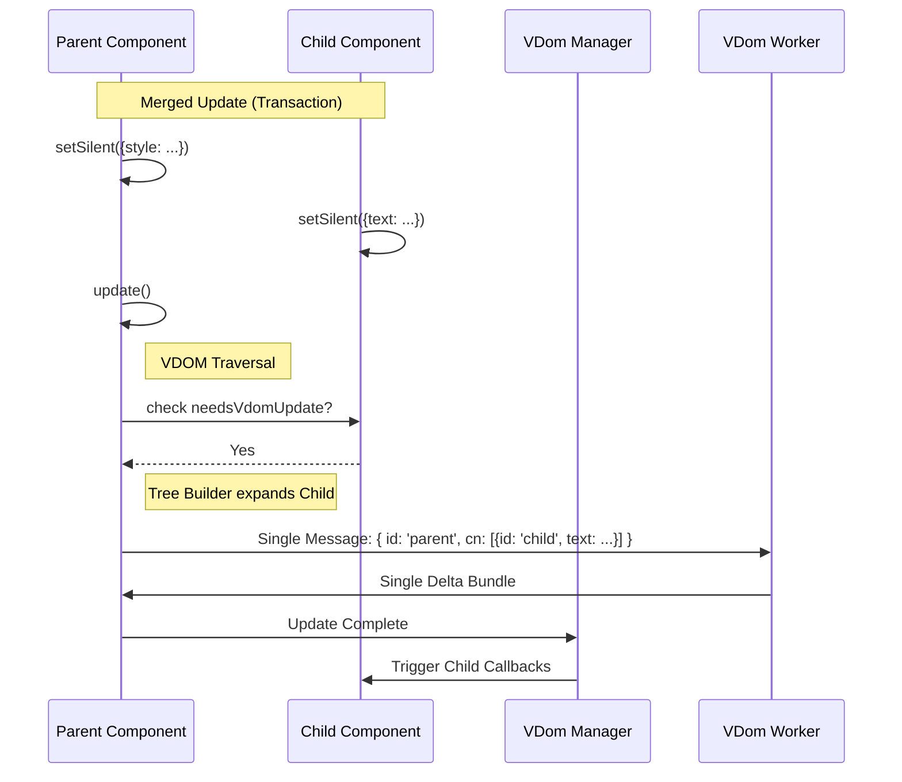
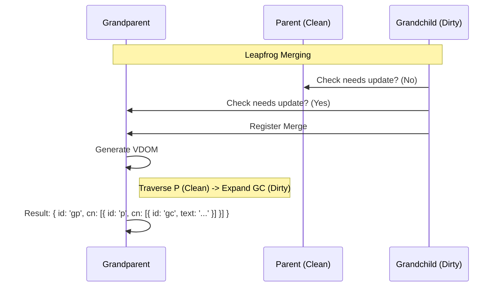

# Asymmetric VDOM Updates: A Technical Deep Dive

One of Neo.mjs's most powerful performance features is its ability to perform **Asymmetric VDOM Updates**. This capability allows the framework to update different parts of the component tree independently, in parallel, or merged into a single atomic transaction, depending on the most efficient strategy for the current state.

This guide provides a technical deep dive into the VDOM engine's update logic, the mechanics of "Scoped Updates," the "Merging" optimization algorithm, and the "Transaction Pattern."

## The Problem: The Cost of "The Tree"

In traditional Virtual DOM frameworks (like React or Vue), an update often implies re-rendering a significant portion of the component tree. When a parent component updates, it typically re-renders its children. This is "Symmetric" - the render tree matches the component tree.

However, in a multi-threaded environment like Neo.mjs, sending large VDOM trees across the worker bridge is expensive. We want to send the *minimum amount of data possible*.

## The Solution: Scoped Updates (Depth 1)

By default, Neo.mjs uses **Scoped Updates**. When you change a reactive config on a component, the framework calculates the VDOM diff **only for that specific component**, ignoring its children.

### How it Works

Every component has an `updateDepth` config, which defaults to `1`.

*   **Depth 1**: Only the component's own VDOM nodes are traversed.
*   **Child Placeholders**: Any child components inside the VDOM are represented as lightweight placeholders: `{ componentId: 'child-1' }`.
*   **Disjoint Sets**: Because the Parent's update only sees placeholders, and the Child's update sees its own full VDOM, the two operations effectively touch **disjoint sets of DOM nodes**.

This allows a Parent and a Child to update **simultaneously and independently** without conflict.



## Merging: The Optimization

While parallel updates are safe, sending two messages to the worker is less efficient than sending one. If we know that a Parent and a Child are both updating at the same time, we can **merge** the Child's update into the Parent's payload.

This is controlled by the `canMergeUpdate` logic in `Neo.mixin.VdomLifecycle`.

### The Logic (`<=`)

A child update can merge into a parent update if:
`distanceToParent <= parent.updateDepth`

Since the default `updateDepth` is `1`, a direct child (distance 1) *can* merge if the timing aligns.

### The Benefit

1.  **Reduced Traffic**: One message to the VDOM worker instead of N.
2.  **Atomic Paint**: The browser paints the Parent and Child changes in the same frame, preventing visual "pop-in" or layout thrashing.
3.  **Leapfrog Merging**: A Grandchild can merge into a Grandparent even if the intermediate Parent is not updating.



## The Transaction Pattern

To force multiple components to update together in a single atomic batch, use the **Transaction Pattern**. This involves setting configs silently (`setSilent`) and then triggering a single update on the highest-level component.

### Example: Updating a Toolbar

Imagine a Toolbar (Parent) with three Buttons (Children). You want to change the Toolbar's style and update the text of all three buttons simultaneously.

```javascript
// 1. Queue updates silently (no worker messages sent yet)
toolbar.setSilent({ cls: ['my-active-toolbar'] });

button1.setSilent({ text: 'Save' });
button2.setSilent({ text: 'Cancel' });
button3.setSilent({ iconCls: 'fa fa-trash' });

// 2. Trigger the transaction
// The toolbar sees that its children are "dirty" (need update)
// and bundles their changes into its own VDOM payload.
toolbar.update();
```

### What happens under the hood?

1.  `setSilent` flags the components as `needsVdomUpdate` but does not trigger the `updateVdom` scheduler.
2.  `toolbar.update()` starts the cycle for the parent.
3.  The framework traverses the VDOM. When it encounters the placeholders for the buttons, it checks if they need an update.
4.  Since `needsVdomUpdate` is true for the buttons, and they are within range (`distance <= updateDepth`), the framework **expands** their VDOM into the parent's tree instead of leaving them as placeholders.
5.  The VDOM worker receives one large tree, diffs it, and produces one set of DOM deltas.

## Leapfrog Merging

One of the most advanced capabilities of the engine is **Leapfrog Merging**. This occurs when a deep descendant (Grandchild) needs to update, but its direct Parent does not. If the Grandparent is updating, the Grandchild can "leap" over the clean Parent and merge into the Grandparent's cycle.

This solves the "Pruning Problem": if the Parent is clean, the VDOM engine normally wouldn't even look at its children. By explicitly registering the merge, the engine knows to traverse through the clean Parent to find the dirty Grandchild.



## The Promise Lifecycle

A critical architectural feature of Neo.mjs is that `promiseUpdate()` **always resolves**, even if the component didn't send its own update message.

When you call `await child.promiseUpdate()`, and that child ends up being merged into a parent, the `VDomUpdate` manager tracks this relationship.

1.  **Registration**: When `child` merges into `parent`, the manager records `parent -> [child]`.
2.  **Execution**: When `parent` receives its deltas from the worker, it notifies the manager.
3.  **Resolution**: The manager looks up all merged children for that parent and executes their callbacks.

This ensures that your code flow remains consistent regardless of whether the update was standalone or merged.

```javascript
// This awaits successfully even if 'child' never sends a message!
await child.promiseUpdate();
console.log('Update done (possibly merged)');
```

## Best Practices

### When to use Independent Updates (Default)
*   **Unrelated Interactions**: A user hovering a button while a chart updates in the background.
*   **Performance Isolation**: When one component is very heavy (e.g., a Data Grid) and you don't want to block the UI of lighter components.

### When to use Merged Updates (Transactions)
*   **Visual Consistency**: When a UI state change affects multiple components that visually belong together (e.g., changing a Theme, disabling a Form).
*   **Layout Stability**: When changing a parent's layout (e.g., `vbox` to `hbox`) while simultaneously changing children's `flex` configs. Doing this separately could cause a frame of broken layout.
*   **Mass Updates**: Loading a complex view where 50+ components are created/updated at once.

## Summary

| Feature | Default | Purpose | Logic |
| :--- | :--- | :--- | :--- |
| **Scoped Update** | `updateDepth: 1` | Performance, Parallelism | Update only self, use placeholders for children. |
| **Merging** | Automatic | Optimization, Atomicity | Bundle child updates into parent if `dist <= depth`. |
| **Transaction** | `setSilent` | Coordinated State Changes | Manually queue updates, flush with `parent.update()`. |