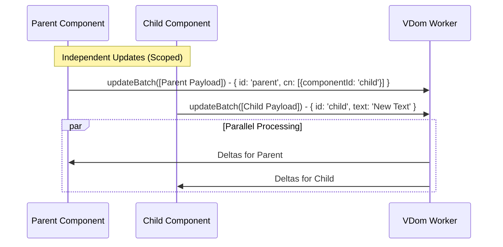
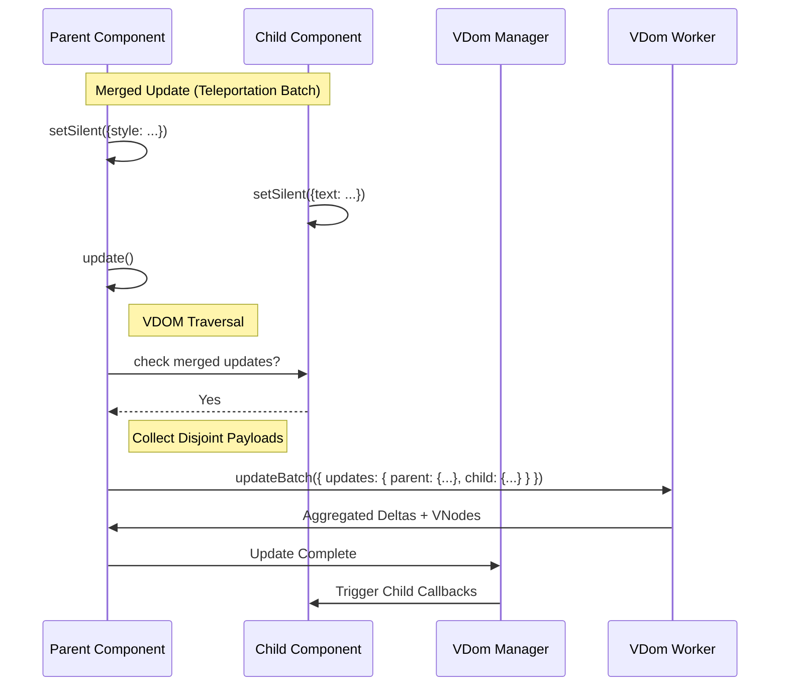
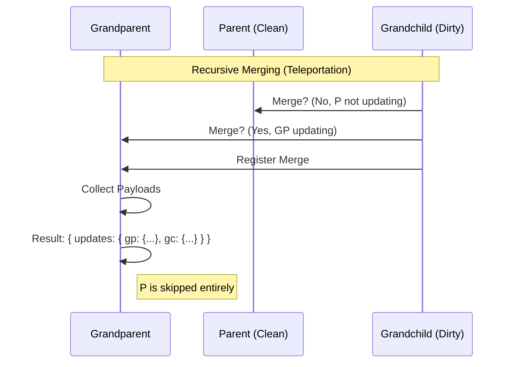

# Asymmetric VDOM Updates: A Technical Deep Dive

## TL;DR

Neo.mjs can update Parent and Child components **independently and in parallel**, or merge them into a single atomic transaction—whichever is most efficient.

This is a fundamental shift from traditional frameworks where Parent updates typically force Child re-renders. We designed for multi-threaded, worker-based rendering from day one.

**Key innovations:**
- **Scoped Updates**: Disjoint updates (Depth 1) run in parallel.
- **Teleportation**: Updates can "teleport" across the component tree, allowing deep descendants to update without parent involvement.
- **Recursive Merging**: Bundles child updates into parent messages (`dist <= updateDepth`).
- **Transaction Pattern**: Atomic multi-component updates via `setSilent`.

---

One of Neo.mjs's most powerful performance features is its ability to perform **Asymmetric VDOM Updates**.

**The Problem:** In many frameworks, updating a Parent component forces a re-evaluation of its entire subtree. Even with memoization, the main thread must traverse the tree to decide what to skip.
**The Solution:** Neo.mjs treats the component tree as a collection of disjoint sets. A Parent and a Child can update **independently and in parallel** because the VDOM engine runs off the main thread and understands "Scoped Updates".

This guide provides a technical deep dive into the VDOM engine's update logic, the mechanics of "Scoped Updates," the "Merging" optimization algorithm, and the "Transaction Pattern."

## The Problem: The Cost of "The Tree"

In traditional Virtual DOM frameworks (like React or Vue), an update often implies re-rendering a significant portion of the component tree. When a parent component updates, it typically re-renders its children. This is "Symmetric" - the render tree matches the component tree.

However, in a multi-threaded environment like Neo.mjs, sending large VDOM trees across the worker bridge is expensive. We want to send the *minimum amount of data possible*.

## The Solution: Scoped Updates (Depth 1)

By default, Neo.mjs uses **Scoped Updates**. When you change a reactive config on a component, the framework calculates the VDOM diff **only for that specific component**, ignoring its children.

### How it Works

Every component has an `updateDepth` config, which defaults to `1`.

*   **Depth 1**: Only the component's own VDOM nodes are traversed.
*   **Child Placeholders**: Any child components inside the VDOM are represented as lightweight placeholders: `{ componentId: 'child-1' }`.
*   **Disjoint Sets**: Because the Parent's update only sees placeholders, and the Child's update sees its own full VDOM, the two operations effectively touch **disjoint sets of DOM nodes**.

This allows a Parent and a Child to update **simultaneously and independently** without conflict.



## Merging: The Optimization (Teleportation)

While parallel updates are safe, sending two messages to the worker is less efficient than sending one. If we know that a Parent and a Child are both updating at the same time, we can **merge** the Child's update into the Parent's payload.

With the **Teleportation** architecture, merging does **not** mean expanding the Child inside the Parent's VDOM tree (which would require updating the Parent's structure). Instead, it means bundling the Child's disjoint update payload into the same `updateBatch` message as the Parent.

This is controlled by the `canMergeUpdate` logic in `Neo.mixin.VdomLifecycle`.

### The Logic

A child update can merge into a parent update regardless of distance. The `executeVdomUpdate` method recursively collects all merged children and generates a batch of disjoint payloads.

### The Benefit

1.  **Reduced Traffic**: One message to the VDOM worker instead of N.
2.  **Atomic Paint**: The browser paints the Parent and Child changes in the same frame, preventing visual "pop-in" or layout thrashing.
3.  **Recursive Merging**: A Grandchild can merge into a Grandparent even if the intermediate Parent is not updating.



## The Transaction Pattern

To force multiple components to update together in a single atomic batch, use the **Transaction Pattern**. This involves setting configs silently (`setSilent`) and then triggering a single update on the highest-level component.

### Example: Updating a Toolbar

Imagine a Toolbar (Parent) with three Buttons (Children). You want to change the Toolbar's style and update the text of all three buttons simultaneously.

```javascript
// 1. Queue updates silently (no worker messages sent yet)
toolbar.setSilent({ cls: ['my-active-toolbar'] });

button1.setSilent({ text: 'Save' });
button2.setSilent({ text: 'Cancel' });
button3.setSilent({ iconCls: 'fa fa-trash' });

// 2. Trigger the transaction
// The toolbar sees that its children are "dirty" (need update)
// and bundles their changes into its own VDOM payload.
toolbar.update();
```

### What happens under the hood?

1.  `setSilent` flags the components as `needsVdomUpdate` but does not trigger the `updateVdom` scheduler.
2.  `toolbar.update()` starts the cycle for the parent.
3.  The framework recursively collects `mergedChildIds`.
4.  It generates a **disjoint payload** for the Toolbar and one for each Button.
5.  It sends a single `updateBatch` message containing all 4 payloads.
6.  The VDOM worker processes them sequentially and returns a single set of deltas.

## Recursive Merging (formerly Leapfrog)

One of the most advanced capabilities of the engine is **Recursive Merging**. This occurs when a deep descendant (Grandchild) needs to update, but its direct Parent does not. If the Grandparent is updating, the Grandchild can merge into the Grandparent's cycle.

In a traditional merge model, the Grandparent would have to "bridge" to the Grandchild by expanding the clean Parent.
With **Teleportation**, this is much simpler: The Grandchild simply adds its disjoint payload to the Grandparent's batch. The clean Parent is ignored entirely.

This solves the "Pruning Problem" without the O(N) overhead of bridging.



## The Promise Lifecycle

A critical architectural feature of Neo.mjs is that `promiseUpdate()` **always resolves**, even if the component didn't send its own update message.

When you call `await child.promiseUpdate()`, and that child ends up being merged into a parent, the `VDomUpdate` manager tracks this relationship.

1.  **Registration**: When `child` merges into `parent`, the manager records `parent -> [child]`.
2.  **Execution**: When `parent` receives its deltas from the worker, it notifies the manager.
3.  **Resolution**: The manager looks up all merged children for that parent and executes their callbacks.

This ensures that your code flow remains consistent regardless of whether the update was standalone or merged.

```javascript
// This awaits successfully even if 'child' never sends a message!
await child.promiseUpdate();
console.log('Update done (possibly merged)');
```

## Neo.mjs vs React: VDOM Update Strategies

| Scenario | React | Neo.mjs |
| :--- | :--- | :--- |
| **Parent style change, Child unchanged** | Re-renders Child by default (unless memoized). | Updates **only** Parent (Scoped Update). Child is a placeholder. |
| **Parent + Child both changing** | Single render pass. Large payload. | Can **Merge** (atomic) OR **Parallelize** (disjoint). |
| **Grandchild dirty, Parent clean** | Walks entire tree to find dirty node. | **Teleportation** (Grandchild updates in batch, skipping Parent). |
| **50 components updating** | 50 re-renders (unless batched). | **1 Transaction** (atomic paint via `setSilent`). |
| **Multi-threaded environment** | Not designed for this. | Optimized for **Worker Bridge** traffic. |

## When Does This Matter?

### For Traditional Apps
In typical single-page apps, these optimizations are nice-to-haves. React's main-thread scheduling is generally fast enough for standard forms and lists.

### For AI-Driven & Multi-Window Apps
This architecture becomes critical in two scenarios:

1.  **Conversational UIs (AI Agents)**:
    When an AI agent (like Gemini) decides to "update the chart, reset the filters, and change the grid selection" all at once, it triggers multiple state changes across the app.
    *   **React**: Might trigger cascading re-renders and main-thread blocking.
    *   **Neo.mjs**: Can batch these into a single worker message using the **Transaction Pattern**, ensuring the UI updates atomically without flicker.

2.  **Multi-Window Applications**:
    Neo.mjs runs the entire application in a SharedWorker (App Worker). This means one App Worker controls multiple browser windows.
    *   **Disjoint Updates**: A chart updating in Window A should not block a form typing in Window B. Scoped Updates ensure these are processed as independent streams.

## Architecture Constraints & Race Conditions

Implementing disjoint updates in a high-performance, multi-threaded, multi-window environment introduces unique challenges. The application engine handles these automatically, but understanding them is crucial for advanced architecture.

### 1. The Lazy Snapshot (Avoiding "Ghost Content")

When a component triggers an update (e.g., `header.hidden = true`), the framework must decide *when* to calculate the VDOM diff.
If we snapshot the VDOM synchronously at the moment of the trigger, we risk missing subsequent changes that happen in the same execution tick (e.g., a synchronous `remove()` call).

**Solution:** The VDOM lifecycle uses a **Lazy Snapshot** model.
1.  `updateVdom()` marks the component as dirty (`isVdomUpdating = true`).
2.  The process **yields to the Macrotask queue** (`await setTimeout`).
3.  This allows pending synchronous operations (like layout reflows or removals) to complete.
4.  Only then does `collectPayloads` run, ensuring it captures the *final* state of the transaction.

This prevents "Ghost Content" where a component is removed from the DOM but persists in the VDOM update payload because the snapshot was taken too early.

### 2. SharedWorker Window Isolation

In a SharedWorker environment, a single App Worker manages multiple Browser Windows.
A `Viewport` in Window A might have a `mergedChildIds` list containing a `Panel`. If that `Panel` moves to Window B (popout), it is physically gone from Window A.

**Constraint:** We must strictly **filter update payloads by Window ID**.
If `Viewport` (Window A) batches updates, it must **exclude** any merged children that have moved to Window B. Failing to do so would cause "Cross-Window Leaks", where deltas meant for the Popup are applied to the Main Window, causing corruption.

### 3. Zombie Parents (In-Flight Registry)

When a parent component starts an update, it registers itself in the `VDomUpdate` manager. This blocks it from starting overlapping updates (`isChildUpdating` check).
If a child component **moves** to a new parent while an update is in-flight, the manager must be smart enough to clear the registry for the **old parent**, not just the new one.

**Solution:** The registry tracks dependencies via a direct map (`descendantInFlightMap`). Cleanup iterates this map directly rather than walking the live component tree (which might have changed). This prevents "Zombie Parents" from being permanently blocked by children they no longer own.

## Best Practices

### When to use Independent Updates (Default)
*   **Unrelated Interactions**: A user hovering a button while a chart updates in the background.
*   **Performance Isolation**: When one component is very heavy (e.g., a Data Grid) and you don't want to block the UI of lighter components.

### When to use Merged Updates (Transactions)
*   **Visual Consistency**: When a UI state change affects multiple components that visually belong together (e.g., changing a Theme, disabling a Form).
*   **Layout Stability**: When changing a parent's layout (e.g., `vbox` to `hbox`) while simultaneously changing children's `flex` configs. Doing this separately could cause a frame of broken layout.
*   **Mass Updates**: Loading a complex view where 50+ components are created/updated at once.

## Summary

| Feature | Default | Purpose | Logic |
| :--- | :--- | :--- | :--- |
| **Scoped Update** | `updateDepth: 1` | Performance, Parallelism | Update only self, use placeholders for children. |
| **Teleportation** | Automatic | Optimization, Atomicity | Bundle child updates into parent batch (`updateBatch`). |
| **Transaction** | `setSilent` | Coordinated State Changes | Manually queue updates, flush with `parent.update()`. |