# Neural Link MCP Server

AI agents are blind in traditional frameworks. They can read your code, but they cannot see your running application.

The **Neural Link** changes this. It is a bidirectional bridge that connects AI agents directly to the living runtime of your Neo.mjs application—allowing them to inspect state, modify components, and debug issues in real-time.

It transforms Neo.mjs into an **AI-Native** platform where agents act as first-class citizens alongside human developers.

## Why the Neural Link Matters

In traditional frameworks:
- **The AI is guessing.** It can see your JSX source code, but the running DOM is a transformed soup of `<div>` tags.
- **The AI cannot verify.** It writes a fix, you test it manually, report back. The feedback loop is measured in minutes.
- **The AI cannot explore.** It has no way to ask "What components are on this page right now?"

With the Neural Link:
- **The AI can see.** It queries the Scene Graph and gets the actual runtime object hierarchy.
- **The AI can verify.** It simulates a click, checks the result, and confirms its own fix—all in seconds.
- **The AI can explore.** It can inspect state, measure DOM positions, and read event listeners like a human using DevTools.

**This is the difference between an AI assistant and an AI developer.**

## Configuration Strategy

To optimize your AI context window and tool limits, we recommend different configurations based on your operational mode.

### 1. Collaborative Mode (Human + Agent)
**Best for:** Daily development, pair programming, debugging.

In this mode, **you** act as the browser manager. You open the browser, navigate to the page, and the Agent "hitches a ride" via the Neural Link.
- **Enable:** `neo.mjs-neural-link`
- **Disable:** `chrome-devtools` (Save 26 tool slots)

**Why:** The agent doesn't need to open tabs if you are already there. It needs deep introspection into the Neo.mjs runtime, which Neural Link provides and Chrome DevTools does not.

### 2. Autonomous Mode (Agent OS)
**Best for:** CI/CD, nightly regression testing, autonomous "Night Watchman" agents.

In this mode, the Agent is alone. It must be able to launch its own environment.
- **Enable:** `neo.mjs-neural-link` (For inspection)
- **Enable:** `chrome-devtools` (For lifecycle: Open Browser, Navigate, Reload)

## Architecture

The Neural Link consists of three main components arranged in a star topology:

1.  **The Bridge (WebSocket Hub):** A standalone Node.js process that acts as the central message broker.
2.  **The Client (Browser Runtime):** A specialized service running inside the Neo.mjs application (`Neo.ai.Client`) that exposes the runtime state.
3.  **The Server (MCP):** The Model Context Protocol server that exposes tools to AI agents (like Claude or Gemini).

```mermaid
graph TD
    Agent[🤖 AI Agent] <-->|MCP| Server[📡 MCP Server]
    Server <-->|WebSocket| Bridge[🌉 Bridge :8081]
    Bridge <-->|WebSocket| App[⚙️ Neo.mjs Runtime]
```



### The Bridge: A Shared World

Think of the Bridge as a **switchboard operator** from the 1950s. Multiple callers (AI agents) can dial in, and the operator connects them to the same destination (your running app).

The Bridge running on `ws://localhost:8081` creates a "Shared World".
- A Claude Desktop agent can inspect the component tree.
- A VSCode agent can modify a config.
- Both see the same runtime state in real-time.

### The Client

The `Neo.ai.Client` is a singleton within the application's App Worker. It is **tree-shakeable** and **opt-in**, ensuring zero overhead for production applications that don't use it. It communicates with the Bridge using a JSON-RPC 2.0 protocol.

### The `toJSON` Protocol: Teaching the App to Speak "Machine"

For an AI to "understand" your application, it needs a standardized language. Neo.mjs implements a comprehensive `toJSON` protocol across 60+ classes.

**Why this matters:**
- When an agent asks for a component, it doesn't get a raw JavaScript object with circular references and internal noise.
- It gets a **Rich Blueprint**: the class name, inheritance chain, config values, bound state, and active event listeners—everything semantically meaningful.

This is why agents can reason about Neo.mjs apps with high fidelity while remaining "blind" to React/Vue apps.

## Installation & Setup

### 1. Enable the Client (App Side)

To enable the Neural Link in your application, add the `useAiClient` flag to your `neo-config.json`. This tells the Main Worker to load the `Neo.ai.Client` module.

```javascript readonly
{
    "appPath": "apps/myApp/app.mjs",
    "useAiClient": true // 👈 This is the magic flag
}
```

### 2. Configure the MCP Server (Agent Side)

Add the Neural Link server to your MCP configuration (e.g., `claude_desktop_config.json` or VSCode settings).

```json readonly
{
  "mcpServers": {
    "neo-neural-link": {
      "command": "npm",
      "args": ["run", "ai:mcp-server-neural-link"]
    }
  }
}
```

### 3. Start the Bridge (Optional but Recommended)

For the best experience, especially if using multiple agents, run the bridge as a standalone background process:
```bash
npm run ai:server-neural-link
```

**Bridge Lifecycle:**
- If the Bridge is already running, the MCP server detects and connects to it automatically
- If not running, the MCP server spawns a managed Bridge process in the background
- The Bridge runs detached and persists even if the MCP server exits
- Bridge logs are written to `./bridge.log` in your project root
- To stop: Use the `manage_connection` tool with `action: 'stop'` or manually kill the process

**Multi-Agent Coordination:**
When multiple AI agents connect to the same Bridge, they share a single view of the runtime:
- Agent 1 (Claude Desktop) queries the component tree
- Agent 2 (VSCode) modifies a button's text
- Both see the same state with zero conflicts

## How It Works Under the Hood

**The Request Flow:**
1. **Agent** → Sends JSON-RPC call to MCP Server (e.g., `get_component_tree`)
2. **MCP Server** → Wraps call in routing envelope: `{target: 'appWorkerId', message: {...}}`
3. **Bridge** → Routes message to target App Worker's WebSocket
4. **App Worker (Client)** → `Client.mjs` receives message, delegates to appropriate Service
5. **Service** → Executes the operation (e.g., `ComponentService.getComponentTree()`)
6. **Service** → Serializes result using `toJSON` protocol
7. **App Worker** → Sends JSON-RPC response back through Bridge
8. **Bridge** → Broadcasts response to **all connected Agents** (enabling multi-agent collaboration)
9. **MCP Server** → Resolves the Promise, returns result to Agent

**Key Insight:** The Bridge doesn't understand Neo.mjs semantics—it's a dumb message router. All intelligence lives in the App Worker's service layer.

## Architecture (Advanced)

### Client-Side Service Pattern

The Neural Link client uses a **Domain Service Architecture** to organize functionality:
```text readonly
Neo.ai.Client (Orchestrator)
├── ComponentService   → UI inspection & manipulation
├── DataService        → Stores, records, state providers
├── InstanceService    → Generic instance operations
├── InteractionService → Event simulation
└── RuntimeService     → Environment, routing, hot-patching
```

**Why This Matters:**
- Each service is independently testable and documented.
- The `serviceMap` in `Client.mjs` routes JSON-RPC methods to the correct service based on prefix matching.
- Services use a shared `safeSerialize()` method to handle Neo instances, ensuring circular references don't break JSON serialization.

This architecture allows agents to operate on the application without understanding Neo.mjs internals—they just call standardized RPC methods.

### Automatic State Recovery

When the Neural Link reconnects (after a browser refresh or network interruption), it automatically rehydrates:
1. **App Worker Registration**: Sends environment, userAgent, and worker type to the Bridge.
2. **Window Topology**: Re-registers all open browser windows with their dimensions and positions.
3. **Drag State**: If a drag operation was active, it notifies agents of the current drag context.

This means agents never lose track of the application state, even across page reloads.

### Advanced Configuration

**RPC Timeout:**
By default, Neural Link operations timeout after a configured duration (typically 30 seconds for complex operations like `get_component_tree` on large apps). You can adjust this in your AI config if needed.

**Multi-Agent Coordination:**
The Bridge tracks all connected agents via `activeAgents`. Multiple agents can query the same session simultaneously without conflicts—all responses are broadcast to every connected agent, enabling collaborative debugging.

## Tool Reference

The Neural Link exposes 33 tools categorized by domain.

> **Definitive Reference:** The complete specifications are in `ai/mcp/server/neural-link/openapi.yaml`. This file is the single source of truth for parameters, validation, and usage. If there's a discrepancy between this guide and the OpenAPI spec, the spec is correct.

### 1. Component Introspection

*"Where is the Save button? What does it look like right now?"*

These tools let agents navigate the UI structure and visual state—like Chrome DevTools, but scriptable.

| Tool | Description |
|------|-------------|
| `get_component_tree` | Retrieves the full hierarchy of UI components. Useful for understanding the page structure. |
| `query_component` | Finds components using fuzzy property matching (e.g., `{text: 'Save'}`). Returns IDs and class names. |
| `query_vdom` | Finds raw Virtual DOM nodes inside a component (e.g., finding a specific `div` or `span`). |
| `inspect_component_render_tree` | Deep inspection of a component's VDOM (blueprint) and VNode (actual DOM-aligned tree). |
| `get_computed_styles` | Retrieves the exact computed CSS styles (e.g., `backgroundColor`, `fontSize`) for a component. |
| `get_dom_rect` | Measures the physical screen coordinates and dimensions (`getBoundingClientRect`) of components. |

### 2. Data & State Management

*"What data is in the grid? How is the global state configured?"*

Tools for inspecting and modifying the application's data layer.

| Tool | Description |
|------|-------------|
| `list_stores` | Lists all active Data Stores (collections of records) in the application. |
| `inspect_store` | Retrieves records, filters, sorters, and metadata from a specific Store. |
| `get_record` | Fetches the full data object of a specific record by its ID. |
| `inspect_state_provider` | Reads the hierarchical state data from a State Provider (global or local). |
| `modify_state_provider` | Updates the data in a State Provider, triggering reactive updates across the app. |

### 3. Instance Manipulation

*"I need to change this label. I need to disable this button."*

Generic tools for working with *any* Neo.mjs instance (Components, Stores, Managers, etc.).

| Tool | Description |
|------|-------------|
| `find_instances` | powerful tool to find non-component instances (like Managers or Controllers) by property matching. |
| `get_instance_properties` | Reads specific runtime properties from any instance by ID. |
| `set_instance_properties` | **The primary control tool.** Modifies properties on an instance, triggering all reactive `beforeSet`/`afterSet` hooks. |

### 4. Runtime & System

*"Is the environment healthy? Are there errors in the console?"*

Tools for understanding the environment, topology, and execution flow.

| Tool | Description |
|------|-------------|
| `get_namespace_tree` | Discovers all loaded classes and singletons in the global `Neo` namespace. |
| `check_namespace` | Verifies if a specific class or namespace is available. |
| `get_worker_topology` | Lists all connected App Workers, their environments, and session IDs. |
| `get_window_topology` | Maps logical Window IDs to physical browser windows and their dimensions. |
| `get_console_logs` | Streams `console.log/warn/error` messages from the App Worker to the Agent. |
| `reload_page` | Forces a full reload of the application window. |
| `manage_neo_config` | Reads or updates the global `Neo.config` object at runtime. |

### 5. Navigation & Routing

*"Where am I? Take me to the settings page."*

Tools for controlling the application's URL and history.

| Tool | Description |
|------|-------------|
| `get_route_history` | Inspects the navigation history stack. |
| `set_route` | Navigates the application to a new hash-based route (e.g., `#view=profile`). |

### 6. Interaction & Debugging

*"Click that button. What's in the console? Drag that panel."*

Tools for simulating user input, debugging events, and monitoring runtime output.

| Tool | Description |
|------|-------------|
| `simulate_event` | Dispatches native DOM events (click, input, drag) to test interactions. |
| `highlight_component` | Visually flashes a border around a component in the browser. Critical for agents to confirm they "see" the right element. |
| `get_dom_event_listeners` | Lists all active DOM event listeners attached to a component, including their delegates. |
| `get_dom_event_summary` | Provides a high-level overview of the global event system state. |
| `get_console_logs` | Streams live console.log/warn/error output from the App Worker. Supports filtering by type and content. Logs generated before connection are buffered and delivered on reconnect. |

### 7. Runtime Coding & Patching

*"This logic is wrong. Let me fix it live."*

Advanced tools for "Open Heart Surgery" on the running code.

| Tool | Description |
|------|-------------|
| `inspect_class` | Returns the "Rich Blueprint" of a class: its full config system, methods, mixins, and inheritance chain. |
| `get_method_source` | Reads the actual source code of a function directly from memory. |
| `patch_code` | **Dangerous.** Replaces a method implementation at runtime. Requires `Neo.config.enableHotPatching = true`. All patches are logged for audit purposes. |

**Security Note on `patch_code`:**
- Patched methods are marked with `$isPatched = true` and `$originalSource` for debugging.
- All hot-patches are logged to the console with a warning banner.
- This tool is **disabled by default** and requires explicit opt-in via `Neo.config.enableHotPatching = true`.

## Usage Examples

### Scenario 1: UI Debugging

**User:** "Why is the Save button not blue?"
**Agent:**
1.  Calls `query_component({selector: {text: 'Save'}})` to find the button ID.
2.  Calls `get_computed_styles({componentId: 'button-1', variables: ['backgroundColor']})`.
3.  Analyzes the result and suggests a fix.

### Scenario 2: Data 

**User:** "Show me the last 5 users in the grid."
**Agent:**
1.  Calls `find_instances({selector: {className: 'Neo.data.Store'}})` to find the user store.
2.  Calls `inspect_store({storeId: 'store-1', limit: 5})`.
3.  Returns the JSON data to the user.

### Scenario 3: Live Prototyping

**User:** "Change the header title to 'Welcome Back' and make it bold."
**Agent:**
1.  Calls `query_component({selector: {ntype: 'toolbar', Dock: 'top'}})` to find the header.
2.  Calls `set_instance_properties({id: 'toolbar-1', properties: {title: 'Welcome Back', style: {fontWeight: 'bold'}}})`.
3.  The app updates instantly.

## Security Model

The Neural Link is a powerful capability, designed for **local development and trusted admin interfaces**.

**By Design:**
1. **Localhost Only:** The Bridge binds to `127.0.0.1`. It is not exposed to the network.
2. **Opt-In:** The client is tree-shakeable and not included in production bundles by default.
3. **Transparent:** All agent actions are logged, creating an audit trail.

**Legitimate Production Use Cases:**
- **Admin Dashboards:** Allow support engineers to debug live user sessions.
- **Power User Features:** Enable advanced users to customize their UI conversationally.
- **Autonomous Monitoring:** Deploy "Night Watchman" agents that detect and heal issues.

**Not Recommended For:**
- Public-facing production apps without authentication.
- Any scenario where untrusted users could access the Neural Link endpoint.

## Troubleshooting

### Connection Issues

- **"Connection Refused":** Ensure the Bridge is running (`npm run ai:server-neural-link`). Check `./bridge.log` for errors.
- **"Connection Lost" (Automatic Recovery):** The client retries up to 5 times with exponential backoff (max 30 seconds between attempts). Check browser console for reconnection logs.
- **"Max reconnection attempts reached":** Bridge or network is unstable. Restart the Bridge and check firewall settings.

### Tool Execution Issues

- **"Tool Timeout":** If the app is paused at a debugger breakpoint, resume it. For very large component trees, the 30-second default timeout may be insufficient.
- **"Component Not Found":** The UI is dynamic. Use `query_component` to find IDs at runtime rather than hardcoding them.
- **"Method not available":** Some tools require config flags. Example: `patch_code` needs `Neo.config.enableHotPatching = true`.

### Health & Diagnostics

- **"Health Check Failed":** Run the `healthcheck` tool. It reports:
  - Bridge connection status and agent ID
  - Active sessions with timestamps
  - Window topology
  - Connected agents
  - Uptime and version

  If unhealthy, restart the Bridge manually.

### State Sync

- **"Stale Window Data":** After page reload, wait 1-2 seconds for client rehydration. Use `get_window_topology` to verify.
- **"Agent Not Seeing My Changes":** Responses are broadcast to all agents. Agent B sees Agent A's changes in the NEXT tool call, not the current one.

## When to Use the Neural Link

**Ideal Use Cases:**
- Local development (primary debugging environment)
- Admin dashboards for support engineers
- Power user features (with authentication)
- Autonomous monitoring agents
- E2E testing and interaction automation

**Use With Caution:**
- Production end-user traffic (only with specific architecture)
- Multi-tenant SaaS (Bridge has no tenant isolation)

**Do NOT Use:**
- Public-facing apps without authentication (Bridge has no built-in auth)
- Shared/untrusted machines (any local process can connect to localhost:8081)

## What This Unlocks

The Neural Link is more than a debugging tool. It's the foundation for a new category of software: **Conversational Applications**.

Imagine:
- **"Make this grid sortable."** → The agent inspects the grid, adds a `HeaderButton`, and wires the click handler. Done.
- **"Why is the chart not updating?"** → The agent checks the data binding, traces the state flow, identifies the issue, and hot-patches the fix—without a reload.
- **"Move this panel to a new window."** → The agent detaches the component, creates a popup, and rehydrates the state. Seamless.

This is not science fiction. This is Neo.mjs v11.18.0.

### Beyond Interactive Debugging: Autonomous Agents

When combined with Code Execution, the Neural Link enables truly autonomous workflows. Instead of asking "What's wrong?", you can write scripts that:
1. Monitor `get_console_logs` for errors
2. Use `inspect_class` to understand architecture
3. Apply `patch_code` fixes automatically
4. Verify with `simulate_event`
