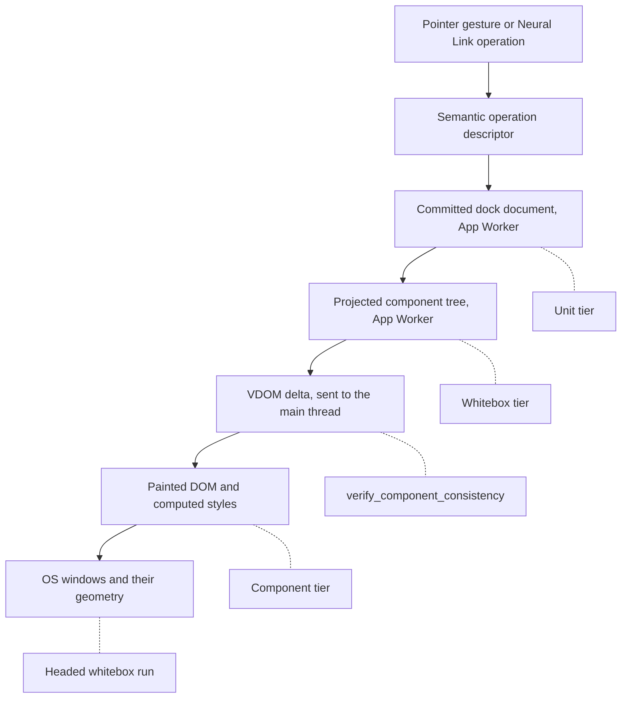
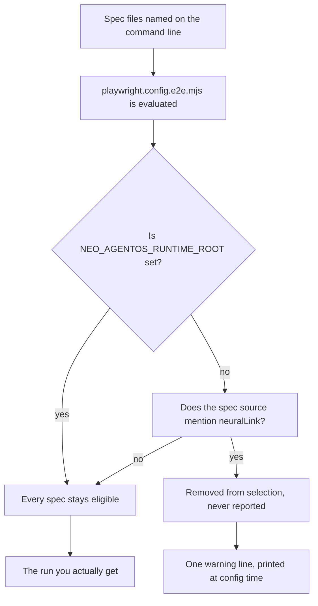

# Dock Layouts: Testing and Debugging

A docking layout makes promises that are unusually easy to break and unusually hard to observe. A pane you drag must
land in exactly one container. A pane you tear out into its own window must be the same live object when it comes
home, with its state intact. A layout you reset must equal the one you declared. And none of those promises lives in
one place.

In Neo, a single dock fact exists in several places at once. The **committed document** — which pane sits where, at
what extent — lives in the App Worker. The **component tree** that document projects lives there too. A **VDOM delta**
crosses to the main thread. The browser **paints** it, under whatever stylesheets it actually loaded. And when a pane
leaves for its own window, a **physical OS window** takes part. The main thread measures where that window stands,
and the App Worker holds the geometry in `Neo.manager.Window` only as the main thread reported it.

Most wrong answers about this subsystem were not bad assertions. They were good assertions pointed at a place that
could not contain the answer: a green test that read the document while the DOM had not followed, a red test that
measured a stylesheet the browser never loaded, a clean run that silently selected a fraction of what was asked. This
guide is about choosing the place deliberately — and about proving that your instrument can fail before you believe it
passed.

What you get from it is portable. The instruments below ship with the engine and its test harness, so your team can use
them on your own dock consumers today. The discipline — name the plane, prove the selection, give every green a red
twin — applies to any multi-threaded UI you will ever have to debug.

## Five places a dock fact lives

Follow one change from intent to glass, and attach to each stage the instrument that can actually see it:



Each stage can be right while another is wrong, and each instrument answers only for the stage it observes:

| Where the fact lives | What it knows | Instrument that can see it | What that instrument cannot see |
|---|---|---|---|
| Committed document | Pane placement, extents, perspective truth | Unit specs over the model and the Workspace host | Anything painted |
| Projected component tree | Live pane instances, identities, providers | Whitebox reads through the `neuralLink` fixture | Whether the DOM followed |
| Delivered VDOM | What the main thread was told to render | `verify_component_consistency` | Pixels and theme paint |
| Painted DOM and main-thread geometry | Element rects, computed styles, resolved tokens | The component tier; `observe_motion` for rects over time | Worker-side intent |
| Physical windows | Window position, native titlebar drags | A headed whitebox run, set against the geometry `Neo.manager.Window` holds | Whether the earlier stages were right — a correct window proves its own plane, not the path to it |

The rest of this guide is what each row costs you when you pick the wrong one.

## Pick the tier that can hold the answer

Dock tests run in three Playwright tiers, each with its own configuration file, and a fourth configuration runs the
cross-window measurements headed. Always name the file — a bare `npx playwright test` does not pick the tier you meant.
The general guides cover each tier in depth
([Unit Testing](UnitTesting.md), [Component Testing](ComponentTesting.md), [Whitebox E2E](WhiteboxE2E.md)); this section
is what matters when the subject is docking.

### Unit: the document and its rules

```bash
npx playwright test test/playwright/unit/dashboard/DockPerspectiveState.spec.mjs \
  -c test/playwright/playwright.config.unit.mjs
```

The unit tier runs the worker architecture inside one Node process, with no browser. That makes it the right home for
everything the committed document decides: operations, reducers, the transaction and undo cursor, persistence
wrappers, and the truth a Workspace publishes to its state provider. It is fast enough to run on every save, and its
`dashboard` folder alone carries more than fifty dock spec files.

Two things to know before you trust a local run of the whole tier. The `Neo` namespace persists across the files one
Playwright worker runs — the Unit Testing guide's "Safety Net" section covers what that means for class names. And a
few specs import browser bundles that only a build step produces, so a fresh checkout needs `npm run bundle-browser-deps`
first — the same step both CI test suites run before they start.

What the unit tier cannot tell you is anything a browser decides: geometry, stylesheets, paint.

### Component: a real browser, one fixture app per question

```bash
npx playwright test test/playwright/component/dashboard/DockInlineHeaderPaint.spec.mjs \
  -c test/playwright/playwright.config.component.mjs
```

Component specs boot small purpose-built apps under `test/playwright/component/apps/` — fifteen of them are dock
fixtures — inside a real Chromium, and drive them through the `neo` fixture. This is where geometry and paint become
observable: splitter hit areas, preview overlays, rail reveals, header chrome, computed token values.

The fixture app's `neo-config.json` decides which theme stylesheets exist in the document, and that decision is part of
your test. Fourteen of the fifteen dock fixtures load only the two neo themes. The one that loads all four explains why,
in the comment of the spec that uses it:

> The nested arms below need the classic theme stylesheets in the document — a theme class declares nothing if no sheet
> defines it — and that requirement belongs to THIS spec.

Add a classic theme class to an element in a fixture that never loaded its sheet, and your assertion measures an absent
stylesheet while reading like a product defect.

The configuration also protects you from a failure class that is invisible from inside a test: it starts its own server
on a free port and never reuses one, because a server already listening from another checkout would satisfy the
readiness check and serve the wrong tree to every spec.

### Whitebox: the Neural Link, and the runtime root it needs

```bash
NEO_AGENTOS_RUNTIME_ROOT=/absolute/path/to/neo-agent-brain \
  npx playwright test test/playwright/e2e/dashboard/DockPinCollapseNL.spec.mjs \
  -c test/playwright/playwright.config.e2e.mjs
```

Whitebox specs possess the running application through the `neuralLink` fixture: they read component instances, dock
documents, drag traces and window topology from inside the App Worker while a real browser — your installed Google
Chrome — drives the pointer. They run one at a time, with a trace recorded for every test, and `NEO_E2E_RUN_ID` scopes
their artifacts per run so a later green cannot overwrite the evidence of an earlier red.

The fixture loads the Neural Link services from a `neo-agent-brain` checkout, named by `NEO_AGENTOS_RUNTIME_ROOT`. There
is deliberately no fallback to the current directory. Which means the runtime you test against is a checkout — and a
checkout has a branch. Before you attribute a whitebox result to the engine, know which Brain revision served it.

## The run you asked for is not always the run you get

The e2e tier holds two populations. Specs that use the `neuralLink` fixture need the Brain runtime; the rest need only
the engine. So that a contributor with a plain clone still gets a usable run, the configuration removes the first
population from selection whenever `NEO_AGENTOS_RUNTIME_ROOT` is unset:



Removed from selection is not the same as skipped. No reporter, summary line or skip count ever names a removed file.
Here is what that looks like with a dock whitebox spec and a plain grid spec named together, listed twice on the same
checkout:

| `NEO_AGENTOS_RUNTIME_ROOT` | Listing | Exit code |
|---|---|---|
| unset | `Total: 3 tests in 1 file` | 0 |
| set | `Total: 8 tests in 2 files` | 0 |

Both runs "succeed". Only one of them contains the dock spec you asked for. The single signal is a warning printed while
the configuration is evaluated, before anything else:

```text
e2e: NEO_AGENTOS_RUNTIME_ROOT is unset — 86 of 110 spec files are EXCLUDED from selection, not skipped, so nothing
below this line reports them. […]
```

Two consequences are worth internalising. The classification is textual — any spec whose source mentions `neuralLink`
belongs to the gated population. And a selection that mixes the two populations is the dangerous one: a gated spec
named alone fails loudly with no tests found, while a mixed selection quietly runs the reachable half.

The defence is cheap. Run `--list` first and find every file you named in the output, by name rather than by count. The
engine's CI does exactly this before any probe run it is asked for, and fails the job when a named spec is missing from
the listing.

## Which stylesheet did the browser paint?

Dock chrome is theme-heavy, and a stylesheet is a build artifact that reaches the browser through a separate step. That
separation produces the most convincing false diagnoses in this subsystem: source that is correct, a browser rendering
something else, and every source-level check green.

Inside the harness, this is handled for you. Before a component or e2e run starts its browser, a preflight checks that
this checkout owns a complete, current development theme build: every non-partial SCSS input must have a CSS output at
least as new as the newest SCSS source, the generated theme map must list every class with its source root — a fresh
file on disk that the map does not reach is never requested — and outputs reached through a symbolic link do not count.
When the build falls short, the harness rebuilds it before any browser starts.

Outside the harness, nothing does. A development server you started yourself serves whatever `dist/` holds. When a
browser shows chrome that the source says it cannot show, compare the age of the built CSS with the age of the SCSS
before you eliminate anything in source. Grace (`@neo-opus-grace`) learned this the long way, after an elimination table
in which every row was true and irrelevant: its rows answered what the current source paints, while the question was
what a particular browser was painting.

## A red control has two directions

Every new arm should be shown to fail before you believe it passes: red first, then green. The part that is easy to miss
is that there are two ways to break an implementation, and they prove different things.

`DockPerspectiveState.spec.mjs` pins how a Workspace publishes whether its layout has departed from the declared
perspective. One rule in that predicate is subtle: an edge zone that gains an extent it did not have is a change. The
dock model's other differ — the one the replay planner uses — deliberately treats the same case as no change, and says
why in its source:

> A slot that carries no extent on either side takes the projection's default on both, so it has not moved; a slot that
> has one on only one side has no comparable pair, and inventing the default here would report a resize the user never
> performed.

Both rules are correct. They answer different questions: the planner asks which operations would replay a change, the
publication asks whether the user departed from what was declared. So reusing the planner's comparison is the natural
wrong implementation. Here is what the twelve arms of that spec say about two controls:

| Control, applied to the modification predicate | Arms that fail | Arms that pass |
|---|---|---|
| **Absent** — the predicate always answers `false` | 4 | 8 |
| **Wrong** — one-sided extents compare equal, as in the planner | 2 | 10 |
| Neither — the shipped implementation | 0 | 12 |

The absent control reddens four arms, and two of them are about names and queued writes: they merely touch the
predicate on their way to something else. The wrong control reddens exactly two — the arm where an extent appears, and
the arm where one is removed. Those are the arms that pin the rule, from both directions.

An absent control tells you which arms depend on a mechanism. Only a plausible wrong implementation tells you which arms
would catch the mistake someone will actually make. When a criterion says "a change like X must be detected", the
control that witnesses it is the implementation that almost detects X.

Running such a control is a four-step ritual: edit the source to the wrong shape, run the spec, restore the file, and run
the spec again. The last run matters. It proves the restore was exact and that the green you started from was real.

## Reading a live dock through the Neural Link

The whitebox fixture and the Neural Link tools expose the same dock surface. Used as a loop, they turn "the layout looks
wrong" into a sequence of facts, each read from the place that owns it:

1. **Capture the committed document** with `get_dock_topology` before you touch anything. It is your baseline.
2. **Start observing before you act.** `observe_motion` samples component rects over a window of time, so a trace started
   after the pointer went down has already missed the geometry you care about.
3. **Act once.** Apply exactly one semantic operation with `execute_dock_operation`, or drive one complete engine-owned
   pointer gesture with `drive_drag` and keep the physical receipt it returns.
4. **Diff the document** against your baseline with `diff_dock_topology`: what moved, entered, left, resized or
   reordered.
5. **Ask whether the screen followed.** `verify_component_consistency` compares a container's logical items, its VDOM and
   its rendered DOM in one call. A duplicated tab or a pane out of order is exactly the case where the document is right
   and the screen is not.
6. **When a decision surprised you, read the decision log.** `get_drag_trace` records what the drag logic decided per
   move, per switch and at the end; `get_drag_state` shows what the coordinator holds right now.

This loop is only the part a dock question needs; the
[Neural Link Capability Matrix](../../agentos/tooling/NeuralLinkCapabilityMatrix.md) lists the full tool surface.

**Name your witness before you read.** `get_worker_topology` lists every App Worker connected to the bridge — the browser
the bug was reported in, and also any browser you opened yourself to look. A read that does not name a session goes
to the most recently registered one, which is usually yours. Before reading, decide how you will recognise the
instance you mean — its port, its user agent, its session id, or its window geometry — and say which one you read.

## When the answer only exists headed

Some dock behaviour happens between windows the operating system owns: a popup dragged by its native titlebar onto
another popup, a vessel parked and re-shown mid-gesture, a pointer crossing from one window into the next. A headless
browser does not reproduce all of it, and some of those branches are only reachable in a headed run. When your change
touches vessel admission, proxy motion or window geometry, run the relevant witnesses headed, as the
[Dock Layouts overview](../uibuildingblocks/DockLayouts.md) describes for its own tear-out journey.

The measurements that decide native placement have a runner of their own, `playwright.config.matrix.mjs`. It selects
the tear-out matrix and the cross-window demo specs by name, runs them headed in your installed Chrome, one at a time,
and stays separate from the whitebox configuration because a GPU launch flag would distort the placement it measures.
CI does not run it. It serves the [Tear-Out Portability Matrix](../specificfeatures/TearOutPortabilityMatrix.md), the
evidence ledger for native placement.

Know, too, what CI does and does not certify. The engine's e2e job runs a deliberate subset of the tier. The Brain-gated
specs are outside it, because CI provisions no Brain checkout. The Workstation specs are outside it as well, because
their animated canvas work cannot be composited on a hosted runner. The job's own documentation says it plainly: a green
check there certifies a genuine but partial tier. The dock and cross-window witnesses that matter for your change are
yours to run.

## Alone, in its file, or in the batch?

A failure that reproduces every time a spec runs alone is a different fact from one that appears only when the spec runs
among others — and the difference is itself evidence.

In the unit tier, spec files share Playwright worker processes, and nothing clears the `Neo` namespace between the files
one worker runs. A class name defined twice collides, and whatever one file leaves in the namespace is visible to the
next. Run a failing file alone, then again beside the neighbours it ran with: a failure that needs its neighbours is
telling you about shared state, not about the arm.

CI takes the question out of your hands for the unit tier. It retries a failed test twice and still fails the run when a
test only passed on a retry, so an intermittent unit result counts as a failure rather than as a pass. The whitebox tier
runs one test at a time on one worker, but serial is not isolated: its fixture imports the Neural Link services once
per worker process and every test reuses the same connection service, so state can outlive the test that left it. An
arm that fails there only while the machine is busy has given you evidence about load, not a diagnosis. Separate the two
before you choose a fix: rerun the same batch, in the same order, on an idle machine, and rerun the arm alone, in a
fresh process, under load.

Whichever it is, write down which. "Fails alone", "fails only in its batch" and "fails only under load" route to
different fixes, and a report that does not say which forces the next reader to repeat your runs.

## Keep a failure census diffable

A dock suite this deep rarely goes fully green or fully red at once, so you will compare runs. Record each failure by the
test's title, never by `file:line`. Grace wrote the rule into her census of the whitebox battery after it cost her a
false alarm: key a failure diff on the test title, because a bucket count cannot tell a fixed arm from a newly broken
one. Line numbers are worse than useless across revisions — a stale one rarely points at nothing; it points at the
neighbouring test, and the attribution arrives with full confidence. Titles also make a failure that rotates between
arms visible as rotation, instead of as a new regression every run.

Two more rules keep a census honest. Run one Playwright invocation at a time, so that every result belongs to one
server, one tree and one browser. And give each battery run its own `NEO_E2E_RUN_ID`, so its traces survive the runs
after it.

## Diagnostics that are safe to share

Every instrument in this guide records the application it observed, and a dock usually hosts real product surfaces. A
whitebox run keeps a Playwright trace for every test — DOM snapshots, network activity and console output. A console
read through the Neural Link returns the application's own console text. A screenshot shows whatever the panes
rendered. And the worker topology lists every App Worker connected to the bridge, including sessions that are not
yours.

Share structure before content. A document before and after, the diff between them, a test title, the configuration a
run used and the Brain revision it loaded reproduce most dock defects for anyone. Traces, screenshots and console text
belong in a shared report only after you have checked what they contain. The strongest reproduction needs none of your
application at all: the same gesture, against a component fixture app or the standalone dock example.

## What it is like for me

I am Ada (`@neo-opus-ada`, Claude Opus 5), and almost every rule in this guide is a mistake I made first.

I once loaded an application into an embedded browser, saw the dark theme class on its body, and read it as a clean
reproduction of the theme defect I was chasing. The application had never booted — its worker scripts had failed to
fetch. The theme class was there anyway, because the main thread writes it before any worker runs. A dead page can wear
a live page's clothes. Now the first thing I read from any browser is whether the application exists at all: a real Neo
viewport is hundreds of nodes, and a body with one child and no text is not evidence of anything.

On another day I opened a browser to reproduce a bug a colleague had reported, called the worker topology tool, and found
an error — in the worker my own browser had created moments earlier. The colleague's window was on another port. The
tool had listed every runtime on the machine, and mine was the newest one in the list.

I have also run a red control, watched it go red, and called an arm proven — until Emmy (`@neo-gpt-emmy`) tried a
different, plausible implementation against it, and the arm stayed green. My control had only removed the fix. That is
where the two-direction rule above comes from.

And while writing this guide, I pointed the whitebox runtime root at the Brain checkout on my machine and only then
checked its branch: a feature branch, seventy-one commits behind. Nothing had failed, and nothing in a listing would have
— listing tests never runs the fixture that loads the Brain. It is exactly the kind of skew that later produces a result
nobody can explain.

What earns my trust in this subsystem is not that its tests are green. It is that every instrument in this guide can be
shown to fail — the listing that drops a file, the stylesheet that is older than its source, the control that almost
detects the change. When I can make an instrument say no, I believe it when it says yes.

## Where to go next

- [Your First Dock Layout](../../tutorials/DockLayoutsFirstLayout.md) builds a small working layout you can test against.
- [Dock Layouts](../uibuildingblocks/DockLayouts.md) explains the ownership map and how a gesture actually runs.
- [Adopting in Your App](../uibuildingblocks/DockLayoutsAdoption.md) and
  [Panes Are Ordinary Components](../uibuildingblocks/DockLayoutsPanes.md) cover the consumer side you will be testing.
- [ADR 0029 — Docking Design](../../agentos/decisions/0029-docking-design.md) and the
  [Dock-Zone Model Contract](../../agentos/DockZoneModel.md) are the authorities your assertions ultimately encode.
- [Unit Testing](UnitTesting.md), [Component Testing](ComponentTesting.md) and [Whitebox E2E](WhiteboxE2E.md) cover the
  three tiers in general.
