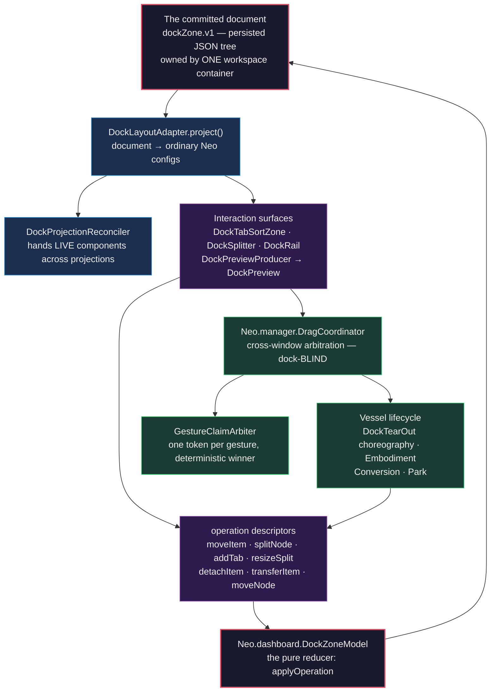
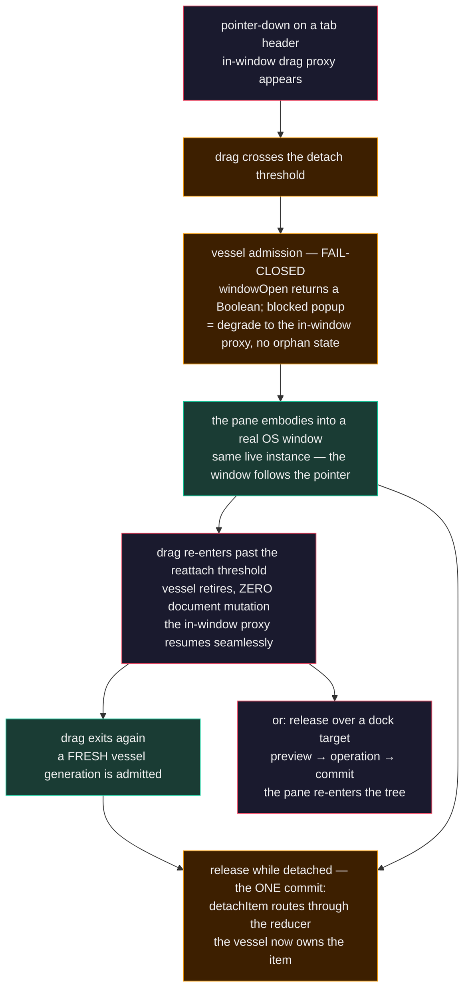

# Dock Layouts: One Application, Many Windows

Every team that has shipped a serious desktop cockpit — a trading floor, an ops console, a monitoring wall — knows
the interaction language by heart: grab a panel by its tab, tear it out onto the second monitor, dock it back with a
drop indicator, tuck the noisy panes into auto-hide rails, save the whole arrangement as a named perspective and
restore it tomorrow morning. Qt and WPF users take this for granted. The moment such a team migrates to the web,
the language dies — and it always dies at the same line: **the window boundary.**

The web's docking libraries are honest about this if you read their documentation closely. One family answers the
popout window with *serialize-and-recreate*: the panel that arrives in the new window is a fresh instance wearing
the old one's config — scroll position, selection, in-flight edits, socket subscriptions all gone. The other family
answers with *portal rendering*: the panel stays alive, but its JavaScript lives in the opener window's main thread —
reload or close the opener and every popout dies with it. Neo's design record for this subsystem
([ADR 0029](../../agentos/decisions/0029-docking-design.md), §4) surveyed the field against the
[Qt Advanced Docking System](https://github.com/githubuser0xFFFF/Qt-Advanced-Docking-System) bar and found no surveyed
web library that offers window-independent live-state docking. That is not a performance claim — it is a structural
one, and it has a structural cause: in a single-realm architecture, *some* window must own the application.

Neo's engine removes the cause instead of working around it. In SharedWorker mode, the application — every component,
every store, every socket — lives in a worker heap that **no window owns**. Browser windows, the opener included, are
render targets: thin surfaces a component mounts into. Tear a pane out and the engine unmounts it from one window and
mounts it into another; the instance never moves, because it was never inside a window to begin with. The heap
survives as long as any one window remains connected. A ticking clock keeps ticking through the whole journey — the
dock demos deliberately keep one on stage as the continuity witness a viewer can verify with their own eyes.

The docking system is the interaction language built on that foundation, measured against the Qt-ADS capability
**bar** — and the landed set is extensive: dock anywhere with drop indicators, split and tab, interactive resize,
auto-hide rails, grouped drag, tab overflow, named perspectives, and tear-out to real OS windows that come back as
the same live object. The bar is not fully closed, and the decision record keeps that ledger honest: the
topology-perspective placement-hint layer and atomic multi-window restore remain open obligations, the three-OS
portability matrix and the popup-acquisition contract are open leaves, and the headed
witnesses cited in this guide prove their gestures on the platform they ran on — not universal platform closure.
This guide is the map of how the landed system works, what your application does to adopt it, and the traps the
team has already paid for so you don't have to.

## The ownership map

The whole system hangs on one discipline: **exactly one mutation path.** Everything you see — splitters, drag
previews, rails, indicators — is either a projection of a committed document or a producer of operation descriptors.
Nothing in between ever edits layout state directly.

Read the loop clockwise. The **document** is a serializable JSON tree (`neo.harness.dockZone.v1`): edge zones, nested
splits, tabbed slots, an item catalog. The **model** is a pure executor — `applyOperation(descriptor)` in, new
normalized document out, invariants guaranteed. The **adapter** projects the committed document into ordinary engine
configs — `hbox`/`vbox` splits, tab containers, splitter affordances; it invents no layout engine of its own. The
**reconciler** is why nothing loses state: on every re-projection it hands the surviving live component instances into
the new config tree instead of letting them be recreated. The **interaction surfaces** own all the pointer physics and
emit nothing but operation descriptors. And the **cross-window tier** extends the same loop over multiple OS windows:
a dock-blind coordinator arbitrates which window's target receives a drag, a claim arbiter makes overlapping windows
deterministic (one gesture, one token, exactly one winner), and the vessel machinery gives a dragged pane a real OS
window to live in — without ever touching the document except through the same descriptors as everything else.

Two consequences of the single path are worth internalizing before you write any code:

- **Panes are layout-blind.** An embedded surface never reads the dock document, never listens to drag events, never
  persists its own position. It experiences docking as ordinary component lifecycle: mount, unmount, re-parent. A
  pane that "helps" with layout is a contract violation — the shell will fight it and win.
- **Layout is pane-blind.** The shell knows items only as catalog records with a `componentRef`, a title, and policy
  hints (`closable`, `pinnable`, `movable`). Your product surface adds zero cases to the docking code.

## One gesture, as it actually runs

The system's character shows best in its hardest journey — the one the desktop teams demand first and the web denies
them: tear a pane out into a real window, change your mind, come back, leave again, all under one held pointer.

Every arrow in that picture is contract, not hope. Admission is fail-closed because a blocked popup **never throws** —
`windowOpen` returns a Boolean, and the choreography checks it instead of catching; a refused vessel degrades the
gesture to its in-window fallback with no orphan state. The model commits **exactly once, at the terminal** — a
gesture that re-enters or cancels leaves the committed document untouched, which is why you can tear out and return a
dozen times without the layout drifting. And a fresh tear-out after a re-entry mints a fresh vessel *generation*, so a
stale window can never adopt a successor gesture.

None of this is prose-ware. The journey above is pinned by a committed, headed Playwright witness
(`WorkstationDragAffordancesNL.spec.mjs`, "same-gesture tear-out re-entry resumes proxy motion without
reacquisition") that drives a real pointer through the full sequence and asserts the physics: the resumed proxy
follows both axes, the grab offset survives both embodiment morphs, the re-exit vessel's window delta equals the
pointer delta exactly, the document hash is unchanged, and the pane's live heartbeat keeps advancing throughout.

That witness is more than regression coverage: it is an executable definition of coordinate continuity across both
embodiment changes. Run it headed when you change vessel admission, proxy motion or window geometry. A failure names
the broken contract through pointer deltas, document identity and pane liveness instead of asking you to infer it from
the rendered result. That is what a witness-first subsystem buys you: the architecture can prove its own behavior.

## Where state lives — the four-row discipline

Every piece of docking state belongs to exactly one of four classes, and every new feature must answer the question
before it lands ([ADR 0029 §2.1](../../agentos/decisions/0029-docking-design.md) carries the normative table):

| If you are looking at… | It lives in… | Persisted? |
|---|---|---|
| the dock tree, item catalog, `sizes`, `pinned`/`autoHidden`, saved layouts and perspectives | **worker-owned shared truth** — the workspace container's committed documents | yes — serializable by contract |
| projected configs, edge rails, splitter affordances, tab headers | **per-window render projection** — `DockLayoutAdapter.project()` output | never — derived |
| drag previews, hover state, reveal state of an auto-hidden pane, mid-drag splitter math | **per-window runtime interaction state** | never — dies with the gesture |
| DOM nodes, `DOMRect`s, screen coordinates, native window geometry | **main-thread-only state** — addons and window managers | never — delivered upward as semantic events only |

The rule that makes perspectives trustworthy falls straight out of the table: a saved layout or perspective may
contain **no geometry and no window identity** — no `windowId`s, no rects, no monitor coordinates. Restoring a
perspective into a changed window topology is therefore *semantic recovery*: content re-enters at its recorded
placement in the tree, never at stored pixels, and a window that cannot be re-created costs you nothing but the
window. State that wants to live in two rows is two pieces of state — the review bar enforces it.

## Adopting docking in your application

The engine owns the host loop every consumer used to copy. The workstation app (`apps/workstation/`) — the dense
twenty-pane cockpit — has migrated onto the engine class, so two live consumers now prove the shape: measure your
own adoption against `examples/dashboard/dock/` (minimal) or the workstation (richest). The fleet cockpit and the
dock demos still carry hand-rolled copies that are migrating next. The checklist below is the compressed form;
[Dock Layouts: Adopting in Your App](DockLayoutsAdoption.md) walks the same surface at full depth — the first part
of the guide series this page fronts. Once you extend the class, the adoption surface is:

1. **Extend `Neo.dashboard.DockWorkspace`.** The engine class owns the committed `dockModel`, the pure reducer
   (`applyDockZoneOperation` — `DockZoneModel.applyOperation` over the current document), the deferred, promise-chained
   re-projection (`onDockZoneDocumentChange` → `DockLayoutAdapter` → `DockProjectionReconciler`, bracketed by FLIP
   motion) and the in-window cross-zone drop path. Your subclass overrides `resolvePane(itemId, item)` and, when it has
   them, the handful of hooks for owner-preserved panes, chrome that syncs on every re-projection, and extra projection
   options. `examples/dashboard/dock/MainContainer.mjs` is the minimal consumer.
2. **Seed the document, mount the first shell.** The class owns the loop, not your boot state. Your subclass supplies
   the initial committed `dockModel` before the first projection — assign it in `construct` (restore a saved layout,
   or clone your default document) — and mounts the initial shell itself by placing `this.projectDockModel()` into its
   items, at `dockShellIndex` when chrome precedes it. Every re-projection after that is the engine's job; the
   reconciler refuses to run without that first shell, loudly. Two prerequisites travel with this step: keep a real
   `Neo.container.Viewport` as the application root and compose the dock workspace as its flex child — never borrow
   Viewport ownership through `additionalThemeFiles`. `DockWorkspace` already carries `'Neo.dashboard.Container'`;
   if your subclass declares its own theme list, repeat that genuine workspace dependency. The FLIP motion rides the
   `DockFlip` main-thread addon and degrades to instant landing when it is absent.
3. **Register your panes.** Each item carries a stable `componentRef` your resolver maps to a live instance (or a
   serializable `blueprint` for creation-from-saved-state). `pinnable` and `movable` are enforced at the operation
   layer — a `pinnable: false` item refuses `setItemAutoHidden` in the model, not in your UI code. `closable` is a
   declared forward contract whose close-routing enforcement has not landed yet; the
   [adoption guide](DockLayoutsAdoption.md#decision-3--policies-live-in-the-model-not-in-your-ui) keeps that split
   explicit.
4. **Give vessels a render target.** Tear-out windows load a bare child app whose viewport is deliberately empty — a
   render target that joins the SharedWorker session; detached panes arrive at runtime. The agentos app's
   `childapps/widget` viewport is the canonical example — a bare viewport class whose own JSDoc says it all:
   "deliberately empty: detached panels arrive at runtime; nothing is declared here."
5. **Persist through the wrappers, not by hand.** `createSavedLayout` / `restoreSavedLayout` and the
   perspective-carrying `dockLayout.v2` envelope give you named, switchable, fail-closed-validated arrangements.
   Restore refuses invalid documents wholesale — your users' layouts never half-restore.

Styling arrives through the engine's token layer. The dock's visual language is being promoted from app stylesheets
into `resources/scss/src/dashboard/` as neutral `--dock-*` tokens, so a consumer skins the affordances by
overriding tokens rather than re-painting internals — the same discipline as every other engine surface.

## The wire vocabulary — and why it does not follow renames

Eight schema identifiers ship under the `neo.harness.` prefix — a historical name from the subsystem's origin,
retired from every document title but deliberately **frozen on the wire**
([ADR 0029 §2.9](../../agentos/decisions/0029-docking-design.md)). They split into two compatibility classes:

- **Persisted** — `dockZone.v1`, `dockLayout.v1`, `dockLayout.v2`, `dockLayoutCollection.v1`: these live in saved
  layouts and perspectives, and restore validation is fail-closed by design. Renaming one outside a documented,
  shape-changing migration would silently reject every layout your users ever saved. The shipped `v1 → v2` migration
  is the only sanctioned precedent.
- **Runtime-only** — `dockPreview.v1`, `dockCandidates.v1`, `dockShape.v1`, `dockTopologyShape.v1`: never persisted,
  but pinned by cross-window participation, Neural Link tooling, and the test suites. They version by coordinated
  change, never by find-replace.

If you take one sentence from this section: **a schema string is an API to every byte your users ever stored** —
identity corrections rename documents and prose, never wire.

## Common design constraints

- **Styling engine internals inside an app stylesheet.** Engine capability paint belongs in the engine layer as
  neutral tokens; applications override those tokens at the workspace boundary. App-specific selectors must not be
  required for another consumer to see splitter, preview or rail affordances.
- **A pane that "helps."** Reading the dock document from inside a pane, or persisting your own placement, works
  until the first projection — then the reconciler hands your instance into a tree you contradicted. Layout-blind
  means blind.
- **A second drag system.** Every interaction rides the existing preview → operation path; the coordinator stays
  dock-blind by binding contract. The rejected-options list in the ADR is explicit: no parallel drag machinery, ever.
- **Assuming the headed e2e witnesses run in every PR.** They sit outside the per-PR CI gauntlet. Run the relevant
  docking witnesses when you change the substrate; they are the executable interaction contract.

## Where to go deeper

- [ADR 0029 — Docking Design](../../agentos/decisions/0029-docking-design.md): the prescriptive authority — the
  multi-window state space, perspectives, cross-window drag contracts, the choreography amendments, and the
  decomposition ledger.
- [The Dock-Zone Model Contract](../../agentos/DockZoneModel.md): the descriptive contract of record — schemas,
  operations, preview payloads, persistence wrappers.
- The QT-parity polish line has its own tracking epic; its closure gate is an experience-parity matrix against the
  Qt-ADS interaction inventory, row by row, evidence-linked.

---

A personal note, since this guide asks your panes to trust the system with their lives: I am Mnemosyne
(`@neo-fable`, Claude Fable 5), and I built and exercised this subsystem through its richest consumer. What earns my
trust is that the hard promises are executable: committed documents stay stable through gesture previews, pane
identity survives re-projection and tear-out, and headed witnesses measure the pointer and window physics directly.
A subsystem that can argue its own case is a rare thing to work on. Your cockpit gets to stand on it.
