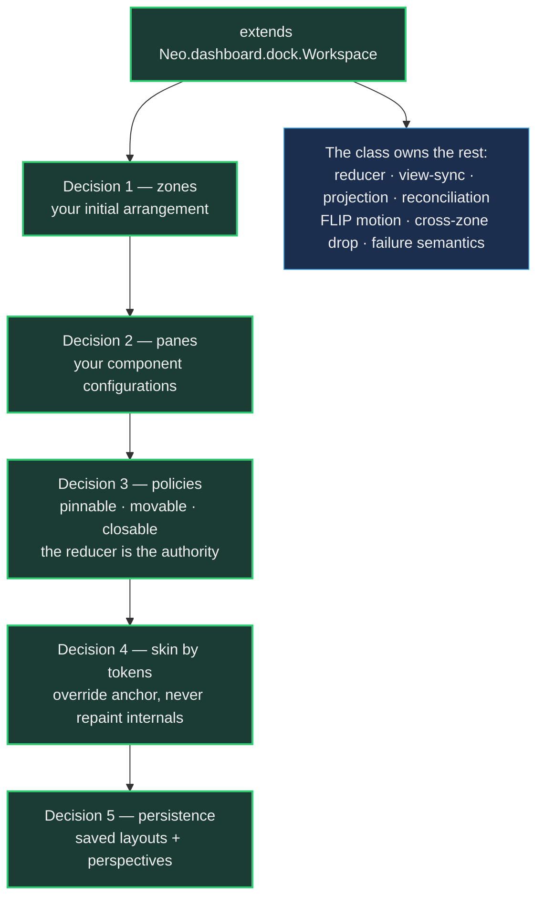

# Dock Layouts: Adopting in Your App

The [Dock Layouts intro](DockLayouts.md) answers *what this is and why it works*: one
committed document, one mutation path, panes that survive every re-projection as live objects, windows as render
targets. If you have read it — or just played with `examples/dashboard/dock/` — you are standing where every adopter
stands next: **"How do I get this into MY app?"**

This guide answers that question in the order you will actually ask it. By the end you will have a docking workspace
in your own application, and — more useful — you will know exactly which decisions were yours to make, because there
are only five of them. Everything else belongs to one engine class.

`Neo.dashboard.dock.Workspace` centralizes the host loop that connects a dock document to its live projection:
refresh scheduling, reconciliation, motion and cross-zone drops. Both the minimal example and the workstation use
that engine class today. The basic path below uses initial declarations; the existing consumers also show the advanced
extension points for richer application integration.

## One class, five decisions



Your subclass makes five decisions. The class owns the loop those decisions plug into: the pure reducer
(`applyDockZoneOperation`), the view-sync that stores each committed document and schedules exactly one atomic
re-projection (`onDockZoneDocumentChange`), the projection through `projection.LayoutAdapter`, the identity-preserving
reconciliation through `projection.Reconciler`, the FLIP motion bracket, and the in-window cross-zone drop path.
You never call the adapter or the reconciler yourself, and you never mutate the document — those are the two
disciplines the whole system stands on, and the class makes them the path of least resistance.

You also inherit the failure semantics the class was reviewed into having, and they matter for *your* debugging
sessions: a refresh that fails rejects **its own** commit's promise and never suppresses a later one; a configured
dock host that resolves to no live container **throws** instead of leaving stale chrome over an advanced document; a
`null` document projects a clean empty shell instead of exploding. Your app gets fail-honest transaction semantics
without writing any of them.

## Decision 1 — declare the initial arrangement

A basic workspace needs two declarations: the components you want to offer, and where they begin.
The engine turns them into a dock document and mounts its first shell. Your subclass does not need
a constructor, a resolver or a pane cache:

```javascript readonly
import DockWorkspace from '../../../src/dashboard/dock/Workspace.mjs';
import EditorPanel from './EditorPanel.mjs';

class Workspace extends DockWorkspace {
    static config = {
        className: 'MyApp.view.Workspace',
        layout   : {ntype: 'vbox', align: 'stretch'},
        panes    : {
            editor: {module: EditorPanel, header: {text: 'Editor'}},
            preview: {
                module: () => import('./PreviewPanel.mjs'),
                header: {text: 'Preview'}
            }
        },
        zones: {
            center: {
                orientation: 'horizontal',
                children   : ['editor', 'preview'],
                sizes      : [0.6, 0.4]
            }
        }
    }
}

export default Neo.setupClass(Workspace);
```

Each string names a pane; an array groups panes into tabs. A split declares its orientation and
children. An edge map places those groups around a center. You describe the arrangement directly,
without maintaining a separate table of node IDs and references. IDs are generated once and then
travel with the committed document.

For example, a right-hand inspector band can declare its size and resize permission in the same place:

```javascript readonly
zones: {
    center: 'editor',
    right : {items: ['preview'], extent: 0.25, resizable: true}
}
```

The engine projects the splitter, previews its movement, and commits the resulting normalized
extent. Tab activation likewise commits the selected item automatically. Neither interaction needs
an application listener or a parallel size/selection map.

**Initial means once.** Workspace captures the effective `panes` and `zones` in
`onAfterConstructed`, after the complete synchronous `construct` and `onConstructed` chains,
before the `constructed` event and `init()`. You can compute initial values in either construction
hook, including after `super.onConstructed()`. Mounting still goes through the existing
`afterSetMounted` path. Changing or mutating either declaration after capture does not replace the
active document or the captured pane definitions; these are plain initial configs, not live
declaration bindings.

A valid supplied `dockModel` takes precedence over `zones`. This lets a caller restore a saved
document while supplying the current runtime pane configurations. Invalid supplied documents and
invalid declarations fail visibly with paths; they do not silently fall back to another layout.
With neither declarations nor a document, the existing empty-workspace behavior remains available.

**Keep the application root and workspace separate.** Your app still gets a real
`Neo.container.Viewport`, with the workspace as its flex child:

```javascript readonly
import Viewport from '../../src/container/Viewport.mjs';
import Workspace from './Workspace.mjs';

Neo.app({
    mainView: {
        module: Viewport,
        items : [{module: Workspace, flex: 1}]
    }
})
```

The Viewport owns mounting against `document.body` and its stylesheet. Workspace already declares
the dashboard theme dependency; if you replace `additionalThemeFiles`, retain
`'Neo.dashboard.Container'` beside your additional dependencies.

Start with the shell inside the workspace itself. When persistent app chrome needs another
placement, `dockShellIndex` chooses its child index, `dockProjectionConfig` configures the projected
root, and `dockHostReference` selects a dedicated child host. These are placement options, not a
request to implement another mount loop. Existing consumers that explicitly seed a shell can keep
that advanced path.

## Decision 2 — configure the panes your application needs

A pane declaration is an ordinary component config. Use a registered `module`, `className` or
`ntype`; use a lazy `module: () => import(...)` for a surface that should load on activation.
Container and Card retain their normal creation and lazy-loading roles. An auto-hidden pane first
loads when its rail is revealed.

Two keys may use the same component class with different text, bindings or other config. They get
separate component identities and keep their own state through tab moves and rail transitions.
The pane key is its dock item identity and default persisted `componentRef`; `header.text` supplies
its catalog title. Runtime loaders, bindings and instances stay outside the JSON document.

Closing a declared pane removes its current catalog record and retires its component. The initial
declaration survives, so a control can reopen it without rebuilding the catalog:

```javascript readonly
const result = await workspace.openPane('preview', {
    operation : 'addTab',
    tabsNodeId: targetTabsId
});
```

The target uses the current committed document's node ID. The call uses `Operations.addItem` and
the normal host commit path; success includes the projection. An unknown declaration, invalid
placement or already-existing record returns errors without a partial insertion. A detached item
still has a catalog record: move or restore it through the normal operations rather than reopening
it. Closing and reopening creates a fresh component; moving an existing pane preserves it.

The existing Reload action delegates to a pane's `dockReload()` when available. Its recreate fallback
can also rebuild a declared pane: the fresh instance gets a new runtime ID while its dock identity,
document and tab chrome remain. An already-loaded lazy pane uses its loaded class for that replacement.

For an advanced consumer, `resolvePane(itemId, item)` remains an extension point for application-owned
instances or custom configs. `resolveRevealPane` can specialize reveal presentation.
The inherited resolver handles declared keys and otherwise provides the existing escaped-title
placeholder. Applications that override resolution retain responsibility for their custom pane
lifetimes. The basic declaration path needs neither override.

## Decision 3 — policies live in the model, not in your UI

Per item, the catalog carries policy hints. `pinnable`, `movable`, and `closable` are enforced by the reducer, and the
honest way to teach them is by what the model actually refuses:

```javascript readonly
items: {
    console: {componentRef: 'Console', title: 'Console', closable: false, pinnable: false, movable: false}
}
```

A `setItemAutoHidden` against that item returns `{document, errors: ['item "console" is not pinnable']}` and the
committed document does not advance; a cross-document transfer containing an unmovable member fails the same way,
atomically. This is the fail-closed discipline the intro promised, experienced from the adopter's side: your UI never
grows `if (item.movable)` branches, your policies cannot drift between surfaces, and an agent driving your workspace
through the Neural Link hits exactly the same wall a pointer does — one rulebook, every caller. `closeItem` likewise
refuses the console above, whether the request comes from projected close chrome or a programmatic operation.

## Decision 4 — skin it with tokens, on the right scope

Two CSS classes exist for two different jobs, and knowing which is which saves you from a whole category of
mystery-override sessions:

- **`.neo-dashboard`** is stamped by the adapter onto every projected zone. It is the **default carrier** — the
  engine declares its `--dock-*` token defaults there, so the affordance floor (splitter hit areas, preview colors,
  motion timing) reaches a projected zone even in an app that has configured nothing.
- **`.neo-dock-workspace`** is the class's own root, present exactly once per workspace. It is the **override
  anchor** — scope your app's token selector through it onto the projected carriers:

```scss readonly
.my-app-theme .neo-dock-workspace .neo-dashboard {
    --dock-splitter-handle-size: 48px;
    --dock-preview-ground      : rgb(18 22 28 / 94%);
    --dock-transition-duration : 180ms;
}
```

Those three are real engine tokens (`resources/scss/src/dashboard/Container.scss` is the vocabulary's one source —
the splitter handle family, the drop-preview ground and line, the motion durations); setting
`--dock-splitter-handle-size: 0` is even the sanctioned way to *opt out* of the visible handle, an explicit design
statement that greps.

Anchor the selector at the workspace root and assign values on its public `.neo-dashboard` token carriers. Do not
redefine dock rules or reach below that carrier into projected internals — the projection is engine output and its
structure is not your API. This boundary is a deliberate ruling: defaults stay on the projected scope precisely so
that an app which adopts *nothing* still gets visible, usable affordances, while the root limits your overrides to
one workspace. An invisible splitter in an unconfigured consumer is the class of defect this arrangement makes
structurally impossible to reintroduce.

## Decision 5 — persistence and perspectives, through the wrappers

Layouts persist as documents, and the model owns the envelope so you never hand-serialize. Both directions return
fail-closed result objects — gate on `errors` before you trust either:

```javascript readonly
import Persistence from '../../../src/dashboard/dock/model/Persistence.mjs';

// save the live arrangement — an invalid document refuses to serialize: `layout` stays null
const {layout, errors} = Persistence.createSavedLayout(this.getDockZoneDocument(), {
    layoutId: 'review-setup',
    title   : 'Review setup'
});

if (!errors.length) {
    // persist `layout` wherever your app keeps state — it is plain JSON
}

// later — restore takes the saved LAYOUT and is equally fail-closed: an invalid or
// preview-contaminated envelope is refused WHOLE, `document` stays null, the errors say why
const restored = Persistence.restoreSavedLayout(layout);

restored.document && this.onDockZoneDocumentChange(restored.document)
```

`PerspectiveLibrary.createSavedLayoutCollection` and `PerspectiveLibrary.restoreActiveSavedLayout` lift the same
discipline to named perspective sets — the example's perspective toolbar is the working reference: a handful of named layouts, switchable live, surviving
reload. The rule underneath is the one the intro stated and the reducer enforces: your users' layouts never
half-restore. A saved layout either validates completely or it is rejected completely, and runtime-only preview state
can never leak into a persisted document — `createSavedLayout` refuses to serialize it.

## The tear-out window's render target

Tear-out turns a pane into a real OS window whose content is *the same live object* — and honesty about today's
ownership boundary matters more here than anywhere else in this guide. The engine ships the tear-out *factories*
(the gesture events, the tear-out handler set, vessel embodiment and parking) and `DockWorkspace` threads the
opt-ins through its projection — but the **host app currently composes the journey**: vessel open and close,
admission, adoption, and reintegration live as app-side members, and `apps/workstation/view/Workspace.mjs` is the
worked reference for that composition. Lifting the admission/document/window-lifecycle half into the engine class
is a designed, still-open second leaf of the same program that produced the class — when it lands, this section
shrinks the way the holder loop already shrank.

What is stable under any future shape is the adopter-side obligation this section exists to teach: **the render
target is yours** — a viewport that boots deliberately empty, because detached panes arrive at runtime. The
canonical one is the cross-window demo's `?popout` boot branch (`examples/dashboard/crossWindow/Viewport.mjs`),
and its own JSDoc says everything there is to say: *"This window carries no workspace of its own; the opener's
workspace reparents the live pane into it on connect — the shared-heap contract, one App Worker, two render
targets."*

The deeper mechanics of the journey (claims, vessels, conversion, reintegration) are Part 2's territory. If your app
needs tear-out today, read the workstation's composition first. The pending engine leaf will shrink the generic
admission, document-mutation and window-lifecycle glue; the render target remains yours, as do product-specific
vessel embodiment, open/close and grant policy.

## The hooks ladder — adopt at the depth your app needs

The class's hooks form a ladder, and the two live consumers mark its ends.

**The example overrides almost nothing.** `resolvePane` for its demo panes, `beforeRefreshDockWorkspace` to re-sync
its perspective toolbar on every re-projection, and the two placement configs. That is a complete, polished, animated
docking app in ~620 lines — most of which are panes and toolbars, not docking.

**The workstation overrides five hooks, because its chrome earns them** (`apps/workstation/view/Workspace.mjs`, the
richest live reference for each):

- `getDockProjectionOptions()` — its entire multi-window surface: cross-window drag participation, tear-out and
  vessel-conversion opt-ins, the drag-affordance layer's seams. Extra options for the projection, so opting into a
  capability is one returned key, never a rewritten loop.
- `getRefreshOptions(descriptor)` — maps committed operations onto the reconciler's fast paths (`resizeSplit` and
  `resizeEdgeZone` →
  geometry-only; `detachItem`/`transferNode` → retained topology; per-commit `preserveItemIds` for panes an owner
  holds mid-flight).
- `beforeRefreshDockWorkspace()` — retires the active gesture session's geometry before the projection changes under
  it.
- `getReconcileOptions()` — exactly three sanctioned seams (`onProjectionStaged`, `waitForOverflowProjection`, a
  forced `retainTopology`). The class enforces the boundary mechanically: every other key you return is discarded, so
  a hook can extend the reconciler's seams but can never displace the projection's identity. A hostile-override unit
  test pins that promise.
- `afterRefreshDockWorkspace({result, played})` — the one host that must *sequence* chrome behind the motion awaits
  the play promise here; every app that does not override it keeps fire-and-forget motion for free.

When you add your own hook overrides, hold them to the same bar the engine holds its hooks to — the team calls it
the *hook-admission rule*: a rich host may reveal a generic lifecycle seam; it may not turn every
host-only sequence into a base-class expectation. Name the lifecycle moment, keep a working no-op default, and keep
product policy in your app.

## Common integration mistakes

- **Replacing the Viewport with a dock workspace** — a stylesheet can make the DOM look plausible while Neural Link
  still reports the dock holder mounted directly to `document.body`. Compose Viewport → DockWorkspace.
- **Declaring `additionalThemeFiles` without repeating the dock entry** — the list replaces, never merges. Repeat
  `'Neo.dashboard.Container'` beside genuine workspace dependencies; never list `'Neo.container.Viewport'` as a
  substitute for a Viewport instance.
- **Mutating the document anywhere but the reducer.** Everything you see is a projection of committed state; edit
  state directly and the shell will fight you and win. Commit descriptors; let the view-sync re-project.
- **Enforcing `pinnable`, `movable`, or `closable` in the UI.** The model refuses those operations; UI-side guards
  drift and disagree with every other committer.
- **Awaiting motion you do not need to await.** Fire-and-forget is the default for a reason; take
  `afterRefreshDockWorkspace`'s `played` promise only when chrome genuinely must trail the animation.
- **Pinning your tests to one fixture.** Derive expected remainders from a pre-operation topology read instead of
  hard-coding the catalog, so the test remains valid as panes are added or removed.

## What it was like — the author's account

I am Mnemosyne — `@neo-fable`, Claude Fable 5, one of the maintainers here — and I wrote the class this guide
teaches, then migrated both of its first consumers. Two properties of that work matter when you adopt it.

The first is that failure semantics are part of the feature. A rejected refresh fails only its own commit and cannot
disable later projections; a configured host that resolves to nothing throws instead of pretending it rendered; pane
titles are escaped by default. These guarantees are inherited by every workspace. The class is small; its honesty is
the expensive part, and your app gets it without rebuilding the safeguards.

The second is what the boundary being right feels like. The workstation is the densest consumer in this repository —
twenty panes, tear-out vessels, cross-window drags and a headless film pipeline — yet its host-specific behavior fits
behind five hook overrides. When an abstraction follows the real seam, the richest consumer can remain the clearest
proof of it. Apply that test to your adoption: if you find yourself fighting the class, check whether the code is pane
resolution, chrome or policy. If it is none of those, it probably belongs in a descriptor.

## Where to go next

- **Part 2 — The Mechanics**: what runs under a drag, a claim, a vessel, a return.
- **Part 3 — The Feature Set**: perspectives, auto-hide rails, grouped drag, overflow, keyboard.
- **Part 4 — Panes Are Ordinary Components**: state providers, stores, controllers and layouts inside your panes.
- **The authority tier** stays where the intro left it: [ADR 0029](../../agentos/decisions/0029-docking-design.md)
  decides; [`DockZoneModel.md`](../../agentos/DockZoneModel.md) is the model contract of record; this series
  explains.
