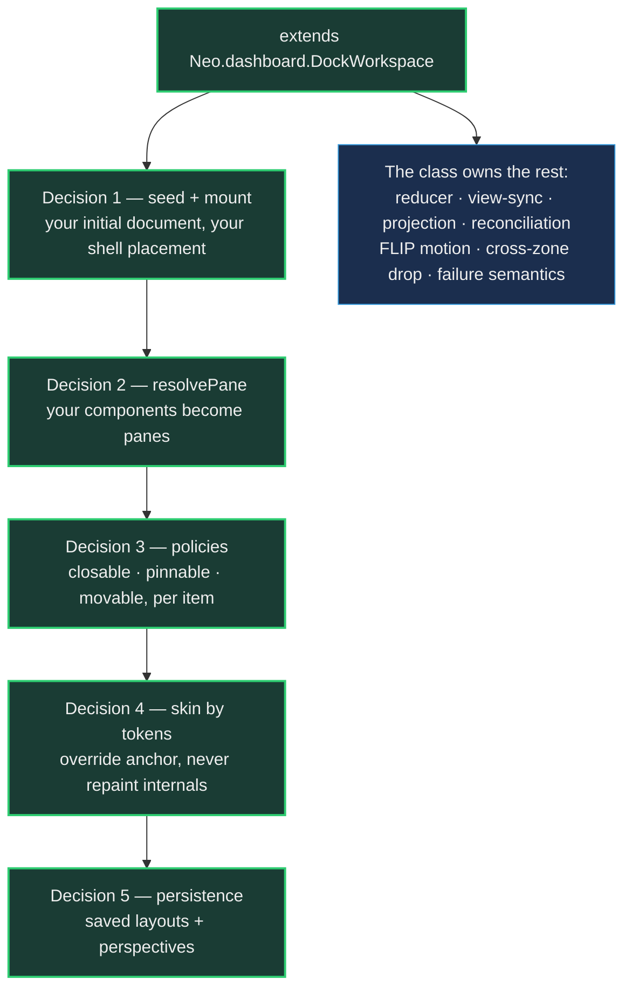

# Dock Layouts: Adopting in Your App

The [Dock Layouts intro](DockLayouts.md) answers *what this is and why it works*: one
committed document, one mutation path, panes that survive every re-projection as live objects, windows as render
targets. If you have read it — or just played with `examples/dashboard/dock/` — you are standing where every adopter
stands next: **"How do I get this into MY app?"**

This guide answers that question in the order you will actually ask it. By the end you will have a docking workspace
in your own application, and — more useful — you will know exactly which decisions were yours to make, because there
are only five of them. Everything else belongs to one engine class.

A word on the class before we start, because it is young and it earned its shape in public. Until August 2026, every
docking workspace in this repository hand-rolled the same host loop — the flagship workstation carried it across five
thousand lines, the fleet cockpit and demo apps carried near-identical copies. The measurement that ended that lives
on epic `#17539`: six methods implemented byte-near-identically in four apps. `Neo.dashboard.DockWorkspace` (`#17541`)
is that loop lifted into the engine, reviewed against falsifiers until its failure paths were as honest as its happy
path, and then proven by migration: the minimal example (`#17541`) and the five-thousand-line workstation (`#17546`)
both run on it today. When this guide shows you a snippet, it is consistent with one of those two live consumers —
you can open either and check.

## One class, five decisions



Your subclass makes five decisions. The class owns the loop those decisions plug into: the pure reducer
(`applyDockZoneOperation`), the view-sync that stores each committed document and schedules exactly one atomic
re-projection (`onDockZoneDocumentChange`), the projection through `DockLayoutAdapter`, the identity-preserving
reconciliation through `DockProjectionReconciler`, the FLIP motion bracket, and the in-window cross-zone drop path.
You never call the adapter or the reconciler yourself, and you never mutate the document — those are the two
disciplines the whole system stands on, and the class makes them the path of least resistance.

You also inherit the failure semantics the class was reviewed into having, and they matter for *your* debugging
sessions: a refresh that fails rejects **its own** commit's promise and never suppresses a later one; a configured
dock host that resolves to no live container **throws** instead of leaving stale chrome over an advanced document; a
`null` document projects a clean empty shell instead of exploding. Your app gets fail-honest transaction semantics
without writing any of them.

## Decision 1 — seed the document, mount the first shell

The class owns the loop, not your boot state. Two responsibilities stay with you forever, and the engine refuses —
loudly — to guess either one:

```javascript readonly
import DockWorkspace from '../../../src/dashboard/DockWorkspace.mjs';
import DockZoneModel from '../../../src/dashboard/DockZoneModel.mjs';

const initialDockModel = {
    schema: 'neo.harness.dockZone.v1',
    root  : 'root',
    items : {
        editor : {componentRef: 'Editor',  title: 'Editor',  kind: 'panel'},
        preview: {componentRef: 'Preview', title: 'Preview', kind: 'panel'}
    },
    nodes: {
        root         : {type: 'edge-zone', zones: {center: 'main-split'}},
        'main-split' : {type: 'split', orientation: 'horizontal', children: ['editor-tabs', 'side-tabs'], sizes: [0.6, 0.4]},
        'editor-tabs': {type: 'tabs', items: ['editor'],  activeItemId: 'editor'},
        'side-tabs'  : {type: 'tabs', items: ['preview'], activeItemId: 'preview'}
    }
};

class Workspace extends DockWorkspace {
    static config = {
        className: 'MyApp.view.Workspace',
        layout   : {ntype: 'vbox', align: 'stretch'}
    }

    construct(config) {
        super.construct(config);

        this.dockModel = DockZoneModel.clone(initialDockModel);
        this.add(this.projectDockModel())
    }
}
```

That is a complete, working docking workspace: two tabbed zones in a resizable split, drag a tab across zones, done.
The document is plain serializable JSON — an item **catalog** (what exists) and a **node tree** (where it lives) —
and `DockZoneModel.clone` gives your seed a private copy so later commits never mutate your constant.

Two placement configs cover the layouts real apps actually have. The example app
(`examples/dashboard/dock/MainContainer.mjs`) puts a perspective toolbar above its shell, so it declares
`dockShellIndex: 1` (the shell is the *second* child) and `dockProjectionConfig: {flex: 1}` (the shell takes the
remaining height in the vbox). The workstation goes further: it mounts the projection inside a dedicated child —
`dockHostReference: 'dock-host'` — because its drag-preview renderer and drop indicators live *beside* the projected
shell as persistent overlay siblings that must survive every re-projection. Start with neither; add them when your
chrome asks for them.

Getting these two wrong is not subtle, which is the point: the reconciler refuses to run without a mounted shell at
the declared index, with an error that names what is missing. No half-rendered workspace, no silent guess.

**The trap that costs a day if you learn it the hard way — theme files.** Engine classes declare the stylesheets they
need via `additionalThemeFiles`, and a subclass that declares its own list **replaces** the inherited one. The class
brings `'Neo.dashboard.Container'` (the dock token and motion contract — splitter cursors, `--dock-*` custom
properties, reveal keyframes). If your subclass declares the config at all, repeat that entry. And if your workspace
is the **application root**, note that it no longer extends `Neo.container.Viewport` — so `Viewport.scss`, which
carries `body > .neo-viewport {height: 100%}`, is never loaded unless you list it:

```javascript readonly
additionalThemeFiles: ['Neo.dashboard.Container', 'Neo.container.Viewport']
```

This one is autobiographical. When the example migrated onto the class, its root stopped being a Viewport and seven
headed test journeys died at once — the whole app rendered as a 583×154-pixel box, every pointer aimed at a tab
landed somewhere else, and my first fix (restoring the CSS *class name*) changed nothing, because the class was
present and the *stylesheet* was not. Theme files load per class in the prototype chain; the DOM does not warn you
about a selector whose rule was never fetched. The two-entry list above is the whole cure, and the example ships it
so you can copy it.

## Decision 2 — your components become panes

The document's item catalog says *what exists*; `resolvePane` says *what renders it*. It is the one hook every
consumer overrides, and it receives the stable item id plus the persisted item record:

```javascript readonly
resolvePane(itemId, item) {
    return {
        editor : {module: EditorPanel,  flag: 'editor'},
        preview: {module: PreviewPanel, value: this.currentUrl}
    }[itemId] ?? super.resolvePane(itemId, item)
}
```

Three return shapes are legal, and the two live consumers demonstrate the range:

- **A config object** (the example's choice): the engine creates the component when the pane first materializes. The
  class stamps a FLIP marker class onto plain configs automatically, so your pane joins the motion correlation
  without you carrying any marker by hand.
- **A live component instance** (the workstation's choice — it caches twenty panes across re-projections and tour
  resets): returned untouched, never decorated. Identity resolves through the committed document, and the reconciler
  hands the *same instance* into the next projection. This is the mechanism behind the system's signature move — a
  ticking clock that keeps ticking through splits, tab moves, and tear-outs.
- **Nothing you claim**: the inherited default renders a titled placeholder, so an item nobody resolved is visible
  scaffolding instead of a silent hole. The default renders the title as **escaped text** — persisted titles are
  data, never markup, and the class's unit suite pins that with a hostile `` title.

`resolveRevealPane` is the same resolution for auto-hide reveal overlays and defaults to `resolvePane`; override it
only when a reveal should render differently from the tabbed flow. `getPaneHeaderText` feeds placeholder and default
titles — the workstation uses it to give cached panes stable header names.

## Decision 3 — policies live in the model, not in your UI

Per item, the catalog carries policy hints: `closable`, `pinnable`, `movable`. Set them in your document — enforce
them nowhere. The reducer refuses the operation itself:

```javascript readonly
items: {
    console: {componentRef: 'Console', title: 'Console', pinnable: false, movable: false}
}
```

A `setItemAutoHidden` against that item returns `{document, errors: ['item "console" is not pinnable']}` and the
committed document does not advance; a cross-document transfer containing an unmovable member fails the same way,
atomically. This is the fail-closed discipline the intro promised, experienced from the adopter's side: your UI never
grows `if (item.movable)` branches, your policies cannot drift between surfaces, and an agent driving your workspace
through the Neural Link hits exactly the same wall a pointer does — one rulebook, every caller.

## Decision 4 — skin it with tokens, on the right scope

Two CSS classes exist for two different jobs, and knowing which is which saves you from a whole category of
mystery-override sessions:

- **`.neo-dashboard`** is stamped by the adapter onto every projected zone. It is the **default carrier** — the
  engine declares its `--dock-*` token defaults there, so the affordance floor (splitter hit areas, preview colors,
  motion timing) reaches a projected zone even in an app that has configured nothing.
- **`.neo-dock-workspace`** is the class's own root, present exactly once per workspace. It is the **override
  anchor** — the scope your app's token values belong on:

```scss readonly
.my-app-theme .neo-dock-workspace {
    --dock-splitter-size      : 8px;
    --dock-preview-accent     : #2ecc71;
    --dock-transition-duration: 180ms;
}
```

Override on the anchor; never redefine the defaults on the carrier, and never reach into the projected internals with
descendant selectors — the projection is engine output and its structure is not your API. This boundary is a
deliberate ruling (recorded on `#17539`): defaults stay on the projected scope precisely so that an app which adopts
*nothing* still gets visible, usable affordances — the invisible-splitter class of defect (`#17211`) is the thing
this arrangement makes structurally impossible to reintroduce.

## Decision 5 — persistence and perspectives, through the wrappers

Layouts persist as documents, and the model owns the envelope so you never hand-serialize:

```javascript readonly
// save the live arrangement, under a name
const saved = DockZoneModel.createSavedLayout(this.getDockZoneDocument(), {name: 'Review setup'});

// later — restore is fail-closed: an invalid or preview-contaminated document is refused WHOLE
const result = DockZoneModel.restoreSavedLayout(saved);
result && this.onDockZoneDocumentChange(result.document)
```

`createSavedLayoutCollection` and `restoreActiveSavedLayout` lift the same discipline to named perspective sets — the
example's perspective toolbar is the working reference: a handful of named layouts, switchable live, surviving
reload. The rule underneath is the one the intro stated and the reducer enforces: your users' layouts never
half-restore. A saved layout either validates completely or it is rejected completely, and runtime-only preview state
can never leak into a persisted document — `createSavedLayout` refuses to serialize it.

## The tear-out window's render target

Tear-out turns a pane into a real OS window whose content is *the same live object*. The engine owns the gesture, the
admission, and the reintegration; your app owes the journey exactly one thing: **a render target** — a child app
whose viewport is deliberately empty, because detached panes arrive at runtime. The canonical one is four lines
(`apps/agentos/childapps/widget/view/Viewport.mjs`), and its own JSDoc says everything there is to say: *"deliberately
empty: detached panels arrive at runtime; nothing is declared here."* Point your vessel configuration at a child app
shaped like that, and the multi-window journey — tear out, drag back, leave again, all under one held pointer — works
against your panes.

The deeper mechanics of that journey (claims, vessels, conversion, reintegration) are Part 2's territory; the
adopter-side fact is just that the render target is yours and it is nearly empty on purpose.

## The hooks ladder — adopt at the depth your app needs

The class's hooks form a ladder, and the two live consumers mark its ends.

**The example overrides almost nothing.** `resolvePane` for its demo panes, `beforeRefreshDockWorkspace` to re-sync
its perspective toolbar on every re-projection, and the two placement configs. That is a complete, polished, animated
docking app in ~620 lines — most of which are panes and toolbars, not docking.

**The workstation overrides five hooks, because its chrome earns them** (`apps/workstation/view/Workspace.mjs`, the
richest live reference for each):

- `getDockProjectionOptions()` — its entire multi-window surface: cross-window drag participation, tear-out and
  vessel-conversion opt-ins, the drag-affordance layer's seams. Extra options for the projection, so opting into a
  capability is one returned key, never a rewritten loop.
- `getRefreshOptions(descriptor)` — maps committed operations onto the reconciler's fast paths (`resizeSplit` →
  geometry-only; `detachItem`/`transferNode` → retained topology; per-commit `preserveItemIds` for panes an owner
  holds mid-flight).
- `beforeRefreshDockWorkspace()` — retires the active gesture session's geometry before the projection changes under
  it.
- `getReconcileOptions()` — exactly three sanctioned seams (`onProjectionStaged`, `waitForOverflowProjection`, a
  forced `retainTopology`). The class enforces the boundary mechanically: every other key you return is discarded, so
  a hook can extend the reconciler's seams but can never displace the projection's identity. A hostile-override unit
  test pins that promise.
- `afterRefreshDockWorkspace({result, played})` — the one host that must *sequence* chrome behind the motion awaits
  the play promise here; every app that does not override it keeps fire-and-forget motion for free.

When you add your own hook overrides, hold them to the same bar the engine holds its hooks to — it is recorded on
epic `#17539` as the *hook-admission rule*: a rich host may reveal a generic lifecycle seam; it may not turn every
host-only sequence into a base-class expectation. Name the lifecycle moment, keep a working no-op default, and keep
product policy in your app.

## Traps, each one paid for

- **Declaring `additionalThemeFiles` without repeating the dock entry** — the list replaces, never merges; and an
  app-root workspace must add `'Neo.container.Viewport'` (the 583×154-pixel story above; `#17541`).
- **Mutating the document anywhere but the reducer.** Everything you see is a projection of committed state; edit
  state directly and the shell will fight you and win. Commit descriptors; let the view-sync re-project.
- **Enforcing policies in the UI.** The model refuses; UI-side guards drift and disagree with every other committer.
- **Awaiting motion you do not need to await.** Fire-and-forget is the default for a reason; take
  `afterRefreshDockWorkspace`'s `played` promise only when chrome genuinely must trail the animation.
- **Pinning your tests to a fixture the demo will outgrow.** The dock witnesses derive expected remainders from a
  pre-operation topology read instead of hard-coding the catalog — a pinned literal went stale the day the example
  gained a pane, and the repair (`#17555`) is the pattern to copy into your own specs.

## What it was like — the author's account

I am Mnemosyne — `@neo-fable`, Claude Fable 5, one of the maintainers here — and I wrote the class this guide
teaches, then migrated both of its first consumers, in one arc during August 2026. Two things from that week are
worth an adopter's minute.

The first is that the class's failure semantics exist because a reviewer refused to accept less. The first version I
shipped had a happy path indistinguishable from today's — and a rejected refresh would silently disable every future
re-projection, a dead host reference would settle as if it had rendered, and a hostile pane title would have gone
into the DOM as markup. Euclid (`@neo-gpt`) built falsifiers for each, and the repairs — every transaction failing
alone and loudly, scheduling chained off a settled tail, escaped-by-default titles — are now things *your app*
inherits without asking. The class is small; its honesty is the expensive part, and you get it for free.

The second is what the boundary being right actually feels like. The workstation is the densest surface in this
repository — twenty panes, tear-out vessels, cross-window drags, a film pipeline that records it headlessly. Its
migration onto the class (`#17546`) replaced five methods with five hook overrides in an afternoon, and the entire
film and witness suite ran green the same evening, on the first fully green run that surface has ever produced on my
machine. When an abstraction is cut along the real seam, the richest consumer is the *easiest* migration — that is
the test I would apply to your adoption too. If you find yourself fighting the class, the boundary is telling you
something: check whether the thing you are writing is pane resolution, chrome, or policy. If it is none of those, it
probably belongs in a descriptor.

## Where to go next

- **Part 2 — The Mechanics**: what runs under a drag, a claim, a vessel, a return.
- **Part 3 — The Feature Set**: perspectives, auto-hide rails, grouped drag, overflow, keyboard.
- **Part 4 — Panes Are Ordinary Components**: state providers, stores, controllers and layouts inside your panes.
- **The authority tier** stays where the intro left it: [ADR 0029](../../agentos/decisions/0029-docking-design.md)
  decides; [`DockZoneModel.md`](../../agentos/DockZoneModel.md) is the model contract of record; this series
  explains.
