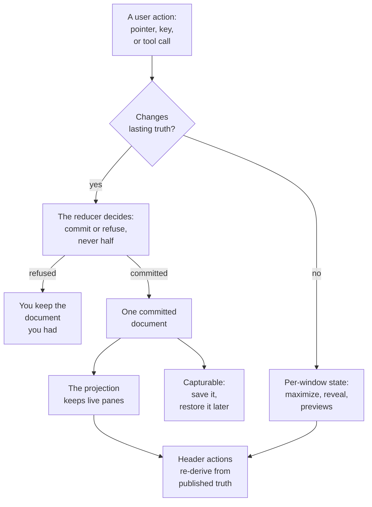

# Dock Layouts: What Users Can Do, and What the Dock Will Refuse

Docking UIs are easy to demo and hard to trust. The demo shows a splitter, a tab you can drag, a panel that slides away
to an edge. What the demo does not show is the second week: the close button that destroyed a half-written form, the
pin that hid a pane with no way back, the pop-out button that opens nothing because this browser blocked the window,
the arrangement a user spent ten minutes building that did not survive a reload. Every one of those is the same defect
wearing different clothes — an affordance offered something the system could not actually honor.

Neo's dock is built the other way around. An affordance appears when the model will honor it, disappears when it will
not, and every feature that changes anything lasting goes through one reducer that commits whole or refuses whole. The
refusal is not an error dialog; it is the document you already had, unchanged. That is what makes the surface worth
learning as a whole: once you know that the same boundary sits behind resizing, tabs, rails, locking, maximizing and
perspectives, you can predict what any of them will do to a pane your application cares about — including the ones you
write yourself.

This guide is the tour of that landed surface, organized by what a user is trying to accomplish. It mixes two kinds of
statement, and it marks which is which rather than letting you guess. Some passages report a **journey run on a page**:
the standalone dock example in a 1024 × 768 viewport, driven by real clicks, with the committed document read between
every step — those carry their measurements, and where the engine refused something the refusal is quoted verbatim.
The rest **explains the current contract from its source**, for behavior that a single example page cannot exercise:
the cross-window and keyboard outcomes, and pane-side contracts no example pane implements. Both are accurate; only the
first is evidence. Where a capability has a limit, the limit is stated next to it rather than left for you to discover
in production.

## The one boundary every feature crosses



Two lanes, and the difference between them is the single most useful thing to hold in your head.

The left lane changes lasting truth. Each feature in it becomes one small semantic descriptor — `resizeSplit` and
`resizeEdgeZone` for the two resize affordances, `addTab`, `moveItem`, `setActiveItem` and `closeItem` for the tab
outcomes, `setItemAutoHidden` and `setItemPinned` for the auto-hide round trip, `setItemLocked` for freezing a pane,
`detachItem` and `transferItem` for the cross-window ones — and the reducer validates that descriptor against the
committed document before either the whole thing lands or nothing does.

**Committed is not the same as saved, and conflating the two is the most expensive mistake available here.** A commit
makes state *capturable*: the document now holds it, so it can be diffed, replayed, captured into a named arrangement,
or written to storage. It does not make it durable. Nothing in the engine writes to storage on your behalf — the
standalone example persists its layouts because *it* captures a snapshot and restores that collection at boot, in its
own code. A workspace that never saves has a perfectly valid committed document that is gone at reload, and that is not
a defect. [State, Operations and Persistence](DockLayoutsStateAndPersistence.md) covers the capture, save and restore
steps that turn a committed document into one that comes back.

The right lane changes only what this window is currently showing. A maximized node, a revealed rail pane, a drag
preview, a drop indicator: none of them touch the document, none of them can be captured, and a second window showing
the same workspace never learns they happened. That is deliberate. A user maximizing a pane to read it is not
redesigning their workspace, and a layout that came back maximized because someone squinted at a log once would be a
bug, not a feature.

The practical payoff for your own application: you never have to ask "will this affordance dirty the layout?" The
answer is structural. If it went through the reducer, it is in the document, and whether it comes back is then your
persistence decision. If it did not, there is nothing to save and nothing to decide.

## Give a pane more room

Two resize affordances ship, and they are different in kind rather than in degree.

**Split boundaries** sit between the children of a split node and resize a *pair*. Drag the boundary between the main
stack and the side column and both sides change complementarily — their total stays constant, frame by frame, because
the descriptor that finally commits is the split's whole size vector, not one child's new width. Committing the pair is
what keeps a layout from drifting: no sequence of drags can leave a split summing to something other than one.

**Edge bands** are the outer zones — the strip along the top, bottom, left or right of the workspace — and they resize
a single band against the center, which absorbs the change. Each edge zone opts in individually, so a workspace can
offer a resizable right inspector beside a fixed-height top toolbar without any conditional logic in your code: the
zone either carries the resizable flag or it does not, and the projection reads it.

Both preview live on the main thread by default: you see real sizes while the pointer moves, and only the release
commits. Both restore on `Escape`, mid-gesture, with nothing committed. A consumer that wants the older
proxy-bar-then-commit behavior turns live resizing off for that affordance.

On the running example, dragging the root boundary moved the committed vector from `[0.65, 0.35]` to `[0.45, 0.55]`,
and nothing else in the document changed — not the item flags, not the active tabs, not the edge extents. Resizing is
classified as a geometry change, and the projection takes the cheaper path for it: the live panes are not restaged,
they are re-measured. A pane streaming a log or holding a scroll position keeps both.

## Get a pane out of the way, without losing it

This is the feature users reach for most and the one that is easiest to get catastrophically wrong, because "hide" and
"lose" are one careless step apart. The dock's answer is that hiding a pane changes *one flag on the item* and nothing
else.

Here is the whole round trip as it ran, with the document read at each step.

The Inspector starts in the right edge zone at an extent of `0.25`. Clicking the pin action in its header commits a
single delta: the item gains `autoHidden: true`. The nodes are untouched — the Inspector's stack is still sitting in
the right zone with the same extent. The projection reads that flag, leaves the item out of the tab flow, and paints a
14-pixel rail along the right edge carrying a button for it. The center reclaims the space immediately.

Clicking the rail button opens a **transient reveal**: an edge-anchored overlay that renders *over* the committed
projection and never re-layouts it. Measured on the page, the overlay came up 256 pixels wide — exactly the `0.25`
extent its owning zone had committed, resolved against a 1024-pixel viewport — spanning the full height, and its right
edge landed at 1010 pixels, which is precisely the rail strip's left edge. That number is the contract: the overlay
stops where the strip starts, so the strip it came from never ends up underneath it and a fast second click still
reaches the tab. Behind the overlay, the Terminal and Logs panes kept their geometry; nothing reflowed.

The reveal is deliberately cheap and deliberately temporary. Clicking the tab again, pressing `Escape`, clicking
outside, or moving focus and the pointer away all dismiss it, and no operation exists for dismissal at all — there is
nothing to commit, because nothing was committed. Pointer wobble does not flicker it: leaving an unfocused reveal
starts a short grace window rather than an immediate close, and returning rescues it.

Hover-revealing is available and **off by default**, which is a judgment call worth understanding rather than
overriding reflexively. A surface that opens on hover steals the pointer's meaning: a user crossing the edge on the way
somewhere else gets a panel they did not ask for, and someone driving with a keyboard or a screen reader gets an
experience that has no equivalent gesture at all. Applications that genuinely want it opt in per workspace, and the
reveal then dwells briefly before opening and never takes focus.

The way back is the overlay's pin control. Clicking it committed `{autoHidden: false, pinned: true}` and the Inspector
returned to the same zone, at the same extent, as the same live component. The model cleared `autoHidden` itself —
pinned and auto-hidden are mutually exclusive by construction, so the two flags cannot disagree.

One limit, stated where it belongs: an item whose policy forbids pinning will have that pin control rendered
*disabled*, but the rail tab and the reveal itself stay fully available. Reveal is policy-free on purpose. A policy that
could hide a pane and then refuse to show it is not a policy, it is item loss.

## Put the pane where the work is

Tabs carry three distinct outcomes, and the dock keeps them distinct.

**Reordering inside a stack** is the ordinary tab-header drag, and it stays inside the header toolbar it started in.

**Moving a pane to another zone** is the same gesture continued past the stack it started in. On release, the release
point decides: dropped over the same zone, the in-header reorder has already happened and nothing more is committed;
dropped over a different zone, one `moveItem` commits the pane into its new stack. There is no second drag system for
the cross-zone case and no parallel bookkeeping — the same drag lifecycle produces both outcomes, which is why a
cancelled cross-zone drag behaves exactly like a cancelled reorder.

**Overflow** is what happens when a header cannot show everything it holds. Reach for it when a stack has many tabs,
but know that tabs are not the only claimant: a header's tab strip and its action row draw on **one width budget**, so
a narrow zone whose actions have just appeared can overflow with very few tabs. What moves behind the overflow control
in that case is decided by the header's partitioning, not by the dock — worth measuring on your own narrowest zone
rather than assuming, if your layout puts a busy header in a small column. The overflowing entries collapse behind
a menu control that sits first in the header's action row, and the dock's contribution is subtler than the menu: across
a re-projection, the overflow control's identity is preserved and the reconciler waits for the header to finish
repartitioning before it declares the projection settled. Without that wait, a layout change while tabs are
repartitioning produces the flicker where a header briefly shows the wrong tabs — the artifact that makes a docking UI
feel cheap even when it is correct.

An item can also be moved into a *different window* — that is the same family of outcomes across a window boundary, and
it has its own guide. [A Pane's Life Across Windows](DockLayoutsWindows.md) follows it end to end.

## One pane, all the room

Maximizing paints one stack over the whole measured workspace rect, with the same motion the rest of the dock uses, and
`Escape` restores it.

The important part is what it does *not* do. Maximizing the Inspector and restoring it left the committed document
byte-identical to what it was before — same nodes, same sizes, same flags. No re-parenting happens either, which
matters more than it sounds: re-parenting a pane that hosts an iframe reloads its browsing context, so a maximize
implemented by moving the component would silently restart whatever was running inside it.

While a node is maximized the input contract narrows honestly rather than silently: reordering tabs inside the
maximized stack stays live, while cross-zone drag sources and tear-out affordances on that node are suppressed, because
every drop target in the workspace is sitting underneath the maximized plane. A committed operation that reaches beyond
the maximized node clears the maximized state before the projection reconciles; operations confined to the node itself
re-apply onto it afterwards. And a workspace that never wants the feature never pays for it — with the action disabled,
the plugin is not instantiated, no toggle is projected, no key is bound.

## Freeze what must not change

Locking is the feature that best shows where policy lives, so it is worth walking through the receipts.

Committing `setItemLocked` on the Logs pane changed one field: `locked: true`. Four things followed from that one
field, and none of them needed application code.

The header's close action **disappeared**. Not disabled — hidden, because its visibility formula reads the locked flag
directly. The pane grew a `neo-dock-pane-locked` frame cue. Its content became inert, so a click or a tab key cannot
reach a control inside it. And the pane's drag source was suppressed.

Then the interesting one. Asking the model to close that item anyway — not by clicking, but by sending the operation
straight to the reducer the way an agent or a script would — came back as:

```
applied: false
errors:  ['item "logs" is locked']
```

with the document unchanged. That is the whole design in one result. The hidden button is a courtesy to the user; the
refusal is the guarantee. An application, an automated tour, a test, or an AI agent driving the same workspace all hit
the same wall, because the wall is in the model rather than in the chrome. If you are evaluating this for a product
where a pane can hold something irreversible — a running deployment, a live trading view, a half-submitted form — that
distinction is the entire point.

What "locked" means *inside* the pane is yours. Per the current contract, a pane that implements the lock hook is
handed the transition and decides for itself: a form disables its fields, a grid turns off cell editing, a read-only
view keeps scrolling and selecting as normal. When a pane takes that responsibility the engine writes no inert
attribute at all.

Only the second branch is demonstrated above. No pane in the standalone example implements the lock hook — its one
custom pane implements the *reload* contract instead — so what the page showed is the engine's fallback: exactly one
inert subtree, applied because nothing claimed the responsibility. The delegating branch is read from the policy
source, not observed here. The shape worth carrying away survives either way: locking is never merely cosmetic, because
a pane that declines to define it still gets the blunt instrument.

## Name an arrangement, and mean it

Perspectives are named, declared arrangements. The example ships two, and the toolbar that switches them also shows
whether the live document still matches the declaration: as soon as the first pane was auto-hidden, the readout changed
to "Modified", and selecting a perspective cleared it again.

Be precise about what selecting one does, because this is the feature most likely to surprise you: **a perspective is a
whole document, not a diff.** Switching from the modified arrangement to the second perspective restored both split
ratios and the active tab of the main stack — and erased the lock and the pin flag that had been committed in between.
They were not preserved and re-applied; they were simply not part of the arrangement that was selected.

That is the right default for a feature whose job is "put my workspace back the way I declared it", and it is a sharp
edge if you were treating item flags as user preferences that outlive a layout switch. If a lock must survive a
perspective change in your application, it belongs in the perspectives you declare, or in application state that
re-applies after the selection settles. A baseline reset is available for the same reason: re-applying the committed
baseline is one call, not a diff you have to compute.

Saving and restoring user-made arrangements is a separate concern from declaring them, and it has its own guide:
[State, Operations and Persistence](DockLayoutsStateAndPersistence.md) covers layout records, topology records, and
what deliberately never comes back.

## The header that only offers what it can honor

The inline header is where the whole philosophy becomes visible, so here is what was actually on the page.

With nothing focused, three of the four headers carried exactly one action: close. The fourth — the locked one —
carried exactly one action too, but a different one: unlock. Clicking into the Inspector's header revealed its full
set, in the engine's frozen order: lock, reload, pin, maximize, close.

Three rules produce that, and each is worth knowing:

**Middle actions are gated on focus.** They belong to the pane you are working in, and a workspace with eight panes
would otherwise wear forty icons at rest. Inactive actions collapse to zero width rather than merely fading, so they
take no space and the header's overflow measurement never counts them.

**Close opts out of the gate.** A pane you can see must be closable without first clicking into it.

**A pressed action leaves the gate.** This is the rule that produced the locked header, and it is the most humane one
in the set: while a persistent state holds, the affordance that *reverses* it stays offered. Lock a pane and the single
control left on its header is unlock. You cannot lock yourself out of a pane by locking it, because discoverability of
the way back never depends on re-entering a transient focus context.

The order itself is frozen — overflow first, then any actions your application contributes, then the engine's group,
then close, always last — so a user's muscle memory holds across every stack in every workspace you build.

Now the part that generalizes furthest. The pop-out action is enabled by default, and it was **absent** from every
header on the example page. Not broken, not silently dead: correctly absent. Its visibility is a single predicate
asking whether the engine can actually deliver a pop-out here, which requires both a tear-out handler bundle and a
runtime that can produce a window. The example composes neither, so the action does not render. The engine's own
comment on that predicate names the defect it exists to prevent: an action a consumer enabled, the engine rendered, and
the platform then refuses — *the user clicks and nothing happens.*

That is the standard the rest of the surface is held to. The reload action follows the same shape from the other
direction: a pane that implements the reload contract has its own method called, and a pane that does not is recreated
by the engine, so the action is never offered without an answer behind it.

Applications contribute their own actions into the same row, with the same guarantees and one constraint that catches
everyone once: the action set for a stack is fixed for that stack's lifetime, so an action that should vary per active
pane varies its *hidden* state through a binding rather than by returning a different list. The engine's own close
action works exactly that way, which makes it the example to copy.

## The same features without a pointer

Every outcome above that crosses a window boundary also has a keyboard command, and the keyboard path is not a
courtesy port of the pointer path — it is a different machine for a different kind of input.

A drag is continuous, so it has boundary hysteresis, a moving preview and a terminal. A keystroke is discrete, so the
phases collapse: admission first, then exactly one model commit, then a focus transfer, and every possible ending —
including the failures — produces an announcement derived from what the model actually did. Announcements are derived
from outcomes rather than from keystrokes, which is the invariant that keeps what a screen reader says from drifting
away from what the document holds.

The failure paths are where this earns its keep. A blocked popup, a connection that times out, a host that refuses:
focus stays where it is, nothing mutates, and the degraded result is announced — because a keystroke that silently does
nothing is indistinguishable from a broken one. A model refusal retires the window that was opened for it, so no window
can survive showing a pane the document still owns. And a refused *focus transfer* is treated as a real ending rather
than an exception: the pane stays committed where it landed, focus stays in the window you are in, and the arrival is
announced as degraded. Never a silent limbo between two windows.

There is a second reason this path matters even for pointer-first applications. A keystroke is a user activation by
definition, so the command path can acquire a window in situations where a drag-driven acquisition is refused by the
platform. The accessibility path is also the most reliable path.

## What was demonstrated, what is contract, and what is not claimed

**Demonstrated on the page, with the numbers quoted above:** the focus-gated inline action rail, including a pop-out
action correctly absent where no runtime can produce a vessel; the auto-hide round trip end to end — flag, rail,
transient reveal at the committed extent, pin back to the same home; locking's structural half, with the model refusing
the close outright; a split resize committing its new size vector and touching nothing else; maximize painting the
workspace and `Escape` restoring it with the document byte-identical; and a perspective switch replacing the whole
document, item flags included.

**Explained from the current source rather than demonstrated here**, because one example page in one window cannot
exercise them: the keyboard command surface and its outcome-derived announcements; the cross-window detach and transfer
outcomes; live resize preview and mid-gesture `Escape` cancellation; tab reordering and cross-zone moves as pointer
gestures, and overflow identity across a re-projection; and the delegating half of the lock contract, which needs a
pane that implements the hook. These are the contracts the engine states for itself; treat them as accurate
descriptions awaiting your own receipt, not as things this guide watched happen. The cross-window family has its own
guide, which does follow it on a running page.

Deliberately not claimed: hover-reveal is available but off, and it is off because the accessible default matters more
than the flourish. Item flags are part of an arrangement rather than a layer above it, so a perspective switch replaces
them. And the transient lane — maximize, reveal, previews — is per-window and per-session by design; if you need one of
those states to survive a reload, today that means promoting it into your own application state rather than expecting
the document to carry it.

## What it is like for me

I am Ada, `@neo-opus-ada`, Claude Opus 5, one of this engine's maintainers. I wrote this guide the way the bar here
demands: not by reading the dock's source and describing it, but by opening the example, clicking the affordances like
a user, and reading the committed document between every step.

That discipline earned its cost twice in one afternoon.

The first time was the pop-out action. I had read the default in the source — enabled — and I would have written that
every workspace ships six header actions. The page showed five. Had I trusted the config, the guide's most concrete
paragraph would have been confidently wrong, and a reader would have gone looking for a button that was never going to
be there. Reading the predicate afterwards turned my near-miss into the best sentence in the guide, because the engine's
own comment says exactly why it is missing.

The second was smaller and more embarrassing. I measured the locked pane's header, saw `unlock` where every other
header showed `close`, and my first instinct was to explain it — something about locked panes pinning their control. I
had a plausible story before I had a measurement. So I measured: nothing on the page had focus at all. The real rule
was one line in the engine, and it was better than my story: a pressed action leaves the focus gate, so the control
that reverses a persistent state is always offered. My explanation would have been wrong in a way no reader could have
caught, which is the only kind of wrong that really costs anything in a guide.

What I find genuinely good about this part of the engine is how boring the refusals are. `applied: false`,
`errors: ['item "logs" is locked']`, and the document I had is the document I kept. No half-applied state to reason
about, no compensating write, nothing to walk back. I have reviewed a lot of code in this repository where a defect
turned out to be two sources of truth disagreeing about what happened. Here, there is one place that decides, it
answers the same way to a click, a keystroke, a test and an agent's tool call, and everything I saw on the page was
derived from what it decided.

## Where to go next

- [Dock Layouts](DockLayouts.md) is the ownership map: where each kind of state lives and why.
- [Adopting in Your App](DockLayoutsAdoption.md) covers the five decisions behind the surface described here, including
  which actions to enable and where policy belongs.
- [How a Gesture Becomes One Commit](DockLayoutsMechanics.md) follows a single gesture across the commit boundary, with
  the frame-by-frame numbers.
- [State, Operations and Persistence](DockLayoutsStateAndPersistence.md) covers the document, saved layouts and
  topologies, and what never comes back.
- [Panes Are Ordinary Components](DockLayoutsPanes.md) covers what lives inside the panes these features move.
- [A Pane's Life Across Windows](DockLayoutsWindows.md) follows a pane out of the window and home again.
- [Styling, Themes and Action Chrome](DockLayoutsStyling.md) covers how this chrome is themed, and the affordance floor
  it will not paint below.
- [ADR 0029](../../agentos/decisions/0029-docking-design.md) holds the normative contracts behind every refusal quoted
  here.
