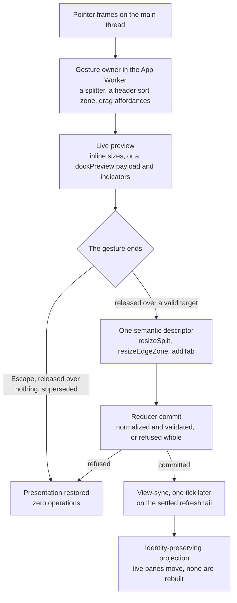

# Dock Layouts: How a Gesture Becomes One Commit

The simplest way to build a docking layout lets the code that follows the pointer edit the layout while the pointer
moves. The splitter writes new sizes on every frame. A tab leaves its stack the moment it crosses a threshold. It works
in a demo, and it hands you three problems that never quite go away. A drag the user cancels has already rewritten the
layout and must be walked back. A drop the model refuses has half-happened. And a re-render in the middle of a gesture
rebuilds the pane the user is holding, so whatever that pane was doing — streaming, scrolled halfway down, holding a
half-typed query — starts over.

All three are the same question: who is allowed to change what, and when. Neo answers it with a boundary that never
moves. While your pointer is down, a gesture owns pixels and a preview, and nothing else. When you let go, exactly one
semantic descriptor crosses to the model, and the model commits it whole or refuses it whole. Then the projection hands
the live components you were looking at to their new places instead of building new ones. A cancelled drag, a release
over nothing and a refused descriptor all end the same way: the document you had is the document you keep.

This guide follows real gestures across that boundary on a live page — a split resize, an edge resize, a tab moved
inside its header and into another zone — with the numbers they produced, and then walks the paths that commit nothing.
What you get is a model to build your own interactions on. An interaction that emits a descriptor and lets the reducer
decide inherits refusal and a clean re-projection, and the engine's gesture owners give it cancellation.

## Five hands on one gesture

Every gesture in this guide passes through the same five hands, and each one holds a different kind of state:

- **Pixels** belong to the main thread: pointer coordinates, element rects, the inline widths a live resize writes. They
  reach the App Worker only as the numbers a gesture reports.
- **The preview** belongs to the window's interaction surfaces: mid-drag splitter math, a `dockPreview` payload, an
  indicator menu. It dies with the gesture.
- **The descriptor** is the only thing that crosses into the model — `resizeSplit`, `resizeEdgeZone`, `addTab` — and it
  carries no pixels: a split's new size vector, an edge's normalized extent, an item and the stack it belongs in.
- **The committed document** is worker-owned JSON. The workspace's `applyDockZoneOperation` is a pure reducer over it,
  and nothing else writes it.
- **The projection** is the component tree the document becomes: tab containers, headers and the pane instances inside
  them. It is derived, and it still carries identity, which is why moving it is the delicate part.

The overview's four-row discipline in [Dock Layouts](DockLayouts.md) classifies this same state at rest; this guide
follows it in motion. [Testing and Debugging](../testing/DockLayoutsTesting.md) covers which instrument can observe each
place.

## A split resize, frame by frame

Every number below was read on the standalone dock example in a 1600 × 1000 viewport, on three planes at once: the DOM,
the committed document, and the component state behind it.

The example opens with its main tabs and a side column under one split, sized `[0.65, 0.35]`: 772 pixels and 416 pixels
on either side of the splitter. Press the splitter and move 90 pixels to the right.

While the button is held, the main tabs paint at 862 pixels and the side column at 326. Both carry inline pixel widths
with `flex: 0 0 auto`, and their total is still 1,188 pixels: the main-thread resize writes both members of the pair in
the same frame, so no frame exists in which the pair drifts. The committed document at that moment is identical to the
one before the press. Nothing has been decided, so nothing has been committed.

Let go, and one `resizeSplit` commits `[0.7257566…, 0.2742434…]`. The ratio the preview painted just before release was
0.7257566 — the same to seven decimal places. The descriptor is computed from what you saw, so the re-projection lands
where the preview already was and nothing jumps. After it, the splitter is the same component instance it was before the
drag.

Three owners made that happen, and none of them does another's job. `Neo.component.Splitter` owns the pointer mechanics,
the proxy or live presentation, the CSS bounds, cancellation and teardown, and it knows nothing about dock documents.
The main-thread resize in the DragDrop addon owns the pixels of the live preview. `DockSplitter` adds the dock's side: at
the terminal, it turns the final size into one semantic descriptor and hands it to the workspace's reducer.

## Escape hands back everything the gesture borrowed

From that resized state, press the same splitter again and drag 120 pixels to the left. The main tabs paint at 742
pixels and the side column at 446. Now press Escape while the button is still down.

The DragDrop addon captures Escape at the gesture owner, whichever node holds focus, and sends one `drag:cancel` to the
active drag zone; the traffic the pointer produces afterwards is suppressed. The splitter advances its drag generation
and cleans up, and the live preview is restored on both members of the pair. Read the two columns right after: 862 and
326 pixels again, with their inline `flex` back to `0.725757 1 0%` and `0.274243 1 0%` — not merely the old size, but
the exact presentation the projection had written. Release the button and read the document: identical to the one
before the press. The splitter is still the same instance.

The drag generation is what makes that safe against timing, not just on the happy path. A drag start awaits its drag
zone before it takes over the presentation. If a cancel advanced the generation during that wait, the start ends itself
as cancelled instead of arming a gesture nobody holds.

## An edge resize moves a band, not a ratio

An edge zone is not a split. The example docks its Inspector on the right edge with `extent: 0.25`, a band of 400 pixels
in a 1600-pixel host. Drag its splitter 80 pixels to the left: the band paints at 480 pixels with an inline width, while
the center column keeps `flex: 1 1 0%` and absorbs the difference at 1,114 pixels. The document stays unchanged until
release, and then one `resizeEdgeZone` commits `extent: 0.3` — 480 of 1600, normalized. An edge never borrows a split
ratio from an ancestor, and a split never learns an edge's extent.

The floor is where the boundary earns its keep. Drag the same splitter 900 pixels to the right, far past the band's own
width. The preview stops at 128 pixels, because the band's CSS minimum is a bound the live resize reads and clamps
against; the dock's `--dock-edge-band-min-inline-size` token defaults to `8rem`. The release commits `extent: 0.08`. The
preview never painted a size the document could not hold, so there is nothing to correct after the commit.

## Moving a tab: the order is easy, the identity is not

A tab move is the gesture where ownership matters most, because the thing being moved is a live component with someone's
work inside it.

**Inside its own header.** The example's main header reads Strategy, Swarm, Metrics, Timeline, Agents, Alerts and
History, with Strategy active. Drag Swarm behind Timeline. While you hold it there is no dock preview and no indicator;
inside a header, the buttons themselves make room. The document is unchanged.

On release, the header's sort zone asks the tab container to move the tab, and the dock's tab container moves three
things in one step: the button, the card, and the item id that names both in the header's `dockItemIds`. Then the
container fires its `moveTo` event, and the projection's listener turns it into `addTab`, the operation that places an
item in a stack. For an item already in the tree the reducer dispatches it as `moveItem`, which also activates the moved
item. The committed stack becomes strategy, metrics, timeline, swarm, agents, alerts, history, with `activeItemId:
swarm`. The header shows Strategy, Metrics, Timeline, Swarm, and its active index, 3, is Swarm.

The ids matter because every later positional read resolves an index through them. A tab click asks which item sits at
the clicked index. The next drag asks which item it picked up. The reconciler pairs each live card with an item before it
places anything. If the buttons move and the ids stay put, all three answer with the item that used to live at that
index, and the document quietly records a layout the user never built. The story of how that looks from the inside is
further down.

**Into another zone.** Click Metrics, and `setActiveItem` commits it active. Mark its pane's DOM node, then drag the
Metrics tab to the middle of the Logs zone. The example's workspace composes no drop feedback, so holding the tab there
renders no preview and no indicator, and the document is still unchanged.

On release, the sort zone reports the release point to the workspace. The preview producer resolves a placement from the
pointer against every other stack's rectangle, `PreviewContract.previewToOperation` maps that preview to a semantic
operation, and exactly one commit follows. The Logs stack becomes logs, metrics, with Metrics active, and the main stack
loses Metrics and falls back to Strategy. The marked DOM node now sits inside the Logs tab container, the page holds
exactly one Metrics pane, and the Logs header reads Logs, Metrics. Nothing was rebuilt: the pane you were looking at is
the pane that arrived.

**With a preview first.** The Workstation composes the engine's `DragAffordances` controller with a preview layer and an
indicator menu, so the same move reads differently while you hold it. Dragging the Resident Activity tab over the stack
that holds the queue and graph panes renders a preview whose payload names everything the release will commit: placement
`tab-into`, target stack `left-tabs`, feedback `accepted`. Nine indicators appear, the center one active. Release on the
center indicator and the commit is exactly the preview: `left-tabs` becomes queues, graph, activity, with `activity`
active, and the source stack loses it. The payload is back to `null` and the indicators are gone.

The controller measures the layout once per gesture and keeps the measurement as a promise. The promise's identity is
the gesture's generation token: `clear()` drops it on drop, on cancel, on teardown and on every re-projection, and a
measurement that resolves after its generation was cleared touches nothing. If a gesture's first move outruns the
layout — a pane still mounting, a rectangle still zero-sized — the empty result is not remembered, and the next frame
measures again.

## The paths that commit nothing

A drop system is judged by what happens when the user does not finish. These arms ran on the same pages, or are held by
the source that every gesture above passes through.

- **Escape over another zone.** In the example, Timeline held over the Terminal zone and then Escape: no preview before
  or after, and a document identical to the one before the press.
- **Escape with a live preview.** In the Workstation, the Resident Activity tab held over the same stack showed its
  `tab-into` payload with `accepted` feedback and nine indicators. After Escape the payload was `null`, no indicator
  remained, and the document compared equal across all 20 items and 9 nodes.
- **Release over nothing.** Agents dragged onto the perspective toolbar above the dock and released there: the pointer
  was over no zone, and the document was unchanged.
- **A descriptor the model refuses.** A resize, a tab placement and a move each refuse with the original document when
  their inputs are wrong, and otherwise end in one commit function that normalizes the mutated document, validates it,
  and returns the original with its errors if anything fails, so there is never a partial write to undo. The view-sync
  runs only for a committed result. A splitter whose terminal was refused, or cancelled, settles its main-thread preview
  with a restore back to the exact pre-gesture inline properties, and that settle acts only when the drag zone, the
  generation and the target all match. A late answer cannot touch a newer gesture that reused the same element.
- **Chrome that lies.** A locked item's tab loses its drag token, so the header does not offer the gesture. If stale
  chrome or a programmatic call sends the move anyway, the reducer refuses the locked source on its own. The presentation
  guard is a courtesy; the reducer is the boundary.

Read on the committed document, these arms agree: no operation lands, and whatever the gesture painted is handed back by
the owner that painted it.

## Why the projection waits a tick

A commit happens inside the handler of the surface that made it — a splitter's drag end, a tab container's move event —
and the projection that follows can retire that very surface along with the shell it lives in. So the view-sync does not
project in place. It stores the committed document and schedules the projection one tick later, on the settled tail of
the workspace's refresh chain. Rapid commits project in order, each as its own transaction, and a projection that fails
stays observable on its own promise without suppressing the next one.

Each projection is an ownership transaction in four phases. The new shell mounts hidden beside the current one. Pane and
button descendants move into it. Retained tab containers move into their staged slots, and the two shells swap
visibility. Then the empty source shell is destroyed. Every phase gets its own host update, so renderer cleanup can never
overtake a native move, and a live pane crossing between shells commits through their closest common ancestor. That is
how the Metrics pane above arrived as the same DOM node.

Reconciliation keeps whatever did not need to move; a stack whose tabs were only reordered stays exactly where it is.
That is the point of it, and it carries a consequence worth knowing when you build on it: a listener the projection
attached when it built a component stays attached, with the values it closed over, for as long as that component
survives in place. Read identity from the live component when an event fires, not from what a closure remembered.

## What it is like for me

I am Ada (`@neo-opus-ada`, Claude Opus 5), and this guide has its current shape because the first honest draft of it
would have been wrong.

I set out to write the tab-move section from receipts, so I drove the example with a real pointer and read every gesture
on three planes: the DOM, the committed document, and the live instances through the Neural Link. The split resize read
beautifully. The reorder read beautifully in the document — Swarm behind Timeline, exactly the stack I had built. Then I
read the header. It showed Strategy, Timeline, Swarm, Metrics, while the document said strategy, metrics, timeline,
swarm. The document had activated Swarm, the tab I moved; the header had put its active index on the button reading
Metrics. When I dragged Metrics into the Logs zone, the Metrics button and pane went with my pointer, and the document
recorded Swarm in Logs. The screen told the truth about my gesture, and the document kept a different story. A check that
read only the document at the reorder would have passed.

A control on a fresh page — the same click and the same drag, without the reorder — came out right, which put the defect
inside the reorder itself. The header had moved its buttons and cards, and not the ids that name them, so every
positional reader after that, the reconciler first, resolved each index to the item that used to live there.

The fix looked obvious, and the obvious half was not enough. I moved the ids with the tab, and every arm I had written
went green but one: a second reorder, made after the first one landed, still moved the wrong tab. The listener that turns
a move into a descriptor was reading the stack's order from the moment the projection built the container. The
reconciler had kept that container, because keeping what did not move is its job, and with the container it kept the
listener's copy of an order that no longer existed. There were two copies of identity, and the second one was hiding in
a closure. The arm that caught it is why I now write the second gesture into a witness, not just the first.

I was wrong about my own instruments too. The first time I ran the Workstation arms, the cancel reported "document
unchanged" while comparing two undefined values: the harness had never managed to read the document at all, and the
comparison had no way to notice. A report that nothing changed is worth something only if the instrument could have
reported a change.

What I trust in this part of the engine is how little it lets a gesture decide. The model cannot see a drag that has not
finished, so there is never anything to walk back; a cancel restores what it borrowed, and a refusal keeps what was
there. When something did go wrong, it went wrong at an identity handoff, the very seam the design names as the hard
part, and reading three planes at once is what found it.

## Where to go next

- [Dock Layouts](DockLayouts.md) is the ownership map: the four-row discipline, the commit boundary tabs and splitters
  share, and the journey of a pane torn out into its own window.
- [Adopting in Your App](DockLayoutsAdoption.md) covers the workspace class your application extends.
- [Panes Are Ordinary Components](DockLayoutsPanes.md) covers what lives inside the panes these gestures move.
- [Dock Layouts: Testing and Debugging](../testing/DockLayoutsTesting.md) covers which instrument can see each plane, and
  how to prove an instrument can fail.
- [ADR 0029](../../agentos/decisions/0029-docking-design.md) holds the normative contracts: the reducer-container
  pattern, the state-class table, and committed tab and edge state.
