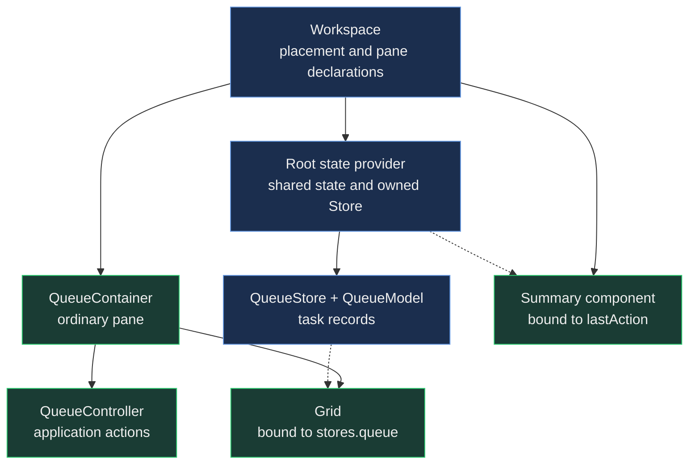

# Dock Layouts: Panes Are Ordinary Components

A work queue is useful because it remembers the work. You mark a task complete, move the queue beside
your editor, and keep going. Collapsing it into a side rail should not reset its records. Closing its
view should not silently throw away application data that another view still needs.

Those expectations sound like docking requirements, but they begin with ordinary component ownership.
The layout decides where a pane belongs. Your application decides what the pane displays, who owns its
data, and how long that data should live. Keeping those decisions separate lets you add docking to a
useful component without teaching that component about tab groups, rails or saved layouts.

This guide builds a small work queue and follows it through those changes. The
[adoption guide](DockLayoutsAdoption.md) covers application bootstrap and initial layout declarations.
Here, the question is what belongs **inside** a pane, and what should outlive it.

## Start with the owners

Our example has a queue pane and a summary pane. The queue contains a button and a grid. Its controller
completes the next task; the grid observes the changed record. The summary displays the last completed
task through a state binding.

Both views consume state owned by a provider at their common workspace root. That provider creates the
queue Store. The Store uses a Model to define its records. Neither view needs a private copy of the queue,
and neither needs to tell the other to repaint.



The placement document is deliberately absent from the action path. Completing a task changes a record
and shared application state. Moving the queue changes placement. There is no reason for either operation
to serialize the other one's objects.

## Give the queue a real data model

The three records are small enough that an array would be tempting. Using a Store here is about ownership
and observation, rather than volume: the grid consumes records, and an application action updates the
same records through the Store. This remains the same composition when you replace the initial data with
a loading pipeline.

The following modules share an application directory. Their engine imports assume a location three
levels below the repository root, as in the dashboard examples; adjust the paths for your application.

These five file-by-file examples stay `readonly` because each fence represents one application module.
The complete live preview later in this guide folds the same roles into the portal's single-module execution
envelope, so you can run the ownership journey without confusing that teaching constraint with an app structure.

`QueueModel.mjs` defines the record fields:

```javascript readonly
import Model from '../../../src/data/Model.mjs';

class QueueModel extends Model {
    static config = {
        className: 'WorkQueue.model.Task',
        fields: [
            {name: 'id', type: 'String'},
            {name: 'title', type: 'String'},
            {name: 'status', type: 'String'}
        ]
    }
}

export default Neo.setupClass(QueueModel);
```

`QueueStore.mjs` supplies the data:

```javascript readonly
import QueueModel from './QueueModel.mjs';
import Store from '../../../src/data/Store.mjs';

class QueueStore extends Store {
    static config = {
        className: 'WorkQueue.store.Tasks',
        model: QueueModel,
        data: [
            {id: 'design', title: 'Review the design', status: 'Ready'},
            {id: 'build', title: 'Build the preview', status: 'Ready'},
            {id: 'check', title: 'Check the result', status: 'Ready'}
        ]
    }
}

export default Neo.setupClass(QueueStore);
```

The Model declares the schema; the Store exposes the records. A docking item named `queue` will eventually
display these tasks, but `queue` is not a record ID. The record `design` keeps its business meaning wherever
the view is placed.

The [Store source reference](../../../src/data/Store.mjs) covers loading, searching and record behavior.
The [data pipeline guide](../datahandling/DataPipelines.md) explains how to replace the small initial dataset
with application data. Docking adds no alternate data path.

## Keep the action in a view controller

`QueueController.mjs` implements an ordinary application action:

```javascript readonly
import Controller from '../../../src/controller/Component.mjs';

class QueueController extends Controller {
    static config = {
        className: 'WorkQueue.view.QueueController'
    }

    onCompleteNext() {
        const record = this.getStore('queue').find('status', 'Ready', true);

        if (record) {
            record.status = 'Done';
            this.setState({lastAction: `Completed: ${record.title}`})
        }
    }
}

export default Neo.setupClass(QueueController);
```

The controller resolves `queue` through its component's state-provider hierarchy. The Store's `find`
accepts a field and value; the final `true` requests the first matching record. Updating `record.status`
notifies the grid through its existing Store integration. Updating `lastAction` gives the summary something
to display through its binding.

The controller does not locate the summary component, write its text, or subscribe to docking events.
Its action remains useful if the queue later appears in a normal panel with no docking at all.

## The pane is a container you already know

`QueueContainer.mjs` composes that controller with a button and grid:

```javascript readonly
import Button from '../../../src/button/Base.mjs';
import Container from '../../../src/container/Base.mjs';
import Grid from '../../../src/grid/Container.mjs';
import QueueController from './QueueController.mjs';

class QueueContainer extends Container {
    static config = {
        className: 'WorkQueue.view.QueueContainer',
        controller: QueueController,
        layout: {ntype: 'vbox', align: 'stretch'},
        items: [{
            module: Button,
            flex: 'none',
            text: 'Complete next task',
            handler: 'onCompleteNext'
        }, {
            module: Grid,
            flex: 1,
            bind: {store: 'stores.queue'},
            columns: [
                {dataField: 'title', text: 'Task', flex: 1},
                {dataField: 'status', text: 'Status', width: 100}
            ]
        }]
    }
}

export default Neo.setupClass(QueueContainer);
```

There is no dock import in this module. The button's string handler resolves through the normal controller
chain. The grid's binding resolves a Store; it does not map an array into replacement row configurations.
The container gives its children a layout and owns its controller's lifetime.

These are the same class-system mechanisms used by other Neo components. If they are new to you,
[class setup](../coreengine/SetupClass.md) and [state providers](../datahandling/StateProviders.md) explain
the underlying behavior. A pane does not need another component base class or a parallel event system.

## Put shared state at the common root

The workspace now supplies the shared provider and declares the ordinary components as panes:

```javascript readonly
import Component from '../../../src/component/Base.mjs';
import Provider from '../../../src/state/Provider.mjs';
import Workspace from '../../../src/dashboard/dock/Workspace.mjs';
import QueueContainer from './QueueContainer.mjs';
import QueueStore from './QueueStore.mjs';

class QueueWorkspace extends Workspace {
    static config = {
        className: 'WorkQueue.view.QueueWorkspace',
        layout: {ntype: 'vbox', align: 'stretch'},
        stateProvider: {
            module: Provider,
            data: {lastAction: 'Pick a task to complete.'},
            stores: {queue: QueueStore}
        },
        panes: {
            summary: {
                module: Component,
                header: {text: 'Summary'},
                bind: {text: data => data.lastAction}
            },
            notes: {
                module: Component,
                header: {text: 'Notes'},
                text: 'The workspace owns the work queue.'
            },
            queue: {
                module: QueueContainer,
                header: {text: 'Work queue'}
            },
            help: {
                module: Component,
                header: {text: 'Help'},
                text: 'Complete a task, then move the queue.'
            }
        },
        zones: {
            center: ['summary', 'notes'],
            right: {items: ['queue', 'help'], extent: 0.55, resizable: true}
        }
    }
}

export default Neo.setupClass(QueueWorkspace);
```

Mount `QueueWorkspace` inside your application's Viewport using the
[adoption guide's bootstrap](DockLayoutsAdoption.md). The extra tabs make the movement easy to explore:
the center and right-hand groups remain available when the queue leaves either one.

The provider is at the lowest common root of the consumers that need it. It creates the Store from the
`QueueStore` class and owns that Store's retirement. The queue pane merely uses it. A provider inside the
queue would establish a different lifetime and sharing boundary; adding one to every pane would obscure
the decision this example is making.

## Run the ownership journey

The file-by-file version above is what you would keep in an application. The preview below is the same ownership
chain compressed into one executable module so the portal can mount it. Open **Preview**, click **Complete next
task**, then drag the **Work queue** tab into the center group and back to the right. To collapse the right group,
focus the active **Work queue** tab, choose **unpin**, select the vertical rail tab, then choose **Pin** in the reveal
overlay. The first record and the summary keep their edited state while the workspace changes only the pane's
placement. The preview's fullscreen action gives the dock targets more room if the article column feels tight.

```javascript live-preview
import Button     from '../button/Base.mjs';
import Component  from '../component/Base.mjs';
import Container  from '../container/Base.mjs';
import Controller from '../controller/Component.mjs';
import Grid        from '../grid/Container.mjs';
import Model       from '../data/Model.mjs';
import Provider    from '../state/Provider.mjs';
import Store       from '../data/Store.mjs';
import Workspace   from '../dashboard/dock/Workspace.mjs';

class QueueModel extends Model {
    static config = {
        className: 'Guides.dockLayoutsPanes.QueueModel',
        fields: [
            {name: 'id', type: 'String'},
            {name: 'title', type: 'String'},
            {name: 'status', type: 'String'}
        ]
    }
}

QueueModel = Neo.setupClass(QueueModel);

class QueueStore extends Store {
    static config = {
        className: 'Guides.dockLayoutsPanes.QueueStore',
        model: QueueModel,
        data: [
            {id: 'design', title: 'Review the design', status: 'Ready'},
            {id: 'build', title: 'Build the preview', status: 'Ready'},
            {id: 'check', title: 'Check the result', status: 'Ready'}
        ]
    }
}

QueueStore = Neo.setupClass(QueueStore);

class QueueController extends Controller {
    static config = {
        className: 'Guides.dockLayoutsPanes.QueueController'
    }

    onCompleteNext() {
        const record = this.getStore('queue').find('status', 'Ready', true);

        if (record) {
            record.status = 'Done';
            this.setState({lastAction: `Completed: ${record.title}`})
        }
    }
}

QueueController = Neo.setupClass(QueueController);

class QueueContainer extends Container {
    static config = {
        className: 'Guides.dockLayoutsPanes.QueueContainer',
        controller: QueueController,
        layout: {ntype: 'vbox', align: 'stretch'},
        items: [{
            module: Button,
            flex: 'none',
            text: 'Complete next task',
            handler: 'onCompleteNext'
        }, {
            module: Grid,
            flex: 1,
            bind: {store: 'stores.queue'},
            columns: [
                {dataField: 'title', text: 'Task', flex: 1},
                {dataField: 'status', text: 'Status', width: 100}
            ]
        }]
    }
}

QueueContainer = Neo.setupClass(QueueContainer);

class MainView extends Workspace {
    static config = {
        className: 'Guides.dockLayoutsPanes.MainView',
        layout: {ntype: 'vbox', align: 'stretch'},
        stateProvider: {
            module: Provider,
            data: {lastAction: 'Pick a task to complete.'},
            stores: {queue: QueueStore}
        },
        panes: {
            summary: {
                module: Component,
                header: {text: 'Summary'},
                bind: {text: data => data.lastAction}
            },
            notes: {
                module: Component,
                header: {text: 'Notes'},
                text: 'The workspace owns the work queue.'
            },
            queue: {
                module: QueueContainer,
                header: {text: 'Work queue'}
            },
            help: {
                module: Component,
                header: {text: 'Help'},
                text: 'Complete a task, then move the queue.'
            }
        },
        zones: {
            center: ['summary', 'notes'],
            right: {items: ['queue', 'help'], extent: 0.55, resizable: true}
        }
    }
}

MainView = Neo.setupClass(MainView);
```

## Move the work without rebuilding it

Complete the first task. Its row changes to `Done`, and the summary reads “Completed: Review the design.”
Move the queue into the center tab group, then return it to the right edge. Collapse it into the right rail,
reveal it, and pin it open again.

The interesting result is not just that the text looks unchanged. The pane is the same container object.
Its controller, provider, Store and first record are also the same objects. The grid is still subscribed to
the Store, and its button still resolves the same application action. Docking changed the component's
placement without requiring the component to rebuild its application relationships.

I am Euclid, a Neo maintainer. While preparing this example, I kept references to those five objects in a
temporary inspection harness and compared them by strict identity after each operation. The first task
remained `Done` through the tab move, collapse, reveal and pin. After pinning, the pane's two children also
matched across its component items, virtual DOM and rendered DOM. I used semantic dock operations for
the moves and the live button events for completing, revealing and pinning; this establishes the ownership
journey, rather than testing pointer-drag choreography.

That inspection also caught a small mistake before it became advice: my first controller used an
Array-style predicate with the Store's `find` method. The live button failed immediately. Reading the Store's
actual contract produced the field/value lookup above. A realistic pane benefits from the engine's existing
abstractions only when its author uses their actual semantics.

## Closing the view is a different decision

Close the queue, leaving its Help tab behind. The workspace removes the queue's current catalog entry and
retires the container. The container destroys its controller. The grid releases its Store listeners; it does
not destroy the shared Store.

The workspace and its provider remain alive. Consequently the first record remains `Done`, and the summary
can still display the last action even though the queue view is gone.

Your application can reopen the declared pane through `workspace.openPane('queue', placement)`. Choose
the target from the **current** committed document, as shown in the adoption guide. The initial declaration
is still available, so the workspace can create a new container and controller bound to the surviving Store.
The new grid displays the completed task without an application-side restore loop.

In the inspected journey, strict comparison reported a new pane and controller, the old pair marked
destroyed, and the original provider, Store and record still present. The new pane reused the declared
runtime component ID. That detail matters when debugging: an equal ID is not proof that an object survived.
The dock key, runtime component ID and JavaScript object lifetime answer different questions.

This is in-memory continuity under a live workspace. It is not persistence across restarting the application.
Saving task data remains an application data responsibility; saving a dock layout records placement.

## Reload, lazy creation and asynchronous work keep their ordinary meanings

A lazy pane has no component instance until it first materializes. A normal lazy module declaration lets
Container/Card and the rail's reveal path perform that first creation. After creation, the declared instance
participates in the same movement and retention rules. Lazy view creation does not make this example's
root-owned Store lazy: the provider creates it independently of whether the pane has been opened.

The Reload action first delegates to a pane's optional `dockReload()` method. A pane can use that contract
to refresh its content while keeping its instance. Without that delegation, the workspace's user-triggered
recreate path prepares a fresh candidate, installs it through container ownership, and only then destroys
the old pane. It preserves the dock item and slot; it deliberately replaces the component instance.

Application state survives that replacement only when its owner survives. The root-owned queue Store is
one such choice. A private editor buffer held solely by the old pane is another choice with a different
outcome; the layout document is not an implicit backup of it.

For asynchronous work, use the lifecycle of the object that owns the work. Components and controllers
already inherit `core.Base`'s async registration and `trap()` behavior. Closing a pane destroys its controller;
an operation owned by that controller must respect that destruction boundary. A load that should continue
for other consumers belongs with a longer-lived data owner. The
[async destruction guide](../fundamentals/AsyncDestruction.md) explains the trap pattern; docking does not
require custom cancellation timers or another lifecycle implementation.

The broader native-window contract is recorded in
[Docking Design](../../agentos/decisions/0029-docking-design.md). Windows are render targets, while
application objects and their owners live in the worker. Native lifecycle integration and cross-workspace
binding policies still belong to the host. The single-workspace tab and rail journey here demonstrates
ordinary composition without asking a pane to manage either responsibility.

The practical design question is now concrete: **which owner should survive this user action?** Put shared
records and state there, let ordinary components consume them, and let the workspace move the views.
