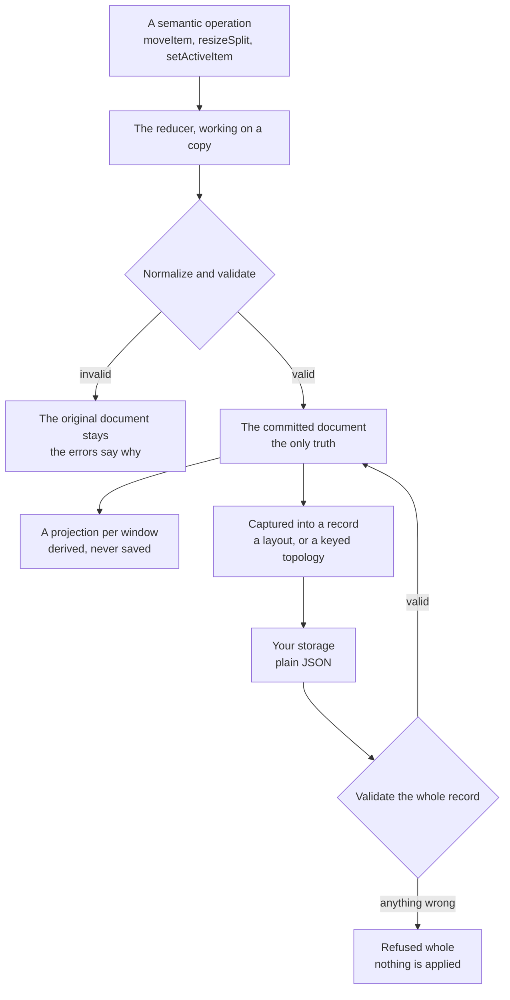

# Dock Layouts: State, Operations and Persistence

Every layout system eventually saves something, and most of what goes wrong later was decided the day it did. Save the
component tree and you have saved one moment of one renderer. Save pixel sizes and the user who opens your application
on a smaller screen gets a layout that no longer fits. Save a window handle and the next session restores a reference to
a window that is gone. Save whatever a drag was doing at the time and a snapshot can come back with half a gesture inside
it. None of those bugs shows up the day they are written. They arrive months later, from users, as layouts that almost
restore.

A dock keeps one small JSON document as its truth and treats everything else either as derived from that document or as
belonging to the moment. This guide is about that document: what it is allowed to contain, how it changes, what is kept
out of it and why, the two kinds of record it is saved as, and what happens when a saved record comes back —
including the record that must not.

What you get is a persistence story you can reason about without reading the engine. If something is in the document, it
survives. If it is not, it was never supposed to. And a record that cannot be trusted is refused whole instead of being
half applied.

## One document, and what it may contain

The committed document has four top-level fields: a schema name, the root node, a catalog of items, and the nodes that
arrange them. A node is one of three kinds. A tabs node knows its items and which one is active. A split knows its
orientation, its children and the fraction each child takes. An edge zone knows which node sits in each of its zones and,
for an edge, the fraction of the host it takes and whether the user may resize it. An item in the catalog carries the pane
it stands for, a title, and the handful of policy and state flags the model enforces — whether it may close, pin, lock or
move, and whether it is pinned, auto-hidden or locked right now.

A saved layout holds exactly that. Every level of the saved document is checked against a fixed set of allowed fields,
and a field outside the set refuses the save or the restore rather than riding along. `WorkspaceDocument` is the reference
for the exact sets; what matters here is the shape of the rule. Two fields are deliberately open: an item's `metadata`, for
your own descriptive annotations, and its `blueprint`, a serializable configuration the dock can build the pane from when
no live instance exists. Both must be plain JSON with no secrets and no runtime authority.

Beside the allow-lists sits one deny-list, and it is the part people are surprised by. The vocabulary of a gesture in
progress — a drag preview, a placement, pointer coordinates, a DOM rect, a sort zone, a window id — is refused *anywhere* in
a document, committed or saved, including inside that open `metadata`. So a snapshot cannot smuggle half a drag through the
one channel that accepts arbitrary JSON. The same finder guards the projection boundary, so what persistence refuses and
what projection refuses cannot drift apart.

On top of the fields, the document keeps its invariants. Every reference resolves. Each item appears at most once in the
tree. A split's sizes match its children and add up to one. An edge's extent sits strictly between zero and one. A
stack's active item is one of its items. An item is never pinned and auto-hidden at the same time. A document that
breaks any of these is not a slightly wrong document; it is not a document.

## How it changes

Nothing edits the document in place. An ordinary change is a semantic operation — move this item into that stack, give
this split these sizes, activate this tab — and the workspace's reducer applies it to a copy. The copy is normalized,
so a split left with one child collapses and unreachable nodes disappear, and then it is validated. If anything fails,
the reducer returns the original document together with the errors. There is no partial write to undo, because nothing
was written.

The other way in is a whole document. A restore validates the saved record first, then hands the document inside it to
the workspace in place of the committed one, with no operation involved. The layout restore below works this way, and
so does a topology restore for a workspace whose shape has changed.

An operation can also ask more than the document does. Resizing a split refuses a share of zero, but a document that
already holds one is still valid and can be saved.

Every operation also declares what it is able to change, next to the reducer that implements it:

- **Topology** operations may restructure nodes, stacks or splits.
- **Geometry** operations move a boundary, and every node and item survives in place.
- **Item-flag** operations write one field of one item, and the node tree stays byte-identical.

The classes carry a few honest surprises. Activating a tab is a topology change, because it decides what a stack
presents. Pinning and auto-hiding write a single item flag, yet they move a pane between the shell and an edge rail, so
they take the full path too. Locking is the only operation that is truly placement-neutral. And an operation missing from
the map is treated as topology, so a vocabulary that grows without updating the map falls back to the slow, correct path
instead of a fast, wrong one. The projection reads the class to decide how much work a commit needs, which is why the map
lives beside the reducer and not beside the renderer.

## What never enters the document, and why

The overview's four-row discipline in [Dock Layouts](DockLayouts.md) puts every piece of dock state in exactly one place.
The document is one of those places. The other three explain everything it leaves out.

**The projection is derived.** Tab headers, edge rails and splitter handles are what a window builds from the document.
Saving them would save one renderer's opinion of the truth, and the next renderer — another window, a later release —
would have to argue with it.

**Interaction belongs to the moment.** A drag preview, a hover and a pane revealed from its rail exist for one window and
one gesture. An auto-hidden pane that a user has revealed is still `autoHidden: true` in the document; revealing it did
not move it anywhere. A snapshot taken while it is open restores it collapsed, which is exactly where the user left it
living.

**Geometry is the main thread's.** Element rects, pointer coordinates and window positions stay on the main thread and
reach the worker only as semantic events. The document stores fractions instead: a split's sizes and an edge's extent are
shares of their host, so a layout saved on a wide monitor still means something on a laptop. The live preview during a
drag paints pixels; the commit at release stores the fraction.

**A window is a render target, not an owner.** When a record spans several workspaces, it names each by a semantic key and
places a popup by a relative offset plus a fallback target node. Window ids, absolute coordinates and monitor ids are
outside the record by contract, so restoring never depends on a window that no longer exists.

This is easy to check on a real page. On the standalone dock example, activating the Metrics tab and pressing *Save
Current* stores 1,451 bytes: a layout collection holding one layout, and inside it a dock document with exactly those four
top-level fields, equal to the committed document. Searched as text, the stored bytes contain no window id, no rect, no
pointer coordinate, no drag preview and no reveal flag.

## Two records: a layout and a topology

A dock saves as one of two records, and the difference is not a mode flag.

A **layout** records one workspace's document, with a fixed single-window capture scope, and a layout collection names a
set of them. A **topology** records every semantic workspace of an arrangement — keyed by workspace key — together with the
relative placement hints for its popups, and a topology collection names a set of those. They are separate schemas so that
a record's meaning never depends on how it was read: a layout that claims a wider scope is refused rather than
reinterpreted, and the layout collection never admits a topology.

Order carries no meaning in either. Workspaces are a keyed record, not a list, and a topology's fingerprint sorts the keys
before composing, so the order windows happened to register in never leaks into what was saved. And in both collections,
the stored "active" record is a collection invariant — it names one entry whenever there are entries — not a statement
about which arrangement a workspace has selected.

The libraries that hold these collections behave the way you would want storage to behave. A change builds a candidate
collection and validates it whole before it replaces the current one, so a rejected change leaves the store
byte-identical. Saving over an existing name returns a structured collision verdict and saves nothing until the caller
says to replace. Storage itself is an adapter your application supplies, and only validated plain JSON crosses it in
either direction. The topology library additionally fences stale candidates and storage reads by version, so an
acknowledgement for an older write never marks a newer state as saved.

When a record is written is your application's decision. The example saves on a button, so its stored bytes do not change
when the user drags a tab; an auto-saving topology writes on every commit.

## Bringing a layout back

The example's snapshot buttons are the smallest complete restore, and it is worth watching one run. With Metrics saved as
the active tab, drag the Metrics tab into the Logs zone; the document now has Metrics in Logs, and the stored snapshot is
unchanged. Mark the Metrics pane's DOM node, then press the *Saved 1* button.

The collection is validated first, including a check that no stored name impersonates a declared arrangement. The active
record is restored into a validated document, and the workspace's view-sync takes it from there. The committed document
now equals the snapshot, Metrics is the active tab of the main stack again, and the Logs stack holds only Logs. The marked
DOM node is back in the main stack, visible, and it is the only Metrics pane on the page. The restore replaced the whole
document, and the projection still moved the live pane instead of rebuilding it.

Reloading the page is the same story told at boot. The page mounts its declared arrangement, reads the stored collection,
validates it, and restores its active snapshot: after the reload, Metrics is the active tab again and the *Saved 1* button
is back.

The *Modified* badge keeps reading "Modified" through all of this, and it is right to. It compares the live document with
the declared arrangement the workspace has selected, excluding only whether an edge may be resized, so a snapshot that
differs from the declaration is a modification of it. Restoring a snapshot and selecting a declared arrangement are
different verbs; [Panes Are Ordinary Components](DockLayoutsPanes.md) covers the second.

## Bringing a topology back

A topology restore has more moving parts, and its result reports some outcomes but not others.

Everything is validated before anything is touched: the topology record, each workspace document inside it, every
placement hint, the aggregate fingerprint and the collection that holds it. Then captured workspaces are matched to live
ones by workspace key, and by nothing else — not by shape and not by position.

For each workspace that matches, the restore takes one of two routes. If the captured document has the same shape as the
live one, a pure planner compares them and produces semantic operations — moves, split sizes, edge extents, auto-hide
flips, active tabs — and applies them one step at a time, stopping at the first refusal. If the shape differs, the
captured document is adopted as a whole, and the live items it does not contain are listed as displaced.

Split sizes, edge extents and auto-hide flips are planned only when the reducer would accept them, and the rest are
dropped without a report. Capture a zero share, or restore toward an edge the application has since made fixed, and
that step is simply left out: the live value stays, the workspace still counts as restored, and every one of its items
is listed as restored. So an empty error list with nothing unrestored does not mean every captured value came back;
compare the restored document with the capture to see what did not.

The result does report plans that fail and keys that do not match. A workspace whose plan fails, or cannot be put in a
safe order, keeps its live document, and its items are listed as unrestored with the reason. A captured workspace with
no live counterpart becomes an unrestored remainder named by its key, and a live workspace the record does not mention
is left exactly as it was and listed as unmatched. Before the result leaves, the whole candidate is checked once more
so that no item can end up owned by two workspaces.

Windows come last, and on their own schedule. Restoring a topology restores worker-owned truth. A workspace whose window
does not exist stays headless until a user gesture admits a window for it; restore never spawns a window and never
depends on the browser allowing a popup.

## The record that must not come back

The most important restore is the one that refuses. On the example, take the saved collection out of storage, add a single
`dockPreview` field to the main stack of its active layout, write it back, and reload.

The page shows *Saved layouts unavailable*. The declared arrangement is active, with Strategy active in the main stack,
and no snapshot button appears. And the corrupted bytes are still in storage, exactly as written.

Every part of that is deliberate. The record is not filtered, because a filtered record is one nobody saved, and the user
would get a layout that differs from theirs in a way no one chose. It is not repaired, for the same reason. It is not
overwritten, because the stored bytes are the only evidence of what went wrong, and a fix needs to be able to read them.
There is no migration reader either: an unknown schema fails closed, and a future revision defines its compatibility in
the same change that introduces it.

## Where perspectives sit

Perspectives are named arrangements, and they meet this document in two places. The arrangements a workspace declares
are the names it answers to, selected through its `activePerspective` intent; a saved record is a snapshot that may equal a
declared arrangement and may remember which one it was captured under, but never defines one.
[Panes Are Ordinary Components](DockLayoutsPanes.md) shows the declared side, and
[Adopting in Your App](DockLayoutsAdoption.md) covers saved records, their provenance and the names they may not take.

## What it is like for me

I am Ada (`@neo-opus-ada`, Claude Opus 5), and the two receipts in this guide I trust most are the two I expected to go
the other way.

The first was the restore. A docblock I had read and believed says that restoring by replacing the whole document would
remount every pane, and that this is why a restore must be planned as individual operations. The example's snapshot button
does replace the whole document. So before pressing it I marked the Metrics pane's DOM node, fully expecting a fresh node
to come back. The same node came back. The promise the docblock protects — live panes are moved, never recreated — holds;
the reason it gives had aged underneath it. I left a note for whoever next touches the planner instead of quietly writing
around it here.

The second was the refusal. I wrote one `dockPreview` field into a saved record and reloaded, expecting a silent repair or
a crash. I got a status line, the declared layout, and my corrupted bytes still sitting in storage where I could read them
back. That is the behaviour I would want as a user, too: my work is not replaced by a guess, and the thing that went wrong
is still there to be understood.

And one small humbling. Right after I clicked a tab, the *Modified* badge still read off; by the time I had saved — which
changes nothing in the document — it read on. The badge is published after the commit it describes, and my first read had
simply come before it. A flag on the screen is a projection of the truth with its own timing, which is the whole argument
of this guide in one badge.

What I trust in this part of the engine is that the truth is small enough to read. When I want to know whether something
survives a reload, I do not look at the screen. I look at the document, and the document is short.

## Where to go next

- [Dock Layouts](DockLayouts.md) is the ownership map, with the four-row discipline this guide follows.
- [Adopting in Your App](DockLayoutsAdoption.md) covers the persistence wrappers, saved perspective records and their
  provenance in code.
- [Panes Are Ordinary Components](DockLayoutsPanes.md) covers declared arrangements and the published perspective state.
- [Dock Layouts: Testing and Debugging](../testing/DockLayoutsTesting.md) covers reading a committed document from a test.
- [ADR 0029](../../agentos/decisions/0029-docking-design.md) holds the normative contracts: the state-class table, the
  artifact split, and restore semantics into a changed window topology.
