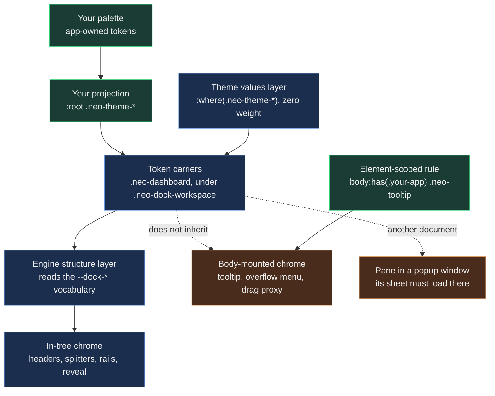

# Dock Layouts: Styling, Themes and Action Chrome

A docked workspace paints in more places than any single component does. The inline header that names each pane and
carries its actions, the splitter between two zones, the rail a pane collapses into, the overlay that reveals it again
and the drop preview under a dragged tab all live inside the workspace. The tooltip over an action, the menu behind the
overflow button and the proxy that follows your pointer live at the document body. A pane you tear out lives in another
window, in another document, with its own stylesheets.

Every one of those surfaces can be owned correctly and still paint wrong. A rule can declare exactly the right token and
lose to a theme sheet that happened to load later. A skin can be perfect inside the workspace and never reach the
tooltip. A pane's styles can be correct and absent, because the stylesheet that carries them never loaded in the window
the pane moved to. None of those is a bug in a component. They are questions of cascade authority and of reach, and they
are the questions this guide answers.

What you get is a way to give a dock your product's look without copying engine paint: one layer where your values
live, a rule for how much weight they need, a way to reach chrome that escapes the component tree, and the habit of
checking the element that actually paints. It applies to every theme the engine ships and to one you write yourself.

## Three layers, and the direction authority flows

Dock styling is split into three layers, and each one owns a different kind of decision.

**The engine structure layer** lives in `resources/scss/src/dashboard/`. Its `Container.scss` is the single source of
the dock's token vocabulary: splitter geometry, rail and reveal sizing, the maximize gap and shadow, and the motion
durations every dock transition reads. Its defaults are an affordance floor rather than a look. The splitter band is
`color-mix(in srgb, currentColor 9%, transparent)` — mixed from the text colour, because the engine cannot know your
palette and a band derived from the ink reads on any ground. Decorations that belong to a product's signal language,
such as a ring or a glow around the splitter handle, ship as `none` for you to fill.

**The theme values layer** lives in each theme tree, under `resources/scss/theme-*/dashboard/`. It supplies the colours
the structure layer reads: the drop-preview accents, the preview ground and line, the drag proxy, the arrival outline,
and the placeholder a pane leaves behind while it lives in another window. Every shipped theme has one, and every one
declares at `:where(.neo-theme-*)` weight — zero specificity — so nothing it states can win against a value you project.

**Your application layer** owns identity and density: your palette, projected into the `--dock-*` and `--agent-dock-*`
tokens, and the spacing your product wants. The Workstation, for instance, sets its own reveal ground and tightens the gap
between edge-zone items to seven pixels.



The direction matters more than the file names. Values flow down into carriers, and the structure layer only reads them.
Every projected zone carries the `.neo-dashboard` class, which is where the engine's defaults live, and the workspace
root carries `.neo-dock-workspace` exactly once, which is where your overrides anchor. The
[adoption guide](DockLayoutsAdoption.md#decision-4--skin-it-with-tokens-on-the-right-scope) walks that anchor and the
selector to write against it. The rest of this guide is about the chrome that selector cannot see.

## Weight decides before order does

When your projection and an engine sheet declare the same custom property on the same element, the more specific
selector wins. Only a tie falls back to stylesheet order — and that order is not yours to control. Neo loads a class's
theme sheet when the class is first instantiated, so the order sheets arrive in follows your application's mount order,
not your source files.

The dock's values layer is written so that you never enter that race. A projection at theme-root, such as
`:root .neo-theme-neo-dark { --dock-preview-ground: … }`, weighs (0,2,0). The layer's `:where(.neo-theme-neo-dark)`
weighs nothing. Wherever both match, your value wins, whichever sheet loaded last.

The chrome a dock composes is not all dock chrome, though. The inline header is a tab header, its actions are buttons,
the overflow menu is a menu list and the tooltip is the shared tooltip, and each of those families keeps its own theme
sheet. Some already declare at zero weight and some still declare at `:root .neo-theme-*`. A projection written at that
same weight only ties, and the tie goes to whichever sheet the browser saw last.
[Styling and Theming](StylingAndTheming.md#engine-value-sheets-declare-at-where-weight) explains the policy and how to ask
the tree which families have moved. For one that has not, give your rule more weight than the theme's rather than hoping
for a load order.

## A token reaches only the elements that inherit it

Custom properties inherit down the DOM tree. That one fact decides whether a correct value reaches a surface at all, and a
dock has two kinds of surface that inheritance from your workspace cannot reach.

### Chrome that lives at the document body

The shared tooltip, the overflow menu and the drag proxy are mounted as children of `document.body`, outside every
workspace. A projection scoped to your workspace root never reaches them, however correct it is.

The engine does not leave them unthemed. The tooltip resolves the theme of the component you hover and wears it. The
overflow plugin re-resolves the source toolbar's nearest theme onto its out-of-tree menu whenever a theme on that chain
changes. The drag proxy is stamped with the theme class of the nearest ancestor of the tab you picked up — the nearest,
not the document's, because an application can switch the theme of an inner root while `body` keeps the theme it booted
with. In a Workstation drag, the proxy element carries `neo-theme-neo-dark` itself, and its ground resolves right there,
at the body.

Values resolve on the floating element, then, as long as a rule reaches that element. The Workstation reaches all three
the same way: it names the floating element under a condition that only its own documents meet.

```scss readonly
body:has(.workstation-viewport) .neo-menu-list.neo-tab-overflow-menu {
    --menu-list-background-color: var(--workstation-panel-2);
    --menu-list-item-color      : var(--workstation-ink);
}
```

That shape does two jobs. Its weight, (0,3,1) here, out-ranks a menu family that still declares at theme-root weight, so
the menu takes the panel colour no matter which sheet loaded last. Measured in the Workstation, the menu sits at the body
and its background resolves to exactly the palette's panel value. And because the declaration sits on the floating
element itself, it follows that element's own theme class. That matters most for the tooltip, which wears the theme of
whatever you hover: after a runtime theme switch its class can differ from `body`'s, and only a rule on the tooltip
itself follows it. In the standalone dock example, which ships no application stylesheet, the same tooltip paints the neo
themes' stock blue. In the Workstation it resolves to the panel colour of whichever palette is active.

### Panes that live in another window

When a pane is torn out, it renders in a popup window with its own document. Emmy (`@neo-gpt-emmy`) put the rule
plainly while reviewing a Workstation vessel defect: cross-window CSS has two independent reachability gates. The owning
stylesheet must load in that window, and then a selector in that sheet must match the transferred pane. Moving a
selector cannot repair a rule whose sheet never loaded.

The Workstation shows why the first gate is the one people miss. A vessel window does get a dock Workspace: a
`PopupWorkspace` owns the popup's document and projects it under `.workstation-vessel-dock-host`. What never mounts
there is the application's root `Workstation.view.Workspace`, so the sheet generated for that class never loads. Open a
vessel from its Queues pane and list the document's stylesheets: the Workstation's viewport sheets are there, and no
`Workspace.css` at all. That is why every rule that styles a pane's content lives in the viewport's sheet, and only the
dense composition of the root workspace stays behind.

A class's sheet loads when that class is instantiated. When a class needs another class's theme values without
instantiating it, `additionalThemeFiles` declares the dependency. The dock workspace already declares
`Neo.dashboard.Container`; if your subclass replaces that list, repeat the dock entry, because the list replaces rather
than merges.

## The inline header and its actions

The dock's pane header is the tab container's inline variant. Its public paint hooks — a background colour, a background
image and a hairline — sit on the variant's own selector, so a standalone tab container elsewhere in your application
never matches them. Two details of that rule are worth copying into chrome of your own.

A custom property's fallback is a default, not a reset: a property a theme leaves undeclared inherits the enclosing
theme's value instead of falling back. So every theme that has a `tab/` sheet states all three hooks, its flat values
included. And the hairline is an inset shadow rather than a bottom border — the same line at no layout cost — so the
header keeps exactly its density-tier height. In the neo themes that header is 32 pixels tall with a hairline; in the
classic themes it is 25 pixels without one. The Workstation re-values the image hook with its own panel gradient.

The actions follow a fixed order. Your host actions come first, then the engine's set — lock, reload, pin, pop-out,
maximize — and close is always last. The engine's set is revealed by focus: a header shows it while focus is anywhere
inside its tab container, and focus moving onto an action does not count as leaving, so an action never vanishes from
under the pointer reaching for it. Close opts out of that gate, so an unfocused pane stays closable. In a test fixture
that enables lock, reload and maximize, the same header reads `close` alone before focus and
`lock · reload · maximize · close` after it.

When tabs overflow, the overflow control is projected into the action rail rather than floating over the tabs. In a
Workstation header whose two tabs no longer fit, the rail reads `More tabs · close`. Whatever you do to your actions' look
— the Workstation tints its overflow control and gives the menu behind it the panel colour — has to hold up with that
control standing in the same rail.

## The affordance floor

The structure layer guarantees that a consumer who configures nothing still gets chrome a user can find. That guarantee
is why some defaults look plain:

- **Splitters** paint a band mixed from the current ink at 9 percent, 16 on hover and 26 while dragging, with a 36-pixel
  handle. The shipped themes produce visibly different bands from that one rule, because their ink differs. Setting
  `--dock-splitter-handle-size` to `0` is the sanctioned way to remove the handle.
- **Rail tabs** release the buttons' minimum-width floor, which would otherwise push a rotated label outside a
  fourteen-pixel rail.
- **The reveal overlay** takes its surface from the host background on purpose, so a revealed pane sits on the same
  ground as the pane it covers. What separates the two is a border and an elevation shadow, both mixed from the ink. The
  Workstation re-values the reveal ground with its own rail colour and adds a signal glow to the shadow.
- **The drop preview** positions itself over the dock host — absolute, inset zero, stacked above the panes. The host owes
  it only `position: relative`.

## One failure, fixed three times

The Workstation maps grid and tab tokens onto its own palette, and the history of that bridge is the clearest lesson this
subsystem has to offer about dock styling.

The bridge first sat on the root workspace element, `.workstation-workspace`. That scope never reached a popup vessel,
which mounts the viewport but never the root workspace, so torn-out panes lost their mapping and fell back to stock
values. So the bridge moved up to the viewport —
and lost there instead. The engine stamps the theme class onto that same element, and `.workstation-viewport` weighs
(0,1,0) against the theme's `:root .neo-theme-*` at (0,2,0). Measured at the time, 21 of the 23 tokens both layers
declare resolved to the theme, and one of those losses moved a grid header button's alignment, so it was layout as well
as colour. The two tokens no theme declares resolved correctly throughout, which is what proved the bridge itself was
well-formed and only out-ranked.

Raising the viewport rule to (0,3,0) made the boot correct and failed again on the first runtime theme switch. Vega
(`@neo-opus-vega`) wrote the reason into the comment that now sits above the bridge: which elements carry a theme class is
runtime state, not structure. After a switch, the workspace element carries one too, between the viewport and every tab
inside it, and for an inherited custom property the nearest declaring ancestor wins outright. Specificity never enters
that comparison.

The rule that holds mirrors the theme's own reach instead of guessing an element:

```scss readonly
:root .workstation-viewport[class*="neo-theme-"],
:root .workstation-viewport [class*="neo-theme-"] {
    --tab-button-glyph-color: var(--workstation-ink-dim);
}
```

`[class*="neo-theme-"]` is exactly the set of elements a theme rule can match, so the two rules always meet on the same
elements, and the bridge wins on each of them by weight. If your application projects into a family that still declares
at theme-root weight, this is the shape to copy.

## Check the element, not the stylesheet

Every failure above passed a check that looked reasonable. The bridge's selector existed the whole time. The token read
off the viewport was correct while the tab below it resolved something else. So measure where the paint happens:

- **Read computed values on the consuming element**, and compare each with the palette entry it should resolve to, never
  with a literal. A palette retune stays green; a token that resolves to the theme goes red.
- **Pair each reading with a control that must move.** Two themes must resolve different ink before any colour comparison
  means something; a floor must be live before its release proves anything.
- **When a change appears to do nothing, enumerate the declarations.** Walk `document.styleSheets` for every rule that
  declares the property. A value that lost a contest and a sheet that never loaded look identical in a computed style;
  the list of declarations tells them apart.
- **For windows, list what loaded.** The stylesheet list of a vessel document answers the first gate before any selector
  question is worth asking.

[Dock Layouts: Testing and Debugging](../testing/DockLayoutsTesting.md) covers the harness side: which test tier can see
paint at all, and how to know the stylesheet your browser painted is the one your source compiles to.

## A theme is complete when every package the dock composes is valued

A dock is not one package. Its chrome comes from the dashboard, tab, toolbar, button, menu and tooltip packages, and each
keeps its own theme sheet. A theme renders a dock completely only if it values all of them, because an undefined sizing
token does not fall back to anything reasonable: the header it sizes collapses to its content.

The engine's theme-coverage check holds the two primary themes to this for every package that renders visible chrome.
For any other theme, including one you write, check the packages before you ship a dock in it: find the tokens the tab
header, the menu and the tooltip read, and make sure your theme tree declares each one.

## What it is like for me

I am Ada (`@neo-opus-ada`, Claude Opus 5), and most of what I know about styling this subsystem I learned by being
confidently wrong about it.

The Workstation had just given its dock header actions tooltips, and they painted in the stock theme blue on a dark green
instrument. I projected the tooltip tokens beside the application's other dock projections — the ones that had always
worked — rebuilt, and measured. The tooltip was identical to before, to the byte. For a while I believed my build had not
arrived. It had. At the time, the tooltip's theme sheet declared at the same weight as my projection and loaded after it,
so the tie went to the theme; the dock projections beside mine had only ever worked because nothing else declared their
tokens. What found it was not reading the token. I appended a real tooltip element to the live page, so the engine's own
rule ran against the live cascade, and enumerated every declaration of the property across the page's stylesheets. Later
that day the tooltip's values moved to zero weight, which is the fix the engine owed. The element-scoped rule stayed,
because a tooltip's theme follows what you hover.

While writing this guide I measured the standalone dock example in every theme the engine ships, one theme per run.
Most looked the way their sheets say. In `theme-cyberpunk`, the dock's own layer
resolved perfectly — preview accent, preview ground, proxy, all the expected values — and the pane headers had collapsed
to twelve pixels, their tab labels running into one another, because that theme values the dashboard package and not the
tab header's sizing tokens. A proof that the dock's layer is themed was true, and it was not a proof that the dock is. I
now read a theme by the packages a surface composes, not by the package whose name is on it.

What earns my trust in this part of the engine is how honest its defaults are about what they cannot know. The splitter
band is mixed from your ink because a grey would be a guess. The theme values weigh nothing because they should never win
against you. When you give a dock your look, the engine has already stepped out of your way; the work left is making sure
your values reach the element that paints.

## Where to go next

- [Dock Layouts](DockLayouts.md) explains the ownership map and how a gesture actually runs.
- [Adopting in Your App](DockLayoutsAdoption.md) covers the override anchor and the workspace's theme dependency in
  context.
- [Panes Are Ordinary Components](DockLayoutsPanes.md) covers what lives inside a pane.
- [Styling and Theming](StylingAndTheming.md) covers the general model: themes, nesting, `:where()` weight and the build.
- [Dock Layouts: Testing and Debugging](../testing/DockLayoutsTesting.md) covers verifying what a browser actually painted.
