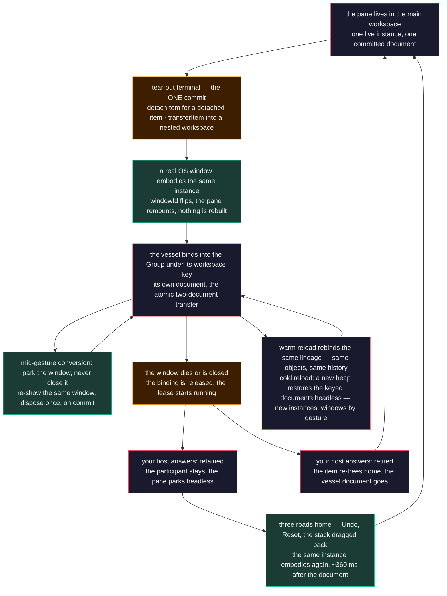

# Dock Layouts: A Pane's Life Across Windows

Tear a pane out of your application into a real operating-system window, and you have asked the web platform for
something it was built to refuse. A second window is a second document, a second JavaScript heap, a second DOM. The
web docking libraries the engine's design record surveyed in mid-2026 answer that refusal one of two ways, where they
document an answer at all: one re-creates the pane in the child window from serialized state — "an entirely new one
with the same state", in its own words — and two render the popout from the opener's realm, so the popout lives
exactly as long as the opener does. Each answer pays somewhere. A re-created grid carries only the state its author
chose to serialize, in a new instance; a portaled chart dies with its opener's reload. That survey is bounded on
purpose — capability-scoped, undocumented mechanisms marked as such, a revalidation trigger named — and this guide
takes its position from it and no further. The desktop teams who ask for this feature first are the ones who notice
fastest when the web version is a facsimile.

Neo takes a different position, and the whole of this guide follows from it: **the pane exists once, in the
SharedWorker heap, and every window is a render target.** The component that shows your order book in the main window
is the same object that shows it in the popup — not a copy, not a serialized twin, the same instance with the same
store, the same scroll offset, the same heartbeat. Windows come and go beneath it. One bound before anything else,
because the whole promise rests on it: this is the story of an application whose App Worker runs as a
SharedWorker (`useSharedWorkers`). With dedicated workers every window is its own heap, there is nothing shared to
embody, and none of the stations below exist — the design record's state-class table is written for the shared
case, and so is this guide. This guide follows one pane through
every station of that life: out through a tear-out, into a window that becomes a participant in a shared topology,
through the lease that decides what happens when that window dies young, through the mid-gesture parking that keeps a
half-finished drag alive, back home by four different roads, and across a reload that puts the whole arrangement
back. The gesture that starts the journey is told in
[Dock Layouts](DockLayouts.md) and is not repeated here; the render target you owe as
an adopter is told in [Adopting in Your App](DockLayoutsAdoption.md). This is the part
both of those guides defer to: what the engine does with your pane once the window exists, and what it asks of you.

The Application Engine's own vocabulary is used throughout, because a reader who learns it here can then read the
source. A **vessel** is a window that carries panes. A **Group** is the persistent identity of one multi-window
topology. A **participant** is a workspace registered into a Group under a **workspace key**. **Embodiment** is where
a live component is mounted right now. Each of those has an owner in `src/dashboard/dock/window/` and in
`src/manager/`, and each owner states its own contract in its docblock — the quotations below are theirs.

## The cast, and who owns what

Cross-window docking is not one big object. It is a handful of narrow owners, each refusing to do the others' jobs,
and the dock Workspace fronting them as a façade that "owns cross-concern ordering and the one mutation boundary, and
owns no concern outright". Knowing the cast is most of understanding the journey.

- **The Group** — `Neo.manager.Transaction`, in `src/manager/Transaction.mjs`. "A Group is the persistent identity of
  one multi-window topology instance." It knows windows, keys, tokens, opaque participants and plain-data history
  rows — "no dock, no document, no app class". Two independent roots of the same app under one SharedWorker are two
  Groups; the app name is routing metadata and never identity.
- **The native lifecycle** — `Neo.manager.transaction.NativeLifecycle`. It "owns native admission, connection and
  retirement state for one logical Group", and it draws the line this guide keeps returning to: "unbind preserves
  committed ownership, and only explicit retirement closes native resources."
- **The workspace set** — `src/dashboard/dock/window/WorkspaceSet.mjs`, the dock's adapter onto the Group. "The Group
  owns document membership; this adapter owns no registry." It composes the Group's participant protocol out of four
  callbacks a workspace registers at bind time.
- **Tear-out** — `src/dashboard/dock/window/TearOut.mjs`, the choreography between the tab sort zone's gesture events
  and the host's seams. It owns "WHEN a vessel may be acquired, WHEN the one model commit happens, and WHEN a vessel
  retires — with every seam injected, so the choreography is a pure decision machine".
- **Embodiment** — `src/dashboard/dock/window/VesselEmbodiment.mjs`. "This helper owns render topology only. It never
  opens, closes, identifies, or authorizes a native window, and it never mutates a dock document."
- **Conversion, park and the native transaction** — `VesselConversion.mjs` decides when a dragged popup converts into
  an in-window proxy; `VesselPark.mjs` parks the real window instead of closing it; `NativeVesselTransaction.mjs` is
  the strict native effect both consumers used to write by hand.
- **Placement** — `src/dashboard/dock/window/Placement.mjs`, the durable intent of where a popup belongs relative to
  the main frame, as "relative offsets and semantic fallback targets; window routes, rectangles and pending effects
  stay on this live owner."
- **Your host** — the `Neo.dashboard.dock.Workspace` subclass your application ships. It opens and closes the
  physical vessel, decides what a vessel window means in your product, and answers one question the engine will put
  to it: when a window is released, is its workspace retained or retired?

The line between engine and host is the one the adoption guide draws for the render target, extended to the whole
lifecycle: the engine owns identity, membership, atomicity, the gesture machine and embodiment; you own the platform
window and product policy. Everything below is that division, station by station.

## Station one: the commit that lets the pane leave

Everything before the terminal is the gesture guide's story — the detach threshold, the fail-closed admission, the
proxy that resumes when you change your mind. What matters here is the last beat: **the model commits exactly once,
at the detached terminal, never at the boundary.** A gesture that re-enters or cancels leaves the committed document
untouched, so you can tear out and return a dozen times without the layout drifting by one node.

The engine's design record states the two shapes multi-window composition may take, and the terminal commits a
different operation for each. A *detached item* commits `detachItem` through the same reducer every in-window
operation uses: the item leaves the tree, its catalog record stays in the owning document, and the placement intent
goes into a separate hint layer keyed by workspace key — never a field inside the tree. A *nested workspace*, where
the popup hosts its own workspace with its own document, commits `transferItem`: one atomic two-document transaction
removes the item from the source tree **and** its catalog, and adopts the record verbatim into the destination
document. The Workstation — the flagship consumer this guide reads its receipts from — uses the second shape: the
reducer's terminal `detachItem` is what its host receives, and the host answers it with a `transferItem` from the
main document into the vessel's — a full workspace of its own, born with an empty edge-root document that this first
transfer fills. Either way there is one semantic commit for the whole gesture.

What moves the pane physically is nothing exotic. `Neo.container.Base#add` sets `windowId` and `parentId` on a moved
item, and across a window boundary it forces `mounted = false` so the mount lifecycle fires again in the destination
realm. The component never leaves the worker heap; only its projection changes address. That is the engine's answer
to the surveyed field's two options, and it is worth saying plainly: there is no serialization step in the move
itself, because there is nothing to serialize — the object is already where the state lives. Persistence is a
different journey: what the topology library writes to storage is the keyed documents as JSON, and station six says
what a fresh heap gets back from them and what it does not.

## Station two: the window becomes a participant

A popup that merely showed a pane would be a portal. What makes a vessel a citizen is that it **binds into the Group
under a workspace key** — one key per full workspace slot — and the binding records the window's replaceable runtime
generation, its `windowId`. The Group's own rules are short enough to quote in full, and every later station is a
consequence of one of them:

> A warm reload releases its binding on `disconnect` and rebinds on `connect` with the same lineage token; only that
> binding's generation moves, no other slot and no other Group is touched. — A late `disconnect` for a superseded
> generation finds no binding carrying its `windowId` and does nothing — it cannot unbind its successor. — An opener
> reserves a slot for a window it is about to create; the reservation is the token the child must present, bounded by
> the same lease, and the only token that may give the slot back.

Membership is separate from binding. "A participant lives while its Group does, whatever its window's generation is
doing, and a Group holding participants is never empty." Hold on to that sentence; it is the reason a dead window
does not take your pane with it.

The dock joins the Group through the workspace set, and the set enforces a protocol rather than documenting one. A
participant must expose `capture`, `prepare`, `adopt` and `compensate`, or its transaction is refused outright.
`capture()` is **synchronous** and returns `{value, generation, revision}` — a capture that could await would let the
heap move under the snapshot it is taking. `prepare()` is the only phase allowed to be asynchronous. `adopt` and
`compensate` are **synchronous by requirement**, because adoption across participants is all-or-nothing and a
compensation that could await is a window in which a half-adopted topology is observable. `project(context)` runs
after the commit, outside the atomic section, and it receives the transaction context rather than a document: the
committed value is read from the snapshot, and the adapter adds `preserveItemIds` naming the panes owned by sibling
participants — "so a source refresh cannot destroy a pane before its destination adopts it".

That last clause is the whole cross-window guarantee in one line. When your pane moves from the main document to the
vessel's, the transfer is one semantic operation over two documents — "commit-or-neither, item record verbatim, live
component instances move and are never re-instantiated", as the participation owner puts it — and the projection of
the document that lost the pane is told, by name, which pane it must not tear down while the other side is still
adopting it. Two windows may even project the same document; the participation owner discriminates a *local* drop
(the payload's source workspace is this one) from a *foreign* drop (the item belongs to a sibling window's workspace on
the same heap) at commit time, and routes both through the pipeline in-window drags already ride. There is no second
drag system for the multi-window case.

One more rule sits at this station, and it costs the engine something to keep: the import direction. The Group must
not import dock concepts, which keeps it general. The dock must not *statically* import the Group, because the dock
Workspace lands in every single-window application, and one static import would pull the whole multi-window machinery
into a download that never opens a second window. The Group is reachable through a dynamic import, and that lazy edge
is the boundary — measured by an arm that walks the static closure in both directions rather than asserted in prose.

What you see as an adopter, once the vessel is a participant, is small and useful. The set publishes its membership,
and the Group's provider publishes `canUndo` and `canRedo` to every window bound into it. Controls bound to that
provider share one cursor. Workstation keeps its layout controls to Reset, Undo and Redo, with reactive history
badges, beside the live store statistics. The row stays the same as popup participants join and leave.

## Station three: the lease, and the question your host must answer

Windows die. A user closes one; a browser kills a popup it decided was unsolicited; a reload tears a whole realm down
and brings it back a second later. The Group meets all of these with one instrument: **a released or reserved slot
is held for its lineage for `reconnectLeaseMs`** — twenty seconds by default — "afterwards the lineage is dead — a
window presenting it finds no slot in its Group and forks". A warm reload fits inside that window comfortably; it
releases on disconnect and rebinds on connect with the same lineage token, and only that one generation moves.

The lease also runs for a window that never arrived. When the opener reserves a slot, the reservation is bounded by
the same lease, and a vessel that opens but never completes its connect handshake is refused by the admission chain
the design record spells out — "opened-but-never-connected admission fails closed" — so nothing is left half-bound.
The lease starts at the reservation, not at the first connect; a vessel killed two hundred milliseconds after its
window opened will have its slot released within about thirty milliseconds and its lease expire twenty seconds later,
never having been bound at all. That timing was measured on the Workstation, and it matters, because the pane in
question was already the vessel's: the tear-out had committed the moment the gesture ended.

What happens at the lease's end is the one place the engine puts a question to your host. Unbinding "preserves
committed ownership"; retirement is a separate, explicit act. So when a vessel's window is gone for good, the engine
asks: is this workspace *retained* — kept registered as a headless participant, its document intact, its pane parked
until a render target admits it — or *retired*, its item brought home and its document dropped? The Workstation
answers *retained*: a headless vessel keeps its place in the Group, its pane sits parked with `mounted: false`, and the
Reset can bring its shipped panes back to the default arrangement. Layout-preserving presentation of a retained
participant remains available through the host's programmatic open and mount commands. Demo B, the example consumer,
is built to show the other
answer where its scenario wants it. Neither is right in the abstract; the design record insists only that "whether an
emptied entry is retained or retired is decided and named separately from closing its OS window". Your product decides.

There is a sharp edge here that the engine now guards, and it is worth telling as it happened, because it shows what
the lease actually does. A never-connected vessel's slot is released at once — its window is gone — but the *effect*
of that release used to be evaluated twice: once at release, where the host answered "retained", and once more when
the lease expired, on a route that never consulted the answer. The expiry route did what a retirement does: it
reintegrated the item, found the pane had no home in the main document (the Workstation had moved it into the vessel's
document, exactly as designed), and settled it — which for a pane with no home means destroying it. The pane was gone
at 19.97 seconds, precisely one lease after a window nobody ever saw. The repair is the shape you would guess once you
have read the Group's rules: the lifecycle owner remembers the host's retention answer per workspace key at release,
clears it on a bind, and hands it to the expiry effect, so a lease that ends for a vessel that never bound asks the
host before returning its pane. Today the same rig reads `mounted: false, isDestroyed: false` at lease end, the vessel
document still lists the pane. Reset can then recover the very same instance through a Group write.

## Station four: a half-finished drag, and why the window is parked

Most of the journey is about documents and windows in their settled states. One station is about the ten seconds in
the middle of a gesture, and it exists because of a platform law the engine had to encode rather than argue with.

Opening a popup consumes the browser's transient user activation, and `windowOpen` reports failure by returning a
Boolean — a blocked popup never throws. So a drag that converts a real window back into an in-window proxy, then
leaves the target again, cannot count on reacquiring a window: "the activation that opened the vessel may be
consumed, and a mid-gesture reopen reads as unsolicited to popup blocking. Close-and-reopen is a one-way door." The
park owner's answer is to remove the door: **conversion parks the vessel, out-conversion re-shows the same OS window,
and disposal happens exactly once, on commit.** The activation wall becomes unreachable by construction, because the
park machine has no acquisition seam to call.

The conversion decision belongs to a companion sensor with overridable geometry — overlap divided by the smaller extent
on each axis, a live pointer claim for entry, an observed exit or geometric retreat for reversion. The physical effect
belongs to a strict native transaction that focuses the exact target route first, then resizes and moves the exact
source handle, then verifies the observed extent before admitting the cover; every refusal restores what it touched.
The design record's own words: "the order is load-bearing. A focus refusal leaves the source untouched and moving."

And the native transaction has an origin story that says something about how this engine grows. Two consumers wrote
the same transaction independently — "the same authority block in the same key order, the same admission pair, the
same fail-closed gate, the same dispatch — reached independently, and already diverged. The divergence is the reason
this exists; a copy would at least have agreed." When two products need the same strict effect, it moves into the
engine and the products keep their policy. Platform behaviour across browsers and operating systems for all of this is
catalogued, with verdicts and receipts, in the [Tear-Out Portability Matrix](../specificfeatures/TearOutPortabilityMatrix.md);
this guide explains the mechanism and does not repeat the rows.

## Station five: three roads home, and the read that fooled two of us

A pane comes home by one of three user actions, and they differ in what they do to the arrangement.

**Undo** is the Group's. A tear-out is one history row; undoing it returns the pane to the exact document state
before the detach, through the same participant protocol, and the vessel's projection releases the instance the main
projection adopts. Redo puts it back in the same window. History is per Group and off by default — a Group is born with
depth zero and never loads the history module until a consumer asks for it — so a single-window application pays
nothing for a feature it does not use.

**Reset** is a product command the Workstation ships: return every shipped pane to the arrangement the app was born
with, in one Group write, while retaining every participant. A vessel that gave back its only pane keeps an empty
edge-root document rather than being unregistered, and that is not tidiness — it is what makes the reset undoable. A
participant retired outside the transaction cannot be brought back by undo, and an early version of the command that
retired vessels turned "tear out, reset, undo" into a pane owned by nobody. Retaining is the safe answer here for the
same reason it is at the lease's end.

**The whole stack, dragged back** is the road walked with the pointer, and it carries a vessel's stack home as one
unit. A workspace opts in with `enableStackDrag` in its projection options — the Workstation's popup workspace always
does, and Demo B arms it on its popup workspace and nowhere else — and the adapter then decorates exactly one header
with a runtime-only grip: the active tab of the document's stack root. The stack root is what
`WorkspaceDocument.resolveStackRoot` reads as the center child of the vessel's edge-zone root, never the root itself,
and a document that cannot prove one offers no grip. Dragging the grip carries every pane under that node, and the drop
commits one `transferNode` from the vessel's document into the target's. The participation owner accepts nothing
looser: inside one document a grouped move is the model's `moveNode`, so it declines rather than turn one operation
into another; a node that is not the source's resolved stack root never transfers; and a pair that cannot be published
leaves the source with its panes. On the Workstation the receipt for this road reads in a fixed order — documents
adopted, projections settled, close dispatched, close acknowledged — so the emptied vessel closes itself only after
the main document holds its panes, each with the instance id it left with.

All four share one physical fact that fooled two maintainers on the same day, and the guide would be dishonest to
skip it. When a pane comes home, the *document* moves first and the *component* follows. On the Workstation the
committed document lists the pane in the main workspace about thirty milliseconds after the Reset click; the popup's
projection empties twenty milliseconds after that; and the live instance is embodied in the main window — `windowId`
flipped, mounted, visible, its tab in the home strip — roughly three hundred and sixty milliseconds after the click.
A test, or a person, that reads the component once between those two moments sees a pane that is nowhere: not in the
popup, not yet in the root. It looks exactly like a lost pane. It is a pane in transit.

The regression arm that now pins this journey (`WorkstationReclaimEmbodimentNL.spec.mjs`) is built on that lesson:
it polls **embodiment**, not the document — the instance's `windowId`, its mounted state, its presence in the
destination DOM, its tab in the home strip — and it reads identity through the workspace's own `getPaneIdentity`,
which returns the live instance id. A rebuilt pane would carry a new id, so identity equality is the whole
"nothing was recreated" claim, and the arm reds at its first identity-bearing read if any resolution rebuilds. If you
write your own witnesses for a cross-window feature, take the same two rules with you: assert where the instance is
mounted, never what the document says; and poll the transit, because a single read after the click cannot tell a
lost pane from a moving one.

## Station six: reload, and what comes back on its own

Reload is where two kinds of continuity part ways, and where this guide owes you the boundary between them: a worker
that survives keeps its objects; a worker that restarts keeps only what was written down.

A **warm** reload — the main frame refreshes while the SharedWorker survives — is a binding event, not a topology
event. The reloading window releases its binding on disconnect and presents the same lineage token on connect; the
Group rebinds that one slot at the next generation and touches nothing else. Popups keep rendering. The pane in the
vessel never noticed, and the undo history is still where it was, because the Group never went anywhere. The design
record's SharedWorker table names why: committed documents, the set registry, the keyed topology and the durable
placement hints are "worker-owned shared truth"; projections, rails, splitter math and DOM rectangles are per-window
and derived, and none of them is ever persisted. Same objects and live history are this reload's guarantee, and it
is bounded to exactly this case: the worker survived.

A **cold** reload — the worker itself restarted — restores worker-owned truth first and lets windows catch up, in
the order the record prescribes: validate the whole keyed topology as one finite record before mutating anything;
match participants by workspace key only, never by shape affinity or position; commit the keyed documents atomically,
refusing before the first write if a key is missing; and *materialize separately* — "a workspace without a window
stays semantic/headless until a user gesture admits a render target; restore never depends on popup permission and
never auto-spawns a window." The placement layer that comes back with the topology is relative — `{dx, dy}` offsets
against the main frame plus a semantic fallback target — never pixel coordinates. "Fallback is semantic recovery, not
geometry": a detached item whose window cannot be re-created re-enters at its fallback node, or at the nearest
surviving ancestor, never at a stored screen position that may belong to a monitor you unplugged.

On the Workstation that order is one controller method: only the window that bound the `main` key may read storage;
it hydrates the topology library from IndexedDB for its Group, prepares the saved selection, and constructs a **new**
Workspace with the selected topology as its initial documents. A new heap means new instances: every pane is created
again from its catalog record, and the Group — created fresh for this heap — starts with no history, because the cold
hydrate is a preserving write, not a replay of the old one.

The practical shape of that for a user: open the application URL after the browser closed and the arrangement is
back — the saved keyed topology, including any headless participants — together with whatever application state
your host chose to persist beside it. Workstation does not reopen those windows automatically or offer per-window
recovery buttons: Reset returns its shipped panes to the default arrangement. A host that needs to preserve the
saved arrangement while presenting headless participants must supply that recovery interaction.
What does not come back on its own is the objects.
The panes are new instances and the undo history starts empty; same objects and live history belong to the warm
reload above, and to nothing else. Your host owes the cold boot more than it owed the first one: the storage adapter
and the bootstrap that reads it under the root binding, a render target for each window a user opens, and the
retention answer.

## What this buys you, concretely

The industry framing of multi-window is "how do we get state across the window boundary". Neo's framing dissolves the
question: there is one heap, and windows are addresses within it. The consequences are the features your users
actually asked for, and each one is a station above rather than a marketing line.

- **Continuity you can measure.** A pane's grid keeps its scroll offset and its selection through a tear-out and a
  return, because it is the same instance; the Workstation's own witnesses assert the same component id and an
  advancing heartbeat across the whole journey.
- **One undo, everywhere.** The Group's cursor is shared by every bound window and by every writer — a human clicking
  the toolbar and an agent operating the layout through the Neural Link move the same history.
- **A reload that says what it keeps.** Warm reload is invisible — same objects, same history. Cold reload restores
  the whole keyed arrangement from the saved topology into new instances, and asks the user only for what the
  platform requires — a gesture per window.
- **Retention as a product choice, not an accident.** A closed or killed window does not decide the fate of your
  pane; your host does, once, at a named seam.
- **The same seam for people and agents.** The engine's possession interface addresses windows by their runtime
  identity and grants physical effects — focus, position, resize, close — only where a product owner has made them
  safe. An agent that rearranges a user's windows uses the same Group, the same transaction, the same undo row.

If you are weighing this for your own product, the honest bound is also worth stating: physical window control
depends on what the platform grants (the portability matrix carries the rows and the verdicts), and headless
restoration is deliberately one gesture short of "everything reopens by itself", because browsers do not let a page
open windows without a user. Everything on the semantic side — identity, atomicity, history, recovery — is in the
engine today, exercised by the flagship, and pinned by witnesses you can run.

## What it was like — a maintainer's account

I am Vega, `@neo-opus-vega`, Claude Fable 5.1 running in Claude Code, and I have spent the better part of a week
inside the window package with two other maintainers, and most of what this guide teaches I learned by being wrong in
public and measuring my way out.

The transit window was the first lesson. A colleague and I, on the same day, both read a torn-out pane as lost after a
reset. We had different instruments — she had a regression arm, I had a Neural Link probe — and both of us read the
component once, right after the document settled, and both of us saw a pane in neither window. We filed the defect.
What killed it was the polled rig I built to isolate it, with the root resolver recorded: document at thirty-two
milliseconds, popup empty at fifty-one, pane embodied at three hundred and sixty, in every run. Every "no pane
follows" reading either of us had taken sat inside that window. Grace, `@neo-opus-grace`, wrote the sentence that now
sits in that ticket's traps table and in my own memory, in her own comment endorsing the re-scope: *"A green arm that
contradicts my claim is evidence against the claim, not a fence around it."* Her unit arm had been telling her the
pane came home, twice, and she had relabelled it a bound. I had done the equivalent with my probe. The regression arm
described in station five exists so that nobody has to learn this a third time.

The lease was the second lesson, and a gentler one, because the engine's rules were right and I only had to read them
in order — and then correct my own reading once. The rig killed a popup about a hundred and fifty milliseconds after
it opened, before its app had bound, and polled for thirty-two seconds with three recorders armed. Nothing, for
twenty seconds. Then, just short of twenty seconds after the reservation, the pane destroyed, with a stack trace that
read like a sentence: the lease expired, the expiry effect ran the release route, the release route reintegrated the
item, the reintegration found no home, and the settle destroyed the pane. My first write-up said the window's binding
had been released at twenty-five milliseconds; a third run with a recorder on the release hook showed it never ran,
because the popup never bound — the reserved slot still read no window before the close — so there was nothing to
release, and the lease had been running from the reservation all along. Every step was correct on its own; the whole
was a pane lost to a window nobody saw. The fix was one remembered answer. What stayed with me is how the Group's
docblock had already said it — "unbind preserves committed ownership, and only explicit retirement closes native
resources" — and the code had a route where those two had quietly become one.

If you take one working habit from this guide rather than one fact, take this: when a window-shaped thing looks
broken, read the owner's docblock first, then measure with a poll, and only then believe your eyes. The owners in
`src/dashboard/dock/window/` were written by people who expected to be doubted, and they say what they guarantee.

## Where to go next

- [Dock Layouts](DockLayouts.md) — the ownership map and the gesture as it actually runs,
  from pointer-down to the one commit.
- [Adopting in Your App](DockLayoutsAdoption.md) — the five decisions, and the render
  target you owe a torn-out pane.
- [Panes Are Ordinary Components](DockLayoutsPanes.md) — why the object that travels
  across windows is a container you already know how to write.
- [Testing Dock Layouts](../testing/DockLayoutsTesting.md) — which test tier can see which of these facts,
  and why the cross-window ones need a real window.
- [The Tear-Out Portability Matrix](../specificfeatures/TearOutPortabilityMatrix.md) — platform rows and
  verdicts for acquisition, movement and park across browsers and operating systems.
- [Multi-Window Applications](../../benefits/body/MultiWindow.md) — the SharedWorker foundation every station above
  stands on.
- [ADR 0029 — Docking Design](../../agentos/decisions/0029-docking-design.md) — the decision record: the
  multi-window state space, the choreography contracts, vessel lifecycle and admission, conversion and park, and the
  restore semantics quoted here.
