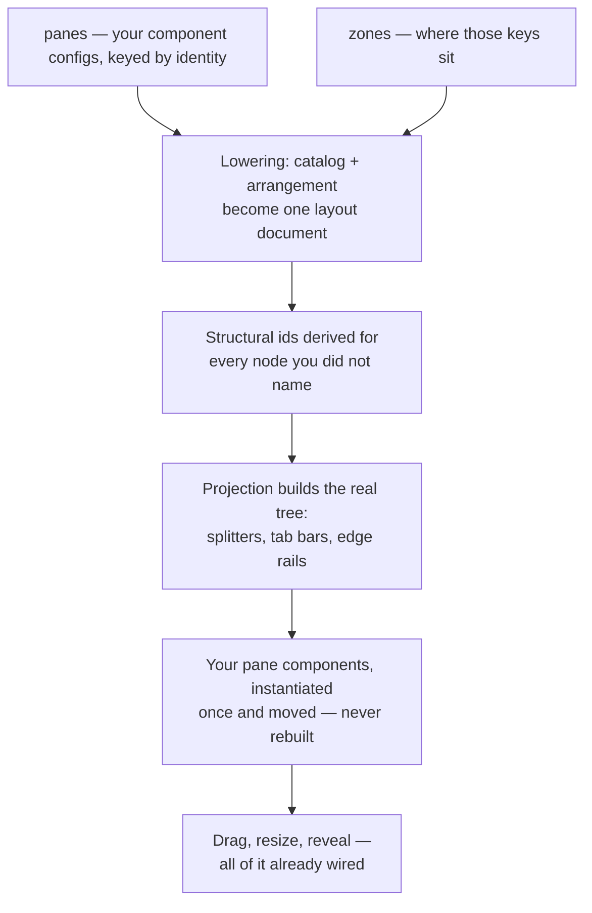

# Your First Dock Layout

Every IDE-shaped application eventually needs the same thing: an editor in the middle, a preview beside
it, a console under that, and a file tree you can push out of the way. It is such a familiar shape that
it is easy to forget how much work it usually is — a splitter component here, a tab container there, a
handful of ids you invent and then have to keep consistent, and a growing pile of code whose only job is
to describe where things sit.

Neo's dock lets you skip that. You declare **what your panes are** and **where they go**, and the engine
builds the splitters, the tab bars, the edge rails and the drag targets for you. This guide takes you
from nothing to a working, draggable four-pane layout — and every layout on this page is live. You can
edit them in place and watch the result change. (One later snippet is deliberately static; it says so and
explains why.)

## The smallest thing that works

Two panes, side by side, with a splitter between them. That is the whole program:

```javascript live-preview
import Component from '../component/Base.mjs';
import Workspace from '../dashboard/dock/Workspace.mjs';

class MainView extends Workspace {
    static config = {
        className: 'Guides.dockFirst1.MainView',
        height   : 260,

        panes: {
            editor : {module: Component, header: {text: 'Editor'},  style: {padding: '1em'}, html: 'Editor'},
            preview: {module: Component, header: {text: 'Preview'}, style: {padding: '1em'}, html: 'Preview'}
        },

        zones: {
            center: {
                orientation: 'horizontal',
                sizes      : [0.6, 0.4],
                children   : [{items: ['editor']}, {items: ['preview']}]
            }
        }
    }
}

MainView = Neo.setupClass(MainView);
```

**Drag the divider.** It works, and you did not write a splitter.

Two configs did all of it. `panes` is a catalog: ordinary component configs, keyed by a name you choose.
`zones` is the arrangement: where those keys go. Nothing in the pane configs knows it is inside a dock —
`editor` is a plain `Component` with an `html` string, and it would render identically in a `Container`.
That separation is deliberate and it is what makes panes reusable: **a pane never learns about layout.**

The keys matter more than they look. `editor` and `preview` are the panes' *identities*, and they are how
you refer to them everywhere else — in zones, in later operations, in a saved layout. Choose them the way
you would choose variable names.

## Tabs, an edge rail, and a pane that loads on demand

Now the real shape. Same two configs, more of them:

```javascript live-preview
import Button    from '../button/Base.mjs';
import Component from '../component/Base.mjs';
import Workspace from '../dashboard/dock/Workspace.mjs';

class MainView extends Workspace {
    static config = {
        className: 'Guides.dockFirst2.MainView',
        height   : 380,

        panes: {
            editor : {module: Component, header: {text: 'Editor'},  style: {padding: '1em'}, html: 'Editor'},
            preview: {module: Component, header: {text: 'Preview'}, style: {padding: '1em'}, html: 'Preview'},
            console: {module: Component, header: {text: 'Console'}, style: {padding: '1em'}, html: 'Console'},
            outline: {module: Component, header: {text: 'Outline'}, style: {padding: '1em'}, html: 'Outline'},

            // `autoHidden` puts this one on the edge rail instead of docking it.
            search: {
                module    : Component,
                header    : {text: 'Search'},
                style     : {padding: '1em'},
                html      : 'Revealed from the rail',
                autoHidden: true
            }
        },

        zones: {
            center: {
                orientation: 'horizontal',
                sizes      : [0.62, 0.38],
                children   : [
                    {items: ['editor']},
                    {items: ['preview', 'console'], activeItemId: 'preview'}
                ]
            },
            left : {items: ['outline'], extent: 0.22, resizable: true},
            right: {items: ['search']}
        }
    }
}

MainView = Neo.setupClass(MainView);
```

Four things to try, in order:

1. **Click the `Console` tab.** The right half of the centre is a tab group — you got a tab bar by putting
   two keys in one node instead of one.
2. **Drag the `Console` tab onto the `Editor`.** Drop indicators appear; release and the layout re-splits
   around where you dropped. You wrote no drag code.
3. **Drag the vertical divider**, then the `Outline` edge divider. Both resize; `resizable: true` is what
   opts the left band into that.
4. **Click `Search` on the right rail** — the narrow strip on the far right edge. It slides out over the
   layout with a pin button, and pins into place if you want it to stay.

`autoHidden: true` is what makes `search` a rail pane rather than a docked one: it lives on the edge as a
button and reveals over the content. Drop `autoHidden` and the same pane docks permanently into the right
band instead. One word, two very different products.

### Loading a pane only when it is first shown

A pane's `module` also accepts a **function returning a dynamic import**. Nothing loads until the pane is
first shown — for a settings screen, a chart, or an editor most sessions never open, that is boot time you
simply do not spend:

```javascript
panes: {
    search: {
        module    : () => import('../view/SearchPanel.mjs'),
        header    : {text: 'Search'},
        autoHidden: true
    }
}
```

Everything else stays identical — zones do not change, and the key is still the identity. The pane simply
does not exist until someone asks for it.

> This one snippet is **not** a live preview, and the reason is worth knowing if you write guides here: the
> live-preview sandbox rewrites *static* import specifiers so `'../component/Base.mjs'` resolves against
> the engine, but a **dynamic** `import()` is evaluated at runtime against the page's own URL, where that
> path does not exist. The form above is correct in your application and cannot execute inside an embedded
> preview.

## The ids you did not have to invent

Look again at the `zones` above. The centre split has no `id`. Neither does the tab node. Yet the dock
needs stable identities for every structural node — to route a drop, to remember which tab was active, to
tell one splitter from another.

The engine derives them from what you wrote, and the benefit is not that the algorithm is clever. **The
benefit is that there is nothing to keep in sync.** You never invented `center-split-0`, so you can never
misspell it, never leave it behind after a rename, and never have two nodes accidentally sharing one.

That is the whole rule: **write your panes and your zones, and let the engine name the structure.**

Most layout systems make you invent a name so you can find a node again, so the reflex to hand-author one
is worth naming. You do not need it here, and this is what the paragraph above is for: a name you never
wrote is a name that cannot drift out of sync with anything.

**You do not need to address a structural node to build a layout, and this tutorial deliberately does not
show you how.** If you later find that you genuinely do, that is a question about your application's
identity strategy rather than about the dock, and it is worth answering deliberately instead of by adding
a string to a config.

## What the engine does with your two configs



The step worth internalising is the last one. When you drag a tab into a new split, the dock **moves the
existing component instance**; it does not serialize it and construct a replacement. Your pane keeps its
scroll position, its state, its in-flight request, its focus. A layout change is not a remount.

## Initial configuration versus what happens later

`panes` and `zones` describe how the workspace **starts**. They are read once, when the workspace mounts.

Everything after that is a runtime operation: the user dragging a tab, revealing a rail, moving a
splitter. Those change the live layout — and they do **not** rewrite your configs. Reading `zones` back
after a drag gives you what you declared, not what the user did.

This matters most for a reflex you might otherwise have: *"I will just update `zones` to move that pane."*
Reassigning `zones` after mount is not the way to drive the layout, and treating your declaration as a
live model will quietly disagree with what the user sees.

**Layout persistence is not automatic.** Nothing here saves the arrangement, and reloading this page
returns every example above to exactly the layout it declares. Restoring a user's arrangement is a
separate capability with its own storage decisions to make; the shipped example demonstrates it, and this
first layout deliberately does not.

## Running it outside this page

The examples above run in the portal. To run one in your own application, the workspace is an ordinary
component — extend `Neo.dashboard.dock.Workspace`, give it `panes` and `zones`, and use it as a view.

For a complete application you can start and read, the dock example lives at
`examples/dashboard/dock/`. Serve the repository and open it:

```bash
npm run server-start -- --port 8080 --no-open
```

then browse to `examples/dashboard/dock/index.html`. It is the same two configs as this guide, at the
size of a real application — ten panes, a nested split inside a split, an edge band, and a reload
contract on one pane.

## Where to go next

- **[Dock Layouts](../guides/uibuildingblocks/DockLayouts.md)** — how docking works across windows, where layout state lives, and
  the ownership boundaries you inherit once an application grows past one window.
- **[Dock Layouts Adoption](../guides/uibuildingblocks/DockLayoutsAdoption.md)** — computing a layout from application data and
  integrating the workspace into an existing view hierarchy.
- **Dock Zone Model** (`learn/agentos/DockZoneModel.md`) — the reference for the document vocabulary: the
  exact fields a pane record and a zone node accept, including the ones this tutorial has no use for.

Start with the second example on this page. Change a key, add a pane, move it to another zone, and watch
what the engine builds for you.
