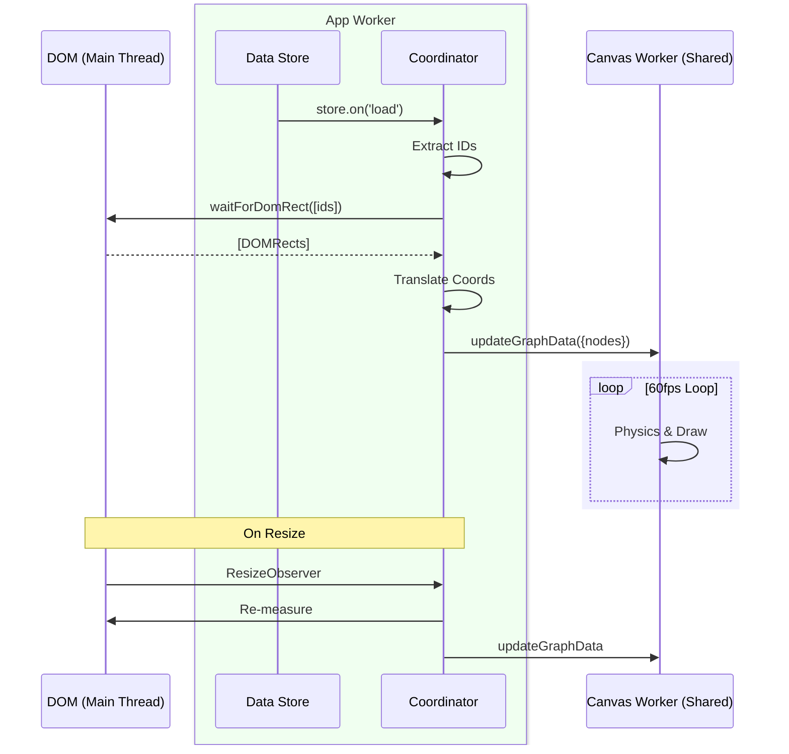

# Docs: Correct Mermaid Diagram in Neural Timeline Guide

We need to correct the Mermaid diagram in `learn/guides/advanced/NeuralTimeline.md`.

**Issue:** The previous diagram presented "Data Store" and "Coordinator" as separate participants without context, potentially misleading readers into thinking they exist in different realms.

**Fix:** Use Mermaid's `box` feature to explicitly group participants by their Thread/Realm (Main Thread, App Worker, Shared Worker). This clarifies that Store and Coordinator share the App Worker scope.

**Corrected Diagram:**

## Timeline

- 2026-01-14T23:54:50Z @tobiu added the `documentation` label
- 2026-01-14T23:54:50Z @tobiu added the `ai` label
- 2026-01-14T23:56:25Z @tobiu referenced in commit `62fa141` - "docs: Fix Neural Timeline diagram participant grouping (#8659)"
### @tobiu - 2026-01-14T23:56:27Z

**Input from Gemini 3 Pro:**

> ✦ I have corrected the Mermaid diagram in `learn/guides/advanced/NeuralTimeline.md`.
> The new diagram uses `box` syntax to explicitly group "Data Store" and "Coordinator" within the "App Worker" realm, eliminating ambiguity about their topology.

- 2026-01-14T23:56:49Z @tobiu closed this issue
- 2026-01-14T23:58:06Z @tobiu assigned to @tobiu

